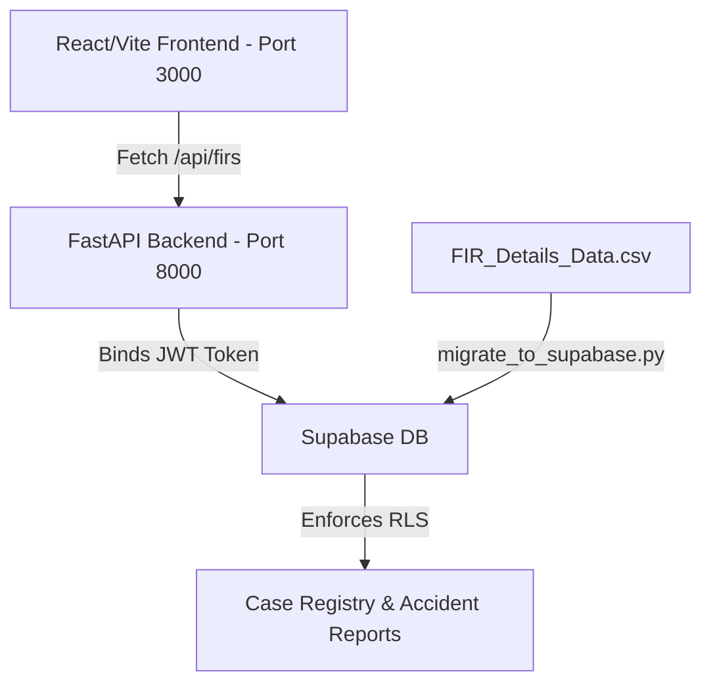

<div align="center">

</div>

# VAJRA (ವಜ್ರ) - Secure Intelligence Portal

VAJRA is a state-of-the-art law enforcement intelligence portal for the Karnataka State Police. It integrates live database case records from `FIR_Details_Data.csv` (uploaded to Supabase) into the frontend's FIR Repository and Case Workspace screens, dynamically filtered using Row-Level Security (RLS).

---

## 🏗️ System Architecture & Data Flow



1. **Frontend Connections**:
   - [FIRSearchScreen.tsx](file:///c:/Users/B.C%20SAKETH/Downloads/VAJRA-main/src/screens/FIRSearchScreen.tsx) fetches cases from the backend at `http://localhost:8000/api/firs?limit=150`.
   - [CaseWorkspaceScreen.tsx](file:///c:/Users/B.C%20SAKETH/Downloads/VAJRA-main/src/screens/CaseWorkspaceScreen.tsx) queries `http://localhost:8000/api/firs/{firNo}` to load specific facts and briefs.
   - [LoginScreen.tsx](file:///c:/Users/B.C%20SAKETH/Downloads/VAJRA-main/src/screens/LoginScreen.tsx) authenticates the officer using their 7-digit numeric badge number (KGID) and password.

2. **Row-Level Security (RLS)**:
   - When a user logs in, the FastAPI server verifies the JWT token and extracts their profile and station.
   - The Supabase client automatically applies the RLS policy: officers can only query cases belonging to their own station (e.g. `Amengad PS` for badge `4003385`).

---

## 🚀 Running the Project Locally

### 1. Run the FastAPI Backend (Port 8000)

Navigate to the backend directory, install Python dependencies, and start the Uvicorn server:

```bash
# 1. Navigate to the backend folder
cd vajra_backend

# 2. Activate virtual environment (if created)
# On Windows:
.venv\Scripts\activate
# On macOS/Linux:
source .venv/bin/activate

# 3. Install Python dependencies
pip install -r requirements.txt

# 4. Start the backend server
python main.py
```

*The backend server will run on **http://localhost:8000**.*

### 2. Run the React Frontend (Port 3000)

In a new terminal window in the project root directory:

```bash
# 1. Install Node.js dependencies
npm install

# 2. Start the Vite development server
npm run dev
```

*The frontend application will be available at **http://localhost:3000**.*

---

## 🗄️ Database Seeding & Migration

If you need to re-migrate or seed the CSV data into Supabase:

```bash
cd vajra_backend
python migrate_to_supabase.py
```

This script parses the CSV files (`FIR_Details_Data.csv`, `Crime_Data.csv`, and `Copy of AccidentReports.csv`), structures them, and uploads them to the Supabase database.

