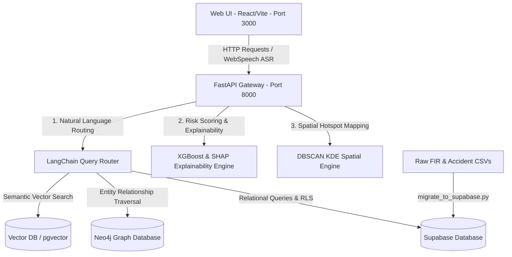

# VAJRA (ವಜ್ರ) - Intelligent Conversational AI & Crime Intelligence Portal
### Karnataka State Police Datathon 2026 — Challenge 01

VAJRA (ವಜ್ರ) is a state-of-the-art, secure law enforcement intelligence portal designed for the Karnataka State Police. It translates raw crime, accident, and historical records into actionable insights using advanced NLP, Explainable AI (SHAP), and GraphRAG. It provides an intuitive, high-performance interface for investigators to traverse criminal networks, locate spatial hotspots, profile offenders, and query database information in both English and Kannada.

---

## 🏗️ System Architecture & Data Pipelines



### 1. Unified Layer Breakdown
*   **Speech Input (ASR)**: Uses web browser-native `webkitSpeechRecognition` to capture live voice queries in Kannada and English directly from the dashboard.
*   **NLP & Router**: Maps queries using Gemini 1.5 Flash alongside localized dictionaries to resolve regional slangs, transliterate fields, and route queries.
*   **Row-Level Security (RLS)**: Enforces access bounds. Officers logging in using their 7-digit Karnataka General ID (KGID) can only view records corresponding to their assigned station (e.g. `Amengad PS`).
*   **Predictive Modeling**: Computes recidivism/threat risks via custom XGBoost models and renders local contributions instantly as interactive SHAP feature-contribution tables and bar charts.
*   **Spatial Cluster Computations**: Applies dynamic Density-Based Spatial Clustering of Applications with Noise (DBSCAN) to group geospatial coordinates (`latitude`, `longitude`) into actionable police patrol zones.

---

## 🛠️ Tech Stack & Dependencies

*   **Frontend**: React (v18), Vite, TypeScript, TailwindCSS, Lucide Icons, Leaflet (React-Leaflet) for GIS Mapping, Recharts for analytics visualization.
*   **Backend**: Python 3.10+, FastAPI, Uvicorn, LangChain, Joblib.
*   **Databases**: Supabase (PostgreSQL), GraphRAG (Neo4j/Graph logic), local JSON caching.
*   **Machine Learning / NLP**: Scikit-Learn, XGBoost, SHAP, Gemini API.

---

## 🚀 Installation & Local Execution

### 1. Prerequisites
Ensure you have the following installed on your machine:
*   [Node.js (v18+)](https://nodejs.org/)
*   [Python (3.10+)](https://www.python.org/)

### 2. Run the FastAPI Backend (Port 8000)

```bash
# 1. Navigate to the backend directory
cd vajra_backend

# 2. Set up a virtual environment
python -m venv .venv

# 3. Activate the virtual environment
# On Windows:
.venv\Scripts\activate
# On macOS/Linux:
source .venv/bin/activate

# 4. Install required packages
pip install -r requirements.txt

# 5. Start the API server
python main.py
```
*The backend server will spin up on **`http://localhost:8000`**.*

### 3. Run the React Frontend (Port 3000)

In a new terminal window at the project root directory:

```bash
# 1. Install Node modules
npm install

# 2. Boot up the Vite dev server
npm run dev
```
*The web interface will compile and run on **`http://localhost:3000`**.*

---

## 🗃️ Database Migrations

To import, parse, and upload raw police records (`FIR_Details_Data.csv`, `Crime_Data.csv`, `AccidentReports.csv`) to your remote database:

```bash
cd vajra_backend
python migrate_to_supabase.py
```

---

## 🛡️ Data Governance & Compliance

*   **DPDPA 2023 / IT Act 2000**: All AI-synthesized profiles feature mandatory advisory headers, reminding officers that AI outputs must be validated manually before being entered into formal case briefs.
*   **Audit Trail Log**: Every search query, profile inspection, and case access is logged transparently inside the **System Audit Log** screen, including timestamp, operator badge (KGID), action description, and station IP.

---

## 📄 Licensing & Attribution
Developed for the **Karnataka State Police Datathon 2026**. Authorized for internal evaluation and pilot deployment.
