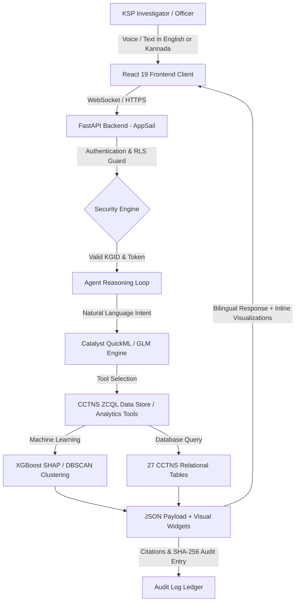

# 🛡️ VAJRA (ವಜ್ರ) — AI Crime Intelligence Copilot

> **Karnataka State Police Datathon 2026 — Challenge 01**  
> *Intelligent Conversational AI for KSP Crime Database*

[](https://vajra-60074806366.development.catalystserverless.in/app/index.html)
[](https://react.dev/)
[](https://fastapi.tiangolo.com/)
[](#)

---

## 📌 Executive Summary

**VAJRA (ವಜ್ರ)** is a high-performance, bilingual (English & Kannada) conversational AI copilot engineered specifically for **Karnataka State Police (KSP)** investigators, analysts, and supervisors. Built on top of live **CCTNS (Crime and Criminal Tracking Network & Systems)** relational database schemas, VAJRA transforms complex multi-table database querying into natural conversational interactions via text or voice.

Instead of navigating fragmented dashboard widgets, officers query VAJRA in plain language. The system dynamically invokes real backend analytical engines—rendering inline interactive spatial maps (DBSCAN), SHAP-explained recidivism risk gauges, criminal network graphs, seasonal trend forecasts, and suspect MO matching directly within the conversation stream.

---

## 🚀 Key Features & Capabilities

### 1. 🗣️ Bilingual Voice & Text Conversational AI
* **Dual-Language Processing:** Seamlessly handles queries in **English** and **Kannada** (using Zia Fast-Translate, GLM reasoning engine, and Qwen fallback).
* **Voice-to-Text & Speech Synthesis:** Native voice querying with automatic language detection and spoken AI audio responses.
* **Inline Dynamic Renderers:** Generates 11 distinct interactive visualization widgets inline (maps, charts, network nodes, risk meters) expandable to full-screen interactive panels.

### 2. 🔍 Advanced Analytical Engines
* **Spatial Hotspot Clustering:** Scans geocoded FIR coordinates using **scikit-learn DBSCAN** to reveal high-density crime corridors.
* **Recidivism Risk & SHAP Explainability:** Evaluates suspect re-offense probability with **XGBoost classification**, delivering clear SHAP feature breakdown charts (prior arrests, MO similarity, age factor) so officers understand *why* a risk score was assigned.
* **Organized Crime Network Analysis:** Maps links between suspects, co-accused, gang affiliations, and shared vehicles/bank transactions.
* **Crime Trend Forecasting:** Predicts upcoming crime volume surges per district using time-series forecasting.
* **Modus Operandi (MO) Behavioral Matcher:** Matches unknown crime signatures against historical offender MO profiles.

### 3. 👥 Live Coworking & Investigation Threads
* **Shared Multi-Officer Sessions:** Real-time **WebSocket-powered cowork sessions** allowing multiple investigators to collaborate in a single thread.
* **Role-Based Interaction:** Controlled `@VAJRA` mentions ensure officers can chat amongst themselves without triggering AI inference until explicitly requested.
* **Case-Linked Investigations:** Dedicated investigation spaces linked directly to registered FIR numbers with auto-extracted case summaries.

### 4. 📊 Statewide District Analytics Dashboard
* Heat-grid breakdown of all Karnataka police districts by active caseload.
* Socio-economic risk correlation profiles, district most-wanted suspect tracking, and live FIR activity feeds.

### 5. 🛡️ Enterprise Security, RLS & Data Integrity
* **KGID Authentication:** Authenticates officers using 7-digit Karnataka Government ID + bcrypt hashing.
* **Server-Side Row-Level Security (RLS):** Strictly restricts data queries to the logged-in officer’s authorized station/jurisdiction.
* **Tamper-Evident SHA-256 Audit Log:** Every query and data access is recorded in a cryptographically linked SHA-256 hash chain, verified on-demand via the Supervisor Dashboard.
* **Two-Person Approval Workflow:** Critical data-flag resolution requires dual supervisor authorization.
* **DPDPA 2023 & IT Act Compliance:** Enforces legal advisory tags on AI-synthesized outputs and raw source citations on all database tool calls.

---

## 🏗️ Architecture & Data Flow


```mermaid
graph TD
    A[KSP Investigator / Officer] -->|Voice / Text in English or Kannada| B[React 19 Frontend Client]
    B -->|WebSocket / HTTPS| C[FastAPI Backend - AppSail]
    C -->|Authentication & RLS Guard| D{Security Engine}
    D -->|Valid KGID & Token| E[Agent Reasoning Loop]
    E -->|Natural Language Intent| F[Catalyst QuickML / GLM Engine]
    F -->|Tool Selection| G[CCTNS ZCQL Data Store / Analytics Tools]
    G -->|Machine Learning| H[XGBoost SHAP / DBSCAN Clustering]
    G -->|Database Query| I[27 CCTNS Relational Tables]
    H --> J[JSON Payload + Visual Widgets]
    I --> J
    J -->|Citations & SHA-256 Audit Entry| K[Audit Log Ledger]
    J -->|Bilingual Response + Inline Visualizations| B
```

---

## 🛠️ Technology Stack

| Layer | Component | Technology |
|---|---|---|
| **Frontend UI** | Framework | React 19, TypeScript, Vite, Tailwind CSS v4 |
| | Visualization | Leaflet (`react-leaflet`), Recharts, Lucide Icons, Motion |
| **Backend API** | Application Server | Python 3.11+, FastAPI, Uvicorn |
| | Hosting | **Zoho Catalyst AppSail** (Persistent Cloud Service) |
| **Database & Storage**| Relational Data Store | **Zoho Catalyst ZCQL Data Store** (27 ER Tables) |
| | File Storage | **Zoho Catalyst Stratus** |
| | Caching | **Zoho Catalyst Cache** |
| **AI / ML Stack** | LLM Engine | GLM via **Zoho Catalyst QuickML** (Fallback: Qwen) |
| | Translation | Zia Fast-Translate API |
| | ML Algorithms | **XGBoost** (Recidivism Risk), **SHAP** (Explainability), **DBSCAN** (Spatial Hotspots) |
| **Real-time & Security**| Real-Time Sync | Native WebSockets |
| | Security | Bcrypt, PyJWT, Server-side RLS, SHA-256 Hash-Chain Audit |

---

## 📂 Repository Layout

```
├── client/                     # Zoho Catalyst Client Distribution
├── docs/                       # Architecture & Database Schema Docs
│   ├── SCHEMA.md               # 27 CCTNS Relational Table Specs
│   ├── VAJRA_Requirements_Architecture.md
│   └── VAJRA_Security_Requirements_Crosscheck.md
├── src/                        # React Frontend Application
│   ├── components/             # Reusable UI components & Widgets
│   ├── screens/                # Main Application Views (Chat, District, Audit)
│   ├── services/               # API & WebSocket client connections
│   └── i18n/                   # English & Kannada Translation Dictionaries
├── vajra_backend/              # FastAPI Backend Microservice
│   ├── main.py                 # Core API endpoints & Auth routes
│   ├── agent_loop.py           # ReAct AI Agent reasoning loop & Tool registry
│   ├── catalyst_llm.py         # Catalyst QuickML / GLM interface
│   ├── session_memory.py       # Session cache manager
│   ├── vajra_core.py           # RLS Firewall & SHA-256 Audit Logger
│   ├── models/                 # XGBoost & DBSCAN trained artifacts (.joblib)
│   └── requirements.txt        # Python dependencies
├── catalyst.json               # Zoho Catalyst Project Configuration
└── package.json                # Frontend & Server scripts
```

---

## ⚙️ Local Development Setup

### Prerequisites
* **Node.js**: v18.x or higher
* **Python**: v3.10+
* **Zoho Catalyst Account & CLI** (for cloud deployment)

### 1. Frontend Setup
```bash
# Clone the repository
git clone https://github.com/your-username/VAJRA.git
cd VAJRA

# Install dependencies
npm install

# Start local frontend dev server
npm run dev
```

### 2. Backend Setup
```bash
cd vajra_backend

# Create virtual environment
python -m venv venv
source venv/bin/activate  # On Windows: venv\Scripts\activate

# Install dependencies
pip install -r requirements.txt

# Start FastAPI backend server
python main.py
```
The backend API will run locally at `http://localhost:8000`.

---

## 🚀 Deployment (Zoho Catalyst)

VAJRA is natively architected for and deployed on **Zoho Catalyst**.

### Deployment Steps
1. Install Catalyst CLI:
   ```bash
   npm install -g zcatalyst-cli
   ```
2. Log in to Catalyst:
   ```bash
   catalyst login
   ```
3. Deploy frontend client and backend AppSail service:
   ```bash
   catalyst deploy --only client,appsail:vajra-backend
   ```

### 🌐 Live Production URL
* **Deployed Solution:** [https://vajra-60074806366.development.catalystserverless.in/app/index.html](https://vajra-60074806366.development.catalystserverless.in/app/index.html) *(Deployed exclusively on Zoho Catalyst)*

---

## 📑 Submission & Evaluation Artifacts

* **Public Repository:** [GitHub Repository](https://github.com/sample_user/VAJRA)
* **Live Prototype:** [Zoho Catalyst Deployment](https://vajra-60074806366.development.catalystserverless.in/app/index.html)
* **Demo Video Link:** [Google Drive / YouTube Link](#) *(Publicly Accessible)*
* **Prototype Deck:** [VAJRA Presentation Deck](docs/VAJRA_Requirements_Architecture.md)

---

## 📜 Compliance & Disclaimers
* Developed for **Karnataka State Police Datathon 2026 (Challenge 01)**.
* Complies with **DPDPA 2023** regulations. All synthetic / sampled dataset disclosures are rendered inline within analytical widgets.
