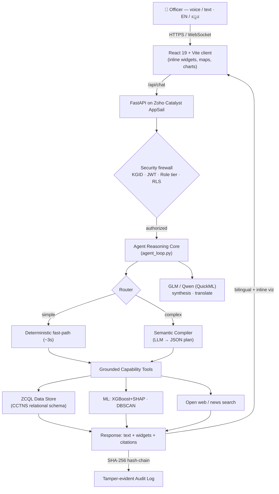
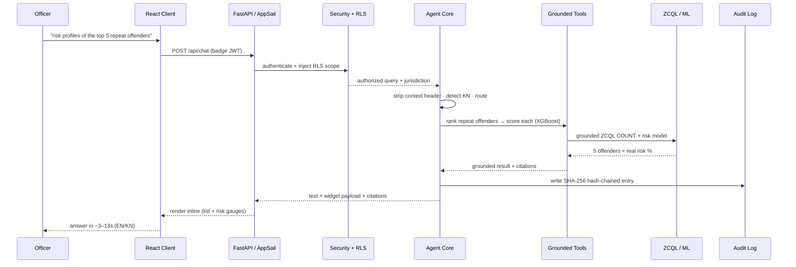
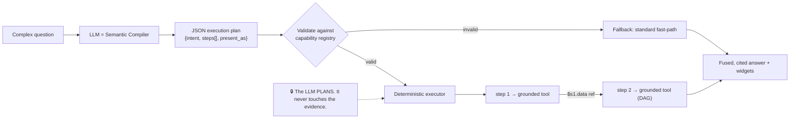
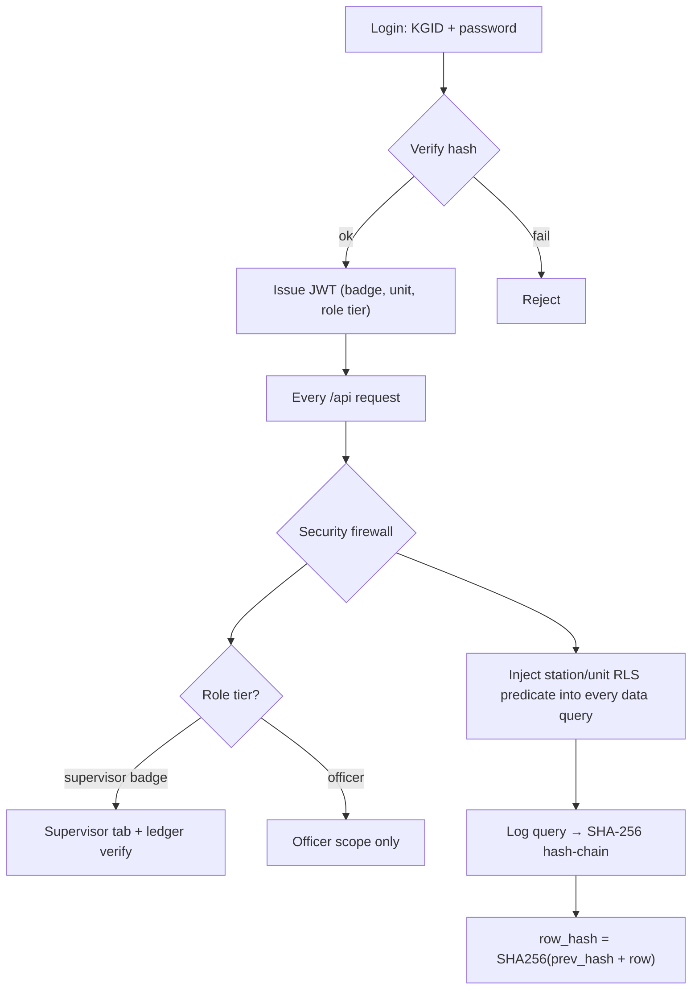
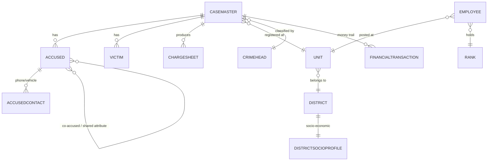

<div align="center">

# 🛡️ VAJRA (ವಜ್ರ)
### AI Crime‑Intelligence Copilot for the Karnataka State Police

*Ask the crime database anything — in English or Kannada, by voice or text — and get a grounded answer with the right chart, map, risk gauge or network graph assembled inline.*

[](https://vajra-60074806366.development.catalystserverless.in/app/index.html)
[](https://react.dev/)
[](https://fastapi.tiangolo.com/)
[](#-aiml-engines)
[](#)

**Karnataka State Police Datathon 2026 — Challenge 01**

</div>

---

## 📌 Executive Summary

**VAJRA** turns the KSP crime database into a conversation. Instead of hunting through fragmented dashboards, an investigator asks a plain‑language question — *"give me the risk profiles of the top 5 repeat offenders"*, *"ಯಾವ ಜಿಲ್ಲೆಗಳಲ್ಲಿ ಅತಿ ಹೆಚ್ಚು ಅಪರಾಧಗಳಿವೆ"*, *"compare crime between Bengaluru and Mysuru, then show hotspots in the worse one"* — and VAJRA compiles it into a grounded analysis, executed against real CCTNS‑schema records, and renders the answer **plus the exact visualization** (map, risk gauge, network graph, pie/trend chart) **inline in the chat**.

Every figure is a live query. When the data doesn't contain the answer, VAJRA **says so** instead of inventing one — the never‑fabricate discipline is a headline design principle, not an afterthought.

> **Live app:** https://vajra-60074806366.development.catalystserverless.in/app/index.html · **Login:** Badge `2346836` / `HackaThon2026`

---

## 🏅 The Five Winning USPs

| # | USP | Why it stands out |
|---|-----|-------------------|
| **1** | **Ask‑Anything → Auto‑Dashboard** | Every answer *composes its own* visualization inline — one question returns narrative **and** the right map/chart/graph, no menu‑hunting. |
| **2** | **A "thinking" AI, not a keyword black box** | A **Semantic Compiler** turns the question into an auditable JSON execution plan; a deterministic engine runs it. The LLM plans, it never touches the evidence. |
| **3** | **Explainable & audit‑ready by default** | Every claim carries citations + a tamper‑evident SHA‑256 audit entry; risk scores ship with SHAP feature breakdowns — evidence‑admissible, glass‑box. |
| **4** | **True bilingual, voice in *and* out** | Kannada speech‑in → reasoning → Kannada speech‑out, end to end, for a Karnataka‑government audience. |
| **5** | **Syndicate Radar** | Surfaces *emerging* groups by shared phone/vehicle links — connections nobody has formally filed yet. |

---

## 🚀 Key Features & Capabilities

### 🗣️ Bilingual, multimodal conversation
- **English & Kannada**, text or voice, with automatic spoken‑language detection.
- **Kannada intent routing** — Kannada analytical queries are matched on Kannada script directly (rank, count, hotspots, trend, forecast, news…), then answered and spoken back in Kannada.
- **Inline result widgets** — maps, charts, network graphs, risk gauges and SHAP bars render *in the chat thread*, expandable to a full side panel.
- **Per‑message translate** + a live whole‑chat language toggle.

### 🧠 A genuine reasoning layer (the USP)
- **Semantic Compiler (AI Reasoning mode):** the LLM emits a JSON plan `{intent, steps[], present_as}` over a capability registry; a deterministic executor runs it and stitches multi‑step (DAG) results — the model is quarantined from execution.
- **Auto‑router:** simple asks take the fast ~3s deterministic path; genuinely complex/compound asks are auto‑promoted to the compiler.
- **Multi‑tool per turn:** one question can fan out to several facets (e.g. *web signals + grounded distribution*) and stack them as panels.

### 🔍 Analytical engines
- **Spatial hotspots** — `scikit‑learn` **DBSCAN** over geocoded FIR coordinates + 90‑day momentum.
- **Recidivism risk + SHAP** — **XGBoost** conviction‑risk per suspect with a plain‑language SHAP breakdown of *why*.
- **Criminal‑network & Syndicate Radar** — co‑accused graph plus shared‑phone/vehicle link inference, community detection and centrality ranking.
- **Trends & forecasting** — real monthly `COUNT` aggregation, least‑squares trend, statewide/ district baseline projection.
- **Distribution analytics** — case‑type and per‑crime‑by‑district pies (honours a "last N years" window).
- **Anomaly detection** — z‑score spikes and category‑momentum breaks.
- **Predictive Beat Planning** — fuses hotspot density into a ranked "where to patrol tomorrow" recommendation.
- **Open‑web signals** — live web/news search, clearly separated as *unverified leads* from official CCTNS records.

### 👥 Collaboration & workspaces
- **Live cowork sessions** over WebSockets — multiple officers in one thread; `@vajra` gates AI inference so officers can talk without pinging the model.
- **Case‑linked investigations** tied to FIR/CR numbers with auto‑extracted summaries.

### 📊 District Analytics dashboard
- Interactive Karnataka map, Composite Threat Index, socio‑economic correlation, hotspots, case‑outcome mix, most‑wanted, and a separate **open‑source signals** lane with a visible "unverified" trust boundary.

### 🛡️ Security, RLS & integrity
- **KGID authentication** (7‑digit Karnataka Government ID) with hashed credentials + JWT.
- **Role tiers:** supervisor tier is restricted to a specific badge; all others are officers, and the Supervisor tab is hidden for them.
- **Server‑side Row‑Level Security** scoped to the officer's station/jurisdiction.
- **Tamper‑evident SHA‑256 hash‑chained audit log** for every query, verifiable in the Supervisor dashboard.
- **Official PDF export** — KSP letterhead, watermark, seal and a SHA‑256 integrity hash; attributed to the authenticated badge, server‑side.

---

## 🗂️ Capability Catalog (deterministic, grounded tools)

| Category | Capabilities |
|---|---|
| **Case** | case overview · station · victim/complainant · applied sections · timeline · dangerousness · linked cases · next‑steps |
| **People** | offender risk (+SHAP) · repeat offenders · MO profile · full offender dossier · descriptive‑subject resolution |
| **Network** | co‑accused graph · shared‑attribute (phone/vehicle) links · community detection · centrality ranking |
| **Geospatial** | DBSCAN hotspots · predictive beat plan |
| **Trends/Stats** | crime trends · count (by type/district/year) · district ranking · case‑type distribution · per‑crime‑by‑district · forecast · priority concerns · anomaly detection |
| **Socio** | demographic / socio‑economic correlation |
| **External** | live news · web search · URL summarize · online‑abuse triage |
| **Meta** | self‑profile · database overview · conversational memory · re‑chart previous answer |

---

## 🏗️ System Architecture


```mermaid
graph TD
    A["👮 Officer — voice / text · EN / ಕನ್ನಡ"] -->|HTTPS / WebSocket| B["React 19 + Vite client<br/>(inline widgets, maps, charts)"]
    B -->|"/api/chat"| C["FastAPI on Zoho Catalyst AppSail"]
    C --> D{"Security firewall<br/>KGID · JWT · Role tier · RLS"}
    D -->|authorized| E["Agent Reasoning Core<br/>(agent_loop.py)"]
    E --> F{"Router"}
    F -->|simple| G["Deterministic fast‑path (~3s)"]
    F -->|complex| H["Semantic Compiler<br/>(LLM → JSON plan)"]
    G --> T["Grounded Capability Tools"]
    H --> T
    T --> I["ZCQL Data Store<br/>(CCTNS relational schema)"]
    T --> J["ML: XGBoost+SHAP · DBSCAN"]
    T --> K["Open web / news search"]
    E --> L["GLM / Qwen (QuickML)<br/>synthesis · translate"]
    I --> M["Response: text + widgets + citations"]
    J --> M
    K --> M
    M -->|SHA‑256 hash‑chain| N["Tamper‑evident Audit Log"]
    M -->|bilingual + inline viz| B
```

### Query lifecycle (sequence)


```mermaid
sequenceDiagram
    participant O as Officer
    participant UI as React Client
    participant API as FastAPI / AppSail
    participant SEC as Security + RLS
    participant AG as Agent Core
    participant T as Grounded Tools
    participant DB as ZCQL / ML
    participant AU as Audit Log

    O->>UI: "risk profiles of the top 5 repeat offenders"
    UI->>API: POST /api/chat (badge JWT)
    API->>SEC: authenticate + inject RLS scope
    SEC-->>AG: authorized query + jurisdiction
    AG->>AG: strip context header · detect KN · route
    AG->>T: rank repeat offenders → score each (XGBoost)
    T->>DB: grounded ZCQL COUNT + risk model
    DB-->>T: 5 offenders + real risk %
    T-->>AG: grounded result + citations
    AG->>AU: write SHA‑256 hash‑chained entry
    AG-->>API: text + widget payload + citations
    API-->>UI: render inline (list + risk gauges)
    UI-->>O: answer in ~3–13s (EN/KN)
```

### The Semantic Compiler (thinking‑AI USP)


```mermaid
flowchart LR
    Q["Complex question"] --> P["LLM = Semantic Compiler"]
    P --> J["JSON execution plan<br/>{intent, steps[], present_as}"]
    J --> V{"Validate against<br/>capability registry"}
    V -->|valid| X["Deterministic executor"]
    X --> S1["step 1 → grounded tool"]
    S1 -->|"$s1.data ref"| S2["step 2 → grounded tool (DAG)"]
    S2 --> R["Fused, cited answer + widgets"]
    V -->|invalid| FB["Fallback: standard fast‑path"]
    FB --> R
    note["🔒 The LLM PLANS. It never touches the evidence."] -.-> X
```

### Security & RLS flow


```mermaid
flowchart TD
    L["Login: KGID + password"] --> AUth{"Verify hash"}
    AUth -->|ok| JWT["Issue JWT (badge, unit, role tier)"]
    AUth -->|fail| DENY1["Reject"]
    JWT --> REQ["Every /api request"]
    REQ --> FW{"Security firewall"}
    FW --> ROLE{"Role tier?"}
    ROLE -->|supervisor badge| SUP["Supervisor tab + ledger verify"]
    ROLE -->|officer| OFF["Officer scope only"]
    FW --> RLS["Inject station/unit RLS predicate into every data query"]
    RLS --> AUDIT["Log query → SHA‑256 hash‑chain"]
    AUDIT --> PREV["row_hash = SHA256(prev_hash + row)"]
```

### Data model (representative CCTNS‑schema entities)


```mermaid
erDiagram
    CASEMASTER ||--o{ ACCUSED : "has"
    CASEMASTER ||--o{ VICTIM : "has"
    CASEMASTER ||--o{ CHARGESHEET : "produces"
    CASEMASTER }o--|| UNIT : "registered at"
    UNIT }o--|| DISTRICT : "belongs to"
    CASEMASTER }o--|| CRIMEHEAD : "classified by"
    ACCUSED ||--o{ ACCUSEDCONTACT : "phone/vehicle"
    ACCUSED }o--o{ ACCUSED : "co-accused / shared attribute"
    EMPLOYEE }o--|| UNIT : "posted at"
    EMPLOYEE }o--|| RANK : "holds"
    DISTRICT ||--|| DISTRICTSOCIOPROFILE : "socio-economic"
    CASEMASTER ||--o{ FINANCIALTRANSACTION : "money trail"
```

---

## 🧠 AI/ML Engines

| Engine | Tech | Role |
|---|---|---|
| **Reasoning LLM** | GLM‑4.x via Catalyst **QuickML** (Qwen fallback) | Semantic compilation, tool selection, answer synthesis |
| **Translation** | Zia Fast‑Translate (GLM/Qwen fallback) | EN↔KN answer translation (structure‑preserving) |
| **Speech** | Zia TTS/STT | Kannada/English voice in and out |
| **Recidivism risk** | **XGBoost** + **SHAP** | Per‑suspect conviction‑risk score + explanation |
| **Hotspots** | **DBSCAN** (`scikit‑learn`) | Spatial crime‑density clustering |
| **Graph analytics** | NetworkX‑style in‑process | Community detection + centrality over ZCQL‑built graph |

---

## 🛠️ Technology Stack

| Layer | Technology |
|---|---|
| **Frontend** | React 19 · TypeScript · Vite · Tailwind v4 · Leaflet · Recharts · Motion · Lucide |
| **Backend** | Python 3.11 · FastAPI · Uvicorn |
| **Platform** | **Zoho Catalyst** — AppSail (compute) · ZCQL Data Store · Stratus (files) · Cache · QuickML (AI) |
| **Data** | CCTNS‑schema relational tables (CaseMaster, Accused, Victim, Unit, District, CrimeHead, ChargesheetDetails, DistrictSocioProfile, FinancialTransaction, ForecastResults, ProactiveAlerts, ChatSession/Message, AuditLog, OfficerCredentials, …) |
| **AI/ML** | GLM · Qwen · XGBoost · SHAP · DBSCAN · Zia TTS/STT/Translate |
| **Realtime & Security** | WebSockets · JWT · hashed credentials · server‑side RLS · SHA‑256 hash‑chain audit |

---

## 📂 Repository Layout

```
├── src/                     # React 19 frontend
│   ├── components/          #   inline widgets (map, network, risk, news), chat, panels
│   ├── screens/             #   AI Chat, District Analytics, Supervisor, Settings
│   └── i18n.ts              #   English + Kannada dictionaries
├── vajra_backend/           # FastAPI backend (Catalyst AppSail)
│   ├── main.py              #   API endpoints, auth, chat, cowork, export, analytics
│   ├── agent_loop.py        #   agent core: routing, semantic compiler, capability tools
│   ├── catalyst_llm.py      #   GLM/Qwen (QuickML) + Zia translate interface
│   ├── catalyst_speech.py   #   Zia TTS/STT
│   ├── vajra_core.py        #   RLS firewall + SHA‑256 audit hash‑chain
│   └── requirements.txt
├── docs/                    # architecture, schema & security docs
├── catalyst.json            # Catalyst project config
└── package.json
```

---

## ⚙️ Setup & Execution

**Prerequisites:** Node.js ≥ 18, Python ≥ 3.10, a Zoho Catalyst account + CLI (for deploy).

```bash
# 1. Clone
git clone https://github.com/BCSAKETH/VAJRA.git
cd VAJRA

# 2. Frontend
npm install
npm run dev            # Vite dev server

# 3. Backend
cd vajra_backend
python -m venv .venv
source .venv/bin/activate        # Windows: .venv\Scripts\activate
pip install -r requirements.txt
python main.py                   # FastAPI on http://localhost:8000
```

Backend secrets (Catalyst project id, client/secret, refresh token, model endpoints) are provided via `vajra_backend/.env`.

---

## 🚀 Deployment (Zoho Catalyst — required by the Datathon)

```bash
npm install -g zcatalyst-cli
catalyst login
npm run build                                   # build the React client
catalyst deploy --only client,appsail:vajra-backend
```

**Live URL:** https://vajra-60074806366.development.catalystserverless.in/app/index.html

---

## ✅ Built vs. 🔭 Roadmap (honest scope)

We hold the demo to the same never‑fabricate bar as the answers.

**Built & live (demoable on real data):** conversational EN/KN copilot · semantic compiler + auto‑router · DBSCAN hotspots · XGBoost+SHAP risk · co‑accused & shared‑attribute network + community/centrality · trends/forecast/count/ranking/distribution · anomaly detection · predictive beat plan · live web/news search · district analytics · voice in/out · RLS + role tiers + SHA‑256 audit · official PDF export.

**Roadmap (clearly labelled vision, *not* claimed as built):** trained GNN link‑prediction, external graph DB (Neo4j), Splink/Leiden pipelines, PCR‑112 / bail / prison live feeds, MARL patrol dispatch, causal do‑calculus. These require data and infrastructure the current stack doesn't have and are presented only as the funded roadmap.

---

## 🔐 Compliance & Disclaimers
- Built for the **Karnataka State Police Datathon 2026 (Challenge 01)**.
- Human‑in‑the‑loop: VAJRA is decision **support**; officers remain the decision‑makers.
- Every AI synthesis carries source citations and a tamper‑evident audit entry; design aligns with **DPDPA 2023** / IT‑Act principles (no formal certification claimed).
- Demo enrichment (e.g. synthetic phone/vehicle links for Syndicate Radar) is clearly labelled and never presented as an official record.

---

## 📑 Submission Artifacts
- **Live prototype:** https://vajra-60074806366.development.catalystserverless.in/app/index.html
- **Public repository:** https://github.com/BCSAKETH/VAJRA
- **Demo video:** _(add public Google Drive / unlisted YouTube link)_
- **Prototype deck:** _(add link)_

<div align="center">

**VAJRA — ವಜ್ರ · the thunderbolt of clarity for Karnataka's crime intelligence.**

</div>
