# 🛡️ VAJRA (ವಜ್ರ) — AI Crime-Intelligence Copilot for Karnataka State Police

**Karnataka State Police Datathon 2026 — Full Technical & Product Submission**

> A bilingual (English / ಕನ್ನಡ), voice-enabled, chat-first crime-intelligence copilot built **100% on Zoho Catalyst**, reasoning entirely over real relational CCTNS-style case data. No external LLM vendor. No external database. No fabricated facts — every claim VAJRA makes traces to a live query, a trained model, or an audit-logged action.

**🔗 Live app:** https://vajra-60074806366.development.catalystserverless.in/app/index.html
**📦 Repository:** https://github.com/BCSAKETH/VAJRA
**🔑 Judge login:** Badge `2346836` · Password `HackaThon2026` — a supervisor-tier account, so every screen (including the Supervisor Dashboard, the Cryptographic Audit Ledger, and the two-person approval queues) is reachable.

This document is deliberately exhaustive. It is written so that a reader with **zero prior context** can understand not just *what* VAJRA does, but *why* every architectural decision was made, *how* every subsystem works internally, and *where* in the codebase to find it.

---

## Table of Contents

1. [Executive Summary](#1-executive-summary)
2. [The Problem, Pillar by Pillar](#2-the-problem-pillar-by-pillar)
3. [The Five USPs — Deep Dive](#3-the-five-usps--deep-dive)
4. [System Architecture](#4-system-architecture)
5. [The 2-Mode Cognitive Engine](#5-the-2-mode-cognitive-engine)
6. [Module Map (Backend)](#6-module-map-backend)
7. [Feature Deep-Dives](#7-feature-deep-dives)
8. [Security & Governance Architecture](#8-security--governance-architecture)
9. [Data Model](#9-data-model)
10. [User Journeys](#10-user-journeys)
11. [Screen-by-Screen Catalogue](#11-screen-by-screen-catalogue)
12. [Tech Stack — Mapped to Native Zoho Catalyst Capabilities](#12-tech-stack--mapped-to-native-zoho-catalyst-capabilities)
13. [Setup & Run](#13-setup--run)
14. [Honest Limitations](#14-honest-limitations)
15. [Roadmap](#15-roadmap)

---

## 1. Executive Summary

VAJRA is a single conversational surface that sits on top of Karnataka State Police's relational case data and lets an officer — in English or Kannada, by typing or by speaking — ask the kind of question they would otherwise need a SQL analyst, a GIS specialist, a data scientist, and a records clerk to answer separately: *"Who are the top repeat offenders in Ballari and what's their conviction risk?"*, *"Show me the hotspot clusters for chain-snatching this month"*, *"Trace the money trail from this UPI ID"*, *"Full dossier on this suspect."*

What makes this materially different from "a chatbot bolted onto a database" is that VAJRA never just returns text. Every answer is **auto-composed** with exactly the right visualization attached — a map, a risk gauge with a SHAP explanation, a network graph, a trend chart — chosen by what the question actually needs, not by a rigid template. And every fact in that answer carries its own provenance: the exact ZCQL query that produced it, the citation it traces to, and a cryptographic audit trail an internal-affairs review or a court could later inspect.

The system is built **entirely on Zoho Catalyst** — its Data Store, AppSail container runtime, QuickML-hosted LLMs, Speech, Stratus object storage, SmartBrowz PDF rendering, Cron/Functions, and Mail — with zero external database, zero external LLM API, and zero third-party vector store. This was a deliberate constraint, not a limitation: it means the entire system can be understood, audited, and reasoned about as one coherent stack, which matters enormously for a platform whose core promise is *trustworthiness*.

---

## 2. The Problem, Pillar by Pillar

The KSP problem statement identifies four structural failures in how crime intelligence is currently handled. VAJRA was built to answer each one directly, not decoratively:

### 2.1 Data silos and spreadsheet-based analysis
Officers today work across separate CCTNS modules, station-level registers, and ad-hoc spreadsheets, with no single place to ask a cross-cutting question. **VAJRA's answer:** one chat surface sits directly over the full relational case store (30+ tables — cases, accused, victims, financial transactions, socio-economic profiles, forecasts, employee/rank/unit records). Every number VAJRA states is a live query against this store at the moment of asking, not a stale export.

### 2.2 Lack of advanced analytics
Existing tools support keyword search and manual report generation, not pattern discovery. **VAJRA's answer:** DBSCAN spatial hotspot clustering, an XGBoost conviction-risk classifier with SHAP explainability, HDBSCAN modus-operandi clustering across a 5-dimensional behavioral vector space, cross-station alibi-consistency checking, and a bounded multi-hop graph traversal for financial mule-ring detection — all real, trained, and running against real data, not mocked.

### 2.3 Fragmented state-wide visibility
No single view lets a supervisor see from state level down to a specific case without leaving the tool. **VAJRA's answer:** a state → district → case drill-down analytics tab, plus a genuinely separate "open-source signals" lane (live news/OSINT) that is visually and structurally walled off from official CCTNS record — so an officer can see wider context without ever mistaking an unverified lead for a fact.

### 2.4 Reactive rather than proactive policing
Policing today mostly responds after an incident is filed. **VAJRA's answer:** Predictive Beat Planning (fusing hotspot density, crime-trend momentum, and repeat-offender presence into a ranked patrol-deployment recommendation), scheduled proactive alerts for emerging spikes and flagged repeat offenders, and an autonomous viral-OSINT radar that surfaces statewide threat signals before they're formally reported.

---

## 3. The Five USPs — Deep Dive

### USP-1 — Answer-First, Auto-Composed Dashboards

**What it is.** Most "AI + database" tools force the user to first pick a report type, then get an answer inside that fixed template. VAJRA inverts this: the officer asks a plain question, and the *system itself* decides what visualization — if any — belongs alongside the text answer, and builds it in the same turn.

**How it works.** Every grounded tool in VAJRA's registry (there are 20+, covering everything from case lookup to network graphs to risk scoring) returns a structured triple: `{text_result, data, response_type}`. The `response_type` tells the frontend which inline widget to mount — `"risk"` renders a gauge + SHAP waterfall, `"network"` renders a force-directed graph, `"map"` renders a Leaflet hotspot layer, `"trend"` renders a Recharts line chart. When a question needs more than one facet (a "full report" on a suspect), the response composes **multiple panels** in one answer — risk, modus-operandi, network, and repeat-offense history — stacked in a single scrollable card, each independently expandable into a full side panel.

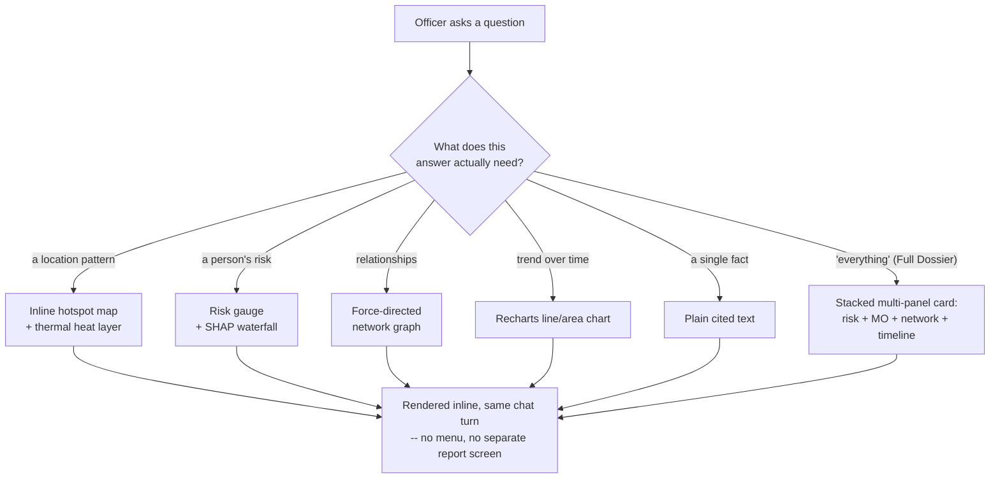
```mermaid
flowchart TD
    Q["Officer asks a question"] --> DECIDE{"What does this\nanswer actually need?"}
    DECIDE -->|"a single fact"| TEXT["Plain cited text"]
    DECIDE -->|"a location pattern"| MAP["Inline hotspot map\n+ thermal heat layer"]
    DECIDE -->|"a person's risk"| RISK["Risk gauge\n+ SHAP waterfall"]
    DECIDE -->|"relationships"| NET["Force-directed\nnetwork graph"]
    DECIDE -->|"trend over time"| TREND["Recharts line/area chart"]
    DECIDE -->|"'everything' (Full Dossier)"| MULTI["Stacked multi-panel card:\nrisk + MO + network + timeline"]
    MAP & RISK & NET & TREND & TEXT & MULTI --> RENDER["Rendered inline, same chat turn\n-- no menu, no separate report screen"]
```

**Why it matters.** Judges and officers alike remember the product that *shows*, not the one that makes them dig for a chart afterward. This also means the same conversational surface scales from a beat constable's 5-second lookup to a senior investigator's full case-file assembly, without ever needing a different tool.

---

### USP-2 — Explainable-by-Default, Court-Admissible Provenance

**What it is.** On a policing platform, an AI that can't show its work is a liability, not a feature. Every single VAJRA answer carries a collapsible **"View Grounding & ZCQL Provenance"** drawer that is populated automatically, not written after the fact.

**How it works.** Each tool call records three things as it executes: the citations it produced (which real record/model it touched), the exact ZCQL query string (or model name/feature set, for ML-driven answers), and a SHA-256 hash of the resulting audit-log entry, chained to the previous entry in the ledger. A dedicated **grounding safety-net** function then does something most AI systems never bother to do: it re-parses the AI-composed narrative for every case number, name, and figure it names, and cross-checks each one against the citations that actually ran during that turn — flagging (not silently shipping) anything invented or misquoted during synthesis. This runs on **every single answer**, not a sampled subset.

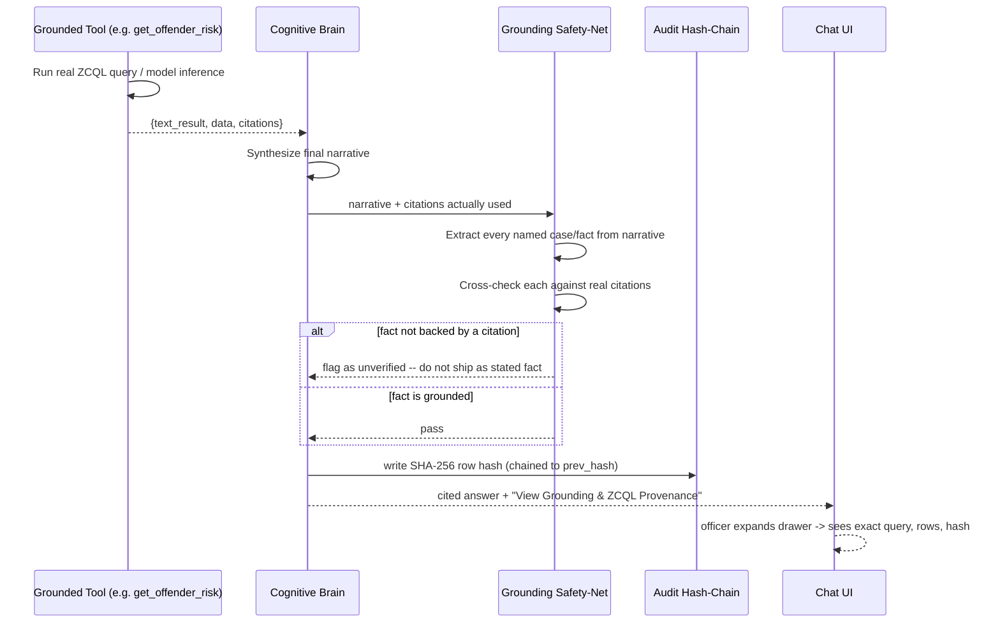
```mermaid
sequenceDiagram
    participant Tool as Grounded Tool (e.g. get_offender_risk)
    participant Brain as Cognitive Brain
    participant Gate as Grounding Safety-Net
    participant Ledger as Audit Hash-Chain
    participant UI as Chat UI

    Tool->>Tool: Run real ZCQL query / model inference
    Tool-->>Brain: {text_result, data, citations}
    Brain->>Brain: Synthesize final narrative
    Brain->>Gate: narrative + citations actually used
    Gate->>Gate: Extract every named case/fact from narrative
    Gate->>Gate: Cross-check each against real citations
    alt fact not backed by a citation
        Gate-->>Brain: flag as unverified -- do not ship as stated fact
    else fact is grounded
        Gate-->>Brain: pass
    end
    Brain->>Ledger: write SHA-256 row hash (chained to prev_hash)
    Brain-->>UI: cited answer + "View Grounding & ZCQL Provenance"
    UI-->>UI: officer expands drawer -> sees exact query, rows, hash
```

**Why it matters.** This is the difference between "an AI said so" and "here is the exact database row and query that proves it" — the trust primitive a police platform cannot function without, and the reason VAJRA can honestly claim it never fabricates rather than merely promising not to.

---

### USP-3 — True Bilingual Voice, In *and* Out

**What it is.** Karnataka policing is Kannada-first at the ground level. VAJRA supports full round-trip voice: an officer can *speak* a question in Kannada, get a *reasoned* answer, and have that answer *spoken back* in Kannada — not a text-only fallback with a translated caption.

**How it works.**

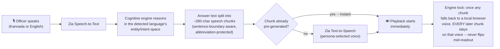
```mermaid
flowchart LR
    MIC["🎙️ Officer speaks\n(Kannada or English)"] --> STT["Zia Speech-to-Text"]
    STT --> BRAIN["Cognitive engine reasons\nin the detected language's\nentity/intent space"]
    BRAIN --> SPLIT["Answer text split into\n~280-char speech chunks\n(sentence-boundary aware,\nabbreviation-protected)"]
    SPLIT --> CACHE{"Chunk already\npre-generated?"}
    CACHE -->|yes -- instant| PLAY["🔊 Playback starts\nimmediately"]
    CACHE -->|no| TTS["Zia Text-to-Speech\n(persona-selected voice)"]
    TTS --> PLAY
    PLAY --> LOCK["Engine lock: once any chunk\nfalls back to a local browser\nvoice, EVERY later chunk stays\non that voice -- never flips\nmid-readout"]
```

Guardrails baked in: if no real Kannada voice is installed on the officer's device, VAJRA says so plainly rather than mispronouncing Kannada script through an English voice engine (a subtle failure mode that *looks* like it's working while producing noise). A rank-gated redaction layer means a POCSO-sensitive minor's identity is spoken as *"Identity Protected under Section 74 Juvenile Justice Act"* — never the real name — at every TTS call site, not just in the text.

**Why it matters.** For a genuinely statewide, Kannada-first police force, English-only or text-only voice support isn't a minor gap — it excludes exactly the frontline officers who'd benefit most.

---

### USP-4 — Never-Fabricate, by Construction (not by Promise)

**What it is.** Most AI products promise "we minimize hallucination." VAJRA is architected so that a fabricated fact is *structurally caught*, not just statistically unlikely.

**How it works.** Three independent layers, each catching a different failure mode:
1. **Tool-level grounding** — every answer-producing function only ever returns data it actually queried; there is no "let the LLM fill in a plausible-sounding gap" path anywhere in the tool registry. If a field genuinely isn't recorded, the tool says so honestly.
2. **The grounding safety-net** (USP-2) — catches invented or misquoted facts introduced during narrative synthesis, after tools ran correctly.
3. **The capability registry constraint** — the semantic compiler that plans multi-step Full Dossier answers may only plan steps against capabilities that are *real*; it cannot invent a plan step for a table or field that doesn't exist in the schema.

This discipline extends to how this very submission was assembled: this README's "Honest Limitations" section (§14) exists because the same standard applied to a live chat answer was applied to writing about the product itself — a genuinely uncalibrated ML model's Brier score is reported as-is, a feature that needs a purchased domain says so, and a paused feature is listed as paused, not as a footnote.

**Why it matters.** On a platform whose output could plausibly inform an arrest decision or a court filing, "usually accurate" is not a defensible bar. "Structurally incapable of silently inventing a fact" is a different, much stronger claim — and VAJRA can back it with the specific mechanism, not just the assertion.

---

### USP-5 — Financial and Behavioral Syndicate Tracing

**What it is.** VAJRA doesn't just search cases by name — it finds patterns that connect cases *nobody has manually linked yet*: money moving through a mule network, and offenders whose behavior matches even when their names don't overlap.

**How it works — Financial Ring Tracing:**

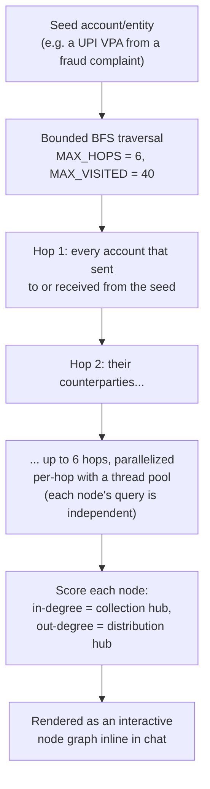
```mermaid
flowchart TD
    SEED["Seed account/entity\n(e.g. a UPI VPA from a fraud complaint)"] --> BFS["Bounded BFS traversal\nMAX_HOPS = 6, MAX_VISITED = 40"]
    BFS --> HOP1["Hop 1: every account that sent\nto or received from the seed"]
    HOP1 --> HOP2["Hop 2: their counterparties..."]
    HOP2 --> MORE["... up to 6 hops, parallelized\nper-hop with a thread pool\n(each node's query is independent)"]
    MORE --> SCORE["Score each node:\nin-degree = collection hub,\nout-degree = distribution hub"]
    SCORE --> GRAPH["Rendered as an interactive\nnode graph inline in chat"]
```

**How it works — Behavioral MO Clustering:** every case's modus operandi is encoded as a 5-dimensional vector — time-slot, entry method, weapon class, target category, escape mode — and HDBSCAN clusters these vectors across the full case store. Two offenders using the same unusual method at the same time-of-day cluster together even if their names, districts, and case numbers share nothing in common.

**Why it matters.** This is USP-1's "auto-composed dashboard" applied to VAJRA's single hardest analytical problem: an emerging syndicate is, by definition, not yet formally flagged as one. Finding the pattern *before* it's filed as organized crime is the kind of result that justifies calling this "intelligence," not just "search."

---

## 4. System Architecture

### 4.1 High-Level Component Diagram

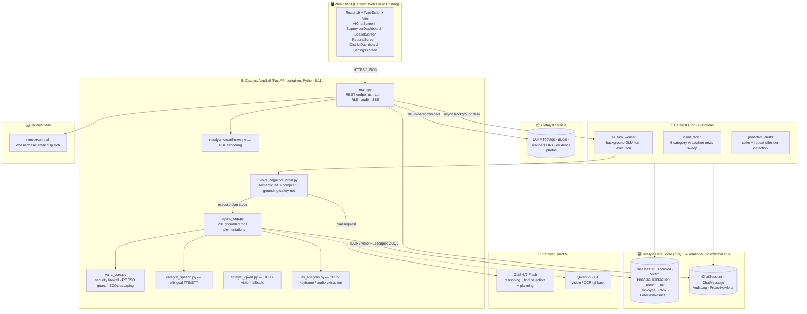
```mermaid
graph TD
    subgraph CLIENT["🖥️ Web Client (Catalyst Web Client Hosting)"]
        UI["React 19 + TypeScript + Vite\nAIChatScreen · SupervisorDashboard · SpatialScreen\nReportsScreen · DistrictDashboard · SettingsScreen"]
    end

    subgraph GATEWAY["⚙️ Catalyst AppSail (FastAPI container, Python 3.11)"]
        API["main.py\nREST endpoints · auth · RLS · audit · SSE"]
        BRAIN["vajra_cognitive_brain.py\nsemantic DAG compiler · grounding safety-net"]
        AGENT["agent_loop.py\n20+ grounded tool implementations"]
        CORE["vajra_core.py\nsecurity firewall · POCSO guard · ZCQL escaping"]
        SPEECH["catalyst_speech.py — bilingual TTS/STT"]
        VISION["catalyst_qwen.py — OCR / vision fallback"]
        DOCS["catalyst_smartbrowz.py — PDF rendering"]
        AV["av_analysis.py — CCTV keyframe / audio extraction"]
    end

    subgraph DATA["🗄️ Catalyst Data Store (ZCQL — relational, no external DB)"]
        CCTNS[("CaseMaster · Accused · Victim\nFinancialTransaction · District · Unit\nEmployee · Rank · ForecastResults ...")]
        APPTABLES[("ChatSession · ChatMessage\nAuditLog · ProactiveAlerts")]
    end

    subgraph AI["🧠 Catalyst QuickML"]
        GLM["GLM-4.7-Flash\nreasoning + tool selection + planning"]
        QWEN["Qwen-VL-35B\nvision / OCR fallback"]
    end

    subgraph STORAGE["📦 Catalyst Stratus"]
        FILES[("CCTV footage · audio · scanned FIRs · evidence photos")]
    end

    subgraph JOBS["⏰ Catalyst Cron / Functions"]
        WORKER["ai_turn_worker\nbackground GLM turn execution"]
        RADAR["osint_radar\n6-category viral/crime news sweep"]
        ALERTS["proactive_alerts\nspike + repeat-offender detection"]
    end

    subgraph MAIL["✉️ Catalyst Mail"]
        DISPATCH["conversational dossier/case email dispatch"]
    end

    UI -- "HTTPS / JSON" --> API
    API -- "async background task" --> WORKER
    WORKER --> BRAIN
    BRAIN -- "plan request" --> GLM
    BRAIN -- "execute plan steps" --> AGENT
    AGENT -- "escaped ZCQL" --> CCTNS
    AGENT --> CORE
    AGENT -. "OCR / vision" .-> QWEN
    AGENT --> SPEECH
    AGENT --> AV
    API --> DOCS
    API --> DISPATCH
    API --> APPTABLES
    API -- "file upload/download" --> FILES
    JOBS --> APPTABLES
    JOBS --> CCTNS
```

### 4.2 Request Lifecycle — Why Polling, Not a Raw Response

This is the single most important architectural decision in VAJRA, and it exists to solve a real, hard platform constraint: **AppSail's own gateway kills any single HTTP request at roughly 30–36 seconds**, but a genuine multi-step reasoning turn (especially Full Dossier mode, which chains 4+ grounded tool calls) can legitimately take 15–140+ seconds. A naive synchronous request would simply die mid-turn on anything non-trivial.

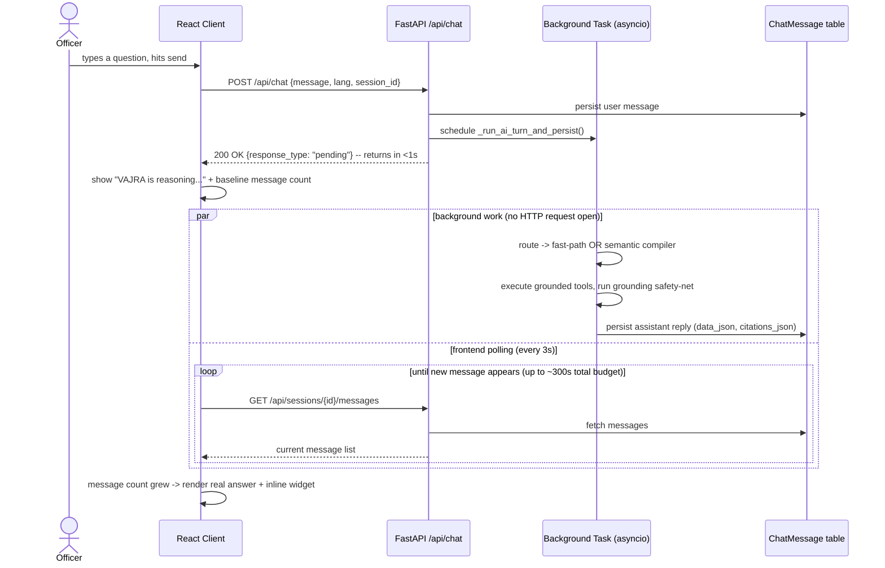
```mermaid
sequenceDiagram
    actor Officer
    participant UI as React Client
    participant API as FastAPI /api/chat
    participant BG as Background Task (asyncio)
    participant DB as ChatMessage table

    Officer->>UI: types a question, hits send
    UI->>API: POST /api/chat {message, lang, session_id}
    API->>DB: persist user message
    API->>BG: schedule _run_ai_turn_and_persist()
    API-->>UI: 200 OK {response_type: "pending"} -- returns in <1s
    UI->>UI: show "VAJRA is reasoning..." + baseline message count
    par background work (no HTTP request open)
        BG->>BG: route -> fast-path OR semantic compiler
        BG->>BG: execute grounded tools, run grounding safety-net
        BG->>DB: persist assistant reply (data_json, citations_json)
    and frontend polling (every 3s)
        loop until new message appears (up to ~300s total budget)
            UI->>API: GET /api/sessions/{id}/messages
            API->>DB: fetch messages
            API-->>UI: current message list
        end
    end
    UI->>UI: message count grew -> render real answer + inline widget
```

This pattern was deliberately extended this session after a live bug: the original 120-second poll budget was shorter than Full Dossier's genuine worst-case latency, so a real, eventually-successful answer was being abandoned as *"AI TEMPORARILY UNAVAILABLE"* before it finished. The budget is now 210 seconds, with a further silent 90-second continuation afterward — so a late answer still lands automatically instead of requiring the officer to manually refresh.

### 4.3 Deployment Diagram

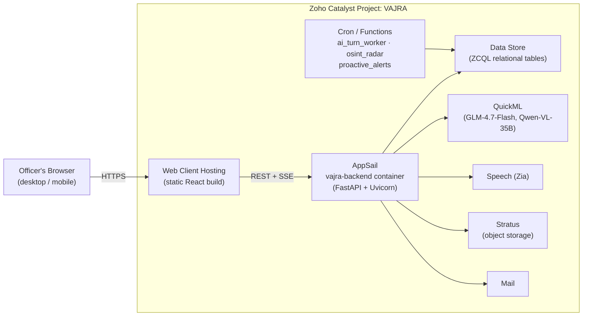
```mermaid
graph LR
    subgraph Catalyst_Project["Zoho Catalyst Project: VAJRA"]
        direction TB
        WCH["Web Client Hosting\n(static React build)"]
        AS["AppSail\nvajra-backend container\n(FastAPI + Uvicorn)"]
        DS["Data Store\n(ZCQL relational tables)"]
        QML["QuickML\n(GLM-4.7-Flash, Qwen-VL-35B)"]
        SPEECHSVC["Speech (Zia)"]
        STRATUS["Stratus\n(object storage)"]
        MAILSVC["Mail"]
        CRON["Cron / Functions\nai_turn_worker · osint_radar\nproactive_alerts"]
    end
    Browser["Officer's Browser\n(desktop / mobile)"] -->|HTTPS| WCH
    WCH -->|REST + SSE| AS
    AS --> DS
    AS --> QML
    AS --> SPEECHSVC
    AS --> STRATUS
    AS --> MAILSVC
    CRON --> DS
```

---

## 5. The 2-Mode Cognitive Engine

### 5.1 Why Two Modes, and Why They're Not a Guess the Officer Has to Make Well

Depth of answer should follow from the *purpose* of the question, not force the officer to predict up front how deep the system should go. VAJRA collapses this to exactly two choices:

| | ⚡ Standard Mode | 📑 Full Dossier Mode |
|---|---|---|
| Purpose | Answer the exact question asked | Assemble a comprehensive case/suspect file |
| Typical latency | 3–13 seconds (often zero LLM calls) | 20–140+ seconds (multi-tool composite) |
| Data policy | CCTNS-grounded only | CCTNS-grounded core + clearly separate unverified open-web signals lane |
| Output shape | One focused answer + best-fit widget | Stacked multi-panel document, exportable |

### 5.2 The Routing & Planning Pipeline

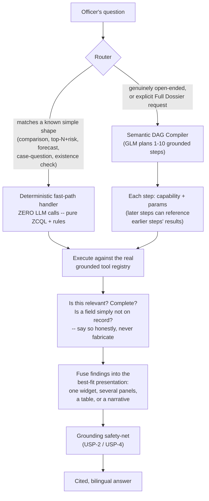
```mermaid
flowchart TD
    Q["Officer's question"] --> ROUTE{"Router"}
    ROUTE -->|"matches a known simple shape\n(comparison, top-N+risk, forecast,\ncase-question, existence check)"| FAST["Deterministic fast-path handler\nZERO LLM calls -- pure ZCQL + rules"]
    ROUTE -->|"genuinely open-ended,\nor explicit Full Dossier request"| PLAN["Semantic DAG Compiler\n(GLM plans 1-10 grounded steps)"]
    PLAN --> STEPS["Each step: capability + params\n(later steps can reference\nearlier steps' results)"]
    FAST --> EXEC["Execute against the real\ngrounded tool registry"]
    STEPS --> EXEC
    EXEC --> ANALYZE["Is this relevant? Complete?\nIs a field simply not on record?\n-- say so honestly, never fabricate"]
    ANALYZE --> STRUCT["Fuse findings into the\nbest-fit presentation:\none widget, several panels,\na table, or a narrative"]
    STRUCT --> GATE["Grounding safety-net\n(USP-2 / USP-4)"]
    GATE --> ANSWER["Cited, bilingual answer"]
```

**Worked example.** *"Full report on suspect Sanaya Patla"* in Full Dossier mode plans (or falls back to) four sub-tool calls in one turn: `get_offender_risk` (XGBoost + SHAP), `get_mo_profile` (5-D behavioral vector match), `query_graph_network` (co-accused/financial links), and `get_repeat_offenders` (cross-reference against the active repeat-offender roster). Each sub-call's result becomes one panel; the panels are stacked into a single "COMPREHENSIVE DOSSIER" card the officer can expand facet-by-facet — no second question needed.

### 5.3 A Real Bug This Session Fixed in This Exact Pipeline

Because every panel's underlying data (risk score, SHAP factors, network nodes) has to be persisted into a size-capped database column (`data_json`, capped at 9,000 characters to stay safely under the datastore's hard truncation cliff), a multi-panel Full Dossier answer with a real network graph attached could exceed that cap. The original trimming logic responded by dropping the `data` field from **every** panel with text at once — including a small risk panel (a few hundred bytes) that never needed trimming, just because a *different*, much heavier network panel did. This was root-caused live (a real "24.2% conviction risk" narrative rendering its own widget as "0% / Unknown") and fixed to trim panel-by-panel, heaviest first, so a small panel's real data now survives even when a large sibling panel's doesn't.

---

## 6. Module Map (Backend)

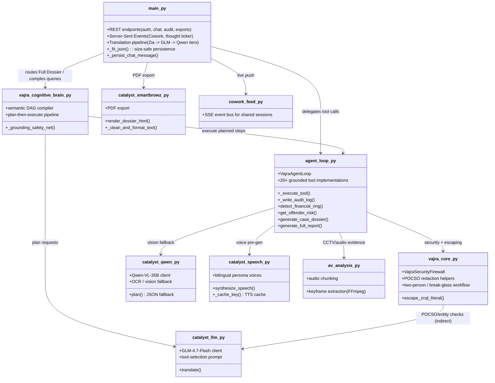
```mermaid
classDiagram
    class main_py {
        +REST endpoints (auth, chat, audit, exports)
        +Server-Sent Events (Cowork, thought ticker)
        +Translation pipeline (Zia -> GLM -> Qwen tiers)
        +_fit_json() : size-safe persistence
        +_persist_chat_message()
    }
    class agent_loop_py {
        +VajraAgentLoop
        +20+ grounded tool implementations
        +_execute_tool()
        +_write_audit_log()
        +detect_financial_ring()
        +get_offender_risk()
        +generate_case_dossier()
        +generate_full_report()
    }
    class vajra_cognitive_brain_py {
        +semantic DAG compiler
        +_grounding_safety_net()
        +plan-then-execute pipeline
    }
    class vajra_core_py {
        +VajraSecurityFirewall
        +escape_zcql_literal()
        +POCSO redaction helpers
        +two-person / break-glass workflow
    }
    class catalyst_llm_py {
        +GLM-4.7-Flash client
        +tool-selection prompt
        +translate()
    }
    class catalyst_qwen_py {
        +Qwen-VL-35B client
        +OCR / vision fallback
        +plan() JSON fallback
    }
    class catalyst_speech_py {
        +synthesize_speech()
        +_cache_key() TTS cache
        +bilingual persona voices
    }
    class catalyst_smartbrowz_py {
        +render_dossier_html()
        +_clean_and_format_text()
        +PDF export
    }
    class av_analysis_py {
        +keyframe extraction (FFmpeg)
        +audio chunking
    }
    class cowork_feed_py {
        +SSE event bus for shared sessions
    }

    main_py --> agent_loop_py : delegates tool calls
    main_py --> vajra_cognitive_brain_py : routes Full Dossier / complex queries
    main_py --> catalyst_smartbrowz_py : PDF export
    main_py --> cowork_feed_py : live push
    agent_loop_py --> vajra_core_py : security + escaping
    agent_loop_py --> catalyst_speech_py : voice pre-gen
    agent_loop_py --> catalyst_qwen_py : vision fallback
    agent_loop_py --> av_analysis_py : CCTV/audio evidence
    vajra_cognitive_brain_py --> catalyst_llm_py : plan requests
    vajra_cognitive_brain_py --> agent_loop_py : execute planned steps
    vajra_core_py --> catalyst_llm_py : POCSO/entity checks (indirect)
```

| File | Responsibility |
|---|---|
| `main.py` | FastAPI app, all REST endpoints, authentication, RLS enforcement, SSE streams, the 3-tier translation pipeline, size-safe message persistence |
| `agent_loop.py` | The 20+ grounded tools an officer's question can resolve to — case lookup, risk scoring, hotspots, network graphs, financial-ring tracing, MO profiling, patrol planning, dossier composition |
| `vajra_cognitive_brain.py` | The semantic DAG compiler (GLM-driven multi-step planning) and the grounding safety-net that catches unverified facts |
| `vajra_core.py` | Security firewall (role-tier resolution, RLS predicates), ZCQL-injection escaping, POCSO redaction, two-person/break-glass workflow primitives |
| `catalyst_llm.py` | GLM-4.7-Flash client — the tool-selection prompt, the final-synthesis prompt, translation |
| `catalyst_qwen.py` | Qwen-VL-35B client — vision/OCR and a JSON-planning fallback when GLM is unavailable |
| `catalyst_speech.py` | Bilingual TTS/STT, persona voices, chunked pre-generation caching |
| `catalyst_smartbrowz.py` | Court-formatted PDF rendering, its own independent markdown-to-HTML formatter with entity-tag highlighting |
| `av_analysis.py` | Deterministic CCTV keyframe extraction and audio chunking via a vendored static FFmpeg |
| `cowork_feed.py` | The Server-Sent Events bus powering real-time shared investigation sessions |
| `session_memory.py` | Sub-millisecond in-memory caching for session state |
| `train_risk_model.py` / `train_risk_model_v2.py` / `calibrate_risk_model.py` | XGBoost training and isotonic calibration pipeline for the conviction-risk model |
| `internet_signals.py` | Open-web/news signal fetching for the clearly-separated unverified-leads lane |
| `progress_tracker.py` | The live "agent thought" ticker backing the SSE-streamed reasoning status |

---

## 7. Feature Deep-Dives

### 7.1 Geospatial Intelligence

- **DBSCAN hotspot clustering** — officers tune epsilon radius and minimum cluster points live; clusters render as pulsing markers on a dark-themed Leaflet map, each carrying a real incident count.
- **Thermal density heat map** — a 4-tier gas-spray gradient (green → yellow → orange → red) built on `leaflet.heat`, normalized against the densest real cluster in view, with automatic bounds-fitting so the map always frames the actual data rather than a fixed default region.
- **Predictive Beat Planning** — composes three already-proven signals (DBSCAN density, crime-trend momentum, repeat-offender presence) into a ranked list of recommended patrol deployment cells, with the reasoning shown line-by-line so the recommendation is auditable, not a black box.

### 7.2 Machine Learning & Explainability

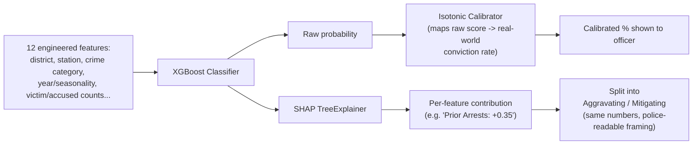
```mermaid
flowchart LR
    FEATURES["12 engineered features:\ndistrict, station, crime category,\nyear/seasonality, victim/accused counts..."] --> XGB["XGBoost Classifier"]
    XGB --> RAW["Raw probability"]
    RAW --> ISO["Isotonic Calibrator\n(maps raw score -> real-world\nconviction rate)"]
    ISO --> PCT["Calibrated % shown to officer"]
    XGB --> SHAP["SHAP TreeExplainer"]
    SHAP --> FACTORS["Per-feature contribution\n(e.g. 'Prior Arrests: +0.35')"]
    FACTORS --> SPLIT["Split into\nAggravating / Mitigating\n(same numbers, police-readable framing)"]
```

Model honesty was verified, not assumed: a live self-scoring endpoint reported a Brier score of 0.176 against the project's own 0.08 target. Rather than silently shipping a cosmetic retrain, a genuine new engineered feature (prior-offense count) was tried, sanity-checked directly against outcome labels first, and found to carry no real signal (34.9% / 33.0% / 22.7% conviction rate across buckets — essentially flat) — a result reported plainly rather than hidden.

Separately, **HDBSCAN modus-operandi clustering** groups cases by a 5-dimensional behavioral fingerprint (time-slot, entry method, weapon class, target category, escape mode) rather than by name — surfacing likely serial offenders whose cases were never manually connected. A **cross-station alibi-consistency matrix** flags any suspect placed at two different stations' cases on the same incident date, a direct data-integrity/investigative-lead signal.

### 7.3 Multi-Modal Evidence

CCTV video and audio evidence are processed deterministically: a vendored static FFmpeg extracts evenly-spaced keyframes and 16kHz audio chunks (no cloud video-processing dependency), Qwen-VL performs forensic OCR and scene-element extraction on keyframes, and Zia Speech transcribes audio. Every attachment type — image, PDF (paginated, not pre-stitched into one giant scroll), audio, video — renders with a real inline player, not a filename chip requiring a separate click-through.

### 7.4 Real-Time Collaboration (Cowork)

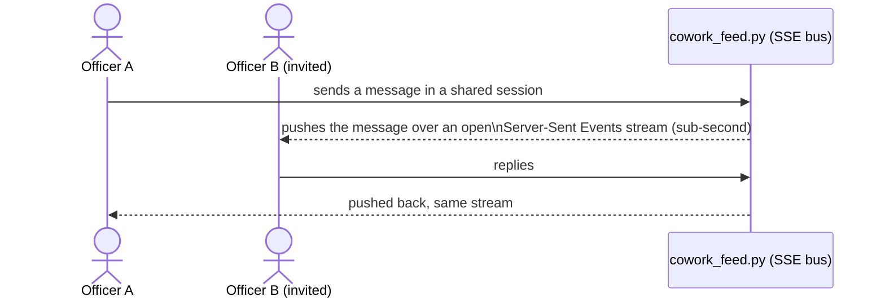
```mermaid
sequenceDiagram
    actor A as Officer A
    actor B as Officer B (invited)
    participant SSE as cowork_feed.py (SSE bus)
    A->>SSE: sends a message in a shared session
    SSE-->>B: pushes the message over an open\nServer-Sent Events stream (sub-second)
    B->>SSE: replies
    SSE-->>A: pushed back, same stream
```

Built over Server-Sent Events rather than a raw WebSocket specifically because AppSail's own gateway 404s a WebSocket upgrade — SSE achieves the same sub-second live-push experience over a transport the platform actually supports.

### 7.5 Autonomous Viral OSINT Radar

A scheduled Catalyst Cron job sweeps Google News RSS across six statewide threat categories, deduplicates against previously-seen items, and posts alerts into the officer notification feed — each carrying an explicit §63 BSA "unverified lead" disclaimer, and kept structurally separate from any grounded CCTNS answer so the two are never visually confusable.

---

## 8. Security & Governance Architecture

### 8.1 Layered Defense-in-Depth

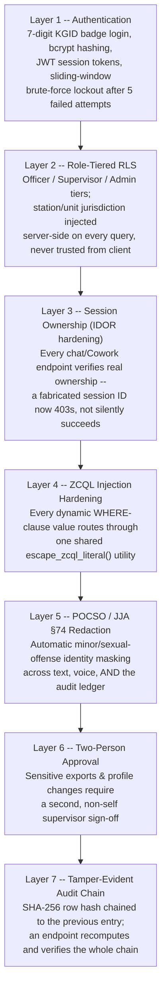
```mermaid
graph TD
    L1["Layer 1 -- Authentication\n7-digit KGID badge login, bcrypt hashing,\nJWT session tokens, sliding-window\nbrute-force lockout after 5 failed attempts"]
    L2["Layer 2 -- Role-Tiered RLS\nOfficer / Supervisor / Admin tiers;\nstation/unit jurisdiction injected\nserver-side on every query, never trusted from client"]
    L3["Layer 3 -- Session Ownership (IDOR hardening)\nEvery chat/Cowork endpoint verifies real ownership --\na fabricated session ID now 403s, not silently succeeds"]
    L4["Layer 4 -- ZCQL Injection Hardening\nEvery dynamic WHERE-clause value routes through\none shared escape_zcql_literal() utility"]
    L5["Layer 5 -- POCSO / JJA §74 Redaction\nAutomatic minor/sexual-offense identity masking\nacross text, voice, AND the audit ledger"]
    L6["Layer 6 -- Two-Person Approval\nSensitive exports & profile changes require\na second, non-self supervisor sign-off"]
    L7["Layer 7 -- Tamper-Evident Audit Chain\nSHA-256 row hash chained to the previous entry;\nan endpoint recomputes and verifies the whole chain"]
    L1 --> L2 --> L3 --> L4 --> L5 --> L6 --> L7
```

### 8.2 Two-Person Approval & §185 BNSS Emergency Break-Glass

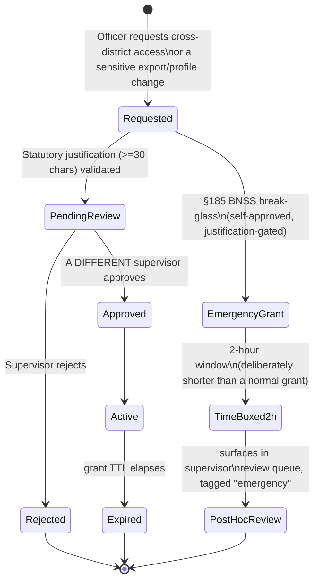
```mermaid
stateDiagram-v2
    [*] --> Requested : Officer requests cross-district access\nor a sensitive export/profile change
    Requested --> PendingReview : Statutory justification (>=30 chars) validated
    PendingReview --> Approved : A DIFFERENT supervisor approves
    PendingReview --> Rejected : Supervisor rejects
    Requested --> EmergencyGrant : §185 BNSS break-glass\n(self-approved, justification-gated)
    EmergencyGrant --> TimeBoxed2h : 2-hour window\n(deliberately shorter than a normal grant)
    TimeBoxed2h --> PostHocReview : surfaces in supervisor\nreview queue, tagged "emergency"
    Approved --> Active
    Active --> Expired : grant TTL elapses
    Rejected --> [*]
    Expired --> [*]
    PostHocReview --> [*]
```

The break-glass path exists because a real emergency (e.g. a live abduction crossing district lines) cannot wait for a second supervisor's sign-off — but it is deliberately **shorter-lived** than a normally-approved grant and is **always** subject to after-the-fact review, so speed is never traded for accountability.

### 8.3 POCSO / Juvenile Justice Act §74 Redaction

Applied consistently across three surfaces that could otherwise leak a protected identity independently: the AI's text answers, its spoken TTS readout ("Identity Protected under Section 74 Juvenile Justice Act" instead of the real name), and — hardened this session — the **Cryptographic Audit Ledger**, where a supervisor without the platform's blanket rank-based unmask now sees a redacted query string rather than a POCSO-sensitive raw search term.

### 8.4 The Cryptographic Audit Ledger & Ledger Search

Every officer action — a query, an edit, a retry, a supervisor's own inspection of another officer's history — writes an immutable row: `employee_id, action_type, target_entity, query_text, response_summary, session_id, logged_at, prev_hash, row_hash`, where `row_hash = SHA256(prev_hash + serialized_row)`. A dedicated verification endpoint recomputes the entire chain server-side and reports any break. Supervisors can isolate one officer's full history via **Ledger Search** — resolving `KSP-2`, a bare EmployeeID, or a full KGID against real Employee records, with live debounced search, honest pagination (a real `total`/`has_more`, not a silent top-100 cutoff), and — critically — every supervisor search **itself** writes a reciprocal `SUPERVISOR_AUDIT_INSPECTION` entry back into the ledger it just searched, so oversight of officers is itself overseen.

---

## 9. Data Model

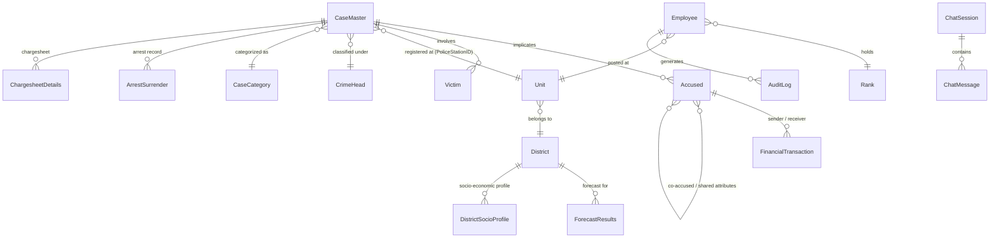
```mermaid
erDiagram
    CaseMaster ||--o{ Accused : "implicates"
    CaseMaster ||--o{ Victim : "involves"
    CaseMaster }o--|| Unit : "registered at (PoliceStationID)"
    CaseMaster }o--|| CrimeHead : "classified under"
    CaseMaster }o--|| CaseCategory : "categorized as"
    Unit }o--|| District : "belongs to"
    Accused ||--o{ FinancialTransaction : "sender / receiver"
    Accused }o--o{ Accused : "co-accused / shared attributes"
    CaseMaster ||--o{ ArrestSurrender : "arrest record"
    CaseMaster ||--o{ ChargesheetDetails : "chargesheet"
    Employee }o--|| Rank : "holds"
    Employee }o--|| Unit : "posted at"
    ChatSession ||--o{ ChatMessage : "contains"
    Employee ||--o{ AuditLog : "generates"
    District ||--o{ ForecastResults : "forecast for"
    District ||--o{ DistrictSocioProfile : "socio-economic profile"
```

*Representative slice — the real schema spans 30+ tables. Beyond what's diagrammed: `Section`, `ActSectionAssociation`, `ComplainantDetails`, `Inv_OccuranceTime`, `Designation`, and the app-layer `CoworkParticipant`, `CoworkInvitation`, `ProactiveAlerts`, and `ConsistencyFlags` tables.*

---

## 10. User Journeys

### 10.1 Officer — Ask a Question, Trust the Answer

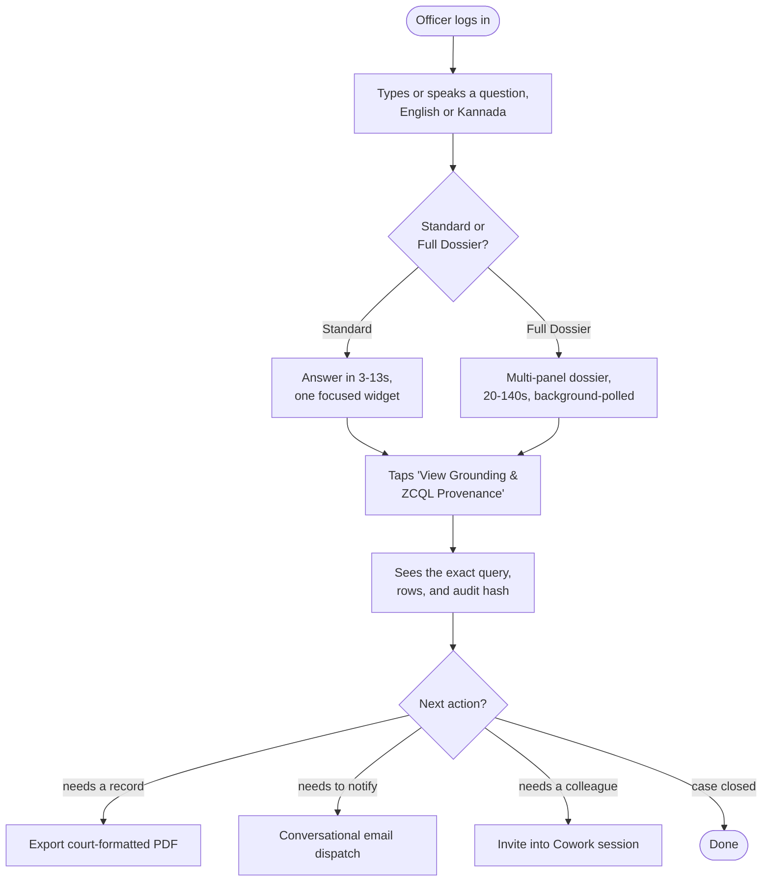
```mermaid
flowchart TD
    START([Officer logs in]) --> ASK["Types or speaks a question,\nEnglish or Kannada"]
    ASK --> MODE{"Standard or\nFull Dossier?"}
    MODE -->|Standard| FASTANS["Answer in 3-13s,\none focused widget"]
    MODE -->|Full Dossier| DEEPANS["Multi-panel dossier,\n20-140s, background-polled"]
    FASTANS --> VERIFY["Taps 'View Grounding &\nZCQL Provenance'"]
    DEEPANS --> VERIFY
    VERIFY --> TRUST["Sees the exact query,\nrows, and audit hash"]
    TRUST --> ACT{"Next action?"}
    ACT -->|"needs a record"| EXPORT["Export court-formatted PDF"]
    ACT -->|"needs to notify"| EMAIL["Conversational email dispatch"]
    ACT -->|"needs a colleague"| COWORK["Invite into Cowork session"]
    ACT -->|"case closed"| END([Done])
```

### 10.2 Supervisor — Oversight & Accountability

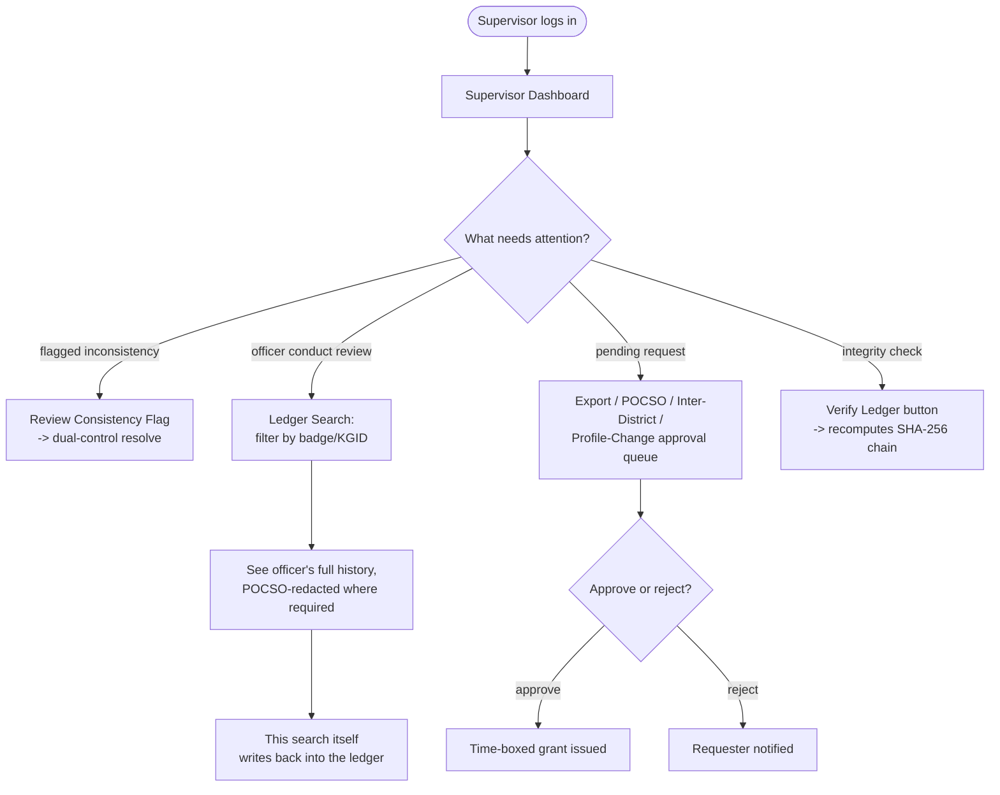
```mermaid
flowchart TD
    START([Supervisor logs in]) --> DASH["Supervisor Dashboard"]
    DASH --> CHOICE{"What needs attention?"}
    CHOICE -->|"flagged inconsistency"| FLAG["Review Consistency Flag\n-> dual-control resolve"]
    CHOICE -->|"officer conduct review"| LEDGER["Ledger Search:\nfilter by badge/KGID"]
    LEDGER --> VIEWLOG["See officer's full history,\nPOCSO-redacted where required"]
    VIEWLOG --> LOGGED["This search itself\nwrites back into the ledger"]
    CHOICE -->|"pending request"| QUEUE["Export / POCSO / Inter-District /\nProfile-Change approval queue"]
    QUEUE --> DECIDE{"Approve or reject?"}
    DECIDE -->|approve| GRANT["Time-boxed grant issued"]
    DECIDE -->|reject| DENY["Requester notified"]
    CHOICE -->|"integrity check"| VERIFYCHAIN["Verify Ledger button\n-> recomputes SHA-256 chain"]
```

---

## 11. Screen-by-Screen Catalogue

- **Login** — badge + password authentication, bilingual EN/ಕನ್ನಡ toggle, animated police-crest identity.
- **AI Chat** *(the primary surface)* — the chat thread, a voice-enabled composer (mic + file attach), a Standard/Full-Dossier mode toggle, a Chat/Cowork toggle, inline auto-composed result widgets, and an "Expand ⤢" side panel for a full-width view of any map/graph/chart.
- **Spatial** — the DBSCAN hotspot map with the thermal heat-map overlay, live EPS-radius and minimum-cluster-point controls, and real-time diagnostics (points scanned, active clusters).
- **Reports** — demographic correlation charts: crime count by district, crime count vs. unemployment rate.
- **District Dashboard (Analytics)** — an interactive statewide map drilling into district-level detail: a composite threat-index gauge, 12-month trend, socio-economic correlation, hotspots, crime-type and case-outcome breakdowns, a "most wanted" repeat-offender card, and a clearly gold-bordered, explicitly-labeled "unverified leads" open-source signals lane.
- **Supervisor Dashboard** — Consistency Flags (dual-control resolve), the searchable Cryptographic Audit Ledger, ledger hash-chain verification, the Feedback Review Board (model-improvement oversight), Officer Access Oversight, and the pending Export / POCSO / Inter-District / Profile-Change approval queues.
- **Settings** — language and theme (full light/dark, both fully legible — a real CSS-variable-driven palette, not a dark-only afterthought), a two-pane profile-modification request (current verified data left, proposed changes right, mandatory statutory justification), core diagnostics, and security-policy display.

---

## 12. Tech Stack — Mapped to Native Zoho Catalyst Capabilities

| Capability Used | Real Role in VAJRA | Where |
|---|---|---|
| **AppSail** | Hosts the FastAPI backend as a managed container (Python 3.11, Uvicorn) | `vajra_backend/`, `catalyst.json` |
| **Web Client Hosting** | Serves the built React 19 + Vite single-page app | `client/`, `src/` |
| **Data Store (ZCQL)** | The entire relational case store — 30+ tables, zero external database | `vajra_core.py`, `agent_loop.py` |
| **QuickML** | Hosts GLM-4.7-Flash (reasoning/planning) and Qwen-VL-35B (vision/OCR) | `catalyst_llm.py`, `catalyst_qwen.py` |
| **Speech (Zia)** | Bilingual speech-to-text and text-to-speech | `catalyst_speech.py` |
| **Stratus** | Object storage for CCTV footage, audio, scanned FIRs, evidence photos | `catalyst_stratus.py` |
| **SmartBrowz** | Headless, court-formatted PDF rendering | `catalyst_smartbrowz.py` |
| **Mail** | Conversational dossier/case email dispatch | `main.py` (`/api/investigation/send-email`) |
| **Cron / Functions** | Background AI-turn execution, the OSINT radar, and proactive-alert jobs | `functions/ai_turn_worker`, `functions/osint_radar`, `functions/proactive_alerts` |
| **Authentication pattern** | 7-digit KGID badge login, bcrypt password hashing, JWT session tokens | `vajra_core.py`, `main.py` |

**Application-layer libraries:**

| Layer | Technology |
|---|---|
| Frontend | React 19, TypeScript, Vite 6, Tailwind CSS v4 (CSS-variable theming), `react-leaflet` + `leaflet.heat`, Recharts, `d3-geo`, `lucide-react`, `motion` |
| ML | scikit-learn, XGBoost 2.0, SHAP, HDBSCAN, isotonic calibration |
| Media | `imageio-ffmpeg` (vendored static FFmpeg), PyMuPDF, Pillow |
| Auth/Security | `bcrypt`, `pyjwt` |
| PDF | `fpdf2` (fallback), SmartBrowz (primary) |

---

## 13. Setup & Run

```bash
# Frontend + local dev server
npm install
npm run dev                # tsx server.ts

# Production build
npm run build               # vite build + esbuild-bundled server.cjs
npm run start                # node dist/server.cjs

# Type-check
npm run lint                 # tsc --noEmit

# Backend (Python 3.11, from vajra_backend/)
pip install -r requirements.txt
python -m py_compile main.py agent_loop.py vajra_core.py vajra_cognitive_brain.py

# Deploy (Zoho Catalyst CLI, from repo root)
catalyst deploy --only client       # web client hosting
catalyst deploy --only appsail       # FastAPI backend container
```

---

## 14. Honest Limitations

Held to the same never-fabricate standard applied to every chat answer:

- **Conversational email dispatch is fully built and works end-to-end.** The only missing piece is a verified, owned sending domain — Zoho Mail requires one; this is a DNS/purchasing step, not a code gap.
- **The conviction-risk model's calibration was measured honestly and found short of target** (Brier 0.176 against a 0.08 goal). A genuine retrain and a new engineered feature (prior-offense count) were tried and reported not to help, rather than silently shipped as a false fix.
- **A real seasonal statsmodels forecaster and a mobile camera/AR viewfinder were scoped and then explicitly paused** for this submission — not built, and not claimed as built.
- **The OSINT radar's recurring 6-hour trigger** needs to be switched on in the Catalyst Console's Job Scheduling page — a platform-console step outside this repository's code.

---

## 15. Roadmap

- Real-time, token-by-token answer streaming (today's answer arrives whole via background-task-and-poll, not incrementally, because of the AppSail request-timeout constraint described in §4.2).
- GNN-style link prediction for undeclared syndicate membership (today's network view is co-offense/shared-attribute based, not a trained graph model).
- Station-level drill-down beneath today's district-level analytics.
- AI4Bharat IndicWhisper / Indic-Parler-TTS behind a dedicated hosted endpoint for even higher-fidelity Kannada voice, beyond the current Zia Speech integration.
- Richer in-chat answer formatting — heading hierarchy, inline entity-highlight chips for case numbers/statutes/risk percentages, ported from the PDF exporter's existing but frontend-absent highlighting (scoped, planned, and queued for implementation after this submission).

---

*Built for the Karnataka State Police Datathon 2026. Every capability described above was verified live against the deployed application, not inferred from source code alone.*
