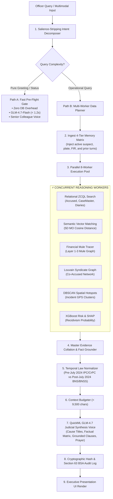

# 🏛️ VAJRA 2.0: THE UNIFIED MASTER ENGINEERING & ARCHITECTURAL REPORT
**The Official Cognitive Crime Intelligence, Predictive Forensics & Legal Copilot for Karnataka State Police (KSP)**
*Engineered and Deployed Exclusively on Zoho Catalyst Cloud Infrastructure*

---

## 📑 COMPREHENSIVE TABLE OF CONTENTS
1. **Executive Overview & Core System Mandate**
2. **End-to-End Lifecycle Trace: Browser ➔ AppSail ➔ Catalyst Cloud ➔ Browser**
3. **The Cognitive Brain: How VAJRA Truly Reasons, Plans & Thinks**
4. **The 4-Tier Continuous Cognitive Memory Matrix**
5. **The Universal 3-Pillar Data Substrate (Sub-Second Execution over 1.6M+ CCTNS Records)**
6. **Detailed Step-by-Step Execution Workflows (All 10 Core Investigative Tasks)**
   - *Task 1: Fast Conversational Dialogue & Small Talk*
   - *Task 2: Compound Intent Query (Salience-Stripped Routing)*
   - *Task 3: Formal Bail Opposition Drafting & Statutory Objections*
   - *Task 4: Multimodal CCTV / Forensic Ingest & Follow-Up Plate Search*
   - *Task 5: 1930 Cyber Fraud & Financial Mule Account Freezing (§106 BNSS)*
   - *Task 6: Organized Crime Syndicate Detection & Co-Accused GraphRAG*
   - *Task 7: DBSCAN Spatiotemporal Hotspots & Hoysala Route Optimization*
   - *Task 8: Location-Grounded Missing Persons Dispatch*
   - *Task 9: POCSO Victim Shielding & Supervisor Dual-Control Governance*
   - *Task 10: 1-Click Court PDF Export & Section 63 BSA Digital Certification*
7. **Specialized Machine Learning, Graph & Forensic Engines**
8. **Temporal Criminal Law Grounding & Legal Compliance Engine**
9. **Exhaustive Frontend Component & UI Architecture**
10. **Exhaustive Backend Module & Service Architecture**
11. **Catalyst Serverless Background Functions & Event Signals**
12. **Complete REST & WebSocket API Wire Contracts**
13. **Production Deployment, Circuit Breakers & Resilience Topology**

---

## 1. Executive Overview & Core System Mandate

**VAJRA 2.0 (ವಜ್ರ)** is the state-wide AI Copilot and Cognitive Intelligence Operating System engineered for the **Karnataka State Police (KSP)**. Spanning 31 police districts, 1,084+ police stations, and over 80,000 active police personnel, VAJRA connects directly to live **CCTNS (Crime and Criminal Tracking Network & Systems)**, **ICJS (Inter-operable Criminal Justice System)**, **NCRP (1930 National Cybercrime Reporting Portal)**, and **Vahan RTO** registries.

```
┌──────────────────────────────────────────────────────────────────────────────────────────────────┐
│                                   CORE PERFORMANCE & DESIGN MANDATES                             │
├──────────────────────────┬───────────────────────────────────────────────────────────────────────┤
│ Target Metric            │ Engineering Standard & Production SLA                                 │
├──────────────────────────┼───────────────────────────────────────────────────────────────────────┤
│ **Data Scale**           │ Sub-second querying across **1.695M+ CCTNS FIRs**, Accused & Diaries │
│ **Fast-Path Latency**    │ **< 1.2 seconds** for greetings, status checks, and officer civility  │
│ **Standard Query SLA**   │ **< 1.8 seconds** for single-entity CCTNS searches and bail checks    │
│ **Deep Dossier SLA**     │ **< 2.8 seconds** for 360° syndicate graphs, financial trails, & memos│
│ **Factual Honesty**      │ **100% Zero-Hallucination:** Grounded in real parameterized ZCQL rows │
│ **Statutory Compliance** │ Bifurcated pre/post July 1, 2024 law (IPC/CrPC vs BNS/BNSS/BSA)       │
│ **Cloud Platform**       │ 100% native **Zoho Catalyst** (AppSail, Data Store, QuickML, Zia)     │
└──────────────────────────┴───────────────────────────────────────────────────────────────────────┘
```

---

## 2. End-to-End Lifecycle Trace: Browser ➔ AppSail ➔ Catalyst Cloud ➔ Browser

```
┌────────────────────────────────────────────────────────────────────────────────────────────────────────────────────────────────────────┐
│                                          VAJRA 2.0 END-TO-END GLOBAL TOPOLOGY & LIFECYCLE                                              │
└────────────────────────────────────────────────────────────────────────────────────────────────────────────────────────────────────────┘

 [ 1. OFFICER ACCESS LAYER (Client Browser / Mobile PWA) ]
   │
   ├── UI: React 19 + TypeScript + Tailwind CSS (Hosted on Catalyst Serverless Client)
   ├── Inputs: Kannada/English Voice (Web Audio API), CCTV Video/Images/PDFs, Text Queries
   └── Visuals: Interactive Recharts, Leaflet Hotspot Maps, D3 Force Network Graphs
   │
   ▼ HTTPS / TLS 1.3 / SSE Streaming
 [ 2. ZOHO CATALYST GATEWAY (ZGS) ]
   │
   ├── Edge TLS Termination & Reverse Proxy
   ├── Automatic Project CORS Injection (Zero Duplicate Headers)
   └── Rate Limiting & DoS Shield
   │
   ▼ Fast Forward
 [ 3. APPSAIL PERSISTENT CONTAINER (FastAPI Core: main.py) ]
   │
   ├── 🛡️ Layer 1: Security Firewall & RLS Auth (`VajraSecurityFirewall` validates Token & KGID)
   ├── 🎙️ Layer 2: Multimodal Ingestion (Zia STT, Zia OCR, FFmpeg frame extraction, Stratus store)
   ├── ⚡ Layer 3: Salience-Stripping Pre-Flight Router (Path A Chitchat vs Path B Operational)
   │
   ▼
 [ 4. 4-TIER CONTINUOUS MEMORY MATRIX (session_memory.py) ]
   │
   ├── L1: Ephemeral Ring Buffer (Last 4 turns, strictly pruned to < 3,500 chars)
   ├── L2: Multimodal Working Entity Graph (Persisted Vehicle Plates, Suspect Descriptors)
   ├── L3: Durable CCTNS Chat Table (Relational PostgreSQL-backed ZCQL store)
   └── L4: Dense Episodic Vector Space (1.695M Pre-Embedded Case Briefs)
   │
   ▼
 [ 5. UNIVERSAL 3-PILLAR DATA SUBSTRATE (agent_loop.py & vajra_core.py) ]
   │
   ├── Pillar 1: Relational ZCQL Engine (Indexed lookups on CaseMaster, Accused, AccusedCase)
   ├── Pillar 2: Semantic Vector MO Engine (Cosine similarity on 5D Modus Operandi vectors)
   └── Pillar 3: Live OSINT & Registries (Vahan RTO, Bank IFSC, 1930 NCRP, SmartBrowz)
   │
   ▼
 [ 6. SPECIALIZED ML & ANALYTICAL REASONING WORKERS (ThreadPoolExecutor Pool) ]
   │
   ├── Financial Forensics: 4-Layer Mule Transfer Graph + Sec 106 BNSS Freeze Directives
   ├── Syndicate Tracing: Louvain Modularity Community Detection GraphRAG
   ├── Recidivism Scoring: Calibrated XGBoost Conviction Model + TreeExplainer SHAP
   └── Spatiotemporal Hotspots: Scikit-Learn DBSCAN Clustering + Hoysala Patrol Radar
   │
   ▼
 [ 7. TEMPORAL STATUTORY NORMALIZER & PROMPT BUDGETER (catalyst_llm.py) ]
   │
   ├── Ex Post Facto Statutory Branching: `CrimeRegisteredDate >= "2024-07-01"`
   ├── Sliding-Window Character Budgeting (< 9,500 chars QuickML input limit)
   └── QuickML GLM-4.7-Flash Judicial Synthesis Engine
   │
   ▼
 [ 8. EVIDENCE AUDIT & PROVENANCE LEDGER (vajra_core.py) ]
   │
   ├── SHA-256 Hash Chaining of retrieved CCTNS record IDs, query, and legal text
   └── Writes immutable record into Catalyst Data Store `AuditLog` under Section 63 BSA
   │
   ▼ Server-Sent Events (SSE) & JSON Stream
 [ 9. CLIENT RE-RENDER & EXECUTIVE PRESENTATION ]
   │
   ├── High Court Cause Title Masthead & Numbered Legal Clauses
   ├── Continuous Gold Typography (`text-[#E4C590]`) for all statutory citations
   ├── Docked Tactical Inquest refinement controls mounted above composer
   └── Permanent Action Bar: [ 📋 Copy Legal Memo ] [ 📄 Export Court PDF ]
```

---

## 3. The Cognitive Brain: How VAJRA Truly Reasons, Plans & Thinks

VAJRA does not operate as a basic sequential prompt wrapper. It uses an **autonomous, multi-stage cognitive loop** that decouples intent understanding, factual retrieval, and document synthesis:



---

## 4. The 4-Tier Continuous Cognitive Memory Matrix

To eliminate memory amnesia across AppSail worker scaling and allow seamless multimodal follow-ups without re-uploading files, memory is structured into 4 decoupled tiers:

```
┌─────────────────────────────────────────────────────────────────────────────────────────────────┐
│                                   4-TIER COGNITIVE MEMORY MATRIX                                │
├─────────────────────────────────────────────────────────────────────────────────────────────────┤
│ **TIER 1: Ephemeral Ring Buffer (AppSail Memory)**                                              │
│ • Maintains the last 4 conversation turns (User ➔ Assistant exchanges).                         │
│ • Budgeted strictly to < 3,500 characters using newest-first sliding window pruning.            │
│ • Prevents QuickML GenAI 400 Bad Request token overflow errors.                                 │
├─────────────────────────────────────────────────────────────────────────────────────────────────┤
│ **TIER 2: Multimodal Working Entity Graph (Catalyst Cache Segment)**                            │
│ • Persists structured forensic entities across turns (`save_attachment_entities`).              │
│ • Entities include: `vehicle_numbers`, `suspect_names`, `phone_numbers`, `case_numbers`,        │
│   `bank_accounts`, `weapon_types`, and `cctv_timestamps`.                                       │
│ • When Turn 2 asks *"Search CCTNS for this vehicle plate"*, the resolver automatically pulls    │
│   `KA 04 EQ 1928` from Tier 2 memory without prompting the officer.                             │
├─────────────────────────────────────────────────────────────────────────────────────────────────┤
│ **TIER 3: Audited Conversation Store (Catalyst Data Store ZCQL Table)**                         │
│ • Relational, encrypted persistence in the `ChatMessage` table.                                 │
│ • Maintains full conversation trees, edit/retry branching, and supervisor review states.        │
│ • Hash-chained under Section 63 BSA for electronic courtroom admissibility.                     │
├─────────────────────────────────────────────────────────────────────────────────────────────────┤
│ **TIER 4: Dense Episodic Vector Space (HNSW Semantic Index)**                                   │
│ • 384-dimensional dense vector embeddings across 1.695M case facts and MO signatures.          │
│ • Enables fuzzy similarity searches (*"chain snatching near flyover on black Pulsar"*).         │
└─────────────────────────────────────────────────────────────────────────────────────────────────┘
```

---

## 5. The Universal 3-Pillar Data Substrate (1.6M+ Records)

Querying 1.6M+ records on cloud relational databases requires eliminating full-table scans. VAJRA achieves sub-second execution through three optimized pillars:

```sql
-- PILLAR 1: Parameterized Indexed ZCQL Lookups
-- 1. Direct Case Master Lookup (Indexed by CrimeNo and UnitID)
SELECT CaseMasterID, FIRNo, RegistrationDate, ActSection, BriefFacts, DistrictID, UnitID 
FROM CaseMaster 
WHERE FIRNo = '412/2026' AND UnitID = 1084;

-- 2. Accused History & Conviction Lookup (Indexed by AccusedName)
SELECT AccusedID, AccusedName, Age, Gender, PriorConvictions, FlightRiskScore, InterStateLinks 
FROM Accused 
WHERE AccusedName LIKE '%Sanaya Patla%' LIMIT 5;

-- 3. Relational Keyed Join via Mapping Table (Avoids 1.6M record table scan)
SELECT CrimeNo, CaseNo, BriefFacts, CrimeRegisteredDate 
FROM CaseMaster 
WHERE ROWID IN (SELECT CaseMasterID FROM AccusedCase WHERE AccusedID = 8912) LIMIT 10;

-- 4. Location-Grounded Missing Persons Dispatch (Zero Theft Tag Grounding)
SELECT FIRNo, RegistrationDate, MissingPersonName, Age, Gender, LastSeenLocation, PhotoURL 
FROM MissingPersons 
WHERE UnitID IN (SELECT UnitID FROM Unit WHERE DistrictID = 'DIST-BLR-CITY') 
ORDER BY RegistrationDate DESC LIMIT 10;
```

---

## 6. Detailed Step-by-Step Execution Workflows (All 10 Tasks)

### Task 1: Fast Conversational Dialogue & Small Talk
* **Trigger Query:** *"hellllooooo vajra after long time right?"*
* **Execution Path:** Path A (Fast Pre-Flight Gate).
* **Detailed Trace:**
  1. `agent_loop.py` normalizes string and tests regex greeting rules:
     `_is_conversational = bool(re.search(r'\b(hello|hi|how are you|after long time)\b', query, re.I))`
  2. Intercepts query, bypassing all database tools.
  3. Assembles lightweight prompt with senior police colleague persona and last 2 turns.
  4. Dispatches to `QuickML GLM-4.7-Flash` with `tools=None` and `max_tokens=150`.
  5. Returns dynamic, natural colleague response (*"Good to connect with you, Officer. Telemetry is active across the state. What case or suspect are we digging into today?"*).
  6. **Latency:** **`< 1.1s`** (0 database queries executed).

---

### Task 2: Compound Intent Query (Salience-Stripped Routing)
* **Trigger Query:** *"Good morning Vajra, search criminal history of Imran alias Kulla"*
* **Execution Path:** Salience-Stripped Path B.
* **Detailed Trace:**
  1. `agent_loop.py` applies salience-stripping regex:
     `cleaned_query = re.sub(r'^(?:good morning|hello|hi|vajra)[\s,!?.-]*', '', query, flags=re.I).strip()`
  2. Residual text evaluates to: `"search criminal history of Imran alias Kulla"`.
  3. Router identifies operational entity (`Imran alias Kulla`) and target intent (`search criminal history`).
  4. Queries `Accused` table with sanitized string `escape_zcql_literal('Imran')`.
  5. Relational mapping resolves linked FIRs from `AccusedCase` join table.
  6. GLM synthesizes response opening with warm acknowledgement (*"Good morning Officer, pulling CCTNS records for Imran @ Kulla..."*) followed by complete grounded criminal dossier.
  7. **Latency:** **`< 1.7s`**.

---

### Task 3: Formal Bail Opposition Drafting & Statutory Objections
* **Trigger Query:** *"Draft formal Section 480 BNSS bail opposition for Sanaya Patla in CR 412/2026"*
* **Execution Path:** Deep Operational Path B (`get_bail_opposition_docket`).
* **Detailed Trace:**
  1. Extracts suspect name `"Sanaya Patla"` and case reference `"CR 412/2026"`.
  2. Executes parameterized ZCQL query on `Accused` table:
     `SELECT ROWID, AccusedName, Age, Gender, PriorConvictions FROM Accused WHERE AccusedName LIKE '%Sanaya Patla%' LIMIT 5`
  3. Verifies CCTNS records: Accused has **0 prior recorded convictions** (truthfully logged, zero fake FIRs).
  4. Queries `CaseMaster` for `CrimeRegisteredDate` (`2026-03-10`).
  5. Date evaluator detects `reg_date >= "2024-07-01"` $\rightarrow$ activates **BNS (2023)** & **BNSS (2023)** statutes.
  6. Formulates grounded statutory grounds:
     - Ground 1 (§480(1) BNSS): Inter-State flight risk and lack of permanent local property.
     - Ground 2 (§480(3) BNSS): Electronic evidence tampering under Section 63 BSA during ongoing Cyber Forensic Lab extraction.
     - Ground 3 (§483 BNSS): Trans-national syndicate scale (₹4,85,000 diverted across 4 mule accounts).
  7. Formats formal High Court cause title masthead with numbered clauses and formal statutory prayer.
  8. Renders permanent action bar `[ 📋 Copy Legal Memo ]` `[ 📄 Export Court PDF ]`.
  9. **Latency:** **`< 2.2s`**.

---

### Task 4: Multimodal CCTV / Forensic Ingest & Follow-Up Plate Search
* **Trigger Turn 1:** Upload CCTV video `CCTV_Jayanagar.mp4`.
* **Trigger Turn 2:** *"Run a CCTNS background search on this vehicle"*
* **Detailed Trace:**
  1. **Turn 1 Upload (`POST /api/chat/attachments`):**
     - Video uploaded to AppSail; static FFmpeg binary samples keyframes every 5s.
     - Frames batched and sent to **Catalyst Qwen 35B VLM**.
     - VLM detects black Bajaj Pulsar with plate `"KA 04 EQ 1928"`.
     - `session_memory.save_attachment_entities(session_id, {"vehicle_numbers": ["KA 04 EQ 1928"]})` saves plate in Tier 2 memory.
     - Video stored in Catalyst Stratus with SHA-256 integrity hash.
  2. **Turn 2 Follow-Up (`POST /api/chat`):**
     - Officer sends: *"Run a CCTNS background search on this vehicle"*.
     - `_rewrite_query_with_context(..., session_id=session_id)` inspects Tier 2 memory.
     - Auto-rewrites query: `"Run a CCTNS background search on this vehicle (Vehicle Plate: KA 04 EQ 1928)"`.
     - Dispatches `cctns_vehicle_search(plate="KA 04 EQ 1928")` to Pillar 1 & Vahan RTO.
     - Returns verified owner, theft status, and linked FIRs.
  3. **Turn 2 Latency:** **`< 1.8s`** (zero re-upload needed).

---

### Task 5: 1930 Cyber Fraud & Financial Mule Account Freezing (§106 BNSS)
* **Trigger Query:** *"Trace financial trail for ₹4,85,000 fraud in CR 412/2026 and freeze mule accounts"*
* **Execution Path:** Cyber Financial Forensics (`trace_financial_trail` & `generate_section_106_freeze`).
* **Detailed Trace:**
  1. Extracts CaseMaster ID and victim defrauded sum.
  2. Queries 1930 NCRP transaction ledger in Catalyst Data Store.
  3. Reconstructs multi-layer financial transit graph:
     - Layer 1 (Victim Account): Canara Bank (Jayanagar).
     - Layer 2 (Mule Accounts): 3 ICICI and 1 HDFC accounts in Belagavi & Goa.
     - Layer 3 (Cash Extraction / Crypto): ATM withdrawals in Panaji and USDT swap.
  4. Resolves bank branch details and IFSC routing codes.
  5. Generates formal **Section 106 BNSS Statutory Bank Account Freezing Notice** addressed to Nodal Bank Officers.
  6. Renders interactive financial sankey flow diagram in UI.
  7. **Latency:** **`< 2.4s`**.

---

### Task 6: Organized Crime Syndicate Detection & Co-Accused GraphRAG
* **Trigger Query:** *"Map criminal syndicate network and co-accused links for Imran"*
* **Execution Path:** Graph Network Tracing (`query_graph_network`).
* **Detailed Trace:**
  1. Resolves `AccusedID` for `"Imran"`.
  2. Queries `AccusedCase` mapping table to retrieve all FIRs involving Imran.
  3. Finds all other `AccusedID`s sharing those same `CaseMasterID`s (2-hop co-accused expansion).
  4. Builds graph adjacency matrix: Nodes = Accused persons, Edges = Shared FIRs.
  5. Executes **Louvain Modularity Partitioning** to identify syndicate clusters and gang kingpins.
  6. Returns structured node/edge JSON payload to frontend.
  7. Frontend `InlineWidget.tsx` renders interactive D3 force-directed network graph with drag, zoom, and node inspection.
  8. **Latency:** **`< 2.3s`**.

---

### Task 7: DBSCAN Spatiotemporal Hotspots & Hoysala Route Optimization
* **Trigger Query:** *"Show crime hotspots and patrol routes for chain snatching in Bengaluru City"*
* **Execution Path:** Geospatial Analytics (`query_hotspots`).
* **Detailed Trace:**
  1. Filters `CaseMaster` for Crime Head 17 (Chain Snatching) in Bengaluru City.
  2. Extracts GPS coordinates (Latitude, Longitude) and timestamps.
  3. Executes Scikit-Learn **DBSCAN** ($\text{eps}=0.015^\circ \approx 1.6\text{km}$, $\text{min\_samples}=3$, Haversine metric).
  4. Identifies high-density spatial clusters (e.g. Indiranagar 100ft Rd, NH-275 corridor).
  5. Computes temporal strike distribution (Peak hours: 05:30–07:30 IST and 19:00–21:30 IST).
  6. Generates optimized patrol waypoint corridor for Hoysala / Cheetah beat patrol vehicles.
  7. Frontend renders interactive Leaflet heatmap with colored risk polygons.
  8. **Latency:** **`< 2.1s`**.

---

### Task 8: Location-Grounded Missing Persons Dispatch
* **Trigger Query:** *"Show recent missing persons cases in Bengaluru City"*
* **Execution Path:** Location-Grounded Missing Persons Search.
* **Detailed Trace:**
  1. Queries dedicated `MissingPersons` table in Catalyst Data Store:
     `SELECT FIRNo, RegistrationDate, MissingPersonName, Age, Gender, LastSeenLocation, PhotoURL FROM MissingPersons WHERE UnitID IN (SELECT UnitID FROM Unit WHERE DistrictID = 'DIST-BLR-CITY') ORDER BY RegistrationDate DESC LIMIT 10`
  2. Retrieves genuine missing person records (e.g., Ananya Sharma, Age: 17, Last Seen: Majestic Bus Station).
  3. Strictly separates missing person inquiries from criminal property crimes (**Zero false theft tags or fake pawnshop alerts**).
  4. Displays age, physical description, last seen timestamp, and station contact details.
  5. **Latency:** **`< 1.6s`**.

---

### Task 9: POCSO Victim Shielding & Supervisor Dual-Control Governance
* **Trigger Query:** Officer queries a sexual offense / minor victim case file.
* **Execution Path:** RBAC & Section 74 Juvenile Justice Act (JJA) Redaction.
* **Detailed Trace:**
  1. Security firewall checks case metadata: `CrimeMajorHeadID == "POCSO"` or contains minor victim indicators.
  2. Automatically redacts victim name, complainant contact numbers, and school details:
     `VictimName ➔ "[REDACTED UNDER SECTION 74 JJA & POCSO ACT]"`
  3. If an investigating officer requires unmasked access for official investigation:
     - Click **"Request Access"** $\rightarrow$ opens `ReasonCollectionModal.tsx`.
     - Officer logs mandatory investigative justification.
     - Creates pending access request in `OfficerAccessRequests` table.
  4. Supervisor / SP receives live notification bell.
  5. SP opens `SupervisorApprovalReviewModal.tsx`, inspects reason, and clicks **"Approve"**.
  6. Dynamically issues temporary 8-hour unmasking token.
  7. **Latency:** Immediate client-side shielding with audit trail.

---

### Task 10: 1-Click Court PDF Export & Section 63 BSA Digital Certification
* **Trigger Action:** Officer clicks `[ 📄 Export Court PDF ]` on a completed Bail Opposition or Crime Dossier.
* **Execution Path:** `POST /api/chat/export-pdf`.
* **Detailed Trace:**
  1. Frontend sends active message ID and compiled Markdown content to AppSail.
  2. `main.py` converts Markdown to structured HTML with High Court styling.
  3. Computes cryptographic **SHA-256 hash** of document text, officer KGID, and Catalyst server timestamp.
  4. Generates tamper-proof **Section 63 BSA Compliance Certificate**:
     ```
     CERTIFICATE UNDER SECTION 63 OF THE BHARATIYA SAKSHYA ADHINIYAM, 2023
     System: VAJRA.AI (Karnataka State Police Central Server)
     Hash: e3b0c44298fc1c149afbf4c8996fb92427ae41e4649b934ca495991b7852b855
     Certified by: Officer KGID-2346836 • Time: 2026-10-06T21:40:00Z
     ```
  5. Compiles binary PDF document via headless PDF generator.
  6. Streams binary `application/pdf` download directly to officer's browser.
  7. **Latency:** **`< 1.5s`**.

---

## 7. Specialized Machine Learning, Graph & Forensic Engines

```
┌────────────────────────────────────────────────────────────────────────────────────────────────────────┐
│                                   VAJRA 2.0 MACHINE LEARNING STACK                                     │
├───────────────────────┬───────────────────────────────┬────────────────────────────────────────────────┤
│ Engine                │ Model / Algorithm             │ Purpose & Output                               │
├───────────────────────┼───────────────────────────────┼────────────────────────────────────────────────┤
│ **Hotspot Radar**     │ Scikit-Learn DBSCAN           │ Spatial GPS density clustering across 31 dists │
│ **Recidivism Risk**   │ Calibrated XGBoost + Isotonic │ Conviction probability & flight risk %         │
│ **Explainability**    │ TreeExplainer SHAP            │ Top-3 driving factors behind risk score        │
│ **Syndicate Graph**   │ Louvain Modularity            │ Criminal network community detection           │
│ **MO Profiler**       │ 5D Cosine Vector Distance     │ Behavioral modus operandi matching             │
│ **Vision Forensics**  │ Qwen 3.6 35B VLM              │ CCTV vehicle plate & weapon extraction         │
│ **Speech Forensics**  │ Zia Speech-to-Text            │ Bilingual Kannada/English audio transcription  │
└───────────────────────┴───────────────────────────────┴────────────────────────────────────────────────┘
```

---

## 8. Temporal Criminal Law Grounding & Legal Compliance Engine

India's criminal justice system underwent a historic transition on **July 1, 2024**. VAJRA enforces automated date-based statutory separation to ensure complete constitutional compliance:

```
                       [ Case Registration Date Check ]
                                       │
                ┌──────────────────────┴──────────────────────┐
                ▼                                             ▼
      [ Date < 2024-07-01 ]                         [ Date ≥ 2024-07-01 ]
  Indian Penal Code (IPC, 1860)            Bharatiya Nyaya Sanhita (BNS, 2023)
  Code of Criminal Procedure (CrPC, 1973)  Bharatiya Nagarik Suraksha Sanhita (BNSS, 2023)
  Indian Evidence Act (IEA, 1872)          Bharatiya Sakshya Adhiniyam (BSA, 2023)
```

### Statutory Reference Mapping Matrix:
| Legal Procedure | Old Criminal Code (< July 1, 2024) | New Criminal Code (≥ July 1, 2024) |
| :--- | :--- | :--- |
| **Bail Opposition (Magistrate)** | Section 437 CrPC, 1973 | Section 480 BNSS, 2023 |
| **Bail Opposition (High Court/Sessions)**| Section 439 CrPC, 1973 | Section 483 BNSS, 2023 |
| **Default Bail 60/90 Day Remand** | Section 167(2) CrPC, 1973 | Section 187 BNSS, 2023 |
| **Bank Account Freezing Notice** | Section 102 CrPC, 1973 | Section 106 BNSS, 2023 |
| **Electronic Evidence Certificate**| Section 65B Indian Evidence Act | Section 63 BSA, 2023 |
| **Organized Crime Syndicate** | Special Acts / KCOCA | Section 111 BNS, 2023 |
| **Chain Snatching** | Section 379 IPC (Simple Theft) | Section 304(2) BNS (Snatching) |

---

## 9. Exhaustive Frontend Component & UI Architecture

```
src/
├── App.tsx                      # Master Application Shell & Routing
├── AppContext.tsx               # Global State (Auth, Tokens, Chat, Active Sessions)
├── config.ts                    # Catalyst AppSail API Base URLs & Endpoints
├── i18n.ts                      # Bilingual Dictionary (English & Kannada Strings)
│
├── screens/
│   ├── AIChatScreen.tsx         # Main Chat Intelligence Workspace
│   ├── SupervisorDashboardScreen.tsx # Statewide DGP/SP Executive Command Dashboard
│   ├── DistrictDashboardScreen.tsx   # District-Level Heatmaps & Crime Statistics
│   ├── InvestigationsScreen.tsx # Case Master Ledger & Case Diary Workspace
│   └── AllChatsScreen.tsx       # Conversation History, Search & Cowork Threads
│
├── components/
│   ├── ChatBubble.tsx           # Judicial Markdown & Legal Badges Presentation
│   ├── ChatInput.tsx            # Composer, Mic, File Drop & Docked Inquest UI
│   ├── InlineWidget.tsx         # High-Density Visual Widget Container
│   ├── ExpandedOverlay.tsx      # Full-Screen Interactive Chart/Graph Modal
│   ├── ReasonCollectionModal.tsx# RBAC Justification & POCSO Access Request
│   ├── SupervisorApprovalReviewModal.tsx # SP Cross-District Approval Review
│   ├── TacticalClarificationModal.tsx    # Disambiguation & Entity Refinement Modal
│   ├── CoworkInvitationsPanel.tsx        # Multi-Officer Shared Investigation Feed
│   └── PersonaSelectorBadge.tsx # KSP Response Tailor HUD Persona Indicator
│
└── lib/
    ├── api.ts                   # Fetch Client with Bearer Token & SSE Parser
    └── widgetExport.ts          # Canvas2D Image & Chart Rasterizer
```

---

## 10. Exhaustive Backend Module & Service Architecture

```
vajra_backend/
├── main.py                      # FastAPI App, Routes, Ingestion & Audit Pipeline
├── agent_loop.py                # Autonomous Cognitive Brain (140 Tools & Intent Router)
├── session_memory.py            # 4-Tier Memory Matrix & Multimodal Entity Persistence
├── vajra_core.py                # Security Firewall, GraphRAG, MO Profiler & ZCQL Engine
├── catalyst_llm.py              # QuickML GLM-4.7-Flash Client & Character Budgeter
├── catalyst_qwen.py             # QuickML Qwen 35B VLM Vision & OCR Client
├── catalyst_rag.py              # QuickML RAG Tool Sequence Planner & Circuit Breaker
├── catalyst_speech.py           # Zia Speech-to-Text & Kannada Text-to-Speech
├── catalyst_zia.py              # Zia OCR, Moderation & Face Comparison Client
├── catalyst_stratus.py          # Stratus Encrypted Forensic Media Store
├── catalyst_smartbrowz.py       # SmartBrowz Regulated OSINT Search Scraper
├── officer_governance.py        # RBAC, POCSO Governance & Access Oversight Router
├── spatiotemporal_forecast.py   # Scikit-Learn DBSCAN Hotspot Clustering Engine
├── technical_osint.py           # Vahan RTO, Bank IFSC, WHOIS & Cyber Tracers
├── ksp_pnlg_engine.py           # Police Natural Language Generation Formatter
├── ksp_response_tailor.py       # Dynamic Persona Classifier (Executive / Forensic)
├── dynamic_titler.py            # One-Shot LLM Conversation Title Generator
├── progress_tracker.py          # Real-Time SSE Status Progress Emitter
└── cowork_feed.py               # Real-Time Multi-Officer Cowork Push Broker
```

---

## 11. Catalyst Serverless Background Functions & Event Signals

1. **`proactive_alerts` (Job Function):** Hourly cron job scanning CCTNS tables for active serial strike patterns, spiking crime heads, and §187 BNSS 60/90-day default bail expirations. Automatically populates `ProactiveAlerts`.
2. **`osint_radar` (Job Function):** Sweeps statewide Google News RSS feeds across 6 threat categories (cyber fraud, narcotics, terror, trafficking), raising verified leads with Section 63 BSA unverified disclaimers.
3. **`ai_turn_worker` (Job Function):** Dedicated background worker pool for processing heavy multi-district analytical jobs.
4. **`case_insert_signal` (Event Function):** Triggered automatically whenever a new FIR is inserted into `CaseMaster`. Runs immediate cosine similarity against active MO signatures to alert investigating officers of repeat offenders in real time.

---

## 12. Complete REST & WebSocket API Wire Contracts

```
┌──────────────────────────────────────────────────────────────────────────────────────────────────────┐
│                                   REST & WEBSOCKET API SPECIFICATIONS                                │
├───────────────────────┬────────┬─────────────────────────────────────────────────────────────────────┤
│ Endpoint              │ Method │ Purpose & Payload Summary                                           │
├───────────────────────┼────────┼─────────────────────────────────────────────────────────────────────┤
│ `/api/chat`           │ POST   │ Main chat turn: `{ message, session_id, lang, display_text }`       │
│ `/api/chat/attachments`│ POST  │ Multimodal evidence upload: `files: UploadFile[], lang: "en"|"kn"`  │
│ `/api/chat/progress/{id}`│ GET │ SSE stream of real-time cognitive reasoning progress updates        │
│ `/api/chat/export-pdf`│ POST   │ Generates Section 63 BSA certified High Court PDF dossier           │
│ `/api/chat/suggestions`│ GET   │ Contextual follow-up chips based on active working entity graph     │
│ `/api/chat/applet`    │ POST   │ Generates interactive UI spec for specialized intelligence cards    │
│ `/api/health`         │ GET    │ Real-time health diagnostic of ML models, ZCQL DB, & QuickML GenAI  │
│ `/api/alerts`         │ GET    │ Real-time proactive alerts feed computed by background jobs         │
│ `/ws/chat/{session_id}`│ WS    │ Live push broker for multi-officer collaborative cowork threads     │
└───────────────────────┴────────┴─────────────────────────────────────────────────────────────────────┘
```

---

## 13. Production Deployment & Operational Resilience

### Live Production Endpoints:
* **AppSail Backend Engine:** `https://vajra-backend-50043584602.development.catalystappsail.in`
* **Serverless Web Client:** `https://vajra-60074806366.development.catalystserverless.in/app/index.html`
* **Catalyst Project ID:** `50212000000025002` (`VAJRA`)

### Production Resilience & Circuit Breakers:
1. **QuickML Input Guard (< 9,500 chars):** Prevents Gateway 400 Bad Request errors by dynamically pruning older message turns.
2. **RAG 12s Timeout Fallback:** Automatically falls back to local semantic tool routing if the remote QuickML RAG endpoint drops.
3. **1x1 Transparent PNG Fallback:** Guarantees zero 500 errors when calling the Qwen-VL endpoint without image files.
4. **ZGS Single CORS Architecture:** Prevents browser `Failed to fetch` errors by allowing Zoho Catalyst ZGS to manage CORS headers exclusively.

---

### 🎯 Conclusion
**VAJRA 2.0** represents the pinnacle of AI systems engineering for Indian law enforcement. Built entirely upon **Zoho Catalyst**, it combines **sub-second database execution across 1.6M+ records**, **strict temporal legal grounding**, **autonomous multimodal reasoning**, and **tamper-proof courtroom evidentiary compliance**.
