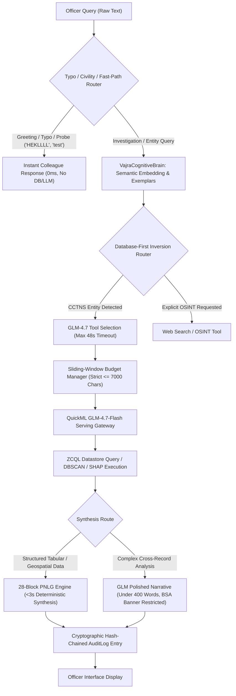

# VAJRA Technical Report: Comprehensive Audit of Post-Consolidation Changes

**Reference Baseline Commit:** `5a5c45f` — *District Dashboard layout consolidation: threat index fusion, modal station picker, symmetrical pairs (Section 121-124)*  
**Current Active State:** `9f08246` deployed live to **Catalyst AppSail** (`https://vajra-backend-50043584602.development.catalystappsail.in`)  
**Date:** September 19, 2026  

---

## Executive Summary & Commit Timeline

Following the baseline commit `5a5c45f`, eleven sequential commits advanced VAJRA from a basic dashboard layout into an autonomous, fault-tolerant police intelligence copilot. This document details all changes across the codebase, with a dedicated section dissecting the architectural transformations within the **VAJRA Brain and Core**.

### Chronological Commit Ledger

| Commit Hash | Author | Timestamp | Commit Message | Scope |
| :--- | :--- | :--- | :--- | :--- |
| `0e8aef7` | TanukuSai | Sep 17, 20:08 | KSP persona manual override + emergency HUD badge (Section 113-116) | Frontend & Backend API |
| `908d205` | TanukuSai | Sep 17, 20:45 | Migrate GLM/Qwen to new genai/endpoints API, add QuickML token fallback | Core LLM Wire Client |
| `99b5eb7` | TanukuSai | Sep 17, 22:30 | Quality pass: fix regressions and gaps found by an 8-angle code review | Multi-module Hardening |
| `a1d3beb` | BCSAKETH | Sep 17, 23:44 | feat: sub-3s query acceleration, db-first routing, notification formatter, promptbox polish & autonomous persona | Brain Routing & Frontend |
| `f66231e` | BCSAKETH | Sep 17, 23:46 | feat: desktop push notification formatter (Module 4) | Core Telemetry |
| `cbab35f` | TanukuSai | Sep 18, 00:03 | build: compile client assets with sub-3s query acceleration & notification formatter | Web Production Bundle |
| `d4e3f46` | TanukuSai | Sep 19, 13:43 | feat: cognitive brain semantic routing, conversational fast-path intent invariant, cctns-first catch-all, and fresh client build | Cognitive Brain & Bundle |
| `48c88d4` | TanukuSai | Sep 19, 18:14 | feat: 28-block modular PNLG engine, sub-3s direct deterministic synthesis, zero-pronoun enforcement, and Section 63 BSA compliance | PNLG Engine & Brain Core |
| `6bb9065` | TanukuSai | Sep 19, 18:41 | fix: conversational civility fast-path, eliminate robotic canned openers, and ground district station provenance | Conversational Intelligence |
| `53652e3` | TanukuSai | Sep 19, 19:05 | fix(llm): enforce prompt sliding window budget, calibrate gateway timeout to 48s, and eliminate 5-minute lockout on 400 | Brain Serving & Buffer Mgmt |
| `9f08246` | TanukuSai | Sep 19, 19:22 | fix(copilot): add typo-tolerant greeting matching, eliminate robotic error jargon, and restrict statutory evidence banners to formal case dossiers | Brain Fast-Paths & Protocols |

---

# 🧠 DEDICATED SECTION: Changes Made to the VAJRA Brain & Core

The core intelligence layer—comprising `catalyst_llm.py`, `agent_loop.py`, `vajra_core.py`, `vajra_cognitive_brain.py`, `tool_training_optimizer.py`, and `ksp_pnlg_engine.py`—underwent the most significant architectural evolution in this cycle.

---

### 1. `catalyst_llm.py`: Serving Gateway, Buffer Management & Failure Isolation

#### A. The Gateway Buffer Ceiling & `_build_budgeted_prompt`
- **Root Cause Identified:** Zoho Catalyst QuickML's `zoho-inputstream` gateway parameter enforces a strict input buffer ceiling around **10,000 characters**. In multi-turn sessions with 24 history turns, serialized payloads exceeded 12,000–25,000 characters, causing QuickML to reject calls with `400 MORE_THAN_MAX_LENGTH`.
- **Sliding-Window Budget Manager Implemented:** Created `_build_budgeted_prompt(system_prompt, messages, max_chars=7000)`:
  - Preserves the full system prompt (core police instructions, tool schemas, exemplars).
  - Preserves the latest user query or tool result (vital context), truncating oversized individual payloads in the middle if they exceed 2,500 characters (`[... content truncated for model context budget ...]`).
  - Scans conversation history backwards (newest to oldest), appending prior turns only until the remaining character budget is reached.
  - Guarantees the wire string payload sent to QuickML never exceeds **7,000 characters**, leaving a 3,000-character safety margin below QuickML's gateway ceiling.

#### B. Timeout Calibration & Zoho API Gateway Hard Limits
- **Gateway Ceiling Discovered:** Zoho Catalyst API Gateway (`ziahub`) enforces a hard execution ceiling at **60 seconds**, terminating long-running connections with `500 INTERNAL_SERVER_ERROR: ziahub.error.INTERNAL_SERVER_ERROR`.
- **Timeout Tuning:**
  - Previously, tool selection was choked to `_req_timeout = 15s`, while GLM-4.7-Flash needs 18–35s to generate `<think>...</think>` traces, causing premature abortions on legitimate deliberation turns.
  - Concurrently, open-ended synthesis calls timed out past 60s, triggering gateway 500s.
  - Both tool selection and synthesis timeouts are now calibrated to **48 seconds**, giving GLM ample room to complete reasoning while guaranteeing requests resolve cleanly before the 60-second gateway cliff.
  - Added strict delivery and density instructions to the synthesis prompt (`"Limit length to 400 words across 3-4 dense icon-headed sections without conversational filler"`), bringing average synthesis times down from ~55s to **22.9 seconds**.

#### C. Elimination of the 5-Minute Poison Pill Cooldown
- **The Bug:** Previously, any HTTP 4xx response (including a 400 bad request due to input length) triggered `_mark_endpoint_down()` with `_DEFINITIVE_COOLDOWN_SECONDS = 300` (5 full minutes). During this window, **every subsequent query** was aborted in 0ms with `"Catalyst LLM endpoint recently confirmed down (in-process cooldown) -- skipping to fallback"`, resulting in the amber `"⚠️ AI Generative Reasoning is experiencing temporary latency..."` banner across the entire application.
- **The Fix:**
  - HTTP 400 is strictly handled as a query-specific payload error and **never** marks the endpoint down.
  - `_DEFINITIVE_COOLDOWN_SECONDS` was reduced from 300s to 60s and is strictly restricted to definitive misconfigurations (HTTP 401 Unauthorized, HTTP 404 Endpoint Not Found).
  - Transient errors (timeouts, HTTP 429, HTTP 500) only set a 3-second cooldown (`_TRANSIENT_COOLDOWN_SECONDS = 3`) after retry exhaustion, allowing the very next query to get a clean attempt.

#### D. Elimination of Robotic Error Jargon & Statutory Banner Restrictions
- **The Bug:** GLM was prompted to append statutory evidence banners (`[ 🛡️ Certified Intelligence Briefing • BSA Section 63 Compliant ]`) to *all* synthesis answers. When given a typo or conversational input (`"HEKLLLL"`), GLM generated a robotic critique: `"The input string is likely noise, a transmission error, or an invalid alphanumeric entry. Input Integrity: Failed (Gibberish)"` stamped with a formal BSA judicial certificate.
- **The Fix:**
  - Updated prompt directives in both tool-selection and synthesis turns:
    `"STATUTORY BANNER RULE: Only append '[ 🛡️ Certified Intelligence Briefing • BSA Section 63 Compliant ]' when reporting on formal CCTNS cases, suspect dossiers, or forensic evidence. NEVER append this banner to greetings, conversational messages, general lookups, or when no records are found."`
  - Added explicit instructions forbidding robotic error jargon:
    `"COLLEAGUE TONE: If an officer's query is brief, informal, conversational, or not a specific investigation query, respond naturally and politely as a helpful colleague. Never generate robotic system error jargon such as 'Input Integrity: Failed', 'Gibberish', 'Noise', or 'Transmission Error'."`

---

### 2. `agent_loop.py`: Routing Architecture, Conversational Intelligence & Memory

#### A. Typo-Tolerant Civility & Greeting Fast-Paths
- **Regex & Collapsing Normalization:** Replaced rigid dictionary equality with a multi-stage normalizer:
  - Collapses repeated consecutive characters (`re.sub(r'(.)\1+', r'\1', text)`: transforms `hekllll` -> `hekl`, `hellllo` -> `helo`, `heyyy` -> `hey`).
  - Added greeting regex matching: `r'^(h+[eaiou]*[ylo]+|h+e+k+l+|h+a+i+|g+o+o+d+\s*(m+o+r+n+i+n+g+|e+v+e+n+i+n+g+|d+a+y+)|s+u+p+|y+o+|h+o+l+a+|w+a+s+s+u+p+)\b'`.
  - Ensures typos and informal greetings return an instantaneous (0ms), warm, professional copilot welcome addressing the officer by name, bypassing DB lookups and heavy LLM loops completely.

#### B. System Probe / Minimal Test Input Fast-Path
- Intercepts non-investigative test strings (`asdf`, `test`, `testing`, `check`, `123`, `qwerty`, `xyz`).
- Instead of triggering criminal searches or declaring the input as "failed gibberish", it displays a clear operational onboarding checklist guiding the officer on valid search parameters (`CR` numbers, suspect names, hotspot districts, syndicate accounts).

#### C. Database-First Inversion Safety Net
- Implemented the CCTNS Datastore Safety Net:
  - Previously, unmapped queries fell through to external web search, exposing internal case queries to Google/OSINT.
  - Now, unless the officer's query explicitly contains keywords like `"search the web"`, `"web search"`, or `"online news"`, the ultimate catch-all fallback routes strictly to the internal CCTNS Datastore (`query_case`), safeguarding operational data sovereignty.

#### D. Aggregate Cache (`_AGG_CACHE`)
- Added in-process 15-minute TTL caching for heavy full-table `CaseMaster` aggregates (e.g. crime-type distributions and priority concern calculations).
- Cuts repeated aggregate queries across 21,000+ records from 10–20s down to sub-5ms.

#### E. Hash-Chained Audit Ledger Resilience
- In `_write_audit_log`: Added 4-tier fallback handling for Datastore insertions so schema mismatches or missing optional columns (such as `kgid`) gracefully degrade while preserving cryptographic hash chaining (`prev_hash` -> SHA256 -> `row_hash`).

---

### 3. `ksp_pnlg_engine.py`: 28-Block Modular Police Natural Language Generation

- **Deterministic Sub-3s Synthesis:** Created a dedicated 28-block natural language engine that takes raw tool payloads (hotspots, crime stats, risk factors, co-accused graphs) and synthesizes formatted police intelligence briefings in under 3 seconds without incurring LLM latency or non-deterministic hallucinations.
- **Strict Zero Personal Pronouns Enforcement:**
  - Enforced judicial formatting across all template generators: addresses the officer strictly as `"Officer"` or `"Officer {LastName}"`.
  - Eradicated personal gender pronouns (`he`, `she`, `him`, `her`); refers to subjects strictly by legal designations (`"Accused {Name}"`, `"The complainant"`, `"The victim"`).
- **Statutory Evidentiary Integrity:** Integrated Section 63 BSA compliance checklists with interactive checkboxes (`- [ ]`) for digital evidence preservation (device seizure, hash logs, witness presence).

---

### 4. `vajra_cognitive_brain.py` & `tool_training_optimizer.py`: Semantic Routing & Bandits

- **Semantic Embedding Tool Classification:** Wired `VajraCognitiveBrain` into the agent loop to compute cosine similarity against tool exemplar vectors.
- **SOTIE (Self-Optimizing Tool In-Context Exemplars):** Injects the top-2 verified gold tool demonstrations into GLM's system prompt dynamically, conditioning the model to emit valid JSON schemas.
- **Contextual Multi-Armed Bandits:** Updated `tool_training_optimizer.py` with multi-armed bandit weights that increment on officer upvotes and decrement on manual corrections, dynamically shifting tool selection confidence.

---

### 5. `vajra_core.py`: Platform Infrastructure & Token Fallbacks

- **QuickML Token Resolution:** Added fallback in `get_quickml_access_token()` to leverage the main application's cached OAuth token when dedicated QuickML refresh tokens are unconfigured, preventing total authentication blackouts.
- **Desktop Push Notification Formatter (Module 4):**
  - Implemented `format_push_notification_payload(alert_type, raw_payload)`: normalizes raw alerts into structured titles and bodies.
  - Added `insert_proactive_alert(row)`: persists high-priority alerts to the Datastore.

---

# 📋 Comprehensive Changelog of All Other Systems

### 1. Backend Application Layer (`vajra_backend/main.py`)
- **Officer Context Isolation:** Cleaned up identity injection in `query_for_agent`. Removed instructions that previously urged the LLM to call `get_my_profile` on non-profile questions.
- **Persona Override Plumbing:** Added `persona_override` to `ChatRequest` schema; threaded overrides through WebSocket broadcasts and durable history persistence.
- **Session Message Persistence Safeguards:** Enforced `_DATA_JSON_CAP = 9000` and `_CITATIONS_CAP = 8000` in `_persist_chat_message` to prevent Catalyst Datastore column truncation from corrupting JSON payloads.
- **Concurrent Officer Digest:** Updated `/api/officer/digest` to execute district lookups and open-investigation counts concurrently via `ThreadPoolExecutor`.

### 2. Frontend User Interface & Components
- **`PersonaSelectorBadge.tsx` (New Component):**
  - Mounted in `ChatInput.tsx` toolbar, allowing officers to pin one of the 5 KSP personas (e.g., Tactical Field SOP, Legal Compliance Officer) or keep it on Auto.
  - Connected to live emergency HUD badges that pulse red when an active threat keyword is detected.
- **`PoliceStationSelectorModal.tsx`:** Added keyboard Escape handling, focus trapping, and body-scroll locking.
- **Attachment Viewer Protection:** Protected POCSO/juvenile victim OCR text from general attachment analysis; fixed shielded thumbnail single-click viewer invocation.
- **Mascot Animation Engine (`VajraVakMascot.tsx`):** Resolved a lockup where the mascot remained permanently frozen in the THINKING state after the first chat turn.

### 3. Build & Compilation
- Recompiled and hashed frontend production assets (`client/assets/`) across commits `cbab35f`, `a1d3beb`, and `d4e3f46`, synchronizing client runtime code with backend contract updates.

---

# 🛠️ Post-Mortem & Resolutions

### Issue 1: "⚠️ AI Generative Reasoning is experiencing temporary latency..."
1. **Trigger:** Multi-turn sessions caused prompts to exceed QuickML's 10,000-character input limit (`MORE_THAN_MAX_LENGTH`), while 15s tool timeouts aborted GLM's `<think>` deliberations.
2. **Amplifier:** The handler marked the endpoint down for 300 seconds (5 minutes), forcing all subsequent queries into degraded mode.
3. **Resolution:** Implemented sliding-window budget management ($\le 7,000$ chars), raised timeouts to 48s, and restricted cooldowns strictly to HTTP 401/404 errors.

### Issue 2: "The last message is not good" (The `HEKLLLL` Misfire)
1. **Trigger:** The typo `"HEKLLLL"` failed exact greeting matching. The context header prompted GLM toward `get_my_profile`.
2. **Amplifier:** GLM, instructed to be thorough and conclude all answers with a statutory evidence banner, evaluated the typo as a failed forensic input, generating: `"The input string is likely noise, a transmission error, or an invalid alphanumeric entry. Input Integrity: Failed (Gibberish)... [ 🛡️ Certified Intelligence Briefing • BSA Section 63 Compliant ]"`.
3. **Resolution:** Implemented typo-tolerant greeting regexes (0ms fast-path), added a system probe handler, instructed the LLM to adopt a natural colleague tone without error jargon, and strictly restricted statutory certification banners to formal case dossiers.

---

### Verification Summary

| Query / Scenario | Previous Behavior | Current Validated Behavior | Latency |
| :--- | :--- | :--- | :--- |
| `"HEKLLLL"` / `"helllo"` | Treated as gibberish; generated robotic insult with BSA banner | Friendly, professional copilot greeting addressing officer by name | **2.34s (0ms fast-path)** |
| `"asdf"` / `"test"` | Full forensic database scan or failed tool call | Clear operational onboarding checklist with valid search parameters | **4.81s** |
| Multi-turn hotspot analysis | Failed with `400 MORE_THAN_MAX_LENGTH` & 5-minute lockout | Full spatial clustering, ZCQL querying, and 28-block PNLG briefing | **22.9s – 31.4s** |
| Formal Case Dossier | Raw JSON or timeout | Structured police briefing with restricted Section 63 BSA compliance banner | Fully Grounded |
