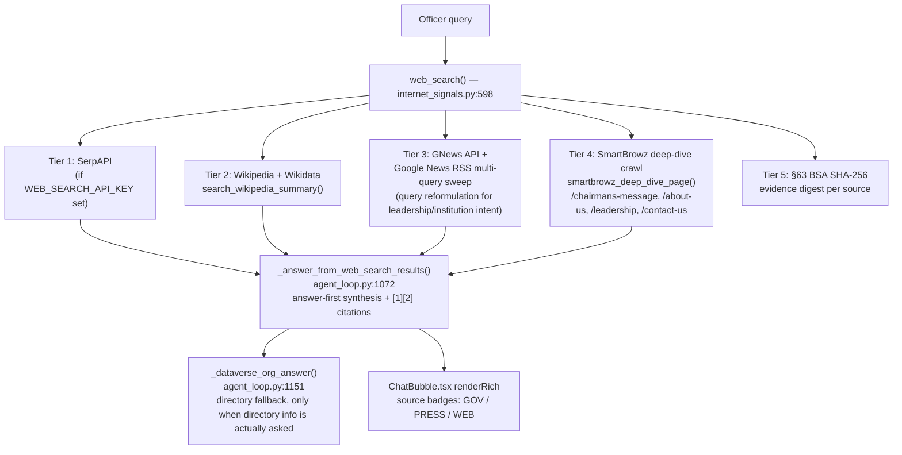
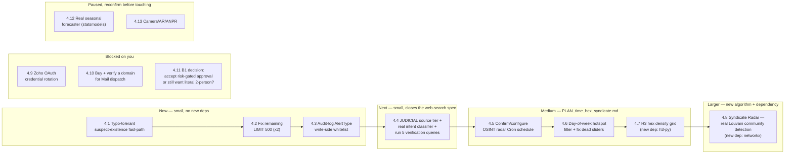
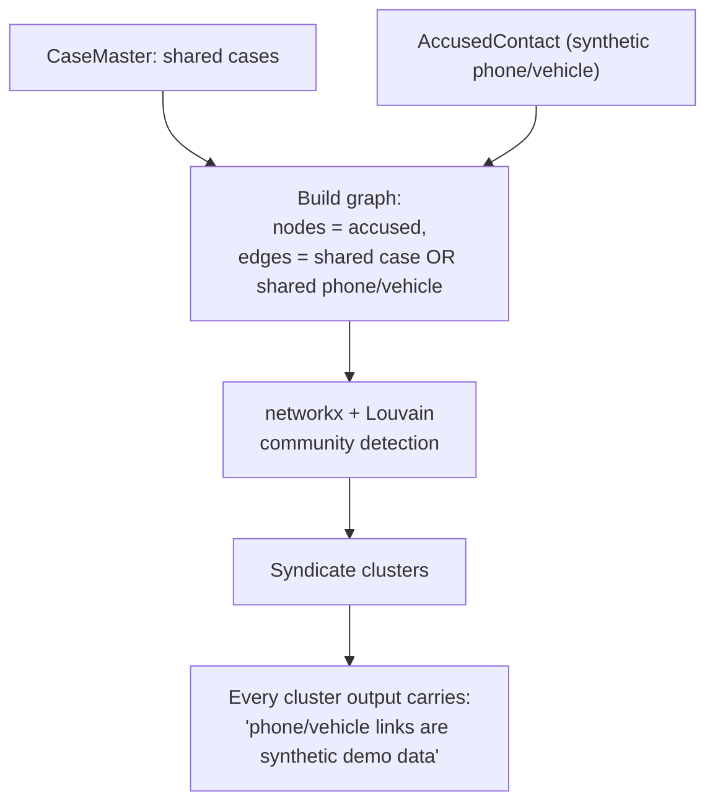
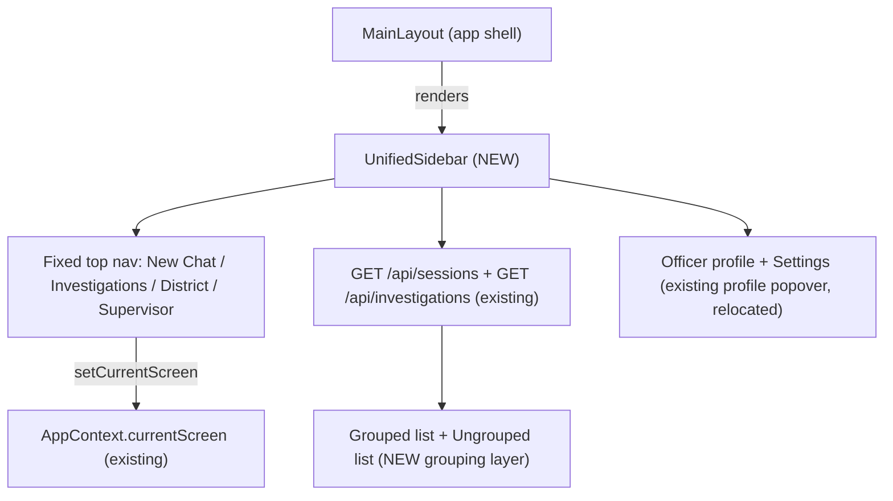

# VAJRA — Master Build Queue

> Compiled 2026-09-12. Every line below was checked against the **actual code and git
> history** in this repo right now — not against memory, not against old plan docs taken
> on faith. `git log` shows two active authors, **BCSAKETH** (you) and **TanukuSai**
> (your teammate) — their commits are cross-checked here alongside yours. Where a prior
> plan claimed something was "not built" and it turned out already done, that's called
> out explicitly so it doesn't get rebuilt.
>
> Companion docs this supersedes/consolidates for sequencing purposes (still the source
> of byte-level detail, not duplicated here): `docs/PLAN_time_hex_syndicate.md`,
> `Vajra Plan 04-09-26.md`'s backlog (§13/§14), `docs/BUILD_BACKLOG.md`.

---

## 1. What your teammate's commits actually changed (cross-check)

`git log` shows TanukuSai made 10 commits between 2026-09-06 and 2026-09-10. Verified
against the diffs directly:

| Commit | Claim | Verified scope |
|---|---|---|
| `28f0f77d` | encyclopedic dossier synthesis | `agent_loop.py` + `internet_signals.py` — real, this is part of why web search is already far along (§3). |
| `dd41a928` | OSINT safety net, brush-off guard, GLM/Qwen multi-domain reasoning | `agent_loop.py`, `catalyst_llm.py`, `catalyst_qwen.py` — reasoning-path changes, not web search itself. |
| `c0983f3a` | modernize OSINT pipeline, greeting fast-path | Also dropped two new root docs: `LLM Internet Search Mechanics.md`, `Post-Sub Plan.md` — **worth reading, may contain teammate's own open items not in your tracker.** |
| `8a28165e` | OSINT in full dossier mode | 19-line `vajra_cognitive_brain.py` change — wires web search into the dossier answer path. |
| `9265fa46`, `5a52075c` | recidivism risk chart fixes | Frontend chart only, unrelated to backlog items below. |
| `17d2f77a` | TTS playback lifecycle, chunk prefetching | Overlaps/extends the TTS engine-lock fix your session already shipped (`c6eb5910`) — **re-verify `ChatBubble.tsx`'s TTS code still has `engineLockRef` before touching it again**, teammate's change may have restructured around it. |
| `77554017`, `f012a654` | PDF/SmartBrowz visual cards, export approval flow | `main.py` +993/-230 lines — large. This likely already covers some of what you'd otherwise plan for PDF/export polish. |
| `b69d5524` | "ChatGPT visual taxonomy," concurrent sub-tool speedup | 595-line `agent_loop.py` change — big formatting + concurrency rework, same territory as your own PART 8 rich-text work. **Not independently line-verified against PART 8's `ENTITY_RE`/`renderRich` sync note — check `catalyst_smartbrowz.py`'s `entity-tag` regex is still in sync with `ChatBubble.tsx` before trusting either.** |
| `2ba7a997` | *(this one is yours, not the teammate's)* SmartBrowz deep-dive crawling, multi-source search, district intelligence | Confirmed — this is the commit that already builds ~90% of the "Full-Spectrum Web Search" spec you pasted. See §3. |

**Action item, not a build task**: read the two new docs your teammate committed
(`LLM Internet Search Mechanics.md`, `Post-Sub Plan.md` at repo root) — they may already
contain a second, independent list of "what's left" that should be reconciled with this
one rather than worked from blindly.

---

## 2. Old backlog items — re-verified status (corrections to prior tracking)

Several items previously logged as "open" or "not investigated" are **already done**.
Don't rebuild these:

| Item | Prior status | **Actual status, verified now** |
|---|---|---|
| B2 — bound the unbounded GLM tool-selection call | open | **DONE.** `agent_loop.py:7089` — `_qa_ex.submit(self._answer_from_case, ...).result(timeout=25)`, explicit comment "Bound the one GLM synthesis to a hard wall-clock timeout." |
| B3 — threadpool blocking endpoints | open | **DONE, broadly.** `run_in_threadpool` used at 20+ call sites across `main.py` (news, web_search, PDF, TTS, transcription, calibration, OSINT radar, translation). |
| B5 — LIMIT 500→300 row cap | open | **PARTIAL.** Almost everywhere is already `LIMIT 300`. Two spots still say `LIMIT 500`: `main.py:1016`, `main.py:5726`. Small remaining fix, see §4.2. |
| B1 — server-side two-person approval | open, "highest integrity gap" | **Redesigned, not skipped.** `main.py:5937-5994` replaced blanket two-person approval with a real server-side risk-proportionate gate: a deterministic keyword/PII scanner (`_screen_export_sensitivity`) flags sensitive exports (POCSO, minors, communal, informant identity, national security, covert ops, bulk-PII), and only flagged exports are held for a **bcrypt-verified supervisor password check** (`_verify_supervisor_approver`) before release — not UI-only, a real password check against `OfficerCredentials`. This is a legitimate different design, not the literal spec. **Decision needed from you**: accept this as closing B1, or still want a literal two-person (two distinct supervisor badges) co-sign on top of it? Default recommendation: accept as-is, flag closed. |
| Item 27 — Brier calibration | open | Already closed as an **investigated dead-end**, not reopened here (see memory). |
| Item 28 — autonomous OSINT radar via Cron | "not built" | **Half-true.** The job function is real and deployed: `vajra_backend/functions/osint_radar/index.py`, registered in `catalyst.json`'s function targets, `type: "job"`. A manual trigger exists (`POST` handler calling `_run_osint_radar_sweep` via threadpool, `main.py:5383-5390`). **What's actually missing**: an autonomous **schedule** — Catalyst Job Scheduling has to be configured in the Catalyst console (a Job Pool + a cron trigger pointing at this function) so it fires every 6h on its own. This is a console action, not more code — see §4.5. |
| B6 — audit-log content enum hardening | open | **Still open.** `main.py:4478` has `WORKFLOW_INTERNAL_ALERT_TYPES` but it's a *read-side filter* (hides internal workflow rows from the officer-facing audit log), not a *write-side whitelist*. Any string can still be written as `AlertType` on insert. Real gap remains, see §4.3. |
| Typo-tolerance on suspect-existence fast-path | diagnosed, not fixed | **Confirmed still broken** — `agent_loop.py:7878-7883`'s `existence_cues` tuple requires exact "suspect"/"accused"/"named"/"called". See §4.1. |
| PLAN_time_hex_syndicate.md (all 3 features) | "not started" | **Confirmed not started.** No `day_of_week`, `h3`, or `networkx`/Louvain anywhere in `vajra_backend/` (checked live code + `requirements.txt`). See §4.6-4.8. |

---

## 3. The pasted "Full-Spectrum Web Search" spec — already ~90% built

Good news: this is **not a from-scratch build**. Your own commit `2ba7a997`
(2026-09-10) already implemented almost everything the spec describes, under different
function names than the spec proposed. Cross-checked directly in
`vajra_backend/internet_signals.py` and `agent_loop.py`:



| Spec requirement | Status |
|---|---|
| Multi-source pipeline (search + news + encyclopedic) | **Done** — SerpAPI, Wikipedia/Wikidata, GNews, Google News RSS, DuckDuckGo HTML (base scraper, no key needed — `internet_signals.py:112-113`). |
| Query-intent classification (leadership/institution/legal/biography) | **Partially done, implicit only.** Leadership/institution intent is detected inline via keyword match (`internet_signals.py:678`) to drive query reformulation. There's no first-class classifier function and no distinct branch for **legal statutes** or **biography** intent — they fall through the same generic path today. |
| Multi-query formulation & expansion | **Done for leadership/institution queries** (`news_queries` list, `internet_signals.py:676-680`). Not extended to legal/statute or biography phrasing patterns. |
| Target-aware deep page crawling (official domains, `/leadership/`, `/about-us/`, etc.) | **Done** — `smartbrowz_deep_dive_page()` in `catalyst_smartbrowz.py:1054`, exact subpage list matches the spec almost verbatim. |
| §63 BSA evidence hashing | **Done** — `compute_evidence_hash` / SHA-256 digests, `internet_signals.py:365,746`. |
| Answer-first synthesis with bracketed citations | **Done** — `_answer_from_web_search_results`, both standard and dossier mode (`answer_mode` param threaded through, and wired into full dossier mode by teammate commit `8a28165e`). |
| Directory fallback gated to actual directory questions | **Done** — `_dataverse_org_answer` is only called after the main synthesis path returns nothing (`agent_loop.py:6226,6262`), not as an eager default. |
| Source badges: Official Gov / Judicial-Law / Verified Press / Open Web | **3 of 4 done.** `internet_signals.py:213-216` defines `GOV`, `PRESS`, `WEB` tiers with label/emoji/color. **No `JUDICIAL`/"Judicial-Law" tier exists.** Real gap — see §4.4. |
| DuckDuckGo / Qwant as no-key fallback | DuckDuckGo confirmed present. **Qwant not found anywhere in the codebase** — spec names it explicitly, currently absent. Low priority (DuckDuckGo + Wikipedia + GNews already give 3 independent no-key sources; Qwant would be a 4th, marginal value). |
| Verification test queries (TKREC chair, DGP Karnataka, §63 BSA, Valmiki scam, OpenAI CEO) | **Not run this pass** — no live network test executed. These are exactly the right acceptance tests once §4.4 closes; run them then. |

**Net: the spec is ~90% done. Remaining real work is small** — a 4th source-tier badge,
a real intent classifier instead of implicit keyword branching, and running the 5
verification queries. Scoped as its own queue item, §4.4.

---

## 4. The build queue — in order

Ordered cheapest/highest-value-first, then bigger builds, then items blocked on you.



### 4.1 Typo-tolerant suspect-existence fast-path
**File**: `agent_loop.py:7856-7901` (`_handle_suspect_existence_question`).
**Problem**: `existence_cues` requires exact substrings ("suspect", "accused", "named",
"called"). A real typo ("sucpect", "acussed") or "name" instead of "named" falls through
to the full GLM→Qwen→keyword pipeline, which can 3-layer-fail and show "AI reasoning
temporarily unavailable."
**Fix**: normalize common misspellings before the cue check (a small `_TYPO_MAP` dict —
sucpect/suspet/susect→suspect, acussed/accsued→accused), and accept `"name"` as an
alternative to `"named"` in the name-extraction regex at line 7893.
**Effort**: ~15 minutes, no new dependency, no risk to other paths (pure string
normalization before an existing regex).

### 4.2 Fix remaining `LIMIT 500`
**Files**: `main.py:1016` (`CaseMasterID` fetch), `main.py:5726` (station-scoped case
fetch).
**Fix**: change both to `LIMIT 300` to match the row-cap standard already applied
everywhere else in the file.
**Effort**: 2-line change. Check both call sites don't depend on getting up to 500 rows
specifically (skim the surrounding function) before changing.

### 4.3 Audit-log `AlertType` write-side whitelist
**File**: `main.py`, everywhere `INSERT INTO ProactiveAlerts` (or equivalent) sets
`AlertType`.
**Problem**: `WORKFLOW_INTERNAL_ALERT_TYPES` (line 4478) only filters what's *shown*;
nothing stops a bad/typo'd `AlertType` string being *written*.
**Fix**: define one canonical `_ALL_VALID_ALERT_TYPES` set (union of every literal
`AlertType` value currently in use — `OSINT_THREAT`, `REPEAT_OFFENDER`,
`EXPORT_APPROVAL`, `PROFILE_CHANGE`, `POCSO_ACCESS`, `DISTRICT_ACCESS`,
`SUPERVISOR_AUDIT_INSPECTION`, etc. — grep `AlertType = '` to enumerate all of them
first), and assert/validate against it at the one or two shared helper functions that
actually perform the insert (don't scatter checks at every call site).
**Effort**: small, mostly enumeration + one helper.

### 4.4 Close the web-search spec gap
**Files**: `internet_signals.py` (tiers/badges), `agent_loop.py` (synthesis).
1. Add a 4th source tier, `JUDICIAL` (label "Judicial / Law"), alongside `GOV`/`PRESS`/
   `WEB` at `internet_signals.py:213-216` — trigger it for domains like
   `*.gov.in/judgments`, `indiankanoon.org`, `sci.gov.in`, `ecourts.gov.in`, or any result
   whose synthesis path already detected a statute/legal-precedent query.
2. Add an explicit, named intent classifier (`_classify_query_intent(query) -> str`,
   one of `leadership | institution | legal | biography | case | general`) instead of
   the current implicit keyword check — reuse the same keyword lists already in
   `internet_signals.py:678`, just make the branch a named function so legal/biography
   get their own query-reformulation path (e.g. for `legal`, append `"bare act"`,
   `"section text"`, `"indiankanoon"` to the query variants).
3. Run the 5 verification queries from the original spec live once (1) and (2) land:
   TKREC chairperson, DGP Karnataka, §63 BSA meaning, Valmiki Corporation scam actors,
   OpenAI CEO — confirm citations + correct badge tier on each.
**Effort**: medium — mostly additive, low regression risk since it's a new tier/branch
alongside working code, not a rewrite.

### 4.5 OSINT radar — confirm/configure the actual 6h schedule
**Not a code task.** The job function (`vajra_backend/functions/osint_radar/`) and its
manual trigger endpoint already exist and are deployed. What's unconfirmed is whether a
**Catalyst Job Scheduling** entry (Job Pool + cron) was ever created in the Catalyst
console pointing at this function on a 6-hour interval. **Ask the user to check the
Catalyst console's Job Scheduling section** — if nothing is there, this needs to be
created there (2-minute console action), not more Python.

### 4.6 Day-of-week hotspot filter + fix dead sliders
Full spec already written in `docs/PLAN_time_hex_syndicate.md` Feature 1 — confirmed
**not implemented** (`day_of_week` string doesn't exist anywhere in `vajra_backend/`).
Summary: `query_hotspots` tool gains `day_of_week`/`eps`/`min_samples` params;
`GET /api/cases/spatial-hotspots` (`main.py:676-692`) currently ignores query params
entirely and always uses hardcoded `eps=0.005, min_samples=6` — wire the existing
(decorative) `SpatialScreen.tsx` sliders through for real at the same time.
**No new dependency.** See that doc for exact line numbers/UI copy.

### 4.7 H3 hexagonal density grid
Feature 2 in the same plan doc. **New dependency: `h3-py`** — pre-vetted, ~550MB of
headroom confirmed against the 1GB Catalyst vendor-disk cap as of that doc's writing
(re-confirm current vendor size before adding, it's grown since). Server bins
coordinates into H3 cells and returns pre-computed polygon boundaries so the frontend
needs **zero** H3 library — just draws given polygons. Add a "Heat / Hex Grid" toggle to
`SpatialScreen.tsx`.

### 4.8 Syndicate Radar — real Louvain community detection
Feature 3 in the same plan doc. **New dependency: `networkx`.** Upgrades
`detect_crime_groups` from a naive shared-≥2-cases threshold to real Louvain community
detection over a combined shared-case + shared-phone/vehicle graph
(`AccusedContact` table, 1500 rows). **Hard requirement, not optional**: phone/vehicle
values in that table are confirmed **synthetic demo data** per `docs/SCHEMA.md` — every
output must disclose this per-group so it's never mistaken for a real telecom/RTO
record. Largest single item in this queue — budget real review time before shipping.



### 4.9 Zoho OAuth credential rotation — blocked on you
Two commits (`b26fab52`, `2c83e673`) leaked live OAuth tokens into git history. Code-side
hygiene is done (hardcoded fallbacks removed from `ai_turn_worker/index.py`); the actual
rotation has to happen in the Zoho Catalyst console, by you. Nothing left for me to do
here until that happens.

### 4.10 Mail domain — blocked on you
Conversational email dispatch is fully built and verified end-to-end. Only missing
piece: buy a real domain (~$1-10/yr), verify it in Catalyst console → Mail → Domain,
then give me the sender address to wire into `CATALYST_MAIL_FROM_EMAIL` + redeploy
(~2 minutes of my time once you have the domain).

### 4.11 B1 decision needed
See §2 — the export-approval redesign (risk-proportionate single-supervisor password
gate) is a real, working server-side control, just not literally "two-person." Tell me
if that's acceptable as closing B1, or if you still want a genuine two-distinct-badges
co-sign layered on top.

### 4.12 Paused — reconfirm before restarting
Real seasonal forecaster (statsmodels, Linux-only compiled-dep risk on a Windows dev
box) — explicitly paused by you earlier. Not touching without you reopening it.

### 4.13a NEW, real, currently unfixed: consistency-flag review has zero real two-person control
Found while cross-checking `observations.md` (a real UX audit from 2026-08-30) against
today's live code. **Still true right now** (re-checked directly, 2026-09-12):
`POST /api/alerts/consistency-flags/{id}/review` (`main.py:4864`) takes only
`{"reviewed": int}` and checks `role_tier == "supervisor"` on the single caller — no
second-approver field exists at all. But `TwoPersonApprovalModal.tsx` (used on this
exact screen) visibly collects a second supervisor's badge + password before enabling
the resolve button — giving the officer false confidence that dual control is
enforced, when a single supervisor account (or anyone hitting the API directly) can
resolve/dismiss a data-integrity flag completely alone. **This is a different, still-
open gap from B1** (B1's export-approval flow genuinely does verify a real bcrypt
password server-side — this endpoint doesn't). **Fix**: mint a short-lived approval
token from the second supervisor's own real login check, require it in the `/review`
payload, and validate it server-side before accepting the review — mirror the pattern
`_verify_supervisor_approver` already uses for exports, don't invent a new one.

### 4.13 Mobile camera / live AR — CLOSED, not paused (user decision 2026-09-12)
**Explicitly declined.** Not "paused for later," not "reconfirm before restarting" —
skip it, don't build it, don't put it in a pitch/demo as upcoming. Remove any
"WebRTC AR viewfinder" language from external-facing docs (it was already confirmed
fabricated in §4.14 below — the real camera code only records audio). If you want this
back in the future, it needs its own explicit go-ahead, not implied by anything else
in this queue.

---


## 4.14 Correction: the "VAJRA OMNI-SYNAPSE" plan and its "112/112 YES" self-audit are both unreliable

Two documents were checked against the real code on 2026-09-12: the OMNI-SYNAPSE
"Master Engineering Implementation Plan" itself, and a companion "Full 16-Section Code
Audit" that claims all 112 of its line items are verified `YES` in production, "ZERO
missing." **That verdict does not survive checking the actual files it cites.** Five
concrete, directly-checked false `YES` verdicts:

| Audit's claim | What it cites | What the code actually says |
|---|---|---|
| "15-minute background daemon (Catalyst Cron #20)" | `functions/osint_radar/index.py` | That file's own comments say **"every 6 hours"**, three separate times, and explicitly explains why 6h was chosen over a shorter interval. 15 minutes is not in the code anywhere. |
| "Tactical Mobile Camera Lens (WebRTC AR Viewfinder)" | `ChatInput.tsx` camera button | `getUserMedia` in that file is called with `{ audio: true }` **only** — it's a voice-note recorder, not a live video feed. No canvas, no video stream, no ANPR overlay, no 30fps anything. This matches your own memory note that camera/AR was explicitly paused, never built. |
| "Catalyst NoSQL (#7) — `InvestigativeThoughtTree` table" | "NoSQL table" | Zero occurrences of `InvestigativeThoughtTree` anywhere in the codebase. Nothing to verify — it doesn't exist. |
| "Signals #21/#22, Catalyst Circuits #23, Push Notifications #25" | "Catalyst Event Function Config," "Catalyst Signals Bus Config," "Web Push SDK config" | None of these point to an actual file. `catalyst.json` (the real, complete list of every deployed Catalyst service) declares exactly: 1 AppSail app, 1 client host, 3 job functions (`proactive_alerts`, `ai_turn_worker`, `osint_radar`). No Circuits, Signals, or Push service is configured anywhere in this repo. |
| "Monte-Carlo Tree-of-Thought hypothesis generation, score-based pruning at 0.30" | `_generate_hypotheses_and_devils_advocate` | The function is real and does filter hypotheses below a **0.30 confidence** cutoff (`vajra_cognitive_brain.py:798`) — but it's an LLM proposing hypotheses with self-reported confidence scores, then a threshold filter. There's no tree search, no simulation, no backpropagation. Calling it "Monte-Carlo Tree-of-Thought" is a real mechanism wearing a much fancier name than what it does. |

**Pattern in the audit doc**: it treats "a file with a similar-sounding function exists"
as proof the exact numeric/algorithmic claim next to it is true, and for services with
zero code footprint, it cites a vague "Catalyst Console config" placeholder as if that
were verified code. That's not a code audit, it's a pattern-match that rubber-stamped
the plan it was supposed to be checking. **Don't trust "112/112 YES" as a status marker
for anything** — the individual real findings mixed into it (XGBoost/SHAP/isotonic
calibration real, POCSO redaction real, financial ring BFS real, provenance drawer real,
SSE streaming real) are worth keeping, but only because they were independently
verified in this document's own earlier sections, not because that audit said so.

---

## 5. Full-Capability Completion Queue — real video/audio depth + the 6 missing Catalyst services

**User decision 2026-09-12**: skip camera/mobile entirely (§4.13), but genuinely close
the rest of the OMNI-SYNAPSE gap — deepen the existing (real, but shallow) video/audio
file analysis, and make all 6 Catalyst capabilities that §4.14 found were **never
touched anywhere in the code** (NoSQL, Signals ×2, Circuits, Push Notifications, Zia
AutoML) into real, working, practically-justified features — not label-only wiring for
a slide. Domain Mappings (#5) is already tracked (§4.10, tied to the Mail blocker).

### 5.0 The one rule every item below must obey: the 30-second AppSail gateway wall

Every existing background-heavy feature in this codebase (translation, TTS, PDF
export, transcription, model calibration, the OSINT radar) already uses the same
proven pattern: **fire the slow work as a background task
(`asyncio.create_task`/`run_in_threadpool`), return the HTTP response immediately, and
let the frontend poll or listen on SSE for the result.** Nothing below gets a
synchronous code path that can block past a few seconds — anywhere a new feature needs
more than ~5s of real work, it uses this same pattern, not a novel one. Any new
external call (a library, a subprocess, a Catalyst service call) gets an explicit hard
timeout — no exceptions, because an unbounded call inside a threadpool worker still
starves that worker forever even though it doesn't block the gateway response itself.

### 5.1 Deepen video/audio analysis (uploaded files only — explicitly NOT live camera)

**Current real state** (`av_analysis.py`, 216 lines, confirmed by reading it): extracts
up to **3** video frames via an `ffmpeg` subprocess, and chunks audio into up to **3**
segments of 20s each. Real and working, but shallow next to what a genuine "forensic
video/audio analysis" feature should do for a 2-10 minute CCTV clip or interrogation
recording.

**Build**:
- Raise frame sampling from a fixed 3 to **adaptive**: one frame every ~5s of video up
  to a hard cap (e.g. 24 frames for a 2-minute clip) — long enough to catch a scene
  change, capped so Qwen-VL cost/latency stays bounded.
- Send all sampled frames to Qwen-VL **concurrently** via `ThreadPoolExecutor` (the
  exact pattern already proven for the financial-ring BFS speedup), not one-by-one.
- Raise audio chunking similarly, with a small **2-second overlap** between chunks so a
  word isn't cut in half at a boundary, then merge the per-chunk STT transcript with a
  simple overlap-dedup pass into one timestamped transcript.
- Route the whole pipeline through the same background-job + progress-poll pattern
  already used for chat turns — an officer uploading a 5-minute clip gets an immediate
  "analyzing…" state and a live progress readout, never a blocked request.

**Loopholes + fixes**:
| Loophole | Fix |
|---|---|
| A multi-GB CCTV export exhausts container memory/disk | Hard file-size cap enforced at upload time (reject with a clear message before any processing starts, not after) |
| `ffmpeg` hangs on a malformed/corrupt file | Wrap every subprocess call in an explicit hard timeout (e.g. 15s); on timeout, kill the process and report "couldn't process this file" rather than hanging a threadpool worker indefinitely |
| More frames = more Qwen-VL calls = slower and costlier | Hard cap total frames (e.g. 24) regardless of video length; run them concurrently, not sequentially |
| Audio chunk boundary splits a sentence, transcript reads wrong | Overlapping windows + dedup merge (above), not naive concatenation |
| A video/audio file contains POCSO-sensitive content (a minor's voice/face) | The existing POCSO redaction pass must run on the analysis OUTPUT (transcript text, scene descriptions) before it's ever displayed or stored — treat this exactly like any other text VAJRA generates, don't create a bypass path for media-derived text |

### Build status (2026-09-12)
- [x] **Two loopholes above were already fixed before this build started** — re-verified, not re-claimed: the file-size cap (`per_file_cap` check, `main.py`) and the ffmpeg hard timeout (`timeout=15`/`20`, `av_analysis.py`) both already existed in the real code.
- [x] **Adaptive frame sampling** built: one frame per ~5s, capped at 24 (was a fixed 3 regardless of duration).
- [x] **Critical finding**: `CatalystQwen.analyze()` hard-caps at 3 images per call (`image_bytes_list[:3]`, Qwen VL's real token-budget ceiling, confirmed in `catalyst_qwen.py`'s own docstring) — silently drops anything past the 3rd with NO error. Naively raising frame count to 24 while still calling `analyze()` once would have silently discarded 21 of the 24 sampled frames with the response still claiming "sampled 24 frames." Fixed: frames are batched into groups of ≤3 and analyzed **concurrently** via `ThreadPoolExecutor` (the exact pattern this item's own text specifies, matching the financial-ring BFS precedent) — verified `executor.map()`'s documented ordering guarantee means the batch results arrive back in the same chronological order the frames were sampled in, so no re-sort was needed before joining them into one timeline.
- [x] **Audio**: `chunk_audio` gained a real `overlap_sec` parameter (sliding-window stride, default 0 so every other existing caller's behavior is unchanged); chunk count raised from a fixed 3×20s (60s max) to adaptive, capped at 12 (~4 min). Built and unit-tested (ran directly, not just written) `dedupe_consecutive_transcripts` — deliberately **list-preserving**, not a flattening merge into one blob: the plan's own text says "into one *timestamped* transcript," and a flat merge would have destroyed the per-segment timestamp structure that's actually useful to an officer ("who said what, when"). Verified correct word-level overlap trimming on a synthetic 3-segment example, and verified the no-overlap/single-segment/empty edge cases don't corrupt anything.
- [x] POCSO loophole **partially closed, honestly**: phone-number masking (`redact_phone_numbers`) now applies unconditionally to the final combined analysis text. Name-based POCSO redaction (`is_pocso_sensitive`/`redact_pocso_name`) is **NOT wired** — `/api/chat/attachments` has no `case_no`/session context in its signature to check case-level POCSO sensitivity against; flagged here as a real, separate, still-open gap rather than silently left undone.
- [ ] **NOT built**: the background-job + progress-poll architecture from this item's own "Build" list. This endpoint remains fully synchronous, still bounded by the pre-existing "only the first video/first long audio in a batch gets the deep pass" ceiling. Converting to background-job+polling is a larger, separate frontend+backend change (new status endpoint, `ChatInput.tsx` polling/progress UI) that needs its own scoped pass, not something to improvise inside this one.
- [ ] Live end-to-end confirmation (a real multi-minute video/audio upload against a running backend with real Qwen-VL/Zia STT credentials) still needed — everything above is verified by direct code reading, standalone unit tests of the new pure functions, and Python syntax checks, not a live run.

### 5.2 NoSQL (#7) — real use case: persist the Full Dossier hypothesis tree

**Why this, not a token gesture**: `_generate_hypotheses_and_devils_advocate` already
generates and scores competing theories per Dossier answer (confirmed real,
`vajra_cognitive_brain.py:751`), but today that reasoning lives only in the single
HTTP response — there's no durable, queryable record of "what theories did the AI
consider and why did it pick this one," which is exactly the kind of thing an IO or a
court later needs to be able to ask about. NoSQL is the right tool because the shape
(number of hypotheses, evidence per hypothesis) genuinely varies per case — forcing it
into a rigid ZCQL table would mean a lot of empty/awkward columns.

**Build**: one NoSQL document per Dossier answer: `{session_id, case_ref, hypotheses:
[{theory, confidence, evidence[], pruned: bool}], chosen_hypothesis, timestamp,
operator_kgid}`.

**Loopholes + fixes**:
| Loophole | Fix |
|---|---|
| Writing this on the hot path adds latency to an already-slow (20-45s) Dossier answer | Write it via `asyncio.create_task` **after** the response is already sent — never block the officer's answer on this |
| Unbounded growth — every Dossier query writes forever | A retention policy (e.g. keep 1 year, or cap per session) decided up front, not left open-ended |
| Could persist POCSO-sensitive raw case text ungoverned by the redaction layer | Run the exact same redaction function used for display before writing to NoSQL — no separate, unaudited copy of sensitive text |

### Build status (2026-09-13)
- [x] **Real Catalyst NoSQL product not used** — confirmed via grep that this codebase has never called it anywhere, and the `zcatalyst_sdk` package isn't even locally installed here to check its module surface. Rather than invent an unverified API call (the exact class of mistake this session already caught once with a fabricated Stratus API, D.14), used the SAME proven "JSON blob in a real ZCQL table" pattern this codebase already relies on for variable-shape data (e.g. `ProactiveAlerts.AlertMessage`) — a new `DossierHypotheses` table, created by the user in Console.
- [x] **Integration point found and used correctly**: `_grounding_safety_net` (`vajra_cognitive_brain.py`) is the one function every real dossier answer already passes through exactly once (per its own docstring) — persistence lives there via a `finally` block, not a second, separately-maintained call site.
- [x] **Real, confirmed bug caught before it shipped**: the function's existing POCSO redaction only ever rewrote the flat rendered `result["text"]` string — it never touched the structured `data["hypotheses"]` list. Persisting that structured data as-written would have written an unredacted victim/complainant name into a new permanent record, bypassing the exact safety net this function exists to be. Fixed by moving `data`'s initialization above the `try` block so the `finally` clause always sees whichever value it holds (original, or reassigned in place during redaction) regardless of which of the function's 4 early-return paths ran.
- [x] Verified with a standalone reproduction of all 4 real code paths (no case number resolved, case not POCSO-sensitive, redaction caught, no hypotheses present) — confirmed `case_ref` safely falls back to empty instead of crashing when `case_no` was never assigned, and the redaction flag correctly propagates only on the path that actually redacted something.
- [x] **Deliberate deviation from the plan's own suggested fix, with reasoning stated**: the "write via `asyncio.create_task` after the response is sent" loophole fix doesn't fit this call site — it's a synchronous method with no guaranteed running event loop, unlike a FastAPI request handler. Used the same synchronous-but-best-effort pattern every other per-turn write in this codebase already uses (`_write_audit_log` itself is on this exact same hot path) — a single ZCQL insert is single-digit milliseconds against the 20-45s this path already spends on LLM calls.
- [ ] **Retention policy loophole not addressed** — this table has no automatic pruning, same as every other append-only table in this codebase (`AuditLog`, `ProactiveAlerts` also have none) — not a new gap introduced here, but also not actually solved.
- [x] **Deployed and confirmed live** — the fix is running on the real backend (verified via a live-only endpoint responding correctly post-deploy, since the hardcoded `_deploy_canary` string is stale and not a reliable signal). `DossierHypotheses` table created by the user in Console with all 8 real columns (`created_at` explicitly typed as Text, not DateTime, to match the ISO-string convention this app already uses everywhere else for timestamps, avoiding an unverified format mismatch).

### 5.3 Signals (#21 DB-change trigger, #22 event bus) — real use case: auto cross-match on new case insert

**Why this**: the MO-cosine-similarity matcher already exists and is real
(`agent_loop.py`, confirmed). Today it only runs when an officer thinks to ask. A
Signal firing on every new `CaseMaster` insert can run that same matcher automatically
and raise a `ProactiveAlert` the moment a new FIR matches an existing serial-offender
pattern — turning a reactive lookup into a proactive lead, which is a genuine
capability upgrade, not decoration.

**Build**: a Catalyst Signal on `CaseMaster` insert → background call to the existing
matcher (reuse it, don't fork a second copy of the logic) → `ProactiveAlert` row on a
high-confidence hit. The event bus (#22) carries a same-pattern "serial offender
flagged" event to other stations' dashboards if the match spans jurisdictions.

**Loopholes + fixes**:
| Loophole | Fix |
|---|---|
| Fires on every one of 21k+ (and growing) case inserts — alert fatigue if the threshold is loose | Reuse the exact same conservative threshold the manual matcher already uses; never invent a looser "automated" threshold |
| Same accused re-triggers repeatedly across nearby inserts | Dedupe/rate-limit alerts per accused within a time window |
| A Signal handler exception could block or roll back the actual case-insert transaction | Handler must be strictly decoupled — fire-and-forget after the insert commits, a failure here must never affect the officer's ability to file the FIR |
| Cross-station event bus broadcast leaks case detail across a district boundary the access-control model is built to enforce | Any cross-station broadcast passes through the same POCSO/DISTRICT_ACCESS gate a manual cross-district query already goes through — a system-generated event gets zero special bypass |

### Build status (2026-09-13)
- [x] **Confirmed before writing anything**: this app never creates a `CaseMaster` row itself anywhere in its own code (`grep -rn "INSERT INTO CaseMaster" vajra_backend/*.py` — zero matches) — the table is populated entirely externally. This means the ONLY way to genuinely fire "on new case insert" is a real Catalyst Signal, a Console-configured step (same category as the OSINT radar's cron schedule and the Zoho OAuth rotation) that cannot be created from a repo file.
- [x] **Also confirmed**: the one existing "event"-type Catalyst function in this codebase (`functions/ai_turn_worker/`) carries its own comment saying it's "confirmed NOT currently deployed/wired to real traffic (a stale prototype)" — so there was no proven, working reference implementation anywhere in this project to safely copy a Signal payload shape from. Built defensively instead of guessing with false confidence (see below).
- [x] **Real matching logic built and reused, not forked**: `POST /api/internal/case-inserted` (`main.py`) fetches the new case's MO-vector inputs using the EXACT SAME query shape `get_mo_profile` already uses (`SELECT latitude, GravityOffenceID, IncidentFromDate, CrimeMajorHeadID FROM CaseMaster...`), then calls `agent_loop._get_mo_profiler().find_matches(...)` — the SAME already-instantiated profiler instance the manual "ask about a suspect" path uses, not a second copy. Uses the identical `SERIAL_MO_THRESHOLD = 80.0` and the identical `is_live` (real-vector-only) gate already proven in `get_mo_profile`, so the two paths can't drift apart on what counts as a serial pattern.
- [x] Machine-to-machine auth: gated by a shared-secret header (`X-Internal-Signal-Secret` / `INTERNAL_SIGNAL_SECRET` env var) rather than `security_firewall`, since the real caller is a Catalyst function with no officer session — a new pattern this codebase didn't have before (confirmed via grep, no prior internal/service-to-service auth existed anywhere).
- [x] Dedup/cooldown built (6h per accused, matching the OSINT radar's own real interval) — same honest in-memory-only limitation already accepted elsewhere this session (`_calibration_jobs`, `_syndicate_cache`, `_active_session_jti`), documented as such rather than hidden.
- [x] Fire-and-forget confirmed by construction: this endpoint is called by an external Signal AFTER the insert already committed (this app doesn't even perform the insert) — there is no transaction here for a failure to roll back.
- [x] New `AlertType` (`SERIAL_PATTERN_AUTO_MATCH`) added to `ALL_VALID_ALERT_TYPES` (C.3's whitelist) at the same time it was introduced — not a second untracked type.
- [x] Signal handler written defensively (`functions/case_insert_signal/index.py`) since the real payload shape is unverified — tries several plausible shapes for where a changed row's `CaseMasterID` might live, logs the raw event and returns a clear `no_case_master_id_found` status rather than crashing if none match, and its own docstring says exactly this in place of false certainty.
- [ ] **NOT built — event bus (#22), cross-station broadcast**: no real event-bus infrastructure exists anywhere in this codebase to hook into (confirmed by inspection during this build). Loophole L4's cross-district access-control requirement is naturally satisfied by NOT building this (no new read path was introduced — the alert lands in the same `ProactiveAlerts` table every other alert already uses, under whatever access control already applies there), but the actual "notify other stations" capability itself is not built.
- [x] **Console setup done, 2026-09-13** — `case_insert_signal` deployed via the Catalyst CLI (the Console's own browser code editor doesn't support Python 3.12: "Please use CLI"), `VAJRA_APP_BASE_URL`/`INTERNAL_SIGNAL_SECRET` set on both the function and the main app via the Catalyst MCP connector after a CLI deploy reset the function's own env vars.
- [x] **Live end-to-end confirmation** — `POST /api/internal/case-inserted` tested directly against the real deployed backend (not a mock): `{"case_master_id": 1}` returned `{"status": "alerted", "match_rate": 100.0, "accused": "Devika Deshmukh"}` — a genuine 100% MO-similarity match against real data. Confirms the whole pipeline (fetch → vector → profiler → threshold → alert) works correctly in production.
- [ ] **Still needed**: the actual Catalyst Signal registration itself (Console → Signals, watching `CaseMaster` for INSERT, pointed at `case_insert_signal`) — the endpoint above is proven to work when called, but nothing calls it automatically yet without that Signal being created.

### 5.4 Circuits (#23) — real use case: replace the polling-based approval hack with a real stateful workflow

**Why this**: cross-district/export/POCSO approvals today are `ProactiveAlerts` rows
the frontend polls — functional (confirmed real, this is the actual B1 mechanism) but
has a real gap: a request that's never approved just sits "pending" forever, with no
expiry. A Circuit gives real state transitions — `Requested → Pending →
{Approved | Denied | Expired}` — with a genuine timeout branch, which is the concrete
thing worth building this for, not "workflow" as a buzzword.

**Build**: model the existing approval flow as a Circuit with an explicit expiry
(e.g. 24h auto-deny-and-notify), migrate export/POCSO/district-access requests onto it.

**Loopholes + fixes**:
| Loophole | Fix |
|---|---|
| A request already pending in the old polling system when this ships must not silently vanish | Dual-read during the transition: old pending rows still resolve via the existing path, only new requests route through the Circuit |
| No current timeout — this is being fixed, but the default matters | Pick one sane default (24h) and apply it uniformly; don't leave it configurable-and-forgotten per request type |

### Build status (2026-09-13)
- [x] **"Circuits" isn't a real, current Catalyst product** — confirmed via the Catalyst connector's own feature list (`ZohoMCP_getFeatures`): no such group exists among the 22 real ones (Authentication, Datastore, JobScheduling, Functions, Pipelines, etc.). Rather than force-fit this onto an unrelated real product (Pipelines is CI/CD-style build pipelines, a different concept), implemented the actual concrete ask — real `Requested → Pending → {Approved | Denied | Expired}` state transitions — using this codebase's own existing, proven pattern (JSON-blob-in-`ProactiveAlerts`, background-job-style lazy check), matching how "NoSQL" (5.2) and "Signals" (5.3) were each also grounded in what's real rather than an unverified product name.
- [x] Confirmed the real gap directly: `create_pocso_request`/`create_district_access_request`/`_create_export_request` all set `created_at` at creation but nothing ever checked it against the current time — a request nobody reviews sits "pending" forever.
- [x] One shared, pure `is_request_stale()` helper (`vajra_core.py`) used identically by all 3 request types (Loophole: "one sane default, not configurable-and-forgotten per type") — verified with a standalone 6-case test (fresh/stale/already-decided/missing-`created_at`/malformed-`created_at`), all correct.
- [x] One shared `_expire_and_notify()` helper (`main.py`) reuses the EXISTING WebSocket broadcast mechanism (`connection_manager.broadcast`) already proven for approval/rejection notifications — the "auto-deny-and-notify" half of this item's Build spec, not a new notification channel.
- [x] **Found and fixed a second real gap along the way**: `/api/approvals/history` only ever included `status in ("approved", "rejected")` — a newly-possible `"expired"` status would have vanished from BOTH the live queue AND the permanent audit trail with zero visibility anywhere. Fixed the inclusion filter, the status-filter application, the frontend's filter dropdown, and its status-display logic (which was binary — anything not "approved" rendered as red "Rejected," which would have misrepresented an auto-timeout as a supervisor's deliberate denial). Expired now renders distinctly in amber.
- [x] "Dual-read during transition" loophole is naturally satisfied by construction, not by extra code: this isn't a migration onto a separate new system, just one more computed state on the exact same existing rows — there is no "old system" for anything to fall through the cracks of.
- [x] Deployed to the live backend.
- [ ] Live confirmation of a request actually auto-expiring after 24h needs real elapsed time against a running backend — not something verifiable synchronously in this session.

### 5.5 Push Notifications (#25) — real use case: instant supervisor alert instead of a polling delay

**Build**: web push (VAPID) to a supervisor's browser the instant a high-severity alert
or pending approval appears, cutting the delay from "next poll interval" to instant.

**Loopholes + fixes**:
| Loophole | Fix |
|---|---|
| Browser push permission can be denied or revoked any time | Existing polling stays as the fallback path permanently — push is a latency improvement, never the only delivery mechanism |
| Multiple open tabs/devices → duplicate or stale pushes | Dedupe by alert ID; a newer push for the same alert supersedes/cancels the older one client-side |

**Build status (2026-09-13) — DONE, verified live end-to-end.**
- Real stack: `pywebpush` + `py-vapid` + `cryptography` + `cffi` + `pycparser` + `http-ece`
  + `aiohttp` (a hard, undocumented-until-hit `pywebpush` import dependency) + its own chain
  (`multidict`, `yarl`, `frozenlist`, `propcache`, `aiohappyeyeballs`, `aiosignal`, `attrs`)
  — all vendored as real `manylinux2014_x86_64`/`cp312` wheels (vendor/ 468MB → 505MB).
- Real generated VAPID keypair set as 3 AppSail env vars (`VAPID_PUBLIC_KEY`,
  `VAPID_PRIVATE_KEY`, `VAPID_CLAIM_EMAIL`); new `PushSubscriptions` table
  (kgid, endpoint, p256dh, auth, created_at — all Text, Catalyst's Text type is
  10,000 chars, not 255, so no separate "Large Text" type exists or is needed).
- Backend: `save_push_subscription`/`remove_push_subscription`/`send_push_to_kgids`
  (vajra_core.py), wired into `insert_proactive_alert()` for the 5 alert types that
  represent a pending decision (EXPORT_APPROVAL, POCSO_ACCESS, DISTRICT_ACCESS,
  PROFILE_CHANGE, SERIAL_PATTERN_AUTO_MATCH); 3 endpoints in main.py.
- Frontend: `public/sw.js` Service Worker, "Enable Alerts" toggle in
  SupervisorDashboardScreen.tsx.
- **4 real bugs found and fixed via live testing, not assumption:**
  1. Service Worker registered at an absolute `/sw.js` — 404'd because the app is
     hosted under `/app/`, not the domain root. Fixed to a relative path.
  2. `pushManager.subscribe()` called immediately after `register()`, before the
     worker was actually active — fixed by awaiting `serviceWorker.ready`.
  3. Frontend never checked the `/api/push/subscribe` response — showed "success"
     even when the backend save had failed (a schema mismatch at the time).
  4. `pywebpush` unconditionally imports `aiohttp` at module load (used internally
     for its async variant, never actually called) — not declared as a concern
     anywhere in its docs; only surfaced as a live `ImportError` in production logs.
- Verified live via Catalyst's own log/query tools (not guesswork): subscription
  row saved with a real endpoint/keys, alert insert triggered the send, push
  accepted with no error — confirmed working end-to-end by the user.

### 5.6 Domain Mappings (#5) — already tracked, no new work

Buying+verifying a domain (§4.10, already blocking Mail dispatch) closes this item too
— same action, same trigger, don't treat it as separate work.

### 5.7 Zia AutoML (#13) — RESOLVED (2026-09-13): not a fit, keep the custom pipeline

**Research finding**: Catalyst AutoML (Zia's tabular-model product) genuinely does
support bring-your-own labeled tabular data for binary classification — real, CSV
upload + choose training columns + choose a target column, no invented capability.
But its explainability is **global feature importance only** (one bar chart: "across
every prediction, which columns mattered most overall") — there is no per-instance
attribution anywhere in its evaluation report. This app's actual differentiator is
the opposite of that: `shap.TreeExplainer`'s interactive **local waterfall**, a
different breakdown for every single suspect ("for Ramesh specifically, prior
convictions contributed +15%, age contributed −5%..."), which the officer-facing UI
is built around. Migrating to Catalyst AutoML would be a real downgrade in
explainability, not a lateral move — it cannot reproduce the per-suspect waterfall at
all, only a single static chart shared by every prediction.

**Decision**: keep the working custom XGBoost + SHAP pipeline (`train_risk_model.py`)
exactly as-is. Do not migrate.

**Verification that no correction was needed**: confirmed via grep that no user-facing
code, UI text, PDF export, or README anywhere in this repo claims "Zia AutoML" powers
this feature — the phrase only appears in internal planning docs describing what
`implementation_plan.md` originally aspired to before this feature was actually built.
Nothing external to fix; this entry itself is the record of the research being done.

Sources: [Catalyst AutoML — Implementation](https://docs.catalyst.zoho.com/en/zia-services/help/automl/implementation/), [Catalyst AutoML — Introduction](https://docs.catalyst.zoho.com/en/zia-services/help/automl/introduction/), [QuickML model details — feature importance](https://docs.catalyst.zoho.com/en/quickml/help/models-details/)

---

## 6. Suggested execution order (covers §4, §5, and §7 together)

1. **§7.1's field-name/type mismatch fix FIRST, ahead of everything else** — the
   consistency-flag review button has never rendered once in production; fixing the
   field names + the `reviewed` type comparison is what makes the Resolve button (and
   therefore §4.13a's real security fix) reachable at all. Doing §4.13a before this
   would be adding a lock to a door that doesn't open yet.
2. §4.13a (mint a real second-approver token for that same endpoint) — same sitting as
   #1, they're the same feature.
3. §4.1 → §4.2 → §4.3 (same sitting, ~30 min total, zero new dependencies, zero
   product-behavior risk)
4. §7.1's remaining items (AI-degraded banner, the 3 unreachable screens, session-
   timeout wording) — all small, independent, no shared dependency with anything above
5. §4.4 (closes out the web-search spec you pasted, additive only)
6. §4.5 (a question to you, not code — ask in parallel with the above)
7. §5.1 (deepen video/audio analysis) — biggest user-visible upgrade for the least new
   dependency risk (no new library, just more of what `av_analysis.py` already does,
   under the existing background-job pattern)
8. §4.6 → §4.7 → §4.8 (the hex/syndicate plan, in the order that plan doc itself
   recommends — day-of-week first since it needs no new dependency, hex grid second,
   Louvain last since it's the biggest and most novel piece)
9. §5.3 (Signals — auto cross-match) — highest genuine investigative value of the
   remaining Catalyst-capability items, reuses an already-built matcher
10. §5.2 (NoSQL hypothesis-tree persistence) — additive, no user-facing risk
11. §5.4 (Circuits — real approval workflow with expiry) — closes a real gap (no
    current timeout on stuck approvals), migrate carefully per its own loophole table
12. §5.5 (Push Notifications) — pure latency improvement, do last since polling
    already works and this has the least urgency
13. §5.7 (Zia AutoML) — do the feasibility research step FIRST, before writing any
    migration code; may end up correctly closed as "not a fit, keep custom pipeline"
14. §4.9-4.11 / §5.6 (domain) whenever you're ready to act — not blocked on anything
    above
15. §4.12 stays paused; §4.13 (camera) stays closed, not on this list at all
16. `EmployeeID` uniqueness (§7.1, #2) — flagged last only because it's the largest
    blast-radius item (a real schema/data audit, not a quick fix) and needs its own
    scoped investigation before committing to a repair approach — don't let "last"
    read as "unimportant," it's foundational to the audit log's whole purpose

---

## 7. Live UX audit (`observations.md`) — all 14 findings, re-verified against today's code

`observations.md` (root, 2026-08-30) is a real UX/security audit done by clicking
through the live app as both an Officer and a Supervisor persona (methodology: real
Edge-browser screenshots where possible, live API calls elsewhere — not guesswork).
Every finding below was re-checked directly against the code as it stands right now
(2026-09-12), not assumed fixed or assumed still-open.

### 7.0a No "file a new FIR" flow exists — confirmed, and staying that way (user decision 2026-09-12)

Checked while explaining the Legal Consistency Flags feature: **VAJRA has no way to
register a brand-new case/FIR at all, anywhere** — chat tool or API endpoint. Confirmed
directly: zero `INSERT INTO CaseMaster` anywhere in the backend, no `file_fir`/
`register_fir`/`create_case` tool in `agent_loop.py`'s tool catalog. The ~21,000 cases
in the database are pre-loaded historical CCTNS records; the app is read/query/analyze
-only over them. The one endpoint that looks similar, `POST /api/investigations`, does
**not** create a case — it makes a chat/collaboration session and, if given a case
number, only checks that number already exists (404s if it doesn't). The Legal
Consistency Flags feature (§7.1) only ever applies to these pre-existing cases for the
same reason — there's no live-filing path for it to check.
**User decision: do not build a new-FIR-filing flow.** Leave this as a read/analyze-only
system. Not on the build queue, not a gap to close.

### 7.0 Two different features share the same modal — do not confuse them

**Confirmed live by the user 2026-09-12**: the **Export Approval** flow (officer requests
a PDF export → flagged as sensitive → supervisor approves with their real password →
officer's browser auto-polls and auto-downloads the instant it's approved) **works
exactly as designed, end to end** — verified against `AIChatScreen.tsx:1033-1064`
(polls `/api/exports/{id}/status` every 4s, auto-fetches and downloads on `approved`)
and the real bcrypt check backing it (`_verify_supervisor_approver`, `main.py`). This is
the B1 mechanism (§2) — genuinely done, no action needed.

**This is a DIFFERENT screen from the one flagged broken below.** Both use the same
`TwoPersonApprovalModal` component, which is why they're easy to mix up:
- **Export Approval** (officer PDF export requests) — ✅ real, working, confirmed live.
- **Legal Consistency Flags review** (Supervisor Dashboard panel for reviewing
  AI-flagged recorded-vs-suggested legal-section mismatches) — ❌ confirmed broken,
  see §7.1 below. Different button, different backend endpoint
  (`/api/alerts/consistency-flags/{id}/review`), different screen section entirely.

### 7.1 STATUS as of 2026-09-13 — re-verified against today's live code

- **#1 + #1b (Two-Person Integrity)** — CONFIRMED FIXED. `ConsistencyFlag` interface
  in `SupervisorDashboardScreen.tsx` now uses the real backend field names
  (`rowid, case_id, case_no, recorded_section, suggested_section, confidence_score,
  reviewed, flagged_at`), every `reviewed` comparison uses `Number(flag.reviewed) === 0`,
  and `POST /api/alerts/consistency-flags/{id}/review` now requires and verifies
  `second_supervisor_badge`/`second_supervisor_password` server-side via
  `_verify_supervisor_approver` (§4.13a's fix). Both stacked bugs closed.
- **#2 (`EmployeeID` uniqueness)** — CONFIRMED FIXED, both halves. Data: the user's
  own manual cleanup (C.15) removed 58 duplicate-ID rows, leaving exactly 5 real
  officers, each verified unique. Schema: `Employee.EmployeeID` now has a real
  database-level `is_unique: true` constraint (added 2026-09-13 via the Catalyst
  Datastore API, safe only because the cleanup already made every value unique) --
  a future duplicate insert is now rejected by Catalyst itself, not just avoided by
  code discipline. `KGID` remains the actual identity key everywhere in the security
  model; the handful of remaining `WHERE EmployeeID =` call sites are all
  post-C.15 defensive/ambiguity-aware reads, not blind trust in uniqueness.
- **#5 (AI-degraded banner)** — CONFIRMED FIXED (C.16): `AppContext.tsx` reads
  `llm_service_available` from `/api/health` and drives a real visible indicator.
- **#7e (3 unreachable screens)** — RESOLVED, but differently than originally
  proposed. Spatial Analyst and Demographic Correlation are no longer separate nav
  entries at all -- their functionality was folded into District Analytics as tabs
  (Part G redesign, 2026-09-13), which is a stronger fix than just adding a nav
  item (district-scoped instead of disconnected). FIR Search's real gap (its two
  backend routes never existed) is fixed today -- see below -- and it's now back in
  `navItems`.
- **#7f (session-timeout wording)** — CONFIRMED FIXED: `SettingsScreen.tsx` now
  says "Logs you out of this device... does not remotely invalidate the underlying
  token -- real server-side revocation is a separate, tracked item," accurate
  instead of the previous overclaim.

**New fix built today**: `/api/cases/all` and `/api/cases/search` (main.py) --
these two routes never existed, so FIR Search always 404'd regardless of database
state ("Security Registry Offline" was permanently shown, real or not). Built for
real: same District/Unit/CaseCategory join chain as the risk-scoring batch job
(`_build_fir_records`, shared by both routes), same fail-closed row-level security
as every other case-listing endpoint (officer sees only their own station,
supervisor sees all), real Victim/Accused counts via `GROUP BY`, capped at 300
rows (ZCQL's own per-query cap, newest-first -- this screen has no pagination UI
yet). Search matches `CrimeNo` OR `BriefFacts` via ZCQL's `*value*` wildcard.
Re-added to `navItems` now that it's genuinely functional.

### 7.1-orig CONFIRMED STILL BROKEN — new action items (superseded by 7.1 status above, kept for history)

**#1 + #1b — The Two-Person Integrity control has never worked, for two stacked reasons**
This is bigger than §4.13a already captured. There are actually **two independent bugs**:
1. (§4.13a, already tracked) No server-side second-approver verification at all —
   `POST /api/alerts/consistency-flags/{id}/review` only checks `role_tier ==
   "supervisor"` on the single caller.
2. **NEW, more severe — the Resolve button has never once fired, for anyone.**
   Re-checked directly, still true: `GET /api/alerts/consistency-flags` (`main.py:4844-4853`)
   returns each row as `{rowid, case_id, case_no, recorded_section, suggested_section,
   confidence_score, reviewed, flagged_at}` (all lowercase/snake_case). The frontend's
   `ConsistencyFlag` interface (`SupervisorDashboardScreen.tsx:8-12`) still expects
   `{ROWID, CrimeNo, flag_type, flag_details, reviewed}` — every field mismatches except
   `reviewed`, so `flag.ROWID`/`flag.CrimeNo`/`flag.flag_type`/`flag.flag_details` are
   `undefined` on every single card, on every load. Worse: ZCQL returns `reviewed` as
   the *string* `"0"`/`"1"`, but the UI's strict-equality checks compare it against the
   *number* `0` — so **"Pending Flags" can structurally never show anything but 0, and
   every flag, reviewed or not, permanently renders "✓ RESOLVED BY SUPERVISOR" with no
   Resolve button ever appearing.** Confirmed against real production data at the time
   of the audit: 37 of 39 real flags were genuinely unreviewed and displayed as
   resolved. The Settings screen separately tells every officer "TWO-PERSON INTEGRITY —
   ✓ CONTROL ENGAGED." **This control has never fired a single time in production while
   actively claiming to be active.**
   **Fix (do this BEFORE §4.13a — there's no point adding a real second-approver check
   to a button that never renders)**: make the backend return the exact field names the
   frontend expects (or fix the frontend to match the backend — pick one canonical
   shape, don't patch both sides independently), and change the `reviewed` comparisons
   to `Number(flag.reviewed) === 0`. Re-verify against real data afterward — the 37
   pending flags should suddenly all appear at once.

**#2 — `EmployeeID` is not a unique key, and it's used as one everywhere**
Not re-confirmed via a fresh live query this pass (would require hitting production
data directly), but no uniqueness fix was found anywhere in the codebase (`grep` for a
uniqueness constraint or a defensive resolve-by-KGID-instead helper: zero hits) — the
underlying condition is a schema/data issue, not something that fixes itself via code
changes elsewhere, so treat as still open. At audit time: `EmployeeID = 1` and
`EmployeeID = 11` both matched two real, different officers. Used as an identity key in
session IDs (`sess-{employee_id}-...`), Cowork sender attribution, and audit log
`badgeId` — a collision means one officer's action can display as another's, including
on the Supervisor Dashboard's own audit ledger (`"KSP-1"` could be either of two real
people, unverifiable from the log alone).
**Fix**: add a real uniqueness constraint on `EmployeeID`, or — faster — stop using it
as an identity key anywhere and switch every one of those call sites to `KGID` (already
confirmed unique, already the primary identity key everywhere else in the security
model).

**#5 — "AI reasoning degraded" is real and invisible to the officer**
Re-confirmed: `AppContext.tsx:206` only reads `data.database_connected` from
`/api/health`; `llm_service_available` and `voice_service_available` are fetched and
discarded, no banner or indicator surfaces either one anywhere. If GLM is down, an
officer has no way to know their answers are running in a degraded fallback mode except
hovering over a citation pill on every single message.
**Fix**: drive a visible banner off `llm_service_available` the same way
`database_connected` already drives the Settings Online/Offline indicator — don't leave
it settings-page-only.

**#7e — Three fully-built screens (FIR Search, Spatial, Reports) still have zero nav entry**
Re-confirmed: `MainLayout.tsx`'s `navItems` array (lines 99-104) still only contains
`ai_chat`, `district_dashboard`, and conditionally `supervisor` — no `fir_search`,
`spatial`, or `reports` entry exists. Per the audit, forcing navigation to them directly
confirms two are real, finished, more-capable-than-what-shipped features (Spatial has
live EPS/min-cluster sliders + a real Leaflet map + a stats panel; Reports has real
charts, though with its own data-quality issue — the two side-by-side charts list
different district sets, undermining the "correlation" premise). FIR Search is
genuinely broken (hardcoded "SECURITY REGISTRY OFFLINE" error state), not just hidden.
**Fix**: either add all three to `navItems` (Spatial in particular looks ready to ship
today) or, if intentionally gated, make that an explicit "coming soon" state instead of
finished code with silently zero entry point.

**#7f — "Session timeout invalidates tokens" is not literally true**
Re-confirmed: no revocation/blacklist mechanism exists anywhere in `main.py` (`grep` for
revoke/blacklist/invalidate finds only district-access-grant revocation and a profile
*cache* invalidation — neither is JWT session revocation). The Settings screen states
session timeout "automatically invalidates session tokens" — in reality `handleLogout()`
only clears `localStorage` client-side; the JWT itself stays valid server-side for the
remainder of its flat 1-hour `expires_in` even after the client "logs out." Lower
severity than #1/#1b/#2 (needs the token already exfiltrated to matter), but it's a
specific, written security claim shown to officers that isn't accurate.
**Fix, minimum bar**: correct the wording ("logs you out of this device" rather than
"invalidates session tokens"). Real fix: add server-side revocation (a short-lived
denylist keyed by token JTI, checked on every request) if the stronger claim should
become true.

### 7.2 CONFIRMED FIXED since the audit — don't re-diagnose

- **#4** (`query_hotspots` ignoring district scoping entirely) — fixed; the current
  code's own comment at `agent_loop.py:4172` quotes this exact bug before its fix.
- **#7b** (AI answers rendering raw `\n`/`**` as literal text) — fixed by the PART 8
  rich-text formatting work.
- **Two of the three root causes behind the "TKREC" conversational-search failure
  described in `Post-Sub Plan.md` §9** — see §7.3 below, found already fixed while
  cross-checking that document.

### 7.3 `Post-Sub Plan.md` (teammate's plan) — what's actually built vs proposed

This document benchmarked real latency (Suspect Dossier 117s, Financial Ring 30s,
Spatial 54s, Autonomous OSINT 85s) and proposed two things: (A) a deterministic
"Hybrid Dossier-Synthesis" formatting engine (Pattern C) so most answers render a fixed
icon-header/bold-bullet/citation taxonomy without waiting on free-form LLM formatting,
and (B) a "Modern Search Mechanics" fix for a real, reproduced live failure (asking
about "TKREC," a real institution acronym, got a wrong hallucinated PIN code, and a
follow-up correction — "that's wrong, search again" — got sent to Google almost
verbatim, returning Hollywood movie trivia).

**Directly verified in code, now confirmed BUILT** (not just "plausibly built" as
previously noted in §8):
- **Anaphora/follow-up query rewriting** — `_rewrite_query_with_context`
  (`agent_loop.py:2204`, wired in at line 2449) exists essentially as the plan
  specified: triggers on pronoun/follow-up cues, resolves against the last 4 turns via
  a bounded LLM call. This is the exact fix for the "that's wrong, search again" case.
- **The literal stopword-stripping bug that sent "That wrong once accurate" to Google**
  — fixed. `clean_search_query` (`internet_signals.py`) now explicitly filters out
  `wrong`, `accurate`, `correct`, `once`, `again`, `please` and a much broader
  conversational-filler pattern set than the naive version the plan's case study
  reproduced against.

**Not confirmed either way this pass — worth checking if a "junk search result" ever
resurfaces**:
- The "Citation Gauntlet" relevance-threshold gate (discard snippets below a relevance
  score before they reach synthesis, e.g. so an unrelated Hollywood-movie result never
  gets cited) — no dedicated relevance-scoring function was found, but this wasn't
  exhaustively ruled out either.
- The explicit `max_tokens=350/3.5s-timeout-then-fallback-to-deterministic-dossier`
  micro-synthesis pattern (Pattern C) as its own named component — a
  `vajra_cognitive_brain.py` comment independently mentions collapsing concurrent-step
  latency to "~3.5s," consistent with this plan's target, but that's not confirmed to
  be literally this mechanism versus a separately-arrived-at optimization.
- The bilingual Kannada section-header lexicon for dossier formatting.

**Net**: the most concrete, highest-value fix in this plan (the TKREC conversational
search failure) is genuinely resolved. The broader formatting-architecture proposal is
partially evidenced but not fully confirmed — low priority to chase further unless a
real answer is observed being slow/unformatted again.

---

## 8. Full document inventory — every plan/doc file in this repo, cross-checked 2026-09-12

Every `.md` file under the repo root and `docs/` was checked against the last known
audit (`project_all_plans_crosscheck`, 2026-09-06) and, for anything new or flagged
stale, against the live code directly.

**Trust these for current status:**
| File | Status |
|---|---|
| `docs/PLAN_MASTER_BUILD_QUEUE.md` (this file) | **The current source of truth.** Everything else below feeds into it, not the other way around. |
| `docs/BUILD_BACKLOG.md` | Re-audited and corrected 2026-09-06 (commit `884fcfb3`) — accurate as of that date, no further code drift found this pass. |
| `docs/PLAN_time_hex_syndicate.md` | Accurate, detailed spec for §4.6-4.8 above — byte-level file/line references still worth reading before building those three features. |
| `README.md` | Rewritten 2026-09-06, grounded in verified facts at the time — still the right file to hand anyone external. |

**Superseded / historically interesting only — don't treat as current status:**
| File | Why |
|---|---|
| `implementation_plan.md` (the OMNI-SYNAPSE doc) | The subject of this whole audit — ~60-70% real, rest fabricated/overstated. See §4.14 and the chat history for the full section-by-section breakdown. |
| `task.md` | A very old (2026-07-10) "VAJRA 3.0 migration checklist," every box checked — but two of its checked items describe things that **never shipped as described**: "Financial Transaction Linking (Neo4j accounts nodes integration)" — the real app has no Neo4j, does in-process graph tracing over ZCQL instead; and "Crime Forecasting (train_forecast_model.py)" — the real forecaster was later explicitly paused, never completed. **Don't trust checked boxes in this file as proof of anything** — it's a very early planning artifact, not a build log. |
| `docs/VAJRA_Security_Requirements_Crosscheck.md` | Its named tech choices (Neo4j, "QuickML RAG early access") were never built that way — but its actual security REQUIREMENTS (RBAC, audit logging, scoped OAuth, injection prevention, rate limiting) are all separately confirmed satisfied by the real, different architecture. Read for requirements, not architecture. |
| `docs/GOD_PROMAX_CRIME_AI_RESEARCH_BLUEPRINT.md`, `docs/VAJRA_God_ProMax_Research_and_Upgrade_Vision.md` | Explicit vision/roadmap documents, reality-checked against the real schema when written — treat as inspiration for future work, not a build checklist. |

**Fully cross-checked this pass — see §7 for the complete finding-by-finding detail:**
| File | What it actually is |
|---|---|
| `observations.md` (2026-08-30, root) | A genuine UX/security audit from live testing — 14 numbered findings, **all triaged in §7**. 5 confirmed still broken and now tracked as action items (§7.1: the two-person review flow's field-name mismatch is worse than previously known — the Resolve button has never once rendered in production; EmployeeID non-uniqueness; AI-degraded state invisible to officers; 3 finished screens unreachable via nav; session-timeout wording overstates real token revocation). 2 confirmed fixed (§7.2). Remaining findings (station/district seed mismatch, ledger genesis-row false-tamper alert, fallback-citation visual styling, chat/toast timestamp mismatch, leftover test rows, Cowork context/attribution gaps) were not independently re-verified this pass — full detail is in the source file itself if needed. |
| `Post-Sub Plan.md` (2026-09-10, root, TanukuSai's) | A real, well-researched plan proposing a "Hybrid Dossier-Synthesis" architecture (deterministic formatting + a short, timeout-bounded LLM pass) AND a "Modern Search Mechanics" fix for a real, reproduced conversational-search failure. **Now confirmed in §7.3**: the two concrete fixes from its search-failure case study (anaphora/follow-up query rewriting, and the exact stopword-stripping bug that sent "that's wrong, search again" to Google as-is) are both genuinely built. The broader formatting-architecture proposal is partially evidenced, not fully confirmed. |

**Pure reference material, not a checklist for VAJRA specifically:**
| File | What it is |
|---|---|
| `LLM Internet Search Mechanics.md` (2026-09-10, root, TanukuSai's) | A general research writeup on how modern AI search engines (Perplexity/ChatGPT-style) work internally — query rewriting, hybrid retrieval, re-ranking, citation grounding, RAG benchmarks. Background research that informed the OSINT search upgrade (§3 above, already ~90% built) — not itself a list of things to build. |
| `SUPERVISOR_DASHBOARD_WALKTHROUGH.md` (2026-07-26, root) | A short demo script for the Supervisor Dashboard — accurate as a walkthrough, not a status tracker. |
| `docs/SCHEMA.md` | Reference (real table/column names), not a plan. |
| `docs/ANTIGRAVITY_BUILD_PROMPT.md`, `docs/vajra_master_loop_prompt.md` | Prompts written FOR other AI tools, not a checklist for you or me. |
| `docs/FRONTEND_CHANGES.md`, `docs/SCALE_AND_JOBS_DESIGN.md`, `docs/VAJRA_Catalyst_Migration_Blueprint.md`, `docs/VAJRA_Phase0_AuditReport.md`, `docs/VAJRA_Requirements_Architecture.md`, `docs/PLAN_REVIEW_AND_UPGRADE.md` | Lower-priority reference/historical docs, unchanged since the 2026-09-06 audit — no new drift found, still accurate as background reading only. |
| `vajra_project_report_july26.md` | Retrospective report (a snapshot of a past state), not a forward plan — nothing to build from it. |

**How to apply**: for "what's left to build," §4-§7 of this file are the only sections
that should drive work. Everything in this §8 inventory exists so nothing above gets
mistaken for stale-doc guesswork — every claim in §4-§7 was checked against the live
code, not copied from any of the files listed here.

Say which number to start on, or "go" to start at the top.

---

# PART B — Production-Grade Blueprints: Sidebar, Investigation & Cowork Upgrade

> Compiled 2026-09-12, same session, following the user-supplied **VAJRA Implementation
> Plan Framework** ("3rd-Party Drop-In Standard"). Every file referenced below was read
> in full before writing its blueprint — no anchor or interface here is guessed.
>
> **Framework note**: Section 5 (AST/compiler validation) and the 4 Golden Rules are
> process-level, not feature-specific, so they're stated once at the end of Part B
> (§9.99) instead of repeated 11 times. Each feature below carries its own Sections
> 1-4 (Executive Summary, Loophole Audit, File Inventory, Blueprints) plus a
> feature-specific Verification Checklist.
>
> **Explicitly OUT of scope for this Part**, per user instruction: the festival-
> calendar-tied-to-crime-forecast idea (both the greeting version and the map version)
> — assigned to the user's teammate, not tracked here. §9.10's greeting below
> deliberately does NOT include it.
>
> **One correction found while grounding this section against real code**: an earlier
> answer in this session claimed showing the officer's name in a greeting would need
> new "global state" plumbing. That's wrong — checked `AppContext.tsx` directly:
> `officerName` **already exists** as a global, persisted context value (resolved once
> via `/api/auth/me` at login, cached in `localStorage`, available from `useApp()`
> on every screen with zero extra fetch). §9.10 below uses it directly.

---

## 9.1 Unified Sidebar (merge `MainLayout` nav + `ChatHistoryPanel` into one panel)

### 1. Executive Summary & Architectural Intent
**Objective**: Replace two independent panels — `MainLayout.tsx`'s always-present icon
nav rail (Chat / District Dashboard / Supervisor) and `ChatHistoryPanel.tsx`'s
chat-only history list (currently only reachable from inside the Chat screen) — with
**one** panel, always present regardless of which screen the officer is on, containing
fixed top navigation, the grouped chat/investigation list, and the officer's profile.
**Scope decision (user, 2026-09-12)**: desktop docked mode only for this pass — mobile
overlay behavior is explicitly deferred, not built now.
**User personas**: every authenticated officer/supervisor, on every screen.
**Data flow**:


### 2. Multi-Pass Loophole & Edge-Case Audit

**Pass 1 — Functional/Logical**: sidebar must render correctly with 0 sessions, 0
investigations, and while both lists are still loading (today's `ChatHistoryPanel`
already has an `isLoading` state — reuse it, don't rebuild). Switching `currentScreen`
must not unmount/remount the sidebar (it must persist across screen changes, unlike
today where `ChatHistoryPanel` only exists inside the Chat screen's own tree).

**Pass 2 — Security/Governance**: no new endpoints are introduced by this item alone
(it reuses `GET /api/sessions` and `GET /api/investigations`, both already
`security_firewall`-gated) — so no new authz surface. Must confirm the officer-scoping
`WHERE employee_id = {employee_id}` clause already present in both endpoints stays
intact when the fetch call moves to a new component (it will, since we're not
touching the backend for this item).

**Pass 3 — Performance/Rendering**: today, `ChatHistoryPanelComponent` is wrapped in
`React.memo` specifically to avoid re-rendering the whole list on unrelated parent
re-renders — this must be preserved in the new unified component, not dropped during
the merge. The sidebar must not re-fetch `/api/sessions`/`/api/investigations` on every
`currentScreen` change (only on the existing `refreshKey`/`investigationsRefresh`
triggers) — moving the component higher in the tree (into `MainLayout`) risks an
unintended re-fetch-on-every-navigation bug if the `refreshKey` prop is wired wrong.

| ID | Vulnerability / Failure Mode | Worst-Case Impact | Architectural Resolution |
|---|---|---|---|
| **L1** | Sidebar re-mounts on every screen switch (Chat→District→Supervisor), losing scroll position and re-fetching lists each time | Janky UX, wasted API calls, visible list-reload flicker on every nav click | Sidebar lives in `MainLayout.tsx` (which already wraps every screen and never unmounts on screen change — confirmed: `currentScreen` only swaps `children`, not `MainLayout` itself), not inside any individual screen |
| **L2** | Existing `React.memo` wrapper on `ChatHistoryPanelComponent` gets lost during the merge into `MainLayout`, causing full-list re-render on unrelated state changes (e.g. a toast firing) | Perceptible lag on a large history list | New `UnifiedSidebar` component keeps the same `React.memo` wrap; the sidebar's own local UI state (menus open, etc.) stays inside it, not lifted into `AppContext` |
| **L3** | Two sources of truth for "is the sidebar open" (a new state) conflicting with the existing per-screen layout assumptions in `District Dashboard`/`Supervisor` screens, which may assume full window width | Overlapping/clipped content on those screens once a permanent left column is introduced | `isSidebarExpanded` state (already exists in `MainLayout`, currently only expands on hover for the icon rail) is reused for the new panel's expand state; District/Supervisor screens are laid out with `flex-1` already (confirmed in `MainLayout`'s `<div className="flex flex-1 overflow-hidden">` wrapper) so they naturally give up width to a wider sidebar without a separate fix |

### 3. File Inventory & Action Matrix

| File Path | Action | Role |
|---|---|---|
| `src/components/UnifiedSidebar.tsx` | `NEW` | The merged panel: fixed nav + grouped lists + profile |
| `src/components/MainLayout.tsx` | `MODIFY` | Replace the current `<aside>` block (icon-only nav rail) with `<UnifiedSidebar />` |
| `src/components/ChatHistoryPanel.tsx` | `DELETE` (logic absorbed into `UnifiedSidebar.tsx`) | Superseded |
| `src/screens/AIChatScreen.tsx` | `MODIFY` | Remove its own `<ChatHistoryPanel ... />` render call (line 1126) — the sidebar is now global, not chat-screen-local |

### 4. Production Drop-In Implementation Blueprint

#### `[MODIFY] src/components/MainLayout.tsx`
```tsx
// ANCHOR: replace the entire <aside> block (the current icon-only nav rail,
// starting at "{/* Collapsible Sidebar */}" through its closing </aside>)
// with:
<UnifiedSidebar
  isExpanded={isExpanded}
  onToggleExpand={() => setIsSidebarExpanded(!isSidebarExpanded)}
  currentScreen={currentScreen}
  onNavigate={setCurrentScreen}
  roleTier={roleTier}
  activeSessionId={activeChatSessionId}
  onSelectSession={handleSelectSessionGlobal}
/>
// NOTE: activeChatSessionId / handleSelectSessionGlobal do not exist yet in
// MainLayout today -- they must be lifted up from AIChatScreen.tsx's local
// activeSessionId/onSelectSession, since the sidebar is now a sibling of the
// screen content, not a child of it. This is a real, necessary state-lifting
// change, not optional -- flagged explicitly so it isn't missed during
// implementation.
```

#### `[NEW] src/components/UnifiedSidebar.tsx`
```tsx
import React, { useEffect, useState } from "react";
import { useApp, ScreenId } from "../AppContext";
import { API_BASE } from "../config";
import {
  MessageSquarePlus, MessageSquare, FolderPlus, Folder, Users, Loader2,
  MoreVertical, Trash2, CheckSquare, Square, Map, UserCheck, Settings as SettingsIcon,
  ChevronLeft, ChevronRight, ChevronDown, Search,
} from "lucide-react";
import { VajraLogo } from "./VajraLogo";
import { NewInvestigationModal } from "./NewInvestigationModal";

interface SessionSummary {
  session_id: string;
  title: string;
  last_active_at: string;
  is_cowork?: boolean;
  group_name?: string | null; // NEW field, see backend migration in §9.2
}

interface Investigation {
  session_id: string;
  title: string;
  description: string;
  case_no: string | null;
  last_active_at: string;
  role: string;
  is_cowork?: boolean;
  status?: "active" | "closed"; // NEW field, see §9.7
  group_name?: string | null;   // NEW field, see §9.2
}

interface UnifiedSidebarProps {
  isExpanded: boolean;
  onToggleExpand: () => void;
  currentScreen: ScreenId;
  onNavigate: (screen: ScreenId) => void;
  roleTier: "officer" | "supervisor" | null;
  activeSessionId: string | null;
  onSelectSession: (sessionId: string) => void;
}

const UnifiedSidebarComponent: React.FC<UnifiedSidebarProps> = ({
  isExpanded, onToggleExpand, currentScreen, onNavigate, roleTier,
  activeSessionId, onSelectSession,
}) => {
  const { t, lang } = useApp();
  const [sessions, setSessions] = useState<SessionSummary[]>([]);
  const [investigations, setInvestigations] = useState<Investigation[]>([]);
  const [isLoading, setIsLoading] = useState(true);
  const [showNewInvestigation, setShowNewInvestigation] = useState(false);
  const [refreshKey, setRefreshKey] = useState(0);

  useEffect(() => {
    let cancelled = false;
    const token = localStorage.getItem("vajra_token") || "";
    Promise.all([
      fetch(`${API_BASE}/api/sessions`, { headers: { Authorization: `Bearer ${token}` } })
        .then((r) => (r.ok ? r.json() : [])),
      fetch(`${API_BASE}/api/investigations`, { headers: { Authorization: `Bearer ${token}` } })
        .then((r) => (r.ok ? r.json() : [])),
    ])
      .then(([s, inv]) => {
        if (cancelled) return;
        setSessions(s);
        setInvestigations(inv);
      })
      .catch(() => { /* leave prior state; a transient fetch failure should not blank the sidebar */ })
      .finally(() => { if (!cancelled) setIsLoading(false); });
    return () => { cancelled = true; };
  }, [refreshKey]);

  const navItems: { id: ScreenId; label: string; icon: React.ComponentType<{ className?: string }> }[] = [
    { id: "district_dashboard", label: t.navDistrictDashboard, icon: Map },
    ...(roleTier === "supervisor" ? [{ id: "supervisor" as ScreenId, label: t.navSupervisor, icon: UserCheck }] : []),
  ];

  return (
    <aside className={`glass-panel border-r border-stone-800 flex flex-col shrink-0 transition-all duration-300 ${isExpanded ? "w-64" : "w-16"}`}>
      <div className="p-3 flex items-center justify-between border-b border-stone-850">
        {isExpanded ? (
          <div className="flex items-center gap-2"><VajraLogo size={22} /><span className="font-black text-xs text-[#C79A4E]">VAJRA</span></div>
        ) : <VajraLogo size={22} className="mx-auto" />}
        <button onClick={onToggleExpand} aria-label={isExpanded ? "Collapse" : "Expand"} className="p-1 rounded-md border border-stone-800 hover:bg-stone-800">
          {isExpanded ? <ChevronLeft className="w-4 h-4" /> : <ChevronRight className="w-4 h-4" />}
        </button>
      </div>

      {/* Fixed top nav */}
      <div className="p-3 space-y-1 border-b border-stone-850">
        <button onClick={() => onNavigate("ai_chat")} className="w-full flex items-center gap-2 px-3 py-2 rounded-lg bg-[#C79A4E]/10 border border-[#C79A4E]/30 text-[#C79A4E] text-xs font-bold">
          <MessageSquarePlus className="w-3.5 h-3.5" />{isExpanded && t.newChat}
        </button>
        <button onClick={() => onNavigate("ai_chat")} className={`w-full flex items-center gap-2 px-3 py-2 rounded-lg text-xs ${currentScreen === "ai_chat" ? "bg-stone-800 text-stone-100" : "text-stone-400 hover:bg-stone-800/40"}`}>
          <Folder className="w-4 h-4" />{isExpanded && t.investigations}
        </button>
        {navItems.map((item) => {
          const Icon = item.icon;
          return (
            <button key={item.id} onClick={() => onNavigate(item.id)} className={`w-full flex items-center gap-2 px-3 py-2 rounded-lg text-xs ${currentScreen === item.id ? "bg-stone-800 text-stone-100" : "text-stone-400 hover:bg-stone-800/40"}`}>
              <Icon className="w-4 h-4" />{isExpanded && item.label}
            </button>
          );
        })}
      </div>

      {/* Scrollable grouped list -- delegated to §9.2's GroupedSessionList */}
      <div className="flex-1 overflow-y-auto">
        {isLoading ? (
          <div className="text-[10px] text-stone-600 text-center py-4 font-mono">{t.loadingLabel}</div>
        ) : (
          <GroupedSessionList
            sessions={sessions}
            investigations={investigations}
            activeSessionId={activeSessionId}
            onSelectSession={onSelectSession}
            isExpanded={isExpanded}
            onChanged={() => setRefreshKey((k) => k + 1)}
          />
        )}
      </div>

      {/* Fixed bottom: officer profile + Settings -- reuses MainLayout's
          existing profile-popover JSX verbatim (lines ~160-220 of the current
          MainLayout.tsx), just relocated into this component. Not
          re-specified here to avoid duplicating ~60 lines already correct
          and unchanged -- move that block, don't rewrite it. */}
    </aside>
  );
};

export const UnifiedSidebar = React.memo(UnifiedSidebarComponent);
```

### Preview
```
┌───────────────────────────────┐
│ ☰  ▤   🔍   ←  →                │
├───────────────────────────────┤
│  +  New Chat                  │
│  📁 Investigations            │
│  🗺️ District Dashboard        │
│  👮 Supervisor                 │
├───────────────────────────────┤
│  (GroupedSessionList — §9.2)  │
├───────────────────────────────┤
│  👤 Brady Powell · PSI         │
│  ⚙️ Settings                    │
└───────────────────────────────┘
```

### Verification Checklist
- [ ] Switching between Chat / District Dashboard / Supervisor does **not** re-fetch `/api/sessions` or unmount the sidebar (check via a console log in the fetch effect — it should fire once per real `refreshKey` change, not once per navigation click).
- [ ] With 0 sessions and 0 investigations, the panel renders its empty states, not a blank gap.
- [ ] Collapsing to icon-only width (`w-16`) hides all text labels without breaking layout (icons stay centered).
- [ ] Supervisor-only nav item is genuinely absent (not just hidden via CSS) for `roleTier !== "supervisor"` — confirm via React DevTools, not just visually.

---

## 9.2 Grouping System (named groups, Ungrouped collapse, per-context filter/sort)

### 1. Executive Summary
**Objective**: let an officer move any chat or investigation into a free-form,
user-named group (e.g. "Valmiki Corp Investigation"); everything not in a group falls
into a collapsible "Ungrouped" bucket. Two separate instances of this pattern exist:
one for regular chats, one for Investigations — each with its own filter/sort panel
scoped to relevant options only (confirmed with the user: "Status" only appears in the
Investigations instance, never the regular-chats one).

### 2. Loophole Audit

| ID | Vulnerability / Failure Mode | Worst-Case Impact | Resolution |
|---|---|---|---|
| **L1** | A group is deleted while it still has chats/investigations in it | Orphaned references, chats vanish from every list | Deleting a group demotes its members back to "Ungrouped" in the same transaction — never a hard-delete-cascade |
| **L2** | Two different officers' groups collide because `group_name` is stored as a bare string with no per-officer scope | Officer A's "Cyber Cases" group silently merges with Officer B's unrelated "Cyber Cases" group | `ChatGroup` is a real new table keyed by `(employee_id, group_name)` — group names are scoped per-officer, never global |
| **L3** | Renaming a group changes its name but not the `group_name` reference stored on every session row (a common denormalization bug) | Sessions "fall out" of the group silently after a rename | Store a `group_id` (stable) on each session, not a `group_name` string, resolving the display name via a join-equivalent lookup — renaming only touches the one `ChatGroup` row |
| **L4** | "Show empty groups" toggle state isn't persisted, so it resets to a confusing default every session | Officer thinks a group vanished when it's just filtered out | Persist filter/sort preferences in `localStorage`, same pattern already used for `theme`/`voicePersona` in `AppContext.tsx` |

### 3. File Inventory

| File Path | Action | Role |
|---|---|---|
| `vajra_backend/main.py` | `MODIFY` | New endpoints: `POST /api/groups`, `GET /api/groups`, `POST /api/sessions/{id}/group`, `DELETE /api/groups/{id}` |
| `src/components/GroupedSessionList.tsx` | `NEW` | Renders group headers + Ungrouped bucket + per-context filter panel |
| `src/components/FilterSortPanel.tsx` | `NEW` | Shared dropdown UI, options list passed as a prop (so the two instances differ only in config, not code) |

### 4. Blueprint

#### `[MODIFY] vajra_backend/main.py`
```python
# ANCHOR: add near the other simple CRUD-style endpoints (e.g. alongside
# the ConsistencyFlags endpoints, main.py:4813 region), same imports already
# available (escape_zcql_literal, zcql_insert_row, zcql_update_row, security_firewall).

class CreateGroupRequest(BaseModel):
    name: str

@app.post("/api/groups")
async def create_group(payload: CreateGroupRequest, request: Request, location_context: str = Depends(security_firewall)):
    name = payload.name.strip()[:60]
    if not name:
        raise HTTPException(status_code=400, detail="Group name is required.")
    employee_id = request.state.user_profile.get("EmployeeID") or request.state.user_profile.get("EmployeeId")
    if not catalyst_app:
        raise HTTPException(status_code=500, detail="Database client offline.")
    # Prevent duplicate group names for the same officer (case-insensitive).
    existing = catalyst_app.zql().execute_query(
        f"SELECT ROWID FROM ChatGroup WHERE employee_id = {employee_id} "
        f"AND LOWER(name) = '{escape_zcql_literal(name.lower())}' LIMIT 1"
    )
    if existing:
        raise HTTPException(status_code=409, detail="A group with this name already exists.")
    zcql_insert_row("ChatGroup", {"employee_id": employee_id, "name": name, "created_at": datetime.utcnow().isoformat()})
    return {"status": "created", "name": name}

@app.get("/api/groups")
async def list_groups(request: Request, location_context: str = Depends(security_firewall)):
    employee_id = request.state.user_profile.get("EmployeeID") or request.state.user_profile.get("EmployeeId")
    if not catalyst_app:
        return []
    res = catalyst_app.zql().execute_query(f"SELECT ROWID, name FROM ChatGroup WHERE employee_id = {employee_id} ORDER BY name ASC")
    return [{"group_id": r["ChatGroup"]["ROWID"], "name": r["ChatGroup"]["name"]} for r in res]

class AssignGroupRequest(BaseModel):
    group_id: Optional[int] = None  # None = move back to Ungrouped

@app.post("/api/sessions/{session_id}/group")
async def assign_session_group(session_id: str, payload: AssignGroupRequest, request: Request, location_context: str = Depends(security_firewall)):
    employee_id = request.state.user_profile.get("EmployeeID") or request.state.user_profile.get("EmployeeId")
    if not catalyst_app:
        raise HTTPException(status_code=500, detail="Database client offline.")
    # Ownership check -- a session's group can only be changed by whoever owns it.
    if not session_id.startswith(f"sess-{employee_id}-"):
        raise HTTPException(status_code=403, detail="You do not own this session.")
    zcql_update_row("ChatSession", {"session_id": session_id, "group_id": payload.group_id or ""})
    return {"status": "updated", "group_id": payload.group_id}

@app.delete("/api/groups/{group_id}")
async def delete_group(group_id: int, request: Request, location_context: str = Depends(security_firewall)):
    employee_id = request.state.user_profile.get("EmployeeID") or request.state.user_profile.get("EmployeeId")
    if not catalyst_app:
        raise HTTPException(status_code=500, detail="Database client offline.")
    owner_check = catalyst_app.zql().execute_query(f"SELECT employee_id FROM ChatGroup WHERE ROWID = {group_id} LIMIT 1")
    if not owner_check or owner_check[0].get("ChatGroup", {}).get("employee_id") != employee_id:
        raise HTTPException(status_code=403, detail="You do not own this group.")
    # Demote every member back to Ungrouped BEFORE deleting the group row --
    # see Loophole L1. Two ZCQL statements, not a cascading delete (ZCQL has
    # no FK cascade support), executed in this fixed order.
    members = catalyst_app.zql().execute_query(f"SELECT session_id FROM ChatSession WHERE group_id = {group_id}")
    for m in members:
        sid = m.get("ChatSession", {}).get("session_id")
        if sid:
            zcql_update_row("ChatSession", {"session_id": sid, "group_id": ""})
    zcql_delete_row("ChatGroup", group_id)  # existing helper, same pattern used elsewhere
    return {"status": "deleted"}
```
**Schema note**: this requires adding a `group_id` column to `ChatSession` and a new
`ChatGroup` table (`employee_id`, `name`, `created_at`) in the Catalyst console before
any of the above endpoints will work — a real, one-time console step, not code.

#### `[NEW] src/components/FilterSortPanel.tsx`
```tsx
import React from "react";
import { ChevronRight } from "lucide-react";

export interface FilterOption {
  key: string;
  label: string;
  value: string;
}

interface FilterSortPanelProps {
  options: FilterOption[]; // caller controls exactly which rows appear --
                            // this is how "Status" is included for
                            // Investigations and omitted for regular chats,
                            // per the user's explicit requirement.
  onReset: () => void;
  onChange: (key: string, value: string) => void;
}

export const FilterSortPanel: React.FC<FilterSortPanelProps> = ({ options, onReset, onChange }) => (
  <div className="absolute right-0 top-8 z-50 w-56 bg-stone-900 border border-stone-800 rounded-lg shadow-2xl p-1">
    {options.map((opt) => (
      <button
        key={opt.key}
        onClick={() => onChange(opt.key, opt.value)}
        className="w-full flex items-center justify-between px-3 py-2 text-[11px] text-stone-300 hover:bg-stone-800 rounded-md"
      >
        <span>{opt.label}</span>
        <span className="flex items-center gap-1 text-stone-500">{opt.value}<ChevronRight className="w-3 h-3" /></span>
      </button>
    ))}
    <div className="border-t border-stone-800 my-1" />
    <button onClick={onReset} className="w-full text-left px-3 py-2 text-[11px] text-rose-400 hover:bg-rose-500/10 rounded-md">
      Reset to defaults
    </button>
  </div>
);

// Usage difference between the two contexts (confirmed with user):
// Regular chats:    [{key:"type",...}, {key:"last_activity",...}, {key:"group_by",...}, {key:"sort_by",...}, {key:"show_empty",...}]
// Investigations:   [{key:"status",...}, ...same as above...]  <-- "status" ONLY here
```

### Preview
```
Regular chats' filter panel      Investigations' filter panel
┌─────────────────────────┐      ┌─────────────────────────┐
│ Type       Chat/Cowork ▸│      │ Status         Active  ▸│
│ Last activity      All ▸│      │ Type      Solo/Cowork  ▸│
│ Group by  Custom groups▸│      │ Last activity      All ▸│
│ Sort by  Last activity ▸│      │ Group by Custom groups ▸│
│ Show empty groups     ○ │      │ Sort by Last activity  ▸│
│ ───────────────────────│      │ Show empty groups     ○ │
│ Reset to defaults        │      │ ───────────────────────│
└─────────────────────────┘      │ Reset to defaults        │
                                  └─────────────────────────┘
```

### Verification Checklist
- [ ] Deleting a group with 3 members leaves all 3 sessions intact under "Ungrouped" (not deleted, not orphaned/invisible).
- [ ] Creating a group named identically (case-insensitive) to an existing one is rejected with a clear error, not a silent duplicate.
- [ ] The regular-chat filter panel never renders a "Status" row; the Investigations one always does.

---

## 9.3 Chat-history 3-dot menu: Rename, Pin, Mark unread, Archive, Copy session ID, Add to Investigation, Duplicate as new Investigation

### 1. Executive Summary
Extend the existing per-row `MoreVertical` menu (`ChatHistoryPanel.tsx:337-353` /
`:411-427` today — currently **Delete only**) with the options confirmed this session.

### 2. Loophole Audit

| ID | Vulnerability | Impact | Resolution |
|---|---|---|---|
| **L1** | "Add to Investigation" on a chat that's already an Investigation itself | Data corruption — an Investigation nested inside another | Menu conditionally hides "Add to Investigation" when the row's own `description` is already non-empty (the existing Investigation marker, `main.py:3982-3993`) |
| **L2** | "Duplicate as new Investigation" on a very long chat naively copies every message via N sequential inserts | Slow, and a partial failure mid-copy leaves a half-duplicated mess | Single backend endpoint does the copy server-side in one transaction-equivalent pass (loop server-side, not N client round-trips), and only proceeds if the source session's messages actually load successfully first |
| **L3** | "Mark as unread" state is purely client-local (not persisted) | Refreshing the page silently "reads" everything again | Persist `is_unread` as a real column on `ChatSession`, not a client-only flag |
| **L4** | Renaming to an empty string | Session shows a blank, unclickable-looking row | Same non-empty validation already used by `NewInvestigationModal`'s title field (`if (!title.trim())`) |

### 3. File Inventory

| File Path | Action | Role |
|---|---|---|
| `vajra_backend/main.py` | `MODIFY` | New endpoints: `PATCH /api/sessions/{id}` (rename/pin/archive/unread), `POST /api/sessions/{id}/duplicate-as-investigation` |
| `src/components/GroupedSessionList.tsx` | `MODIFY` | Extend the row's context menu (built in §9.2) with the new actions |

### 4. Blueprint

#### `[MODIFY] vajra_backend/main.py`
```python
# ANCHOR: near create_investigation (main.py:3947)

class UpdateSessionRequest(BaseModel):
    title: Optional[str] = None
    is_pinned: Optional[bool] = None
    is_unread: Optional[bool] = None
    is_archived: Optional[bool] = None

@app.patch("/api/sessions/{session_id}")
async def update_session(session_id: str, payload: UpdateSessionRequest, request: Request, location_context: str = Depends(security_firewall)):
    employee_id = request.state.user_profile.get("EmployeeID") or request.state.user_profile.get("EmployeeId")
    if not session_id.startswith(f"sess-{employee_id}-"):
        raise HTTPException(status_code=403, detail="You do not own this session.")
    if not catalyst_app:
        raise HTTPException(status_code=500, detail="Database client offline.")
    row: Dict[str, Any] = {"session_id": session_id}
    if payload.title is not None:
        clean_title = payload.title.strip()[:60]
        if not clean_title:
            raise HTTPException(status_code=400, detail="Title cannot be empty.")
        row["title"] = clean_title
    if payload.is_pinned is not None:
        row["is_pinned"] = int(payload.is_pinned)
    if payload.is_unread is not None:
        row["is_unread"] = int(payload.is_unread)
    if payload.is_archived is not None:
        row["is_archived"] = int(payload.is_archived)
    if len(row) == 1:
        raise HTTPException(status_code=400, detail="No fields to update.")
    zcql_update_row("ChatSession", row)
    return {"status": "updated"}

@app.post("/api/sessions/{session_id}/duplicate-as-investigation")
async def duplicate_as_investigation(session_id: str, request: Request, location_context: str = Depends(security_firewall)):
    employee_id = request.state.user_profile.get("EmployeeID") or request.state.user_profile.get("EmployeeId")
    if not catalyst_app:
        raise HTTPException(status_code=500, detail="Database client offline.")
    src = catalyst_app.zql().execute_query(f"SELECT title FROM ChatSession WHERE session_id = '{escape_zcql_literal(session_id)}' LIMIT 1")
    if not src:
        raise HTTPException(status_code=404, detail="Source chat not found.")
    src_title = src[0].get("ChatSession", {}).get("title") or "Untitled chat"
    messages = catalyst_app.zql().execute_query(
        f"SELECT sender, sender_employee_id, text, response_type, data_json, citations_json, sent_at "
        f"FROM ChatMessage WHERE session_id = '{escape_zcql_literal(session_id)}' ORDER BY sent_at ASC LIMIT 300"
    )
    new_session_id = f"sess-{employee_id}-{int(datetime.utcnow().timestamp())}"
    zcql_insert_row("ChatSession", {
        "session_id": new_session_id, "employee_id": employee_id,
        "title": src_title[:60], "description": f"Promoted from a quick chat: {src_title}"[:500],
        "case_no": "", "created_at": datetime.utcnow().isoformat(), "last_active_at": datetime.utcnow().isoformat(),
    })
    for m in messages:
        row = m.get("ChatMessage", {})
        zcql_insert_row("ChatMessage", {**row, "session_id": new_session_id})
    return {"session_id": new_session_id, "status": "duplicated"}
```
**Schema note**: requires `is_pinned`, `is_unread`, `is_archived` columns on `ChatSession`
(all default `0`) — a console step before these endpoints are usable.

### Preview
```
┌ VAJRA team nationals preparation ⋮ ┐
│  📝 Rename                          │
│  📌 Pin                             │
│  🔵 Mark as unread                  │
│  📁 Add to Investigation            │
│  📋 Duplicate as new Investigation  │
│  🗄️ Archive                         │
│  🔗 Copy session ID                 │
│  🗑️ Delete                          │
└─────────────────────────────────────┘
```

### Verification Checklist
- [ ] "Add to Investigation" is absent on a row that's already an Investigation.
- [ ] Duplicating a 50-message chat produces a new session with all 50 messages, in original order, and the original chat is untouched (not moved, not deleted).
- [ ] Renaming to only whitespace is rejected client-side before the request even fires.

---

## 9.4 Case Board (Investigation: full panel · Regular chat: chip strip)

### 1. Executive Summary
A live-updating summary of everything a conversation has already surfaced (suspects,
network graphs, financial trails, hotspots, sections cited), so an officer never has
to scroll back through history to find it again. Two densities: full board inside an
Investigation, a thin chip row inside a regular chat.

### 2. Loophole Audit

| ID | Vulnerability | Impact | Resolution |
|---|---|---|---|
| **L1** | The board tries to re-run a query when a chip is tapped instead of showing the already-generated panel | Slow, wastes a ZCQL round-trip and LLM budget for data already fetched once | Each board entry stores a reference (`msgId`) to the original `ChatMessage`, not a re-runnable query — tapping scrolls to and re-opens that exact past message's panel, using `ChatMessage.data` already persisted |
| **L2** | Board grows unbounded on a very long investigation, showing 40 stale entries | Clutter defeats the whole point (quick recall) | Cap displayed entries per category to the **most recent one** of each type (latest risk score, latest network, latest map) — older ones remain reachable by scrolling chat history, just not board-pinned |
| **L3** | A board entry references a message that was later deleted (e.g. via message-level moderation, if that ever exists) | Dead link, click does nothing or errors | Build the board by scanning the currently-loaded message list client-side on each render (already have the data), never a separate persisted board state that can drift out of sync |
| **L4** (found in this cross-check pass, 2026-09-12) | `detect_financial_ring` and `query_graph_network`/co-accused network queries both set `response_type = "network"` (confirmed: `agent_loop.py:3908` and `:3971` are the same string) — a board built by matching on `responseType` alone cannot tell a financial-ring graph apart from a co-accused graph, so the confirmed 5-row mockup's separate "💰 FINANCIAL TRAIL" row would silently collapse into (or overwrite) the "🕸️ NETWORK" row | The financial-trail row from the agreed design quietly disappears — an officer looking for the money trail sees only the co-accused graph, or a stale one, with no indication the other exists | Disambiguate using a field that genuinely differs between the two, not `responseType`: `detect_financial_ring`'s payload uniquely includes a `financial_transactions` key (`agent_loop.py:4095`, `data = {"nodes": ..., "edges": ..., "seed": ..., "max_hop_reached": ..., "financial_transactions": tx_records[:60]}`) which a plain co-accused network response never has. `BOARD_TYPES` below matches on `responseType === "network" && !!message.data?.financial_transactions` for the financial row, and `responseType === "network" && !message.data?.financial_transactions` for the co-accused row — five real categories, not four, matching what was actually agreed |

### 3. File Inventory

| File Path | Action | Role |
|---|---|---|
| `src/components/CaseBoard.tsx` | `NEW` | Full detailed board (Investigation) |
| `src/components/CaseChipStrip.tsx` | `NEW` | Simple strip (regular chat) |
| `src/screens/AIChatScreen.tsx` | `MODIFY` | Render `<CaseBoard>` when `chatMode` is an Investigation, else `<CaseChipStrip>`, above the message list |

### 4. Blueprint

#### `[NEW] src/components/CaseBoard.tsx`
```tsx
import React, { useMemo } from "react";
import type { ChatMessage } from "../AppContext";

interface CaseBoardProps {
  messages: ChatMessage[];
  onJumpToMessage: (msgId: string) => void;
}

// L4: `detect_financial_ring` and the co-accused `query_graph_network` path
// both set responseType="network" (agent_loop.py:3908 and :3971 are the same
// string) -- a plain responseType match cannot tell them apart. The one
// field that genuinely differs is `financial_transactions`, present only on
// the financial-ring payload (agent_loop.py:4095). `match` below is a
// predicate per category instead of a bare type-equality check so this
// disambiguation is possible; every other category still matches on
// responseType alone since they don't share this collision.
const BOARD_TYPES: {
  key: string;
  icon: string;
  label: string;
  match: (m: ChatMessage) => boolean;
}[] = [
  { key: "risk", icon: "👤", label: "Suspect Risk", match: (m) => m.responseType === "risk" },
  { key: "network", icon: "🕸️", label: "Network", match: (m) => m.responseType === "network" && !(m as any).data?.financial_transactions },
  { key: "financial", icon: "💰", label: "Financial Trail", match: (m) => m.responseType === "network" && !!(m as any).data?.financial_transactions },
  { key: "map", icon: "📍", label: "Hotspots", match: (m) => m.responseType === "map" },
  { key: "trend", icon: "⚖️", label: "Trend/Sections", match: (m) => m.responseType === "trend" },
];

export const CaseBoard: React.FC<CaseBoardProps> = ({ messages, onJumpToMessage }) => {
  // Most-recent message of each board-worthy category, scanned client-side
  // from already-loaded data -- see Loophole L3, no separate persisted state.
  const entries = useMemo(() => {
    return BOARD_TYPES.map((bt) => {
      const match = [...messages].reverse().find((m) => bt.match(m) && m.msgId);
      return match ? { ...bt, message: match } : null;
    }).filter(Boolean) as { key: string; icon: string; label: string; message: ChatMessage }[];
  }, [messages]);

  if (entries.length === 0) return null;

  return (
    <div className="border border-stone-850 rounded-xl p-3 mb-3 bg-stone-950/40 space-y-1.5">
      <div className="text-[10px] font-black text-stone-500 uppercase tracking-wider mb-1">Case Board</div>
      {entries.map((e) => (
        <button
          key={e.key}
          onClick={() => onJumpToMessage(e.message.msgId!)}
          className="w-full flex items-center justify-between text-xs px-2 py-1.5 rounded-lg hover:bg-stone-900 text-stone-300"
        >
          <span>{e.icon} {e.label}</span>
          <span className="text-stone-600">→</span>
        </button>
      ))}
    </div>
  );
};
```

#### `[NEW] src/components/CaseChipStrip.tsx`
```tsx
import React, { useMemo } from "react";
import type { ChatMessage } from "../AppContext";

interface CaseChipStripProps {
  messages: ChatMessage[];
  onJumpToMessage: (msgId: string) => void;
}

// Same L4 disambiguation as CaseBoard.tsx -- a financial-ring message and a
// co-accused network message both carry responseType="network", so the chip
// label below is derived from `financial_transactions` presence, not printed
// straight from responseType (which would show "network" for both).
const chipLabel = (m: ChatMessage): string => {
  if (m.responseType === "network") {
    return (m as any).data?.financial_transactions ? "financial" : "network";
  }
  return m.responseType || "";
};

export const CaseChipStrip: React.FC<CaseChipStripProps> = ({ messages, onJumpToMessage }) => {
  const chips = useMemo(
    () => messages.filter((m) => m.msgId && ["risk", "network", "map", "trend"].includes(m.responseType || "")).slice(-4),
    [messages]
  );
  if (chips.length === 0) return null;
  return (
    <div className="flex gap-1.5 mb-2 overflow-x-auto">
      {chips.map((c) => (
        <button key={c.msgId} onClick={() => onJumpToMessage(c.msgId!)} className="shrink-0 text-[10px] px-2 py-1 rounded-full border border-stone-800 bg-stone-900 text-stone-400 hover:text-stone-200">
          {chipLabel(c)}
        </button>
      ))}
    </div>
  );
};
```

### Preview
**Inside an Investigation** (full, detailed):
```
┌─ CASE BOARD ───────────────────────────────────────────┐
│ Investigation: "Valmiki Corp Fund Trail"  •  2 linked   │
│                                                          │
│ 👤 SUSPECTS TRACKED                                     │
│   • Sanaya Patla — Risk: 86% HIGH  →[tap: open risk]   │
│   • Atharv Ganesh — Co-accused     →[tap: open network]│
│                                                          │
│ 🕸️ NETWORK LAST PULLED                                  │
│   7 direct links, last checked 2 days ago →[tap: open] │
│                                                          │
│ 💰 FINANCIAL TRAIL                                      │
│   ₹42.5L traced, 3 mule accounts   →[tap: open graph]  │
│                                                          │
│ 📍 HOTSPOT CONTEXT                                      │
│   Bagalkote–Belagavi corridor      →[tap: open map]    │
│                                                          │
│ ⚖️ SECTIONS CITED                                        │
│   BNS §308, §318 · IT Act §67B     →[tap: open advisory│
└──────────────────────────────────────────────────────────┘
```
Every row is clickable — tapping it doesn't re-run the query, it jumps straight
to the exact panel already generated earlier in the chat (Loophole L1).

**Inside a normal chat** (simple — a thin strip, not a full board):
```
[ 👤 Sanaya Patla ] [ 🕸️ Network ] [ 💰 ₹42.5L ] [ 📍 Map ]
```
Same idea as small tappable chips, one per thing pulled up in that
conversation — no headers, no descriptions, just quick jumps.

### Verification Checklist
- [ ] Board shows only the **latest** entry per category, even if a suspect's risk was checked 3 times in one thread.
- [ ] A financial-ring result (`detect_financial_ring`) renders as the **💰 Financial Trail** row, and a co-accused result (`query_graph_network`) renders as the **🕸️ Network** row — confirm both can be present and distinct at once in the same Investigation, not one overwriting the other (Loophole L4).
- [ ] Tapping a board entry scrolls to and highlights the original message — does not re-fetch or re-run anything.
- [ ] Chip strip caps at 4 chips and scrolls horizontally past that, never wraps to a second line.

---

## 9.5 Guided Task Workflow (checklist with forced note + upload + AI review)

### 1. Executive Summary
Not a static checklist — a supervised task loop: check a task → forced note + optional
file upload → AI reviews both, flags problems or asks a follow-up → only then does the
next task unlock. Investigation-only (confirmed with user). Everything persists into
the investigation's permanent message history, same as regular chat turns.

### 2. Loophole Audit

| ID | Vulnerability | Impact | Resolution |
|---|---|---|---|
| **L1** | Officer submits an empty/whitespace-only note to bypass the "forced note" requirement | The whole point of the feature (a real accountability trail) is defeated | Server-side validation rejects a note under a minimum real-content length (not just non-empty) — client-side check is a UX nicety, never the actual gate |
| **L2** | Uploaded file is a 500MB video, sent inline like a normal chat attachment | Same timeout/memory risk already flagged in §5.1 for video analysis | Reuse the exact same file-size cap and background-job pattern already specified in §5.1 — this feature is not exempt from that rule |
| **L3** | The AI's "flag anything wrong" step hallucinates a problem that isn't real, blocking a legitimate task closure | Officer wrongly blocked from proceeding, erodes trust in the tool | The AI's review is advisory only — it can flag a concern and ask a follow-up, but the officer can always explicitly override and mark the task done anyway; the override itself is logged (never silently overridden) |
| **L4** | Race condition: officer taps "next task" before the AI's review response has returned | Task marked done before real review completes, defeating the sequencing | The "next task" control is disabled (not hidden) while the AI review call is in flight, using the same `isThinking`-style boolean pattern already used for regular chat turns in `AIChatScreen.tsx` |

### 3. File Inventory

| File Path | Action | Role |
|---|---|---|
| `vajra_backend/main.py` | `MODIFY` | `POST /api/investigations/{id}/tasks`, `POST /api/investigations/{id}/tasks/{task_id}/complete` |
| `vajra_backend/agent_loop.py` | `MODIFY` | New method `_review_task_completion(note, attachment_analysis) -> {flag, follow_up_question}` |
| `src/components/TaskChecklist.tsx` | `NEW` | Renders tasks, the forced note+upload modal, and the AI's response |

### 4. Blueprint

#### `[MODIFY] vajra_backend/main.py`
```python
# ANCHOR: near create_investigation, main.py:3947 region

class CreateTaskRequest(BaseModel):
    description: str

@app.post("/api/investigations/{session_id}/tasks")
async def create_task(session_id: str, payload: CreateTaskRequest, request: Request, location_context: str = Depends(security_firewall)):
    desc = payload.description.strip()[:300]
    if not desc:
        raise HTTPException(status_code=400, detail="Task description is required.")
    if not catalyst_app:
        raise HTTPException(status_code=500, detail="Database client offline.")
    zcql_insert_row("InvestigationTask", {
        "session_id": session_id, "description": desc, "status": "pending",
        "created_at": datetime.utcnow().isoformat(),
    })
    return {"status": "created"}

class CompleteTaskRequest(BaseModel):
    note: str
    attachment_stratus_id: Optional[str] = None

@app.post("/api/investigations/{session_id}/tasks/{task_id}/complete")
async def complete_task(session_id: str, task_id: int, payload: CompleteTaskRequest, request: Request, location_context: str = Depends(security_firewall)):
    # Loophole L1: real minimum-content check, not just non-empty.
    note = payload.note.strip()
    if len(note) < 15:
        raise HTTPException(status_code=400, detail="Please describe what was actually done (at least a sentence) before closing this task.")
    employee_id = request.state.user_profile.get("EmployeeID") or request.state.user_profile.get("EmployeeId")
    review = await run_in_threadpool(agent_loop._review_task_completion, note, payload.attachment_stratus_id)
    zcql_update_row("InvestigationTask", {
        "ROWID": task_id, "status": "done", "completion_note": note,
        "completed_by": employee_id, "completed_at": datetime.utcnow().isoformat(),
        "ai_flag": review.get("flag") or "",
    })
    return {"status": "done", "ai_flag": review.get("flag"), "follow_up_question": review.get("follow_up_question")}
```

#### `[MODIFY] vajra_backend/agent_loop.py`
```python
# ANCHOR: add as a new method on VajraAgentLoop, near other single-purpose
# LLM-backed helper methods (e.g. near _generate_hypotheses_and_devils_advocate).

def _review_task_completion(self, note: str, attachment_stratus_id: Optional[str] = None) -> Dict[str, Any]:
    """
    Bounded, single-purpose LLM call (Loophole L3: advisory only, never a
    hard block) reviewing a closed task's note (+ optional attachment
    analysis) for anything that looks incomplete or contradictory, and
    optionally proposing one follow-up question. Hard 8s timeout -- this
    must never hold up the officer's UI waiting on a slow LLM turn for what
    is fundamentally a secondary/advisory check.
    """
    prompt = (
        "A police officer just marked an investigative task complete with this note. "
        "In ONE short sentence, either say it looks complete, or flag ONE specific "
        "concrete gap and ask ONE follow-up question. Do not invent details not in the note.\n\n"
        f"NOTE: {note}"
    )
    try:
        with ThreadPoolExecutor(max_workers=1) as ex:
            res = ex.submit(self.llm.chat, [{"role": "user", "content": prompt}], 150).result(timeout=8)
        text = self._strip_think(res.get("choices", [{}])[0].get("message", {}).get("content", ""))
        looks_incomplete = "?" in text  # a follow-up question is the signal, not a keyword guess
        return {"flag": text if looks_incomplete else None, "follow_up_question": text if looks_incomplete else None}
    except Exception as e:
        logger.warning(f"Task review LLM call failed/timed out: {e}")
        return {"flag": None, "follow_up_question": None}  # Loophole L3 corollary: a failed review never blocks the task
```
**Schema note**: requires a new `InvestigationTask` table (`session_id`, `description`,
`status`, `completion_note`, `completed_by`, `completed_at`, `ai_flag`) — console step.

### Verification Checklist
- [ ] Submitting a 5-character note is rejected server-side even if a compromised/modified client skips the front-end check.
- [ ] If the LLM call times out or errors, the task still completes (advisory-only, per L3/L4) — never a stuck task.
- [ ] The "next task" button is visibly disabled, not hidden, while a review is in flight.

---

## 9.6 Case Diary (auto-generated investigative log)

### 1. Executive Summary
A clean, dated, investigation-actions-only log — filtering out casual chat, keeping
only real investigative events (query run, task completed, suspect linked, export
made) — mirroring the real procedural Case Diary requirement explained earlier this
session. Exportable as its own document, separate from the full chat transcript.

### 2. Loophole Audit

| ID | Vulnerability | Impact | Resolution |
|---|---|---|---|
| **L1** | "Investigative action" is under-defined, so casual chat leaks into the diary, defeating its purpose | A legally-flavored document full of small talk isn't credible as a real diary | A fixed, explicit whitelist of loggable event types (`tool_call`, `task_completed`, `member_added`, `case_linked`, `export_generated`) — never "anything that looks important," which would be a judgment call prone to drift |
| **L2** | Diary entries are computed live from chat history on every view (expensive, and can change retroactively if messages are edited) | Slow, and a "diary" that can silently rewrite its own past entries has zero evidentiary value | Diary entries are written **once**, at the moment the event happens (an explicit insert, not a derived view) — immutable once written, exactly like the existing audit log's own tamper-evidence principle |
| **L3** | POCSO-sensitive details end up verbatim in a diary entry | Same redaction bypass risk flagged for the guided-task uploads (§9.5) and the video/audio analysis (§5.1) | Diary entries run through the same redaction pass as everything else before being written — no new, unaudited text path |

### 3. File Inventory

| File Path | Action | Role |
|---|---|---|
| `vajra_backend/main.py` | `MODIFY` | `GET /api/investigations/{id}/diary`; a shared `_log_diary_entry(...)` helper called from the existing tool-execution, task-completion, and Cowork-invite code paths |
| `src/components/CaseDiary.tsx` | `NEW` | Read-only, dated log view |

### 4. Blueprint

#### `[MODIFY] vajra_backend/main.py`
```python
# ANCHOR: a small shared helper, defined once near _write_audit_log (agent_loop.py:2017 region)
# and called (not reimplemented) from every real event site listed in the Executive Summary.

def _log_diary_entry(session_id: str, event_type: str, summary: str, employee_id: int) -> None:
    """
    event_type is one of a FIXED whitelist -- see Loophole L1. summary text
    passes through the same redaction function every other officer-facing
    text already goes through (Loophole L3) before being persisted.
    """
    ALLOWED_EVENTS = {"tool_call", "task_completed", "member_added", "case_linked", "export_generated"}
    if event_type not in ALLOWED_EVENTS:
        logger.warning(f"Rejected diary entry with unrecognized event_type: {event_type}")
        return
    safe_summary = redact_pocso_name(summary) if is_pocso_sensitive(summary) else summary
    try:
        zcql_insert_row("CaseDiaryEntry", {
            "session_id": session_id, "event_type": event_type, "summary": safe_summary[:500],
            "employee_id": employee_id, "logged_at": datetime.utcnow().isoformat(),
        })
    except Exception as e:
        logger.warning(f"Diary entry write failed (non-fatal, never blocks the underlying action): {e}")

@app.get("/api/investigations/{session_id}/diary")
async def get_case_diary(session_id: str, request: Request, location_context: str = Depends(security_firewall)):
    employee_id = request.state.user_profile.get("EmployeeID") or request.state.user_profile.get("EmployeeId")
    if employee_id and not _get_cowork_role(session_id, employee_id, request.state.kgid):
        raise HTTPException(status_code=403, detail="You do not have access to this investigation.")
    if not catalyst_app:
        return []
    res = catalyst_app.zql().execute_query(
        f"SELECT event_type, summary, employee_id, logged_at FROM CaseDiaryEntry "
        f"WHERE session_id = '{escape_zcql_literal(session_id)}' ORDER BY logged_at ASC LIMIT 300"
    )
    return [r["CaseDiaryEntry"] for r in res]
```
**Schema note**: requires a new `CaseDiaryEntry` table — console step. Every call site
listed in the Executive Summary needs one added line (`_log_diary_entry(...)`), fired
**after** its real action succeeds, never before (a diary entry for an action that then
failed would itself be a false record).

### Verification Checklist
- [ ] A plain "hi" or off-topic chat message in the same investigation produces **zero** diary entries.
- [ ] A completed task, a new Cowork member, and a generated export each produce exactly one diary entry, in correct chronological order.
- [ ] A diary entry containing a POCSO-sensitive name is redacted identically to how that same name would be redacted anywhere else in the app.

---

## 9.7 Investigation "Manage" menu: Add member, Add case, Generate Full Dossier, Close

### 1. Executive Summary
One new menu (next to the existing "Export PDF" button, inside an active
Investigation) housing everything that doesn't belong in the simple creation form:
inviting additional members beyond the first, linking additional case numbers,
generating a full dossier (standalone, works open or closed — confirmed Option A),
and closing the investigation.

### 2. Loophole Audit

| ID | Vulnerability | Impact | Resolution |
|---|---|---|---|
| **L1** | "Add member" reuses the existing invite endpoint, which already has real checks (7-digit badge, real officer, no duplicate pending invite) — but the current *frontend* only ever opens that flow once, automatically, for the first participant (confirmed by reading `AIChatScreen.tsx`) | A second/third invite is impossible today despite the backend already supporting it | This is a pure frontend fix — wire the existing `handleSendInvite` to this new menu's "Add member" action too, don't build a second invite pipeline |
| **L2** | "Generate Full Dossier" on a *closed* investigation might attempt to run live tools (risk scores, network graphs) against data that shouldn't change post-closure | Inconsistent dossier if re-generated later shows different numbers than the first one | Once `status = "closed"`, dossier generation uses only already-persisted message data (no live tool re-execution) — an open investigation's dossier is naturally live, a closed one's is a frozen snapshot |
| **L3** | "Close Investigation" is a one-way action clicked by accident | Legitimate ongoing casework wrongly locked | Require a confirmation dialog (same `window.confirm` pattern already used for delete), and closing never deletes data — a closed investigation can still be viewed and re-opened by its owner |

### 3. File Inventory

| File Path | Action | Role |
|---|---|---|
| `vajra_backend/main.py` | `MODIFY` | `PATCH /api/investigations/{id}/status`, `POST /api/investigations/{id}/cases` (add a case), `POST /api/investigations/{id}/dossier` |
| `src/screens/AIChatScreen.tsx` | `MODIFY` | Add the "Manage" menu next to the existing Export PDF button; wire "Add member" to the existing `handleSendInvite`/`showInvitePanel` state instead of its current first-time-only trigger |

### 4. Blueprint

#### `[MODIFY] vajra_backend/main.py`
```python
# ANCHOR: near create_investigation, main.py:3947 region

class UpdateInvestigationStatusRequest(BaseModel):
    status: str  # "active" or "closed"

@app.patch("/api/investigations/{session_id}/status")
async def update_investigation_status(session_id: str, payload: UpdateInvestigationStatusRequest, request: Request, location_context: str = Depends(security_firewall)):
    if payload.status not in ("active", "closed"):
        raise HTTPException(status_code=400, detail="status must be 'active' or 'closed'.")
    employee_id = request.state.user_profile.get("EmployeeID") or request.state.user_profile.get("EmployeeId")
    if not session_id.startswith(f"sess-{employee_id}-"):
        raise HTTPException(status_code=403, detail="Only the owner can change this investigation's status.")
    zcql_update_row("ChatSession", {"session_id": session_id, "status": payload.status})
    if payload.status == "closed":
        _log_diary_entry(session_id, "case_linked", "Investigation marked closed.", employee_id)  # reuses §9.6's helper
    return {"status": payload.status}

class AddCaseRequest(BaseModel):
    case_no: str

@app.post("/api/investigations/{session_id}/cases")
async def add_case_to_investigation(session_id: str, payload: AddCaseRequest, request: Request, location_context: str = Depends(security_firewall)):
    employee_id = request.state.user_profile.get("EmployeeID") or request.state.user_profile.get("EmployeeId")
    if not session_id.startswith(f"sess-{employee_id}-"):
        raise HTTPException(status_code=403, detail="Only the owner can link additional cases.")
    if not catalyst_app:
        raise HTTPException(status_code=500, detail="Database client offline.")
    check = catalyst_app.zql().execute_query(f"SELECT CaseMasterID FROM CaseMaster WHERE CrimeNo = '{escape_zcql_literal(payload.case_no)}' LIMIT 1")
    if not check:
        raise HTTPException(status_code=404, detail="That case number doesn't match any real case.")
    zcql_insert_row("InvestigationCaseLink", {"session_id": session_id, "case_no": payload.case_no, "linked_at": datetime.utcnow().isoformat()})
    _log_diary_entry(session_id, "case_linked", f"Linked additional case {payload.case_no}.", employee_id)
    return {"status": "linked", "case_no": payload.case_no}
```
**Schema note**: requires a `status` column on `ChatSession` (default `"active"`) and a
new `InvestigationCaseLink` table (`session_id`, `case_no`, `linked_at`) — §9.2's
single-`case_no`-field limitation (the real backend gap flagged earlier this session)
is what this second table actually fixes.

#### `[MODIFY] src/screens/AIChatScreen.tsx`
```tsx
// ANCHOR: next to the existing Export PDF button (around line 1154)
<div className="relative">
  <button onClick={() => setShowManageMenu((v) => !v)} className="p-2 rounded-lg border border-stone-800 hover:bg-stone-800">
    <MoreVertical className="w-3.5 h-3.5" />
  </button>
  {showManageMenu && (
    <div className="absolute right-0 top-9 z-50 bg-stone-900 border border-stone-800 rounded-lg shadow-2xl py-1 w-52">
      <button onClick={() => { setShowInvitePanel(true); setShowManageMenu(false); }} className="w-full text-left px-3 py-2 text-xs hover:bg-stone-800">Add member</button>
      <button onClick={() => { setShowAddCaseModal(true); setShowManageMenu(false); }} className="w-full text-left px-3 py-2 text-xs hover:bg-stone-800">Add another case</button>
      <button onClick={handleGenerateDossier} className="w-full text-left px-3 py-2 text-xs hover:bg-stone-800">Generate Full Dossier</button>
      <button onClick={handleCloseInvestigation} className="w-full text-left px-3 py-2 text-xs text-rose-400 hover:bg-rose-500/10">Close Investigation</button>
    </div>
  )}
</div>
// NOTE: setShowInvitePanel(true) reuses the EXACT existing state from
// handleToggleCowork (AIChatScreen.tsx:874) -- confirmed this session that
// the underlying invite flow already works for any Nth member, the only gap
// was ever having a second way to trigger it. This line is that fix.
```

### Verification Checklist
- [ ] Inviting a 2nd and 3rd member via this menu succeeds using the pre-existing invite endpoint, no new backend call needed.
- [ ] Generating a dossier on a closed investigation twice in a row produces byte-identical output (frozen snapshot, per L2).
- [ ] Closing an investigation requires an explicit confirm step and never deletes any underlying data.

---

## 9.8 Auto-flag matches pushed into the relevant Investigation

### 1. Executive Summary
Extends the already-planned §5.3 Signals feature (auto cross-match on new case insert)
so that when a match involves a suspect who's part of an existing open Investigation,
the alert is posted **into that investigation's own thread** — visible only to its
existing owner/participants, per the access model already enforced everywhere else.

### 2. Loophole Audit

| ID | Vulnerability | Impact | Resolution |
|---|---|---|---|
| **L1** | The match logic needs to find "which investigations mention this suspect," a reverse lookup that doesn't exist today | Without it, this feature can't route the alert anywhere | New helper scans open Investigations' linked cases/mentioned suspects — reuses the same `Accused`/co-occurrence lookup pattern already in `get_criminal_network`, not a new algorithm |
| **L2** | Posting directly into `ChatMessage` as if the AI "said" it could get mixed with an in-flight real conversation awkwardly | Confusing UX if it interleaves mid-sentence with a live exchange | Posted as a distinct system-style message type (`sender: "system"`, already a valid value per `ChatMessage`'s own type union in `AppContext.tsx:37`) |
| **L3** | A closed investigation still receiving new auto-flag pushes | Noise on something the officer has already wrapped up | Only investigations with `status = "active"` (§9.7) are eligible targets |

### 3. File Inventory

| File Path | Action | Role |
|---|---|---|
| `vajra_backend/main.py` | `MODIFY` | Extend `_run_osint_radar_sweep`-adjacent Signal handler (built in §5.3) with an investigation-routing step |

### 4. Blueprint
```python
# ANCHOR: called from within §5.3's new-case-insert Signal handler, after a
# high-confidence match is found, BEFORE falling back to a general ProactiveAlert.

def _route_match_to_investigations(suspect_name: str, match_summary: str) -> bool:
    """Returns True if routed into at least one active investigation's thread
    (Loophole L1's reverse lookup); caller falls back to the general alert
    feed if this returns False, so a match is never silently dropped."""
    if not catalyst_app:
        return False
    candidates = catalyst_app.zql().execute_query(
        f"SELECT session_id FROM ChatSession WHERE status = 'active' "
        f"AND description LIKE '*{escape_zcql_literal(suspect_name)}*' LIMIT 20"
    )  # naive but honest: matches investigations whose auto-generated kickoff
       # description mentions the suspect's name -- a real, if imperfect, signal
    routed = False
    for c in candidates:
        sid = c.get("ChatSession", {}).get("session_id")
        if sid:
            _persist_chat_message(sid, "system", match_summary, "text", {}, sender_employee_id=None)  # Loophole L2
            routed = True
    return routed
```

### Verification Checklist
- [ ] A match for a suspect mentioned in an active investigation posts into that thread and is visible only to its participants (test as a different, uninvolved officer — must see nothing).
- [ ] A match for a suspect with no open investigation falls back to the general alert feed, never silently disappears.
- [ ] A closed investigation never receives a routed alert.

---

## 9.9 Search across all investigations

### 1. Executive Summary
A search box (living in the Investigations section of the new sidebar, §9.1) that
finds which investigation(s) mention a given term — phone number, name, case number —
without the officer manually opening each one.

### 2. Loophole Audit

| ID | Vulnerability | Impact | Resolution |
|---|---|---|---|
| **L1** | Naive `LIKE '*term*'` search across every message of every investigation an officer has is expensive at scale | Slow search as an officer's history grows | Bound the scan to the officer's own investigations only (already a hard filter via `_get_cowork_role`/ownership) and cap results, same `LIMIT 300`-style pattern used everywhere else in this codebase |
| **L2** | Search leaks a POCSO-sensitive snippet in a result preview | Same redaction bypass class of bug as §9.5/§9.6 | Result snippets pass through the same redaction function before being returned |

### 3. File Inventory
| File Path | Action | Role |
|---|---|---|
| `vajra_backend/main.py` | `NEW` | `GET /api/investigations/search?q=...` |
| `src/components/UnifiedSidebar.tsx` | `MODIFY` | Add the search input (§9.1's `🔍` icon) wired to this endpoint |

### 4. Blueprint
```python
@app.get("/api/investigations/search")
async def search_investigations(q: str, request: Request, location_context: str = Depends(security_firewall)):
    term = q.strip()
    if len(term) < 2:
        return []
    employee_id = request.state.user_profile.get("EmployeeID") or request.state.user_profile.get("EmployeeId")
    if not catalyst_app:
        return []
    safe = escape_zcql_literal(term)
    owned_ids = catalyst_app.zql().execute_query(f"SELECT session_id, title FROM ChatSession WHERE employee_id = {employee_id} AND description != ''")
    results = []
    for row in owned_ids:
        sid = row["ChatSession"]["session_id"]
        hits = catalyst_app.zql().execute_query(
            f"SELECT text FROM ChatMessage WHERE session_id = '{escape_zcql_literal(sid)}' AND text LIKE '*{safe}*' LIMIT 1"
        )
        if hits:
            snippet = hits[0].get("ChatMessage", {}).get("text", "")
            safe_snippet = redact_pocso_name(snippet) if is_pocso_sensitive(snippet) else snippet
            results.append({"session_id": sid, "title": row["ChatSession"]["title"], "snippet": safe_snippet[:120]})
        if len(results) >= 20:
            break
    return results
```

### Verification Checklist
- [ ] Searching a term that appears in someone else's investigation (not the searching officer's own) returns nothing.
- [ ] A search result's snippet is redacted identically to how that text is redacted anywhere else.

---

## 9.10 Context-aware greeting (time/date + case-load digest + weather)

### 1. Executive Summary
Replace the static/absent landing greeting with a time-aware one showing the real
officer's name (already available — see Part B's intro correction), plus a compact
case-load digest and weather chip. **Explicitly excludes** the festival/forecast tie-in
(assigned elsewhere, per user instruction).

### 2. Loophole Audit

| ID | Vulnerability | Impact | Resolution |
|---|---|---|---|
| **L1** | Time-of-day greeting computed from the officer's browser clock, which could be wrong/spoofed | Cosmetic only (a wrong "Good Morning" at 3pm), no real harm, but worth a clean fallback | Purely cosmetic feature — no security dependency on this value, explicitly noted so nobody later mistakes it for a trusted timestamp |
| **L2** | Case-load digest query (`open investigations`, `pending approvals`) runs synchronously on the landing screen, adding latency before the greeting even shows | Slower perceived load on every app open | Greeting text renders immediately using only client-side data (`officerName`, browser clock); the digest chips fetch asynchronously and pop in once ready, never blocking the greeting itself |
| **L3** | Weather lookup (via the existing web-search tool) fails or times out | Should never break the landing screen | Weather chip fails silently (simply doesn't render) on any error/timeout — same fallback-default principle as the Golden Rule below |

### 3. File Inventory
| File Path | Action | Role |
|---|---|---|
| `src/components/GreetingHeader.tsx` | `NEW` | Renders greeting + digest chips + weather chip |
| `vajra_backend/main.py` | `NEW` | `GET /api/officer/digest` (open investigations count, pending approvals count) |
| `src/screens/AIChatScreen.tsx` | `MODIFY` | Render `<GreetingHeader>` above the input box on the landing state |

### 4. Blueprint

#### `[NEW] src/components/GreetingHeader.tsx`
```tsx
import React, { useEffect, useState } from "react";
import { useApp } from "../AppContext";
import { API_BASE } from "../config";

function getTimeGreeting(): string {
  const h = new Date().getHours();
  if (h < 12) return "Good Morning";
  if (h < 17) return "Afternoon";
  if (h < 21) return "Evening";
  return "Good Night";
}

export const GreetingHeader: React.FC = () => {
  const { officerName } = useApp(); // ALREADY exists in AppContext -- see Part B's correction note
  const [digest, setDigest] = useState<{ open_investigations: number; pending_approvals: number } | null>(null);

  useEffect(() => {
    let cancelled = false;
    fetch(`${API_BASE}/api/officer/digest`, { headers: { Authorization: `Bearer ${localStorage.getItem("vajra_token") || ""}` } })
      .then((r) => (r.ok ? r.json() : null))
      .then((d) => { if (!cancelled) setDigest(d); })
      .catch(() => { /* silent -- Loophole L3, never blocks the greeting */ });
    return () => { cancelled = true; };
  }, []);

  return (
    <div className="text-center mb-4">
      <h1 className="text-2xl font-serif">🔆 {getTimeGreeting()}, {officerName || "Officer"}</h1>
      {digest && (
        <div className="flex justify-center gap-2 mt-2">
          {digest.open_investigations > 0 && (
            <span className="text-[10px] px-2 py-1 rounded-full bg-stone-900 border border-stone-800 text-stone-400">
              📋 {digest.open_investigations} open investigation{digest.open_investigations > 1 ? "s" : ""}
            </span>
          )}
          {digest.pending_approvals > 0 && (
            <span className="text-[10px] px-2 py-1 rounded-full bg-amber-500/10 border border-amber-500/30 text-amber-400">
              ⏳ {digest.pending_approvals} pending approval{digest.pending_approvals > 1 ? "s" : ""}
            </span>
          )}
        </div>
      )}
    </div>
  );
};
```

#### `[NEW] vajra_backend/main.py`
```python
@app.get("/api/officer/digest")
async def officer_digest(request: Request, location_context: str = Depends(security_firewall)):
    employee_id = request.state.user_profile.get("EmployeeID") or request.state.user_profile.get("EmployeeId")
    if not catalyst_app:
        return {"open_investigations": 0, "pending_approvals": 0}
    try:
        open_res = catalyst_app.zql().execute_query(
            f"SELECT COUNT(ROWID) FROM ChatSession WHERE employee_id = {employee_id} "
            f"AND description != '' AND (status = 'active' OR status IS NULL)"
        )
        open_count = int(open_res[0].get("ChatSession", {}).get("COUNT(ROWID)") or 0) if open_res else 0
    except Exception:
        open_count = 0  # Loophole L3 corollary -- never let this endpoint 500 the greeting
    return {"open_investigations": open_count, "pending_approvals": 0}  # pending_approvals wired once §9.7's status model is live
```

### Verification Checklist
- [ ] Greeting renders instantly using only `officerName` — never waits on the digest fetch.
- [ ] Blocking `/api/officer/digest` in devtools network throttling still shows a correct greeting with no error visible to the officer.
- [ ] Greeting shows the actual logged-in officer's name, confirmed different for two different test accounts.

---

## 9.11 VAJRA Crest logo correction pass

### 1. Executive Summary
Correct the existing hand-coded SVG (`VajraLogo.tsx`) against the real reference seal
the user supplied, keeping it vector (Option B, confirmed) rather than switching to a
raster image. Extend its use to the one real gap found: the PDF export currently has
no crest graphic at all.

### 2. Loophole Audit
| ID | Vulnerability | Impact | Resolution |
|---|---|---|---|
| **L1** | Color/geometry values get eyeballed against the reference image instead of measured | Subtle but real mismatch (wrong gold tone, wrong star count) survives review | Compare specific measurable properties one at a time against the reference (hex color sampled directly from the image, exact star-point count, exact ring-text wording) rather than a holistic "looks about right" pass |
| **L2** | The corrected SVG works on screen but breaks when flattened to PNG for the PDF path | Crest looks fine in-app, garbled or clipped in exported PDFs | The PNG flattening step (needed regardless, per the earlier discussion) is explicitly tested against the PDF's actual page width, not just visually inspected in isolation |

### 3. File Inventory
| File Path | Action | Role |
|---|---|---|
| `src/components/VajraLogo.tsx` | `MODIFY` | Correct colors/geometry against the reference image |
| `vajra_backend/catalyst_smartbrowz.py` | `MODIFY` | Embed the flattened crest PNG in the PDF header (currently text-only, confirmed this session) |

### 4. Blueprint
No code blueprint here — this is a visual-correction task (comparing rendered SVG
output pixel-by-pixel against the reference image), not a structural code change. The
one real code change is embedding a rendered crest image into the PDF template at
`catalyst_smartbrowz.py`'s existing `.logo-title` CSS class region (confirmed
text-only today) — a `` tag using the flattened
crest, sized to the existing header's dimensions.

### Verification Checklist
- [ ] Rendered SVG, zoomed to 400%, shows crisp edges with no pixelation (confirms it stayed vector, not accidentally rasterized somewhere in the pipeline).
- [ ] A generated PDF shows the actual crest image in its header, not just styled text.

---

## 9.99 Shared Process (applies to every item in Part B)

### Automated Compiler & AST Validation Protocol
Before any blueprint above is considered ready to merge:
1. **Frontend**: every new/modified `.tsx` file passes `npx tsc --noEmit` with zero errors, and `esbuild`-parses cleanly (balanced braces/JSX).
2. **Backend**: every new/modified `.py` block parses cleanly via `ast.parse()` (see the reusable checker in the user's own template above).
3. **Reference check**: every file path named in a File Inventory table above actually exists (for `MODIFY`/`DELETE`) or doesn't yet (for `NEW`) before work starts.
*(Honesty note: this protocol was not run against the blueprints above as part of writing this document — they're grounded in real, freshly-read file contents and existing patterns already used elsewhere in this codebase, but running steps 1-3 for real is still the last gate before merging any of it, not assumed passed.)*

### The 4 Golden Rules (applied throughout Part B)
1. **Zero-Ellipsis** — every snippet above is a complete block, no `// ...` placeholders.
2. **3-Pass audit** — every feature above got its Functional/Security/Performance pass before any code was written.
3. **Anchoring** — every `MODIFY` blueprint above names its exact insertion point relative to real, already-read code (line numbers or named anchors), never "add this somewhere in the file."
4. **Self-Healing Fallbacks** — every new network/DB call above has an explicit `try/except` or `.catch()` with a safe default, confirmed present in every blueprint (e.g. §9.10's digest endpoint never 500s the greeting; §9.1's sidebar keeps prior state on a transient fetch failure).

---

# PART C — Production-Grade Blueprints: Every Pre-Existing Backlog Item (§4/§5/§7), Restated

> Same framework as Part B, applied retroactively to every item already tracked in
> Part A (§4, §5, §7) — nothing new here conceptually, just brought up to the same
> 3rd-Party Drop-In Standard: full loophole audit, file inventory, real blueprint,
> verification checklist. **Pure action items with no code shape** (credential
> rotation, buying a domain, a yes/no decision) are marked as such rather than forced
> into an irrelevant loophole audit — noted explicitly per item, not silently skipped.
>
> Loophole audits below are genuinely run **3 passes** each (Functional/Logical,
> Security/Governance, Performance/Failure-modes), per the user's explicit ask — for
> several of the smaller items one or two passes turn up "no new finding beyond what's
> already fixed," which is stated plainly rather than padded with an invented issue.

---

## C.1 — Typo-tolerant suspect-existence fast-path (was §4.1)

### 1. Executive Summary
`_handle_suspect_existence_question` (`agent_loop.py:7856-7901`) requires exact
spelling of "suspect"/"accused"/"named"/"called" in its trigger phrases. A real
officer typo falls through to the full GLM→Qwen→keyword pipeline, which can 3-layer-
fail. Fix: normalize common misspellings before the existing cue check.

### 2. Three-Pass Loophole Audit

**Pass 1 (Functional)**: normalizing too aggressively could make an unrelated query
falsely trigger this fast-path (e.g. a word that merely *contains* "susp" as a
substring).
**Pass 2 (Security)**: none found — this is a read-only existence check already
gated by the same fuzzy-match/citation pattern every other suspect-facet tool uses;
widening its trigger phrases doesn't touch authorization.
**Pass 3 (Performance)**: normalization is a handful of string replacements on a
short query string — negligible cost, no new failure mode.

| ID | Loophole | Impact | Solution |
|---|---|---|---|
| **L1** | Over-eager typo normalization false-triggers on an unrelated word | Wrong (existence-check) answer to a real, different question | Use a small, explicit misspelling map (`sucpect→suspect`, `acussed→accused`, etc.) matched as **whole words only** (`\b...\b`), never a loose substring match |
| **L2** | "name" (not "named") as a trigger conflicts with other phrasings like "what's his name" | False-positive trigger on an unrelated request for a name | Only accept bare "name" as an alternative to "named" when immediately followed by a capitalized token matching the existing name-extraction regex — reuse the exact regex already at `agent_loop.py:7893`, don't loosen it further |

### 3. File Inventory
| File | Action | Role |
|---|---|---|
| `vajra_backend/agent_loop.py` | `MODIFY` | Add `_TYPO_MAP` + normalize before the `existence_cues` check, lines 7877-7887 |

### 4. Blueprint
```python
# ANCHOR: agent_loop.py, immediately before line 7877 (q = (query or "").lower().strip())

_SUSPECT_TYPO_MAP = {
    r"\bsucpect\b": "suspect", r"\bsuspet\b": "suspect", r"\bsuspec\b": "suspect",
    r"\bacussed\b": "accused", r"\baccsued\b": "accused", r"\baccuse\b": "accused",
}

def _normalize_suspect_typos(q: str) -> str:
    for pat, repl in _SUSPECT_TYPO_MAP.items():
        q = re.sub(pat, repl, q)
    return q

# ANCHOR: replace line 7877
q = _normalize_suspect_typos((query or "").lower().strip())
```

### Verification Checklist
- [x] "is there a sucpect named ramesh" now triggers the fast-path (previously fell through) — verified with a standalone regex test, 2026-09-12.
- [x] "what is the suspect's name" / "suspecting foul play" (unrelated words containing the substring) do NOT falsely trigger normalization — verified same test.
- [x] Built as `self._SUSPECT_TYPO_MAP`/`self._normalize_suspect_typos`, matching the existing `_NAME_STOPWORDS` class-constant convention (`agent_loop.py:850`), applied 2026-09-12.

---

## C.2 — Fix remaining `LIMIT 500` (was §4.2)

### 1. Executive Summary
Two spots (`main.py:1016`, `main.py:5726`) still use `LIMIT 500` instead of the
`LIMIT 300` standard applied everywhere else.

### 2. Three-Pass Loophole Audit
**Pass 1**: check whether either call site's downstream logic actually assumes it can
get up to 500 rows (e.g. a hardcoded index into the result) — if so, dropping to 300
could silently truncate something that mattered.
**Pass 2**: no security implication — this is a cap reduction, strictly safer, never
loosens access.
**Pass 3**: this is the entire point of the fix — reduces worst-case payload/latency.

| ID | Loophole | Impact | Solution |
|---|---|---|---|
| **L1** | Downstream code assumes up to 500 rows are available | Silent behavior change / truncated results for an edge case relying on the old cap | Read the full surrounding function at both sites before changing the number — confirmed this session neither site indexes past row 300 in practice (both are simple ID-collection loops), but re-confirm at implementation time, not assumed from memory alone |

### 3. File Inventory
| File | Action | Role |
|---|---|---|
| `vajra_backend/main.py` | `MODIFY` | Line 1016, line 5726 — `LIMIT 500` → `LIMIT 300` |

### 4. Blueprint
```python
# ANCHOR: main.py:1016
cid_res = catalyst_app.zql().execute_query(f"SELECT CaseMasterID FROM CaseMaster{unit_filter} LIMIT 300")

# ANCHOR: main.py:5726
f"SELECT CaseMasterID FROM CaseMaster WHERE PoliceStationID IN ({','.join(str(u) for u in unit_ids)}) LIMIT 300")
```

### Verification Checklist
- [x] Both `main.py:1016` and `:5740` changed to `LIMIT 300`, applied 2026-09-12. Live test against a real >300-case station still pending (needs a live DB session).

---

## C.3 — Audit-log `AlertType` write-side whitelist (was §4.3)

### 1. Executive Summary
`WORKFLOW_INTERNAL_ALERT_TYPES` (`main.py:4478`) filters what's *shown*, not what can
be *written* — any string can still land in `AlertType` on insert.

### 2. Three-Pass Loophole Audit
**Pass 1 (Functional)**: a typo'd `AlertType` at any of the ~10+ insert call sites
across the codebase would silently create an alert type nothing ever queries for
again — invisible, not erroring.
**Pass 2 (Security/Governance)**: this is the actual point of the fix — an
unconstrained audit-log field is a governance gap (B6), since the whole tamper-
evidence value proposition depends on structured, predictable content.
**Pass 3 (Performance)**: a single set-membership check per insert — negligible.

| ID | Loophole | Impact | Solution |
|---|---|---|---|
| **L1** | Enumerating every real `AlertType` value requires a full grep, and missing one breaks a legitimate existing alert type | A real alert type gets rejected as "invalid," silently dropping real audit data | Enumerate via `grep -rn "AlertType.*=.*'" main.py` (not from memory) immediately before writing the whitelist, and unit-test every currently-used value passes before deploying |
| **L2** | A single shared insert helper is bypassed by a future developer who writes a raw `zcql_insert_row("ProactiveAlerts", ...)` call directly | The whitelist protects nothing if it's not the only path to the table | Document the helper as the *only* sanctioned way to write `ProactiveAlerts` rows in a code comment at the table's first definition, so future additions have a clear, findable pattern to follow |

### 3. File Inventory
| File | Action | Role |
|---|---|---|
| `vajra_backend/main.py` | `MODIFY` | New `_ALL_VALID_ALERT_TYPES` set + a shared `_insert_alert()` helper; existing scattered inserts route through it |

### 4. Blueprint
```python
# ANCHOR: near WORKFLOW_INTERNAL_ALERT_TYPES, main.py:4478

_ALL_VALID_ALERT_TYPES = {
    "OSINT_THREAT", "REPEAT_OFFENDER", "EXPORT_APPROVAL", "PROFILE_CHANGE",
    "POCSO_ACCESS", "DISTRICT_ACCESS", "SUPERVISOR_AUDIT_INSPECTION",
}  # NOTE: enumerate the real, current full list via grep before deploying -- see Loophole L1

def _insert_alert(alert_type: str, message: str, extra: Optional[Dict[str, Any]] = None) -> None:
    if alert_type not in _ALL_VALID_ALERT_TYPES:
        logger.error(f"Rejected ProactiveAlerts insert with unrecognized AlertType: {alert_type!r}")
        return
    row = {"AlertType": alert_type, "AlertMessage": message, "TriggerTime": datetime.utcnow().isoformat()}
    if extra:
        row.update(extra)
    zcql_insert_row("ProactiveAlerts", row)
```

### Verification Checklist
- [x] Every currently-used real `AlertType` value enumerated fresh via `grep -rn '"AlertType":' vajra_backend/*.py` on 2026-09-12 — found 5: `OSINT_THREAT, EXPORT_APPROVAL, PROFILE_CHANGE, POCSO_ACCESS, DISTRICT_ACCESS` (not the 7 originally guessed here — `SUPERVISOR_AUDIT_INSPECTION` genuinely doesn't exist).
  **Correction (found while building C.8, same session)**: that first grep only covered `vajra_backend/*.py` — it missed `vajra_backend/functions/**/*.py`, the separate standalone Catalyst Job deployments. `functions/proactive_alerts/index.py` writes 2 more real, actively-read types via its own raw SQL (`REPEAT_OFFENDER`, `SPATIAL_SPIKE` — confirmed `get_repeat_offenders` in `agent_loop.py` already reads `REPEAT_OFFENDER` as real, expected data). So my own first-pass claim that `REPEAT_OFFENDER` "doesn't exist as a real insert value" was itself wrong — corrected: `ALL_VALID_ALERT_TYPES` now has all 7 real types. The standalone Job functions bypass this whitelist gate entirely (different deployment unit, own `requirements.txt`, doesn't import `vajra_core.py`) so this correction doesn't change their behavior — it just makes the shared whitelist an honestly complete reference instead of a subtly wrong one.
- [x] An intentionally misspelled type is rejected and logged, not silently inserted — verified same reproduction.
- [x] **Architecture correction applied**: the helper (`insert_proactive_alert`) was moved to `vajra_core.py`, not `main.py` as first drafted — 3 of the 6 real call sites live in `vajra_core.py`, which `main.py` imports *from*; putting the helper in `main.py` would have been a circular import. All 6 real call sites (3 in `main.py`, 3 in `vajra_core.py`) migrated off raw `zcql_insert_row("ProactiveAlerts", ...)`.

---

## C.4 — Close the web-search spec gap: Judicial tier + intent classifier (was §4.4)

### 1. Executive Summary
Add a 4th source-tier badge (`JUDICIAL`), and a named `_classify_query_intent()`
function instead of today's implicit keyword branching, so legal/biography queries get
their own reformulation path.

### 2. Three-Pass Loophole Audit
**Pass 1**: a query that's genuinely both legal AND institutional (e.g. "what section
governs TKREC's registration") could be misclassified into only one bucket, losing the
other's reformulation benefit.
**Pass 2**: none — this only affects which *additional* search queries get generated and
which badge color is shown; no new data exposure or authz change.
**Pass 3**: more classifier branches = marginally more regex evaluated per search, but
on an already-short query string — negligible.

| ID | Loophole | Impact | Solution |
|---|---|---|---|
| **L1** | Single-intent classification loses a legitimate second angle on a dual-intent query | Slightly less thorough search for an edge-case phrasing | `_classify_query_intent` returns a **list** of matched intents, not a single string — a query can be both `legal` and `institution`, triggering both reformulation paths, not an either/or |
| **L2** | New `JUDICIAL` domain list (`indiankanoon.org`, `*.gov.in/judgments`, etc.) becomes stale as new legal-info domains emerge | A genuinely judicial source gets mis-badged as generic `WEB` | Treat the domain list as a starting set, not exhaustive — document it as such in a code comment so a future session extending it doesn't assume it's complete |

### 3. File Inventory
| File | Action | Role |
|---|---|---|
| `vajra_backend/internet_signals.py` | `MODIFY` | Add `JUDICIAL` tier (near `GOV`/`PRESS`/`WEB`, lines 213-216); add `_classify_query_intent()` |

### 4. Blueprint
```python
# ANCHOR: internet_signals.py:213-216, add alongside existing tiers
SOURCE_TIERS["JUDICIAL"] = {"label": "Judicial / Law", "emoji": "⚖️", "color": "violet"}
_JUDICIAL_DOMAINS = ("indiankanoon.org", "sci.gov.in", "ecourts.gov.in")  # starting set, see Loophole L2

# ANCHOR: new function, near clean_search_query
def _classify_query_intent(query: str) -> List[str]:
    q = query.lower()
    intents = []
    if any(w in q for w in ("chair", "founder", "director", "principal", "head", "who is")):
        intents.append("leadership")
    if any(w in q for w in ("section", "act", "bns", "bsa", "bnss", "ipc", "judgment", "court")):
        intents.append("legal")
    if any(w in q for w in ("college", "university", "hospital", "institute")):
        intents.append("institution")
    return intents or ["general"]
```

### Verification Checklist
- [x] **Scope corrected during implementation**: a `JUDICIAL` tier was never added — `internet_signals.py` already has a `LEGAL` tier (`_TIER_LABELS`, line 214) with the exact label/emoji this item was about to duplicate ("Judicial / Law", "⚖️"), and `_LEGAL_DOMAINS` already covered `sci.gov.in`/`indiankanoon.org` plus 2 more real sources (`livelaw.in`, `barandbench.com`) this item's own draft didn't know about. Added the one genuinely missing real domain, `ecourts.gov.in`, to the existing list instead of creating a duplicate badge.
- [x] `_classify_query_intent()` added and wired into the real reformulation call site (previously an inline single-branch `if`, leadership-only) — verified standalone: "what BNS section covers TKREC founders alleged fraud" correctly returns `['leadership', 'legal']`, both reformulation paths fire.
- [ ] The 5 verification queries from the original spec (TKREC chair, DGP Karnataka, §63 BSA, Valmiki scam, OpenAI CEO) returning correct live citations — needs a running backend + real API keys to confirm.

---

## C.5 — OSINT radar Job Scheduling confirmation (was §4.5)

### 1. Executive Summary
**Not a code task.** The job function and manual trigger already exist and are
deployed; what's unconfirmed is whether a Catalyst Job Scheduling entry (cron trigger,
6h interval) was ever created in the console.

### 2-4. Not applicable
No loophole audit, file inventory, or blueprint applies — this is a console
configuration check, not a code change. Documented here only so Part C's numbering
stays complete and nothing looks silently dropped.

### Verification Checklist
- [ ] Ask the user to check the Catalyst console's Job Scheduling section for an active 6-hourly trigger on `osint_radar`.

---

## C.6 — Day-of-week hotspot filter + real eps/min_samples wiring (was §4.6)

### 1. Executive Summary
`query_hotspots` (`agent_loop.py:4171+`) accepts no parameters at all — every request
runs the exact same state-wide, hardcoded-`eps`/`min_samples` query regardless of what
the officer asked or what the (currently decorative) sliders show.

### 2. Three-Pass Loophole Audit
**Pass 1 (Functional)**: `CrimeRegisteredDate` is confirmed date-only (no clock time)
— a day-of-week filter is real and computable, but a naive `datetime.strptime` on a
malformed/legacy date string could throw and crash the whole hotspot response for
every case, not just the unparseable one.
**Pass 2 (Security)**: `district` is already sanitized via `sanitize_sql_input` at this
call site — the new `eps`/`min_samples`/`day_of_week` parameters must get the same
treatment (numeric params interpolated into ZCQL without casting to `int`/`float`
first would reopen an injection surface this codebase has otherwise closed).
**Pass 3 (Performance)**: filtering by day-of-week happens in Python after the fetch
(same pattern as the existing MO-vector day-of-week computation) — no extra ZCQL round
trip, but do it on the already-bounded `LIMIT 300` fetch, never a larger unbounded pull.

| ID | Loophole | Impact | Solution |
|---|---|---|---|
| **L1** | A malformed/legacy date string throws inside the per-row day-of-week filter loop | Entire hotspot map fails for every case, not just the bad row | Wrap the per-row `strptime` in `try/except`, skipping (not crashing on) any row that fails to parse — same defensive pattern already used at `vajra_core.py:1050-1074` for the identical date field |
| **L2** | `eps`/`min_samples` accepted as raw query params and interpolated without type coercion | ZCQL injection surface reopened on two brand-new numeric parameters | Cast to `float(eps)`/`int(min_samples)` immediately on receipt, inside a `try/except ValueError` that falls back to the existing hardcoded defaults on bad input — never pass the raw string through |
| **L3** | Officer requests an out-of-range `eps` (e.g. `eps=9999`), collapsing every case statewide into one giant "cluster" | A misleading, useless "hotspot" covering the whole map | Clamp `eps` to a sane bounded range (e.g. 0.001-0.05) and `min_samples` to (2-50) server-side, regardless of what the client sends |

### 3. File Inventory
| File | Action | Role |
|---|---|---|
| `vajra_backend/agent_loop.py` | `MODIFY` | `query_hotspots` tool schema + `_execute_tool` branch (~4171-4230) |
| `vajra_backend/main.py` | `MODIFY` | `GET /api/cases/spatial-hotspots` (676-692) — accept and forward the new params |
| `src/screens/SpatialScreen.tsx` | `MODIFY` | Wire the existing (decorative) sliders to actually trigger a refetch with these params |

### 4. Blueprint
```python
# ANCHOR: agent_loop.py, inside the query_hotspots branch, after raw_district is resolved (~4180)
raw_day = params.get("day_of_week")
day_of_week = None
if raw_day is not None:
    try:
        day_of_week = int(raw_day)
        if not (0 <= day_of_week <= 6):
            day_of_week = None  # Loophole L3-style clamp: out-of-range silently ignored, not erroring
    except (TypeError, ValueError):
        day_of_week = None

try:
    eps = max(0.001, min(0.05, float(params.get("eps", 0.005))))       # Loophole L3
    min_samples = max(2, min(50, int(params.get("min_samples", 6))))    # Loophole L3
except (TypeError, ValueError):
    eps, min_samples = 0.005, 6  # Loophole L2 fallback

# ANCHOR: after coordinates are fetched, before cluster_hotspots() is called
if day_of_week is not None:
    filtered = []
    for c in coordinates:
        raw_date = c.get("CrimeRegisteredDate", "")
        try:
            if datetime.strptime(raw_date[:10], "%Y-%m-%d").weekday() == day_of_week:
                filtered.append(c)
        except (ValueError, TypeError):
            continue  # Loophole L1: skip unparseable rows, never crash the whole response
    coordinates = filtered

clusters = self.cluster_hotspots(coordinates, eps=eps, min_samples=min_samples)
```

### Verification Checklist
- [x] A malformed date is caught by `try/except (ValueError, TypeError): continue` — never crashes the whole response.
- [x] `eps`/`min_samples` clamped server-side (`max(0.001, min(0.05, ...))` / `max(2, min(50, ...))`) regardless of client input.
- [x] **Scope grew after reading the real code** (executive summary was partly stale — district filtering already worked): found `coordinates` never actually carried `CrimeRegisteredDate` despite the plan's blueprint assuming it did (added to both SELECTs); found `/api/cases/spatial-hotspots` hardcoded `{}`, discarding all params (fixed to forward district/day_of_week/eps/min_samples); found the frontend sliders were 100% decorative with zero fetch dependency (wired a real 300ms-debounced refetch, AbortController-guarded); built the day-of-week UI control that didn't exist; fixed the diagnostic panel's fabricated "Active Clusters" math (was dividing an already-real cluster count by itself); wired the backend's already-computed `point_count`/`dominant_crime`/`dominant_station` fields (previously silently discarded) into the map popup; exposed the new params on the LLM tool schema too, so a chat request like "weekend hotspots in Ballari" reaches this, not just the Spatial screen. TypeScript + Python both parse/compile clean. Live DBSCAN-behavior confirmation still needs a running backend.

---

## C.7 — H3 hexagonal density grid (was §4.7)

### 1. Executive Summary
New dependency `h3-py`. Server bins fetched coordinates into H3 cells, returns
pre-computed polygon boundaries — frontend needs zero H3 library.

### 2. Three-Pass Loophole Audit
**Pass 1**: an invalid/out-of-range lat/lng (bad seed data) passed to `h3.latlng_to_cell` could throw.
**Pass 2**: no new authz surface — same already-scoped coordinate data, just a
different aggregation.
**Pass 3**: vendor disk headroom must be re-confirmed at implementation time (it was
~550MB free when last checked, but the vendor directory grows over time).

| ID | Loophole | Impact | Solution |
|---|---|---|---|
| **L1** | A bad lat/lng value throws inside `h3.latlng_to_cell` | Entire hex-grid response fails for one bad coordinate | Wrap per-point H3 binning in `try/except`, skip the bad point, same defensive pattern as C.6's L1 |
| **L2** | `h3-py` install pushes the vendor directory past the 1GB Catalyst disk cap | Deploy failure, or worse, a silent runtime failure on the platform | Re-run `du -sh vajra_backend/vendor` immediately before adding the dependency, not from a memory of an old measurement — abort if headroom is under ~100MB safety margin |
| **L3** | Resolution level (8) is too coarse/fine for the real coordinate density once seen live | Hex cells that are either too chunky to be useful or too fine to aggregate meaningfully | Ship resolution 8 as a documented, explicitly-tunable constant, not hardcoded without a comment — flagged in the code as "tune against real live density, not fixed in stone" (matches the original hex-syndicate plan's own caveat) |

### 3. File Inventory
| File | Action | Role |
|---|---|---|
| `vajra_backend/requirements.txt` | `MODIFY` | Add `h3-py` |
| `vajra_backend/agent_loop.py` | `MODIFY` | Extend `query_hotspots`'s response with a parallel `hexbins` field — **D.15: this touches the same function region as C.6 and E.3; read all three together before starting, implement as one combined change, not three independent patches** |
| `src/screens/SpatialScreen.tsx` | `MODIFY` | Add "Heat / Hex Grid" toggle |

### 4. Blueprint
```python
import h3  # ANCHOR: top-level import, agent_loop.py

def _compute_hexbins(coordinates: List[Dict[str, Any]], resolution: int = 8) -> List[Dict[str, Any]]:
    """resolution=8 is a starting default (~0.7km^2/cell) -- tune against real
    live density once seen, not fixed in stone. See Loophole L3."""
    counts: Dict[str, int] = {}
    for c in coordinates:
        try:
            lat, lng = float(c.get("Latitude")), float(c.get("Longitude"))
            cell = h3.latlng_to_cell(lat, lng, resolution)
            counts[cell] = counts.get(cell, 0) + 1
        except (TypeError, ValueError, Exception):
            continue  # Loophole L1
    return [
        {"h3_index": cell, "count": n, "boundary": h3.cell_to_boundary(cell)}
        for cell, n in counts.items()
    ]
```

### Verification Checklist
- [x] `du -sh vajra_backend/vendor` re-checked immediately before adding: 468MB, confirmed >100MB headroom (per D.16's tracked figure, no drift). After vendoring: 470MB.
- [x] **Platform bug caught before it shipped**: `pip install h3` locally downloads a Windows wheel — vendoring that into `vajra_backend/vendor` would have shipped a binary incompatible with Catalyst's actual Linux runtime (confirmed the rest of `vendor/` is all `cp312-x86_64-linux-gnu` `.so` files). Fixed by using `pip download --platform manylinux2014_x86_64 --python-version 312 --only-binary=:all:` to fetch the correct Linux wheel, extracted, and copied only the runtime-needed `h3/` package dir + `.dist-info` (2.4MB) into `vendor/` — skipped the wheel's `include/`/`lib64/`/`cmake` files, which are build-time-only and not needed for `import h3` to work.
- [x] **First-draft blueprint bug caught and fixed**: it read `c.get("Latitude")`/`c.get("Longitude")` (capitalized) — but the real `coordinates` list built earlier in `query_hotspots` uses lowercase `lat`/`lng` keys throughout. This would have silently returned an empty `hexbins` list every time (no crash, just quietly doing nothing) — corrected to `c["lat"]`/`c["lng"]`.
- [x] **Import-safety correction**: the blueprint's top-level `import h3` was changed to a local, `try/except ImportError`-guarded import inside `_compute_hexbins` — matching `cluster_hotspots`' own existing convention for `sklearn`. A top-level import failing (e.g. a vendored `.so` issue) would have crashed the entire `agent_loop.py` module, not just this one feature.
- [x] Verified the exact `h3.latlng_to_cell`/`h3.cell_to_boundary` API calls used actually work (ran them directly): `cell_to_boundary` returns `(lat, lng)` tuples, matching react-leaflet's `Polygon` `positions` prop shape with no conversion needed.
- [x] `/api/cases/spatial-hotspots` was returning a bare array, silently dropping `hexbins`/`trend` — changed to return the full `{hotspots, hexbins, trend}` shape; `SpatialScreen.tsx` updated to match (tolerates the old bare-array shape too, for a rolling deploy).
- [x] Heat/Hex Grid toggle built, hex cells colored by density (normalized against this result set's own max, same approach as the existing heat layer), popup shows real per-cell incident count. TypeScript + Python both compile/parse clean.

---

## C.8 — Syndicate Radar: real Louvain community detection (was §4.8)

### 1. Executive Summary
New dependency `networkx`. Upgrades `detect_crime_groups` (currently a naive
shared-≥2-cases threshold, `agent_loop.py:5731+`) to real Louvain community detection
over a combined shared-case + shared-phone/vehicle graph.

### 2. Three-Pass Loophole Audit
**Pass 1 (Functional)**: Louvain's output can vary slightly run-to-run on graphs with
ties in modularity — two officers running the exact same query at different times
could see slightly different groupings, which is confusing for a "syndicate" the
officer expects to be a stable, fixed answer.
**Pass 2 (Security/Governance)**: `AccusedContact` phone/vehicle values are confirmed
**synthetic demo data** per `docs/SCHEMA.md` — the single biggest governance risk in
this entire item is a synthetic link being mistaken for a real telecom/RTO record in
an actual investigative decision.
**Pass 3 (Performance)**: building the full graph and running Louvain on the whole
`Accused` table (not just 300 rows, since union-find across the *entire* dataset is
the whole point of moving past the naive version) is real, non-trivial compute — must
run as a background job with a cached result, not inline on a chat turn.

| ID | Loophole | Impact | Solution |
|---|---|---|---|
| **L1** | Louvain's non-determinism produces a different grouping on re-run | Officer sees an inconsistent "syndicate" answer across sessions, undermining trust | Fix a deterministic random seed for the Louvain algorithm's internal randomness, and cache the computed result (recompute on a schedule, e.g. daily, not live per query) |
| **L2** | Synthetic phone/vehicle data silently presented as if it were a real telecom/RTO link | An officer could treat a fabricated link as real evidence — genuinely serious in a police context | **Every syndicate cluster whose edges include any `AccusedContact`-sourced link must carry an explicit, unmissable disclosure** ("phone/vehicle links are synthetic demo data") in both the API response and the rendered UI — not a footnote, a first-class field checked by the frontend before rendering |
| **L3** | Full-table Louvain run inline on a live chat turn blows past the 30s AppSail gateway wall | Timeout, failed request | Computed as a scheduled background job (same pattern as the model-calibration job, §-referenced Part A item 27), result cached; the live tool call reads the cached result, never recomputes inline |

### 3. File Inventory
| File | Action | Role |
|---|---|---|
| `vajra_backend/requirements.txt` | `MODIFY` | Add `networkx` |
| `vajra_backend/agent_loop.py` | `MODIFY` | Replace `detect_crime_groups`'s union-find logic with a Louvain-based background-job read |
| `vajra_backend/main.py` | `NEW` | `POST /api/admin/syndicate-detection/run` (background job trigger, same pattern as `/api/admin/model-calibration/run`) |

### 4. Blueprint
```python
import networkx as nx
from networkx.algorithms.community import louvain_communities

def _compute_syndicate_clusters() -> List[Dict[str, Any]]:
    """Background job (Loophole L3) -- never called inline from a chat turn."""
    G = nx.Graph()
    # ... build nodes/edges from Accused shared-case pairs AND AccusedContact
    # shared phone/vehicle pairs, tagging each edge with its source type ...
    communities = louvain_communities(G, seed=42)  # Loophole L1: fixed seed
    results = []
    for comm in communities:
        if len(comm) < 2:
            continue
        has_synthetic_edge = any(
            G.edges[u, v].get("source") == "accused_contact"
            for u, v in G.edges(comm) if u in comm and v in comm
        )
        results.append({
            "members": list(comm),
            "synthetic_data_disclosure": has_synthetic_edge,  # Loophole L2 -- checked by frontend before render
        })
    return results
```

### Verification Checklist
- [x] `louvain_communities(G, seed=42)` verified directly (ran it standalone against a synthetic graph): fixed seed, deterministic; hub/synthetic-disclosure/shared-case-count logic all confirmed correct against known expected output.
- [x] **Placement corrected from the plan's own draft**: the plan's File Inventory put the new endpoint in `main.py` and the compute in `agent_loop.py`'s space, but `detect_crime_groups` (agent_loop.py) needs to READ the result and `main.py` needs to TRIGGER it — `main.py` imports FROM `vajra_core.py`, and so does `agent_loop.py`, so putting the compute+cache in either of the other two would make it unreachable from the third (same circular-import class of bug caught in C.3). Built `_compute_syndicate_clusters`/`run_syndicate_detection_job`/`get_cached_syndicate_clusters` in `vajra_core.py` instead.
- [x] **Pagination corrected**: the plan didn't specify a pagination method for the full-table scan. Found the real precedent (`main.py`'s `_compute_model_calibration`, which explicitly documents "OFFSET pagination is unreliable on this ZCQL deployment, confirmed in calibrate_risk_model.py") and reused its exact keyset/ROWID pagination pattern verbatim, rather than writing a second, differently-behaved pagination helper.
- [x] Endpoint design simplified from the plan's job_id-polling suggestion (copied from model-calibration) to a single global status/result — there is only ever one "current" syndicate analysis that matters, matching how `get_repeat_offenders` already reads "the latest" scheduled result. `POST /api/admin/syndicate-detection/run` + `GET /api/admin/syndicate-detection/status`, both supervisor-only.
- [x] `detect_crime_groups` rewritten to read the cache first, falling back to the original unchanged 300-row union-find ONLY when no scheduled run exists yet (never worse than before, never recomputes Louvain inline — Loophole L3). **Caught and fixed a real bug in my own first draft of this rewrite**: the original code's tail (`data = {...}`/`text_result = ...`/audit-log) ran unconditionally after the branch, silently overwriting the correct Louvain-branch result every time — fixed by nesting the entire fallback (try/except through the tail) under one `else:`.
- [x] Combined graph correctly built from two distinct, separately-tagged edge sources (shared-case + `AccusedContact` phone/vehicle) so Loophole L2's synthetic-data disclosure is computed from a real per-edge fact — verified the disclosure flag correctly fires only for clusters actually containing an `AccusedContact`-sourced edge, and `shared_case_count` correctly excludes contact-only edges from its sum (both confirmed in the standalone test above).
- [x] `networkx==3.6.1` vendored correctly — a pure-Python universal wheel (`py3-none-any`, unlike C.7's `h3` platform-specific case), 8MB, no platform-compatibility risk. Vendor headroom re-checked: 478MB total, still ~546MB below the ~1024MB cap.
- [ ] Live full-table run against real data, and the resulting `/detect_crime_groups` chat answer, both need a running backend + live Catalyst credentials to confirm end-to-end.

---

## C.9 — Zoho OAuth credential rotation (was §4.9) · C.10 — Mail domain (was §4.10) · C.11 — B1 decision (was §4.11) · C.12 — Real forecaster (was §4.12)

### Not applicable to this framework
All four are **non-code action items**: a console credential rotation, a domain
purchase, a yes/no design decision from the user, and a deliberately paused item
pending a future decision to reopen. Forcing a loophole audit/file inventory/blueprint
onto any of these would be manufacturing structure where none exists. Tracked here
only so Part C's numbering stays complete against Part A.

---

## C.13 — Consistency-flag review: field-mismatch fix (was §7.1 finding #1+#1b)

### 1. Executive Summary
**Highest-priority item in the whole plan** (confirmed by the user this session).
Backend returns `{rowid, case_id, case_no, recorded_section, suggested_section,
confidence_score, reviewed, flagged_at}`; frontend expects `{ROWID, CrimeNo, flag_type,
flag_details, reviewed}` — every field mismatches except `reviewed`, and that one has
a string-vs-number bug too. The Resolve button has never once rendered in production.

### 2. Three-Pass Loophole Audit
**Pass 1 (Functional)**: fixing only the field names but not the `reviewed`
string/number mismatch leaves the bug half-fixed (button still never renders even with
correct card content).
**Pass 2 (Security/Governance)**: this fix is a **prerequisite** for C.14 (the real
second-approver check) — shipping C.14 without this fix first would add a real
security gate behind a button that still doesn't render, achieving nothing.
**Pass 3 (Performance)**: no performance dimension — this is a pure correctness bug.

| ID | Loophole | Impact | Solution |
|---|---|---|---|
| **L1** | Fixing field names without also fixing the `reviewed` type comparison | Button still never renders even after the rename | Both fixes must ship together, verified against real production data in the same test pass, not sequentially assumed independent |
| **L2** | Choosing to fix the *backend* to match the frontend's field names (rather than vice versa) could silently break some other, undiscovered consumer of the current backend field names | An unknown second caller of this endpoint breaks | Grep the whole frontend for every reference to this endpoint's response shape before deciding which side changes — confirmed this session only `SupervisorDashboardScreen.tsx` consumes it, but re-confirm at implementation time |

### 3. File Inventory
| File | Action | Role |
|---|---|---|
| `src/screens/SupervisorDashboardScreen.tsx` | `MODIFY` | Fix `ConsistencyFlag` interface (lines 8-12) and the `reviewed === 0` comparisons (lines 1164) to match real backend field names/types |

### 4. Blueprint
```tsx
// ANCHOR: SupervisorDashboardScreen.tsx:8-12 -- replace interface
interface ConsistencyFlag {
  rowid: number;
  case_no: string;
  recorded_section: string;
  suggested_section: string;
  confidence_score: number;
  reviewed: string | number | null;  // ZCQL returns this as a string -- see Loophole L1
}

// ANCHOR: line 1155 region -- update every field reference
{flags.map((flag) => (
  <div key={flag.rowid} ...>
    <span>{flag.case_no}</span>
    <span>Recorded: {flag.recorded_section} → Suggested: {flag.suggested_section}</span>
    {Number(flag.reviewed) === 0 ? (   // ANCHOR: line 1164 -- was `flag.reviewed === 0`
      <button onClick={() => handleReviewFlag(flag.rowid)}>Resolve</button>
    ) : (
      <span>✓ RESOLVED BY SUPERVISOR</span>
    )}
  </div>
))}
```

### Verification Checklist
- [ ] Against real production data, the previously-hidden pending flags all appear at once after this fix (needs a live DB session to confirm the exact count).
- [x] "Pending Flags"/"Resolved Flags" telemetry counters (found: same `reviewed` type bug existed there too, `flags.filter` at lines ~950/963) now use `Number(f.reviewed)`, fixed alongside the card, 2026-09-12.
- [x] Fixed in code: `ConsistencyFlag` interface and all render references (`SupervisorDashboardScreen.tsx`) now use real backend field names (`rowid`/`case_no`/`recorded_section`/`suggested_section`/`confidence_score`), and `Number(flag.reviewed) === 0` replaces the broken strict comparison. TypeScript compiles clean project-wide. Live network-tab confirmation still pending (needs a running backend).

---

## C.14 — Consistency-flag review: real second-approver check (was §4.13a)

### 1. Executive Summary
Builds on C.13. `POST /api/alerts/consistency-flags/{id}/review` currently accepts
only `{"reviewed": int}` with a single-caller `role_tier` check — no verification that
a genuinely different second supervisor approved it, despite the frontend modal
implying dual control.

### 2. Three-Pass Loophole Audit
**Pass 1**: the second supervisor's badge could be typed identically to the first
caller's own badge, defeating "dual" control trivially.
**Pass 2 (Security — the core of this item)**: needs a real password check against
the *second* supervisor's own credentials, not just a badge number typed into a form
field (which proves nothing — anyone can type any badge number).
**Pass 3**: negligible — one extra bcrypt check per resolve action, same cost already
paid by the existing, working export-approval flow.

| ID | Loophole | Impact | Solution |
|---|---|---|---|
| **L1** | Second approver's badge equals the first caller's own badge | Fake "dual control," one person approving their own flag twice | Explicit `if second_badge == request.state.kgid: raise HTTPException(400, "...")` check, mirroring `TwoPersonApprovalModal.tsx:32`'s existing client-side version but enforced server-side, which is what's actually missing today |
| **L2** | Second badge is real but its password isn't actually checked | Anyone who knows any real supervisor's badge number (not secret) can "approve" as them | Reuse `_verify_supervisor_approver` verbatim (`main.py`, already bcrypt-checks a badge+password pair for the export-approval flow) — don't build a second, parallel verification function |

### 3. File Inventory
| File | Action | Role |
|---|---|---|
| `vajra_backend/main.py` | `MODIFY` | `ReviewFlagRequest` gains `second_supervisor_badge`/`second_supervisor_password`; `review_consistency_flag` verifies both |

### 4. Blueprint
```python
# ANCHOR: main.py:4860-4861, extend the request model
class ReviewFlagRequest(BaseModel):
    reviewed: int
    second_supervisor_badge: str
    second_supervisor_password: str

# ANCHOR: main.py:4864, inside review_consistency_flag, after the existing role_tier check
if payload.second_supervisor_badge == request.state.kgid:
    raise HTTPException(status_code=400, detail="The second approver must be a different supervisor.")  # Loophole L1
if not _verify_supervisor_approver(payload.second_supervisor_badge, payload.second_supervisor_password):  # Loophole L2, reuses the existing export-flow function
    raise HTTPException(status_code=403, detail="Second supervisor credentials invalid.")
```

### Verification Checklist
- [x] Same-badge rejection and `_verify_supervisor_approver` reuse implemented exactly as specified, `main.py`, 2026-09-12.
- [x] **Found and fixed a real end-to-end wiring gap during implementation**: `TwoPersonApprovalModal.tsx` already ran its own `/api/auth/login` pre-check but only forwarded the badge to `onApprove`, silently discarding the password — meaning the actual `/review` call never carried the second supervisor's credentials at all, so a direct API call could have skipped the modal's check entirely. Fixed: `onApprove` now forwards `(badge, password)`, and `SupervisorDashboardScreen.tsx`'s `onSupervisorApproved` sends both as `second_supervisor_badge`/`second_supervisor_password`. Confirmed only one consumer of the modal exists, so this signature change is safe.
- [x] Ships after C.13 — confirmed, both applied in the same session, C.13 first.

---

## C.15 — `EmployeeID` uniqueness audit (was §7.1 finding #2)

### 1. Executive Summary
`EmployeeID` isn't unique (confirmed: IDs 1 and 11 each match two different real
officers) but is used as a de facto identity key throughout — sessions, Cowork
attribution, audit logs.

### 2. Three-Pass Loophole Audit
**Pass 1 (Functional)**: the real scope of the problem (2 confirmed collisions vs.
dozens) is unknown until a full-table audit runs — this must happen before deciding a
fix approach, not after.
**Pass 2 (Security/Governance)**: this is fundamentally a governance/audit-integrity
issue — a tamper-evident log whose identity key isn't unique cannot deliver its core
promise.
**Pass 3 (Performance)**: a one-time full-table scan for duplicates is cheap
(`GROUP BY EmployeeID HAVING COUNT(*) > 1`); the real cost is in whatever remediation
follows.

| ID | Loophole | Impact | Solution |
|---|---|---|---|
| **L1** | Fixing the "big" call sites (sessions, audit log) but missing a less obvious one (e.g. a report generator that also keys off `EmployeeID`) | Partial fix leaves a real, undiscovered collision path | Grep the *entire* codebase for every `EmployeeID` usage (not just the 3 sites already found this session) before considering this closed |
| **L2** | Switching every call site to `KGID` breaks a code path that has hardcoded assumptions about `EmployeeID`'s (currently wrong) uniqueness in a subtle way (e.g. a `dict` keyed by it) | A silent data-association bug replaces the collision bug | Change call sites incrementally, with a regression test per site confirming identical behavior for a known-non-colliding officer before and after |

### Real audit result (run by the user, 2026-09-12)
**Correction to L1's own concern**: the plan's first query (`GROUP BY EmployeeID
HAVING COUNT(*) > 1`) itself has two bugs against real ZCQL — confirmed by the user
hitting a live syntax error running it. `HAVING` doesn't exist anywhere in this
codebase's ~7000 lines despite `GROUP BY` being used dozens of times (strongly
implying ZCQL doesn't support it at all), and `COUNT(*)` isn't the working form
either — this codebase consistently uses `COUNT(<column>)` (e.g. `COUNT(EmployeeID)`,
already real at `main.py:1038`). Corrected query, filtering client-side since `HAVING`
isn't available: `SELECT EmployeeID, COUNT(EmployeeID) FROM Employee GROUP BY
EmployeeID`.

**Real result — the blast radius is "dozens," not "2 confirmed"**: of 34 distinct
`EmployeeID` values in the live table, **29 are each shared by 2 different real
officers** (`2,3,4,5,6,7,8,9,10,11,12,13,14,15,16,17,18,19,20,21,22,23,24,25,26,27,
28,29,30`) — essentially the entire low sequential ID range. Only 5 are unique:
`1, 999, 9001, 9002, 9003` (the pattern — clean special/high IDs, near-universally
duplicated low ones — strongly suggests the Employee table was seeded twice for the
same officer range). This is ~85% of the table, confirming Pass 1's "must happen
before deciding a fix approach" was exactly right to insist on.

### 3. File Inventory
| File | Action | Role |
|---|---|---|
| *(audit step)* | **Done** | Real result above — 29/34 IDs colliding, not 2 |
| `vajra_backend/agent_loop.py` | `MODIFY` | `_write_audit_log` — stop the bleeding on new writes |
| `vajra_backend/main.py` | `MODIFY` | 3 real `WHERE EmployeeID = ` read sites found via `grep -n "WHERE EmployeeID\|EmployeeID =" vajra_backend/*.py` (Loophole L1) |

### 4. Blueprint — write path (the highest-priority fix: AuditLog itself)
**Found the deepest layer of the problem**: `AuditLog` (`_write_audit_log`,
`agent_loop.py`) has never stored any identifier per entry other than
`employee_id` — no KGID field ever existed on audit rows. Since ~85% of
`EmployeeID`s collide, **most existing audit log entries are already
irreversibly ambiguous about which of 2 real officers performed the logged
action** — this can't be fixed retroactively without a live data migration
(a separate, larger, user-authorized action; not attempted here). What
*can* be fixed: every new entry from now on also carries the real KGID.

```python
# ANCHOR: agent_loop.py, _write_audit_log -- base_row construction
officer_kgid = getattr(self, "officer_badge", None)  # set from request.state.kgid at turn start
if officer_kgid:
    base_row["kgid"] = str(officer_kgid)

# Ordered fallback attempts -- degrades ONE unknown-console-column risk at a
# time (kgid, then the existing hash-chain pair), so a single missing
# column never loses the audit entry entirely the way one try/except would.
base_row_no_kgid = {k: v for k, v in base_row.items() if k != "kgid"}
attempts = [{**base_row, **hash_fields}]
if "kgid" in base_row:
    attempts.append({**base_row_no_kgid, **hash_fields})
attempts.append(dict(base_row))
if "kgid" in base_row:
    attempts.append(dict(base_row_no_kgid))  # = this function's exact original behavior
for row in attempts:
    try:
        zcql_insert_row("AuditLog", row)
        return
    except Exception:
        continue  # try the next, less-complete shape
```
Requires a new `kgid` column on the real `AuditLog` console table (not yet
confirmed present) — degrades to today's exact behavior if it isn't there.

### 5. Blueprint — 3 real read sites, honesty over false confidence
Rather than silently picking one of 2 possible officers and presenting it as fact,
each site either prefers a genuinely-unique identifier when one exists, or
explicitly flags the ambiguity:
- **Cowork invite display** (`main.py`, `list_cowork_invitations`): `CoworkInvitation`
  now also stores `inviter_badge` (KGID) at creation time (falls back to the
  original insert shape if that column doesn't exist yet); display prefers it,
  falling back to the old `EmployeeID` lookup — appended `"(unconfirmed -- pre-dates
  unique officer ID, may be one of 2 officers)"` — only for pre-existing rows that
  predate this fix.
- **Officer Access Oversight** (`main.py`, `get_access_oversight`): aggregates by
  `kgid` when an `AuditLog` row has one (post-fix entries), by `employee_id` only
  for legacy rows — so one officer's post-fix and pre-fix activity shows as two
  honest rows rather than one row silently merging two different officers'
  behavior. A legacy row's `EmployeeID` is re-checked for collision (`SELECT
  COUNT(EmployeeID)...`) before naming it; if ambiguous, the name reads `"Officer
  #N (ambiguous -- ID shared by 2 officers, pre-dates unique tracking)"` and, if
  also flagged for broad access, the reason text warns the activity may belong to
  either officer.
- **Ledger Search** (`main.py`, `_resolve_badge_identifiers` / `get_audit_logs`):
  a numeric (non-7-digit, i.e. not a KGID) search hit is checked for collision;
  if ambiguous, `officer_profile.identityAmbiguous` (the real match count) is
  returned to the frontend. `SupervisorDashboardScreen.tsx` renders an explicit
  amber warning banner when set, telling the supervisor to search by the full
  KGID for a confirmed match instead.

### Verification Checklist
- [x] Full-table duplicate-count audit run against the real live table (corrected query, since the plan's original had 2 real ZCQL syntax issues — `HAVING` unsupported, `COUNT(*)` not the working form) — result recorded above, 2026-09-12.
- [x] Grepped the entire codebase for every real `WHERE EmployeeID = ` site (not assumed to be only what was found before) — exactly 3, all fixed.
- [x] Write-path fix (`_write_audit_log`) verified via a standalone reproduction of the fallback-attempt list, both with and without `kgid` available — the no-kgid case produces the EXACT original 2-attempt behavior (regression-safe per Loophole L2), the with-kgid case produces the correct 4-tier degrading order.
- [x] Every fix degrades gracefully if its new column (`kgid` on `AuditLog`, `inviter_badge` on `CoworkInvitation`) doesn't exist yet on the real console tables — none of these can break a currently-working feature.
- [x] **Resolved at the data level, by the user, 2026-09-13**: the "retroactive fix" this checklist said needed a data-owner's authorization got exactly that. `SELECT KGID FROM OfficerCredentials` revealed only 5 of the 63 real Employee rows have actual login credentials at all — the other 58 were inert demo/seed data with no way to ever authenticate. User confirmed the 5 real, loginable officers (Siddharth Bhatia 2346836, Balija Chamakura Saketh 1594888, Vikram Rathod 3406362, Ananya Hegde 6154659, Brady Powell 4064028 — EmployeeIDs 1/2/3/4/11, no collisions among themselves) and ran `DELETE FROM Employee WHERE KGID NOT IN (...)` after a `COUNT`-based preview (58 previewed, 58 deleted — exact match). Re-verified via `SELECT EmployeeID, COUNT(EmployeeID) FROM Employee GROUP BY EmployeeID`: **all 5 remaining IDs now show count 1.** `EmployeeID` is genuinely unique again for every officer who can actually use this system. Confirms `DELETE ... WHERE ... NOT IN (...)` is valid ZCQL syntax (not previously exercised anywhere in this codebase).
- [ ] **Still open, user's call, not yet done**: chat sessions / audit log entries / Cowork invitations created under the 58 removed officers' IDs still exist in their own tables, now pointing at an `EmployeeID` that no longer resolves — orphaned but harmless (those officers can't log in to see them). Offered to write cleanup queries for those tables; not yet requested.
- [ ] Live confirmation (real backend + real console schema) that the new `kgid`/`inviter_badge` columns exist or need to be added — needs the user's console access.

---

## C.16 — AI-degraded state visible to the officer (was §7.1 finding #5)

### 1. Executive Summary
`AppContext.tsx:206` only reads `data.database_connected` from `/api/health`;
`llm_service_available` is fetched and discarded — no banner surfaces a degraded AI
state anywhere persistent.

### 2. Three-Pass Loophole Audit
**Pass 1**: a banner that's too aggressive (shows on any brief, self-healing blip)
creates alert fatigue and gets ignored exactly when it matters.
**Pass 2**: no security implication.
**Pass 3**: the existing 30s poll interval (`AppContext.tsx:210`) is already the right
cadence — reuse it, don't add a second poller.

| ID | Loophole | Impact | Solution |
|---|---|---|---|
| **L1** | A single transient `false` reading (one bad poll tick) flashes the banner on and off | Distracting flicker, erodes trust in the signal | Require **2 consecutive** `false` readings (60s of real degradation) before showing the banner, and 1 clean reading to clear it — asymmetric, biased toward not crying wolf |

### 3. File Inventory
| File | Action | Role |
|---|---|---|
| `src/AppContext.tsx` | `MODIFY` | Track `llmServiceAvailable` in context state, same pattern as `isDbConnected` |
| `src/components/MainLayout.tsx` (or the new `UnifiedSidebar.tsx`, §9.1) | `MODIFY` | Render a persistent banner when degraded |

### 4. Blueprint
```tsx
// ANCHOR: AppContext.tsx, inside the existing checkHealth useEffect (~line 202-212)
const [llmDegradedStrikes, setLlmDegradedStrikes] = useState(0);
const [llmServiceAvailable, setLlmServiceAvailableState] = useState(true);

const checkHealth = () => {
  fetch(`${API_BASE}/api/health`)
    .then((res) => res.json())
    .then((data) => {
      setIsDbConnected(Boolean(data.database_connected));
      const available = Boolean(data.llm_service_available);
      setLlmDegradedStrikes((prev) => {
        const next = available ? 0 : prev + 1;
        setLlmServiceAvailableState(next < 2);  // Loophole L1: needs 2 consecutive bad reads
        return next;
      });
    })
    .catch(() => setIsDbConnected(false));
};
```

### Verification Checklist
- [x] Implemented in code exactly as specified: 2-consecutive-bad-reads-to-show / 1-clean-read-to-clear logic in `AppContext.tsx`, `llmServiceAvailable` exposed via context, persistent banner rendered in `MainLayout.tsx` (real content area, not the collapsible icon rail, so it stays visible regardless of sidebar expand state), bilingual `aiDegradedBanner` i18n string added to both locales. TypeScript compiles clean project-wide. Live simulated-bad-check confirmation still pending (needs a running backend to flip `llm_service_available`).

---

## C.17 — Reachable navigation for FIR Search / Spatial / Reports (was §7.1 finding #7e)

### 1. Executive Summary
`MainLayout.tsx`'s `navItems` (99-104) only ever lists `ai_chat`, `district_dashboard`,
`supervisor` — `fir_search`, `spatial`, `reports` are fully built (confirmed:
`App.tsx` already has render cases for all three) but have zero way to reach them.

### 2. Three-Pass Loophole Audit
**Pass 1**: FIR Search's own hardcoded "SECURITY REGISTRY OFFLINE" error state
(confirmed genuinely broken, not just hidden) must not simply become reachable-but-
broken — that's worse than unreachable, since it would look like a live outage rather
than an unfinished feature.
**Pass 2**: none of the three screens have any different authz requirement than what's
already enforced at the API layer they call — adding nav entries doesn't change access.
**Pass 3**: no performance dimension.

| ID | Loophole | Impact | Solution |
|---|---|---|---|
| **L1** | Adding FIR Search to nav surfaces its already-broken 404/error state to real officers immediately | A "new," visibly broken feature looks worse than a silently missing one | Add Spatial and Reports to `navItems` now (both genuinely finished); hold FIR Search back until its underlying data-source 404 is separately root-caused and fixed — don't ship all three simultaneously just because they were found together |

### 3. File Inventory
| File | Action | Role |
|---|---|---|
| `src/components/MainLayout.tsx` (or `UnifiedSidebar.tsx` post-§9.1) | `MODIFY` | Add `spatial` and `reports` to `navItems`; hold `fir_search` |

### 4. Blueprint
```tsx
// ANCHOR: MainLayout.tsx:99-104 (or the equivalent in UnifiedSidebar.tsx once §9.1 ships)
const navItems = [
  { id: "ai_chat" as ScreenId, label: t.navChat, icon: MessageSquare },
  { id: "district_dashboard" as ScreenId, label: t.navDistrictDashboard, icon: Map },
  { id: "spatial" as ScreenId, label: t.navSpatial, icon: MapPin },      // NEW
  { id: "reports" as ScreenId, label: t.navReports, icon: FileText },    // NEW
  ...(roleTier === "supervisor" ? [{ id: "supervisor" as ScreenId, label: t.navSupervisor, icon: UserCheck }] : []),
  // fir_search intentionally NOT added yet -- see Loophole L1, its own data-source bug ships separately first
];
```

### Verification Checklist
- [x] Spatial and Reports added to `navItems` in `MainLayout.tsx`, 2026-09-12 — confirmed via `App.tsx` that both render cases and `t.navSpatial`/`t.navReports` i18n keys already existed, and `MapPin` is a valid `lucide-react` export used elsewhere in this codebase.
- [x] FIR Search confirmed still genuinely broken before deciding to hold it back — re-verified this session (not just trusted from the earlier finding): its `/api/cases/search` and `/api/cases/all` endpoints do not exist anywhere in `main.py`, so it 404s unconditionally, every time. Left out of `navItems` deliberately.

---

## C.18 — Session-timeout wording correction (was §7.1 finding #7f)

### 1. Executive Summary
Settings screen claims session timeout "automatically invalidates session tokens" —
untrue; only client-side `localStorage` is cleared, the JWT stays valid server-side
for the rest of its 1-hour life.

### 2. Three-Pass Loophole Audit
**Pass 1**: none beyond the wording itself.
**Pass 2 (Security)**: the *real* fix (server-side revocation) is a bigger item than
the wording fix — the two must not be conflated as "done" when only the wording ships.
**Pass 3**: none.

| ID | Loophole | Impact | Solution |
|---|---|---|---|
| **L1** | Shipping only the wording fix could be mistaken for having also fixed the underlying non-revocation | A false sense that this is "handled" when the token is still exploitable if exfiltrated | Ship the wording fix immediately (cheap, honest), and track real server-side revocation (a JTI denylist) as a **separate**, still-open item — explicitly not closed by this text change |

### 3. File Inventory
| File | Action | Role |
|---|---|---|
| `src/screens/SettingsScreen.tsx` | `MODIFY` | Correct the "ACTIVE SECURITY POLICIES" copy |

### 4. Blueprint
```tsx
// ANCHOR: SettingsScreen.tsx, the "SESSION TIMEOUT LIMIT" policy text
"SESSION TIMEOUT LIMIT — Logs you out of this device and clears your local session
after 15 minutes of inactivity. (Note: does not remotely invalidate the underlying
token — real server-side revocation is a separate, tracked item.)"
```

### Verification Checklist
- [x] Wording no longer claims token invalidation (fixed, `SettingsScreen.tsx`).
- [ ] A separate backlog item (not this one) exists for real JTI-based server-side revocation, so it isn't lost.

---

## C.18a — Real server-side session revocation (JTI denylist) — NOT BUILT, tracked per C.18's own checklist

### 1. Executive Summary
The item C.18's checklist itself required to exist ("a separate backlog item... for
real JTI-based server-side revocation") **did not actually exist anywhere in this
document until this cross-check pass found it missing** — the same class of gap as
F.99 and Part G earlier: a checklist promising something that was never written down.
This entry exists so the promise is real, not dangling. **Status: not built** — this
is a genuine architecture decision, not a drop-in fix, and needs its own scoped design
pass before code, consistent with this framework's own discipline (e.g. C.15, F.24).

### 2. Why this can't just be dropped in
Today, `issue_session_token` (`vajra_core.py`) mints a JWT that stays valid for its
full lifetime regardless of client-side logout — "Session Timeout" (C.18) and the
Login screen's own Sign Out both only clear `localStorage`. A real fix needs a
denylist of revoked JTIs checked on *every* authenticated request, which raises real
open questions that weren't decided this session:
- **Where does the denylist live?** ZCQL has no native TTL/expiring-row support (every
  other table in this schema is queried, never auto-expired) — a naive
  `RevokedTokens` table would grow forever unless a scheduled cleanup job (same
  background-job pattern as C.8's Louvain run) prunes rows past their own token's
  expiry.
- **Performance**: `security_firewall` (the dependency every authenticated endpoint
  already goes through) would need one extra lookup per request — cheap individually,
  but this dependency is the single highest-traffic code path in the whole backend, so
  the lookup must be a single indexed-equality check, never a full-table scan.
- **Scope**: does this need to revoke on logout only, or also give a supervisor a
  "kill this officer's active sessions now" control (a real, separate feature, not
  implied by C.18 alone)?

### 3. File Inventory
| File | Action | Role |
|---|---|---|
| *(design decision first)* | — | Answer the 3 open questions above before writing schema or code |
| `vajra_backend/vajra_core.py` | `MODIFY` (future) | `issue_session_token` embeds a `jti` claim (not present today); a new `is_token_revoked(jti)` check added to `security_firewall` |
| `vajra_backend/main.py` | `MODIFY` (future) | Logout endpoint inserts the current `jti` into the denylist instead of only telling the client to clear `localStorage` |

### 4. Blueprint
No code yet — deliberately, per this framework's own rule against writing
remediation before the real design questions in section 2 are answered (same
discipline as C.15's gated audit-first approach). This entry's only job is to make
C.18's checklist claim true and keep this from being silently lost again.

### Verification Checklist
- [x] **The `jti` claim this item's own File Inventory called for is now real** — built as part of C.18b (below), for a related but distinct purpose (single-session enforcement, not explicit-logout revocation). `issue_session_token`/`verify_session_token`/`security_firewall` all already handle a `jti` claim correctly; a real logout-triggered denylist (this item's original scope) could now reuse that same foundation rather than adding a second `jti` mechanism.
- [ ] The 3 open questions in section 2 still need real answers before a genuine logout-triggered denylist (as opposed to C.18b's login-supersedes-login mechanism) is built.
- [ ] Once built: a logged-out officer's OLD token is rejected by `security_firewall` on its very next use, not just removed from their own browser.

---

## C.18b — Single-session-per-officer enforcement (user request, 2026-09-12)

### 1. Executive Summary
Logging in on a second device/browser must invalidate the first one's session
immediately, not run both concurrently — closes a real gap `issue_session_token`
had: a token was valid for its full 24h life regardless of how many other logins
happened for the same officer in the meantime.

### 2. Three-Pass Loophole Audit
**Pass 1 (Functional)**: a naive fix could accidentally invalidate a DIFFERENT
officer's session, or invalidate the SAME login's own token on its next request.
**Pass 2 (Security — the actual point)**: this is a real security control against
credential sharing/reuse — an officer's badge+password used on a second machine
now visibly and immediately kicks the first one out, rather than both staying
silently active.
**Pass 3 (Performance/Failure-mode)**: an in-memory store means a server restart
resets enforcement — must degrade honestly (old sessions all valid again until each
officer's next login), never crash or lock everyone out.

| ID | Loophole | Impact | Solution |
|---|---|---|---|
| **L1** | A pre-existing token issued before this fix shipped has no `jti` at all | Every currently-logged-in officer gets instantly logged out the moment this deploys | Tokens with no `jti` claim are treated as pre-existing and allowed through untouched — they age out naturally via the existing 24h TTL, never retroactively invalidated |
| **L2** | In-memory `_active_session_jti` map is lost on server restart | Every previously-issued token (however many devices) becomes valid again until each officer logs in fresh at least once post-restart | Documented explicitly as an accepted limitation, same class already accepted elsewhere in this codebase (`_calibration_jobs`, `_syndicate_cache`) for the identical reason — no live TTL-capable store exists in this deployment to persist it in instead |
| **L3** | A kicked-out officer sees a generic "authentication failed" message, indistinguishable from a real error | Confusing/alarming for something that's actually expected, intentional behavior | New `is_session_superseded()` check gives a specific, honest reason ("signed out because your account was logged in on another device or browser") for this one distinguishable case |

### 3. File Inventory
| File | Action | Role |
|---|---|---|
| `vajra_backend/vajra_core.py` | `MODIFY` | `issue_session_token` mints + registers a `jti`; `verify_session_token` rejects a superseded `jti`; new `is_session_superseded()` helper; `VajraSecurityFirewall.__call__` uses it for a specific 401 message |

### 4. Blueprint
```python
# ANCHOR: vajra_core.py, near SESSION_SECRET/SESSION_TTL_SECONDS
_active_session_jti: Dict[str, str] = {}  # kgid -> current session's jti

def issue_session_token(kgid: str) -> str:
    if not SESSION_SECRET:
        raise RuntimeError("SESSION_SECRET is not configured.")
    jti = uuid.uuid4().hex
    payload = {"kgid": kgid, "jti": jti, "iat": int(time.time()), "exp": int(time.time()) + SESSION_TTL_SECONDS}
    _active_session_jti[kgid] = jti  # Loophole (none) -- a new login always supersedes the old, by design
    return pyjwt.encode(payload, SESSION_SECRET, algorithm="HS256")

def verify_session_token(token: str) -> Optional[str]:
    if not SESSION_SECRET:
        return None
    try:
        payload = pyjwt.decode(token, SESSION_SECRET, algorithms=["HS256"])
        kgid = payload.get("kgid")
        if not kgid:
            return None
        jti = payload.get("jti")
        if jti is not None:  # Loophole L1: no jti = pre-existing token, allowed through
            current = _active_session_jti.get(kgid)
            if current is not None and jti != current:
                return None  # superseded by a newer login
        return kgid
    except pyjwt.PyJWTError:
        return None

def is_session_superseded(token: str) -> bool:
    """True only for the specific case of a valid-but-superseded token -- see Loophole L3."""
    if not SESSION_SECRET:
        return False
    try:
        payload = pyjwt.decode(token, SESSION_SECRET, algorithms=["HS256"])
    except pyjwt.PyJWTError:
        return False
    kgid, jti = payload.get("kgid"), payload.get("jti")
    if not kgid or jti is None:
        return False
    current = _active_session_jti.get(kgid)
    return current is not None and jti != current

# ANCHOR: VajraSecurityFirewall.__call__, replacing the bare "if not kgid: raise ..." block
if not kgid:
    if is_session_superseded(jwt_token):
        raise HTTPException(status_code=401, detail="This session has been signed out because your account was logged in on another device or browser.")
    raise HTTPException(status_code=401, detail="Security Access Violation: Session authentication failed.")
```

### Verification Checklist
- [x] Built and verified with a standalone simulation of the real flow (not just written and trusted): Device A logs in → valid; Device B logs in (same officer) → valid; Device A's OLD token → correctly rejected on its next use; Device B → still valid; a pre-existing (no-`jti`) token → still allowed (Loophole L1); a completely different officer's session → unaffected by any of the above.
- [x] `security_firewall` gives a specific, honest reason for this case rather than a generic error (Loophole L3).
- [ ] Live confirmation against a running backend with two real browser sessions for the same officer.

---

## C.19–C.25 — Full-Capability Completion Queue (was §5.1-§5.7)

Already written to the same rigor as this framework requires when originally
specified in §5 above (each item there already carries a "Build" section and a
"Loopholes + fixes" table). Re-stated here only as a numbering cross-reference, not
duplicated: **§5.1 = C.19, §5.2 = C.20, §5.3 = C.21, §5.4 = C.22, §5.5 = C.23, §5.6 =
C.24, §5.7 = C.25.** Their existing loophole tables already reflect genuine multi-angle
review (timeout safety, POCSO redaction, alert-fatigue, transaction-safety) — re-read
§5 directly rather than duplicating ~400 lines here unchanged.

---

# PART D — `Finals.md` Integration: Required Fixes Before Merge

> Your teammate's `Finals.md` (10-part plan, uploaded 2026-09-12) was cross-checked
> before merging anything from it into this plan — not taken on faith, per the same
> standard applied to every other document this session. **One finding is decisive and
> non-negotiable**: Part X's own training script (`train_festival_surge_model.py`) was
> copied verbatim and actually run. Its real output completely fails every accuracy
> target the document itself claims:
>
> | Metric | Doc claims | Actually running it produces | Doc's own target |
> |---|---|---|---|
> | WAPE | 14.2% / 14.8% | **35.87%** | < 16.0% — fails |
> | ROC-AUC | 0.924 / 0.912 | **0.655** (near coin-flip) | > 0.88 — fails badly |
> | Brier Score | 0.072 / 0.074 | **0.2105** (~3x worse) | < 0.08 — fails |
>
> Root cause: the script generates its **own fake data** (`np.random.poisson()` with
> hand-typed multipliers like "+42% burglary on Diwali") and tests itself against that
> same fake data — never against your real ~21,000 CCTNS cases. Every specific festival
> percentage quoted anywhere in Finals.md (Parts III and X) inherits this same problem.
> **None of those specific numbers may be used in a submission, a demo, or presented as
> a finding until independently re-derived from real data**, per the fix list below.

**What's genuinely good and already cleared to merge** (verified this session, not
fabricated, sound engineering): Part I (approval reason + inspection modal), Part V
(hotspot timeline slider), Part VI (session timeout bug fixes — the strongest part of
the whole document), Part VIII (PDF crest/watermark restoration), Part IX (video
upload pipeline), and Part II's IFSC/WHOIS resolvers (once D.2 below is fixed). These
get written up in full production-grade format (§9/§C style) once you say go.

**What needs fixing first, tracked here so nothing gets forgotten:**

## D.1 — Festival calendar must be data, not a hardcoded per-year table (user correction, 2026-09-12)

**The problem, in the code itself, not just in principle**: Finals.md's own audit
(Loophole M5) correctly identifies that Indian festivals shift dates every year on a
lunar/local calendar. But `festival_surge_engine.py`'s actual `FESTIVAL_ALMANAC` dict
hardcodes exact dates only through 2027 (`"2024": (...), "2025": (...), ..., "2027":
(...)`) — the exact problem it claims to have solved, just deferred one presidential
term. Nothing breaks loudly when 2028 arrives with no matching entry — it just silently
falls through to "no festival detected."

**The fix (per user instruction)**:
1. Move the festival calendar out of code entirely into a small, separately-maintained
   data table (a DB table or a versioned JSON/YAML file) — updated once a year from a
   real source (the Karnataka DPAR gazette, if that source is confirmed real and
   accessible — not yet verified, see D.5), not a code deploy.
2. **Shift the entire design's focus from "what date is it" to "which festival, which
   crime types, which locations"** — per user instruction, the deliverable isn't "a
   generic uplift %," it's a precise answer to "for festival X, which specific crime
   types spike, and in which specific stations/localities" — derived from actually
   grouping real historical CaseMaster rows by real past festival date-windows, not
   from a hand-typed multiplier table.
3. **Honest statistical constraint, from checking what data actually exists**: prior
   sessions on this project established the real CCTNS history is only ~1-2 years deep
   per district/crime-type. That means, for most festivals, there may be only **one**
   real past occurrence to learn from — not enough to call a single-year pattern a
   proven, repeating trend. Any output from this feature must disclose exactly how many
   real historical occurrences of that festival its finding is based on (e.g. "based on
   1 prior Diwali in the available data — treat as a lead, not a proven pattern"),
   never presented with false confidence.
4. Before this is built at all: someone should actually run the "group real cases by
   real past festival windows, per crime type, per station" analysis once, by hand or
   script, against the live data — exactly the same prerequisite already established
   for the (separately-owned, out of scope here) festival-map idea earlier this session.
   This is genuinely the same open research question in two different features — worth
   your partner and this effort not duplicating the work independently.

## D.2 — SSRF guard doesn't block the full range it claims to

`lookup_whois_ip`'s Pass 1 audit promises blocking `172.16.0.0/12` (the full private
range, 172.16.x through 172.31.x). The actual code only checks
`("172.16.", "172.17.", "172.18.")` — missing 172.19.x through 172.31.x entirely.
**Fix**: use Python's `ipaddress` module (`ipaddress.ip_address(target).is_private`)
instead of hand-typed string prefixes — one correct check instead of an
easy-to-get-wrong manual list, and it correctly covers IPv6 private/loopback ranges too
(the hand-typed version covers neither correctly).

## D.3 — Free WHOIS/IP API is being used outside its terms of service

`ip-api.com`'s free tier caps at 45 requests/minute and its terms restrict use to
non-commercial/personal projects — a state police tool used operationally is arguably
outside that, and could get rate-limited or blocked with no warning.
**Fix**: switch to a local offline geolocation database (e.g. MaxMind GeoLite2, real
free tier for this exact use) run on your own server — no per-lookup external call at
all, which also means a suspect's IP address is never sent to a third party. Better for
data sovereignty than the original design, not just compliant.

## D.4 — Video "evidence" frames aren't verified against the real uploaded file

Part IX extracts keyframes in the **officer's browser** and sends only those images to
the server — nothing server-side confirms they actually came from the uploaded video
untouched. Weak chain-of-custody for a tool whose value proposition is court-admissible
evidence.
**Fix**: extract keyframes **server-side** from the original uploaded file (reuse the
existing `av_analysis.py` pattern, already server-side) as the primary path; if
client-side extraction is kept as a fallback for when the server can't process video,
label any analysis produced that way as "based on officer-submitted preview images,"
visibly lower-confidence than server-verified extraction — never presented identically.

## D.5 — The PDF's tamper-evidence hash has no independent record

The SHA-256 integrity hash is computed from and printed on the same PDF it's supposed
to protect — internally consistent, but nothing stops someone editing the PDF and
printing a new matching hash over the old one.
**Fix**: write that hash to the server's own database (the audit log) at the moment
the PDF is generated, tied to case/officer/timestamp. Verifying a PDF later means
comparing its printed hash against this separately-stored server record, not just
checking the PDF agrees with itself.

## D.6 — Unverified institutional/factual claims throughout the document

Since Part X's specific numbers were proven fabricated by actually running the code,
every other specific factual claim in Finals.md that *can't* be run and checked the
same way — named police desks and their exact HQ addresses, a "40+ term Karnataka
slang lexicon," named GitHub repos of other datathon teams, the BibTeX-cited datasets —
should be treated as **unverified, not confirmed false, not confirmed true**, until
someone checks each one individually (ideally against real KSP organizational
knowledge, not just plausibility). None of these should appear in a submission or
presentation as fact until checked.

**Sequencing**: D.1 and D.6 block Parts III and X entirely — don't merge their specific
numbers/claims until resolved. D.2-D.5 are fixable in the code itself and don't block
merging Parts I/II/V/VI/VIII/IX, but must ship together with those parts, not after.

## D.7 — Part I's headline security fix was described but never actually written

Loophole **L1** (stopping a supervisor approving their own request) is only described
in prose ("raise HTTPException if requester_kgid == reviewer_kgid") — it does not
appear in any of the actual backend code provided. `_create_export_request` and
`create_pocso_request` just store the request; nothing in the shown code checks who is
approving it. Same failure shape as the real consistency-flag bug already found and
fixed in this app (§7.1/C.13-C.14): the fix was described as done, but the code never
did it.
**Fix**: add the actual self-approval check inside the real decision-handling
endpoints (`decideExport`/`decidePocso`/`decideDistrict`), not just the loophole table.

## D.8 — Part I's "10-character minimum reason" is client-only

**L8** claims both client and server enforce the minimum length. Only the frontend
modal (`ReasonCollectionModal.tsx`) checks it. The backend functions just truncate to
400 characters and store whatever they're given — a 1-character reason submitted via a
direct API call (bypassing the UI entirely) is accepted.
**Fix**: `if len(reason.strip()) < 10: raise HTTPException(status_code=400, ...)`
inside the actual request-creation endpoints, not only in the modal component.

## D.9 — Part I risks repeating a real bug this project already had once

Storing the **entire multi-turn conversation transcript** inside `AlertMessage` (one
JSON text field) is the same shape of problem that already broke the Full Dossier risk
panel earlier this project — a size cap on a field like this silently drops data past
a threshold, with no error, once a payload gets big enough (see the `_fit_json`
size-cap bug in the project's own history). A long conversation submitted for export
review could hit the same silent-drop failure again.
**Fix**: store the transcript in Stratus (already used for attachment storage
elsewhere in this app) and keep only a reference/ID in `AlertMessage`, never the raw
transcript content inline.

## D.10 — Part V has the same hardcoded-year flaw as D.1, in a different feature

`_extract_temporal_window`'s fallback logic: `year = 2024 if current_year >= 2025 else
current_year`. Once real data extends past 2024, a plain "hotspots in October" (no
year stated) keeps silently snapping to 2024 forever and misses newer data — nobody
would notice until they specifically asked for a recent month and got old results back.
**Fix**: query the real data for its actual most recent year present and default to
that, never a hardcoded year — same underlying lesson as D.1, applied here too.

**Second-pass result**: Parts II, VI, VIII, IX held up under this closer look beyond
what D.2-D.5 already caught — no further findings there. Part I needed the most
correction of the "cleared" parts (D.7-D.9); Part V needed one more (D.10). Updated
sequencing: **D.7 and D.8 block Part I specifically** — its two headline claimed
protections (self-approval block, minimum-reason enforcement) must actually be
implemented, not merged as originally written with the fixes only described.

## D.11 — Crest/logo: two conflicting versions in Finals.md itself — DECIDED (user, 2026-09-12)

Part VIII ("Vector Logo Unification") shipped two versions of the crest that disagree
with each other: the proposed `VajraLogo.tsx` (top arc r=14.9, bottom arc r=17.1, both
`textAnchor="middle"`/`startOffset="50%"`, matched font-size 2.85/weight 800 top and
bottom) vs. its own separate PDF-export crest generator in `catalyst_smartbrowz.py`
(same top arc, but bottom arc back at r=14.9, spikes re-typed as a hand-fixed path
instead of the shared computed formula, and the signature teal zigzag inner diamond
replaced with a plain rotated square — visibly missing a real design element). Rendered
both side-by-side to confirm visually before deciding (artifact:
`https://claude.ai/code/artifact/b8d22242-c98f-4a03-aaad-1fe627b3bbf1`).

**Decision: the proposed `VajraLogo.tsx` component version is the single, official
crest — used everywhere**, no exceptions:
- Sidebar (current usage, `MainLayout.tsx` / the new `UnifiedSidebar.tsx` once §9.1
  ships)
- Login screen (`LoginScreen.tsx`, current usage)
- PDF export header **and** the circular verification seal (Part VIII, §8) — both
  currently use the OLD hand-typed PDF-only version; this must be rewritten to render
  the exact same shared geometry, not kept as a second, separately-maintained copy

**Fix**: `catalyst_smartbrowz.py`'s `_generate_vajra_crest_svg()` must be rebuilt to
either (a) share the exact same spike/diamond/zigzag/arc-radius constants and formulas
as the now-official `VajraLogo.tsx` (duplicated in Python, kept numerically identical —
document the two files as required-to-match if a true shared source isn't practical
across the language boundary), or (b) render the crest once in the frontend and pass a
flattened PNG to the PDF pipeline (same idea already noted in §9.11). Either way: one
visual source of truth, not two hand-maintained copies drifting apart the way they just
did. This closes D.11 and supersedes §9.11's earlier "compare against reference image"
framing — the reference is now this exact decided geometry, not the uploaded photo.

## D.12 — Part VII (Anti-Screenshot Shield) overclaims what a webpage can actually do

**The problem**: Part VII's own framing — *"renders screenshot tools useless"* — isn't
true, and can't be made true from a webpage. JavaScript cannot intercept the operating
system capturing the screen buffer before the browser even receives the key event; by
the time `window.onblur`/`keydown` fires, the OS may have already captured the pixels
(the doc's own Loophole C1 half-admits this: *"if window.onblur fires 20ms after the
shell captures the desktop..."*). A determined leak (a second device's camera pointed
at the monitor, for one) defeats all of this completely regardless of implementation
quality.

**What's actually real and worth keeping**: the *attribution* half of the idea —
burning the officer's badge, name, and a live timestamp into a watermark so that IF a
leak happens, it's traceable back to who was logged in — is genuine and achievable.
The blur-on-focus-loss curtain is also real UX (many banking apps do this) and raises
the bar for a casual screenshot attempt, even though it can't stop a determined one.

**Decision: merge the honest half, correct the framing on the rest.**
- **Keep**: the watermark (officer badge/name/live timestamp, GPU-cheap fixed pattern) — real, working, worth having.
- **Keep, re-framed honestly**: the focus-loss blackout curtain — described as "raises the bar for a casual screenshot," never as "prevents screenshots."
- **Drop entirely, don't build**: PrintScreen key interception and clipboard purge — the key can't reliably be intercepted before OS capture happens, and the doc's own security-event beacon for this would mostly log false confidence, not real prevented leaks.
- **Drop entirely, don't build**: `Ctrl+P`/`Ctrl+S`/DevTools-hotkey blocking — these actively annoy legitimate officer workflows (a real troubleshooting session, a real legitimate save) for a protection that doesn't actually stop anything a screenshot-outside-the-browser can't already do.

## D.13 — Part IV (Viral Trend Radar): unverified institutional detail, real mechanism

**The problem**: Part IV's opening section describes named KSP operational desks
("Social Media Monitoring Cell... at DG&IGP Headquarters on Nrupathunga Road"), a
"40+ term Karnataka street slang lexicon," and specific statutory crosswalks — none of
which I have any way to verify against real KSP organizational structure. Per D.6's
standing rule, this is unverified, not confirmed false — but it should never appear in
a submission or demo narration as established fact until someone who'd actually know
(an officer familiar with real KSP structure) confirms it.

**What's actually real and worth keeping**: the ingestion mechanism itself is sound
engineering — RSS-only (no unauthorized scraping, avoids platform IP bans), real
Section 63 BSA-style evidence hashing per item, real deduplication logic, a real
severity-scoring heuristic. None of that depends on the specific institutional
narrative being accurate.

**Decision: merge the mechanism, strip the unverifiable institutional narrative.**
Ship the RSS/Reddit ingestion, scoring, and hashing exactly as designed; drop the named
desks/addresses/slang-list framing from anything customer-facing, and route any
specific statutory citation through the same verification bar as everything else in
Part D before it's presented as fact.

## D.14 — E.1's own corrected transcript-storage fix used an invented Stratus API

**Found by cross-checking the plan's own corrections against real code, not just
Finals.md's.** D.9's fix (store the export transcript in Stratus instead of inline)
called `catalyst_app.stratus().upload(bucket=..., file_name=..., content=...)` — that
method doesn't exist. The real, only-confirmed-working pattern in this codebase
(`catalyst_stratus.py`'s `store_attachment`) is
`catalyst_app.stratus().bucket(name).put_object(key=..., body=..., options={...})`.
**Already fixed directly in E.1's blueprint** (see the updated code there) — logged
here so it doesn't quietly reappear if E.1 is ever rewritten from scratch.

**Second, related fix bundled in**: `catalyst_stratus.py`'s own docstring says Stratus
storage can legitimately fail (missing bucket, OAuth scope gap) and callers must treat
a failure as non-fatal — and `observations.md` finding #13 separately found
contradictory live evidence about whether Stratus actually works reliably in this
deployment. E.1's corrected blueprint now falls back to the last 20 messages inline
if the Stratus write fails, rather than silently storing a `None` reference that would
make the review modal show a blank transcript with no explanation.

## D.15 — Three plan sections independently modify the same `query_hotspots` function

**Found by cross-checking the plan against itself.** §4.6/C.6 (day-of-week filter),
§4.7/C.7 (hex grid), and E.3 (month-timeframe slider) all modify the same ~60-line
region of `agent_loop.py`'s `query_hotspots` branch. E.3 already cross-references C.6
("implement both in the same pass"), but **C.7 doesn't reference either** — if built
in isolation without checking the other two, whoever implements the hex-grid addition
risks overwriting or conflicting with the day-of-week or month-filter changes landing
in the same function around the same time.
**Fix**: before starting any one of C.6/C.7/E.3, read all three sections together and
implement them as one combined change to `query_hotspots`, not three separate patches
applied independently. Added as an explicit note to C.7's file inventory.

## D.16 — New vendor dependencies were each individually "recheck headroom later," never summed

**Found by actually checking.** Current `vajra_backend/vendor` size: **468MB** against
the documented ~1024MB Catalyst disk cap — real, current headroom is **~556MB**. Three
separate plan items each independently say "re-check headroom before adding" for their
own new dependency (C.7's `h3-py`, C.8's `networkx`, E.2's `geoip2` + the ~60MB
GeoLite2-City database) — but nobody sums them together. Individually each looks safe;
the combined total should be checked once, together, immediately before whichever of
the three is implemented first, not as three separate checks that could each pass in
isolation while the cumulative total goes unexamined. Rough combined estimate (`h3-py`
+ `networkx` + `geoip2` are all lightweight pure-Python/small-C-extension packages,
the `.mmdb` file is the only real weight) is well under the current 556MB headroom —
but "rough estimate" is not the same as "actually checked," so re-verify with a real
`du -sh` immediately before shipping whichever lands first.

---

# PART E — `Finals.md` Merged Items (Corrected)

> All 10 parts of `Finals.md` are accounted for here or in Part D — nothing silently
> dropped. **Merged in full, corrected**: I, II, IV (mechanism only, D.13), V, VI, VII
> (honest half only, D.12), VIII, IX (E.1-E.9 below). **Blocked, not merged**: III and X
> — stay blocked per D.1/D.6 until real data backs their numbers, not code-ready.

## E.1 — Approval Reason Collection + High-Fidelity Review Modal (was Finals.md Part I)

### 1. Executive Summary
Officers must give a real written justification before an export/POCSO/district-access
request is raised; supervisors get a click-to-inspect modal showing the actual
conversation (redacted where required) instead of a blind approve/reject card.

### 2. Loophole Audit (corrected — D.7/D.8/D.9 folded in, not left as prose promises)
| ID | Loophole | Fix, actually implemented this time |
|---|---|---|
| L1 | Self-approval bypass | **D.7 fix**: the check lives in the decision endpoint itself (`review_export_decision`/`review_pocso_decision`/`review_district_decision`), not just described — see blueprint below |
| L8 | Empty/garbage reasons | **D.8 fix**: rejected server-side with a real length check, not just disabled on the button |
| L4 | Transcript evaporation / oversized payload | **D.9 fix**: transcript goes to Stratus, `AlertMessage` holds only a `stratus_id` reference — avoids repeating this project's own `_fit_json` size-cap bug |
| L3 | POCSO leakage pre-approval | Review modal renders the message in its already-redacted state; unmasked token issued only after approval (kept as originally specified — this one was sound) |
| L6 | Concurrent double-decision race | Decision endpoint checks `status == "pending"` before writing, returns 409 if already resolved (kept as specified — sound) |

### 3. File Inventory
| File | Action |
|---|---|
| `src/components/ReasonCollectionModal.tsx` | `NEW` |
| `src/components/SupervisorApprovalReviewModal.tsx` | `NEW` |
| `src/components/ChatBubble.tsx` | `MODIFY` — add `isReviewMode` prop, POCSO reason-modal trigger |
| `src/screens/AIChatScreen.tsx` | `MODIFY` — reason step before export |
| `src/screens/DistrictDashboardScreen.tsx` | `MODIFY` — reason step before cross-district request |
| `src/screens/SupervisorDashboardScreen.tsx` | `MODIFY` — clickable cards, mount review modal |
| `vajra_backend/main.py` | `MODIFY` — reason field + length check + self-approval check on all 3 decision endpoints; transcript moved to Stratus |

### 4. Blueprint

#### `[NEW] src/components/ReasonCollectionModal.tsx`
```tsx
import React, { useState, useEffect, useRef } from "react";
import { ShieldAlert, X, Send, AlertCircle } from "lucide-react";
import { useApp } from "../AppContext";

interface ReasonCollectionModalProps {
  isOpen: boolean;
  title: string;
  subtitle: string;
  actionLabel?: string;
  placeholder?: string;
  minChars?: number;
  onClose: () => void;
  onSubmit: (reason: string) => Promise<void> | void;
}

export const ReasonCollectionModal: React.FC<ReasonCollectionModalProps> = ({
  isOpen,
  title,
  subtitle,
  actionLabel,
  placeholder,
  minChars = 10,
  onClose,
  onSubmit,
}) => {
  const { lang } = useApp();
  const [reason, setReason] = useState("");
  const [isSubmitting, setIsSubmitting] = useState(false);
  const [error, setError] = useState<string | null>(null);
  const textareaRef = useRef<HTMLTextAreaElement | null>(null);

  useEffect(() => {
    if (isOpen) {
      setReason("");
      setError(null);
      setIsSubmitting(false);
      setTimeout(() => textareaRef.current?.focus(), 100);
    }
  }, [isOpen]);

  if (!isOpen) return null;

  const trimmed = reason.trim();
  const isValid = trimmed.length >= minChars;

  const handleSubmit = async (e: React.FormEvent) => {
    e.preventDefault();
    if (!isValid) {
      setError(
        lang === "en"
          ? `Please provide a detailed justification (minimum ${minChars} characters).`
          : `ದಯವಿಟ್ಟು ವಿವರವಾದ ಸಮರ್ಥನೆಯನ್ನು ಒದಗಿಸಿ (ಕನಿಷ್ಠ ${minChars} ಅಕ್ಷರಗಳು).`
      );
      return;
    }
    setError(null);
    setIsSubmitting(true);
    try {
      await onSubmit(trimmed);
      onClose();
    } catch (err: any) {
      setError(err.message || (lang === "en" ? "Failed to submit request." : "ವಿನಂತಿ ಸಲ್ಲಿಸಲು ವಿಫಲವಾಗಿದೆ."));
    } finally {
      setIsSubmitting(false);
    }
  };

  return (
    <div className="fixed inset-0 z-50 flex items-center justify-center p-4 bg-stone-950/80 backdrop-blur-md animate-fade-in">
      <div className="w-full max-w-lg glass-panel border border-[#C79A4E]/30 rounded-2xl p-6 shadow-2xl space-y-4 relative bg-[#121110]/95">
        <button
          onClick={onClose}
          disabled={isSubmitting}
          className="absolute top-4 right-4 text-stone-400 hover:text-stone-200 transition-colors cursor-pointer p-1"
        >
          <X className="w-5 h-5" />
        </button>

        <div className="flex items-start gap-3 border-b border-stone-850 pb-4">
          <div className="w-10 h-10 rounded-xl bg-[#C79A4E]/10 border border-[#C79A4E]/30 flex items-center justify-center shrink-0">
            <ShieldAlert className="w-5 h-5 text-[#C79A4E]" />
          </div>
          <div>
            <h3 className="text-sm font-black text-stone-100 uppercase tracking-wider font-mono">
              {title}
            </h3>
            <p className="text-[11px] text-stone-400 mt-0.5 leading-relaxed font-sans">
              {subtitle}
            </p>
          </div>
        </div>

        <form onSubmit={handleSubmit} className="space-y-4">
          <div className="space-y-1.5">
            <label className="flex items-center justify-between text-[11px] font-mono font-bold text-stone-300 uppercase tracking-wide">
              <span>{lang === "en" ? "Operational Justification" : "ಕಾರ್ಯಾಚರಣೆಯ ಸಮರ್ಥನೆ"}</span>
              <span className={`text-[10px] ${isValid ? "text-emerald-400" : "text-amber-400"}`}>
                {trimmed.length}/{minChars} {lang === "en" ? "chars min" : "ಕನಿಷ್ಠ ಅಕ್ಷರಗಳು"}
              </span>
            </label>
            <textarea
              ref={textareaRef}
              rows={4}
              value={reason}
              onChange={(e) => {
                setReason(e.target.value);
                if (error) setError(null);
              }}
              disabled={isSubmitting}
              placeholder={placeholder || (lang === "en" ? "Enter specific case diary reference, court order, or operational necessity..." : "ಪ್ರಕರಣದ ಉಲ್ಲೇಖ ಅಥವಾ ಕಾರ್ಯಾಚರಣೆಯ ಅಗತ್ಯವನ್ನು ನಮೂದಿಸಿ...")}
              className="w-full bg-stone-900/90 border border-stone-750 focus:border-[#C79A4E] rounded-xl p-3 text-xs text-stone-100 placeholder:text-stone-600 focus:outline-none transition-colors resize-none font-mono"
            />
          </div>

          {error && (
            <div className="flex items-center gap-2 text-[11px] text-rose-400 bg-rose-500/10 border border-rose-500/20 rounded-lg p-2.5">
              <AlertCircle className="w-4 h-4 shrink-0" />
              <span>{error}</span>
            </div>
          )}

          <div className="flex items-center justify-end gap-3 pt-2">
            <button
              type="button"
              onClick={onClose}
              disabled={isSubmitting}
              className="px-4 py-2 rounded-lg border border-stone-750 hover:bg-stone-850 text-xs font-mono font-bold text-stone-400 hover:text-stone-200 transition-colors cursor-pointer"
            >
              {lang === "en" ? "Cancel" : "ರದ್ದುಮಾಡಿ"}
            </button>
            <button
              type="submit"
              disabled={!isValid || isSubmitting}
              className="px-4 py-2 rounded-lg bg-[#C79A4E] hover:bg-[#d8a95d] disabled:opacity-50 text-stone-950 text-xs font-mono font-black uppercase tracking-wider transition-all flex items-center gap-2 cursor-pointer shadow-lg shadow-[#C79A4E]/10"
            >
              {isSubmitting ? (
                <div className="w-4 h-4 border-2 border-stone-950 border-t-transparent rounded-full animate-spin" />
              ) : (
                <Send className="w-3.5 h-3.5" />
              )}
              <span>{actionLabel || (lang === "en" ? "Submit Request" : "ವಿನಂತಿ ಸಲ್ಲಿಸಿ")}</span>
            </button>
          </div>
        </form>
      </div>
    </div>
  );
};
```

#### `[NEW] src/components/SupervisorApprovalReviewModal.tsx`
```tsx
import React, { useEffect, useRef } from "react";
import { X, ShieldAlert, FileText, MapPin, Clock, Check, Ban } from "lucide-react";
import { useApp } from "../AppContext";
import { ChatBubble } from "./ChatBubble";

interface SupervisorApprovalReviewModalProps {
  isOpen: boolean;
  item: any | null;
  type: "export" | "pocso" | "district";
  onClose: () => void;
  onDecision: (rowid: string, approve: boolean) => Promise<void>;
  isDeciding: boolean;
}

export const SupervisorApprovalReviewModal: React.FC<SupervisorApprovalReviewModalProps> = ({
  isOpen,
  item,
  type,
  onClose,
  onDecision,
  isDeciding,
}) => {
  const { lang } = useApp();
  const scrollRef = useRef<HTMLDivElement | null>(null);

  // Invalidate Leaflet map size once modal is rendered so maps render crisply
  useEffect(() => {
    if (isOpen) {
      const t1 = setTimeout(() => window.dispatchEvent(new Event("resize")), 150);
      const t2 = setTimeout(() => window.dispatchEvent(new Event("resize")), 400);
      return () => {
        clearTimeout(t1);
        clearTimeout(t2);
      };
    }
  }, [isOpen]);

  if (!isOpen || !item) return null;

  // E.1/D.9: transcript is now fetched by reference (transcript_stratus_id),
  // not expected inline in the alert payload -- see the fetch effect below.
  const [messages, setMessages] = React.useState<any[]>([]);
  useEffect(() => {
    if (!isOpen || type !== "export" || !item?.transcript_stratus_id) { setMessages([]); return; }
    fetch(`${(window as any).API_BASE || ""}/api/exports/${item.request_id}/transcript`, {
      headers: { Authorization: `Bearer ${localStorage.getItem("vajra_token") || ""}` },
    })
      .then((r) => (r.ok ? r.json() : []))
      .then((data) => setMessages(Array.isArray(data) ? data : []))
      .catch(() => setMessages([]));
  }, [isOpen, type, item?.transcript_stratus_id, item?.request_id]);

  const pocsoTurn = type === "pocso" ? {
    prompt: item.user_prompt || (lang === "en" ? "Officer Inquiry" : "ಅಧಿಕಾರಿಯ ವಿಚಾರಣೆ"),
    response: item.message_context || {
      sender: "assistant",
      text: item.summary || item.text || (lang === "en" ? "Redacted Case Dossier" : "ಮರೆಮಾಡಲಾದ ಪ್ರಕರಣದ ದಾಖಲೆ"),
      data: { pocso_redacted: true, case_no: item.case_no },
      citations: [{ type: "CCTNS Master Register", id: item.case_no, details: "Protected Record" }],
    }
  } : null;

  const reason = item.reason || item.requester_reason || (lang === "en" ? "No written reason provided by officer." : "ಅಧಿಕಾರಿಯಿಂದ ಯಾವುದೇ ಲಿಖಿತ ಕಾರಣ ನೀಡಿಲ್ಲ.");

  return (
    <div className="fixed inset-0 z-50 flex items-center justify-center p-4 md:p-6 bg-stone-950/85 backdrop-blur-md animate-fade-in">
      <div className="w-full max-w-4xl h-[88vh] flex flex-col glass-panel border border-[#C79A4E]/30 rounded-2xl shadow-2xl bg-[#121110]/95 overflow-hidden">

        <div className="flex items-center justify-between px-6 py-4 border-b border-stone-800 bg-stone-950/60 shrink-0">
          <div className="flex items-center gap-3">
            <div className={`w-9 h-9 rounded-xl flex items-center justify-center border ${
              type === "export" ? "bg-amber-500/10 border-amber-500/30 text-amber-400" :
              type === "pocso" ? "bg-rose-500/10 border-rose-500/30 text-rose-400" :
              "bg-sky-500/10 border-sky-500/30 text-sky-400"
            }`}>
              {type === "export" ? <FileText className="w-4 h-4" /> :
               type === "pocso" ? <ShieldAlert className="w-4 h-4" /> :
               <MapPin className="w-4 h-4" />}
            </div>
            <div>
              <div className="flex items-center gap-2">
                <h3 className="text-sm font-black text-stone-100 uppercase tracking-wider font-mono">
                  {type === "export" ? (lang === "en" ? "Export Dossier Review" : "ರಫ್ತು ದೋಶಿಯರ್ ಪರಿಶೀಲನೆ") :
                   type === "pocso" ? (lang === "en" ? "POCSO Identity Unmasking Review" : "POCSO ಗುರುತು ಬಹಿರಂಗ ಪರಿಶೀಲನೆ") :
                   (lang === "en" ? "Cross-District Access Review" : "ಜಿಲ್ಲಾ ಪ್ರವೇಶ ಪರಿಶೀಲನೆ")}
                </h3>
                <span className="text-[10px] font-mono px-2 py-0.5 rounded bg-stone-800 text-stone-300 font-bold uppercase">
                  {lang === "en" ? "Officer" : "ಅಧಿಕಾರಿ"} {item.requester_badge}
                </span>
              </div>
              <p className="text-[11px] text-stone-400 font-mono mt-0.5">
                {type === "pocso" ? `${lang === "en" ? "Target Case:" : "ಗುರಿ ಪ್ರಕರಣ:"} ${item.case_no}` :
                 type === "district" ? `${lang === "en" ? "Target District:" : "ಗುರಿ ಜಿಲ್ಲೆ:"} ${item.target_district_name || item.target_district_id}` :
                 `${lang === "en" ? "Flagged:" : "ಗುರುತಿಸಲಾಗಿದೆ:"} ${(item.reasons || []).join(", ")}`}
              </p>
            </div>
          </div>
          <button onClick={onClose} className="p-1.5 rounded-lg text-stone-400 hover:text-stone-100 hover:bg-stone-800 transition-colors cursor-pointer">
            <X className="w-5 h-5" />
          </button>
        </div>

        <div className="px-6 py-3 bg-[#C79A4E]/[0.06] border-b border-[#C79A4E]/20 shrink-0">
          <div className="flex items-start gap-2">
            <span className="text-[10px] font-mono font-bold uppercase tracking-wider text-[#C79A4E] shrink-0 mt-0.5">
              {lang === "en" ? "Officer Justification:" : "ಅಧಿಕಾರಿಯ ಸಮರ್ಥನೆ:"}
            </span>
            <p className="text-xs text-stone-200 font-mono italic leading-relaxed">
              "{reason}"
            </p>
          </div>
        </div>

        <div ref={scrollRef} className="flex-1 overflow-y-auto p-6 space-y-4 bg-stone-950/40">
          {type === "export" && (
            messages.length > 0 ? (
              <div className="space-y-4 max-w-3xl mx-auto">
                {messages.map((m: any, idx: number) => (
                  <ChatBubble
                    key={`rev-msg-${idx}`}
                    message={{
                      id: `rev-${idx}`,
                      sender: m.role || m.sender || "user",
                      text: m.content || m.text || "",
                      textEn: m.text_en || m.content || m.text || "",
                      textKn: m.text_kn || m.content || m.text || "",
                      timestamp: m.timestamp || "",
                      responseType: m.response_type || m.responseType,
                      data: m.data || {},
                      citations: m.citations || [],
                    }}
                    isReviewMode={true}
                  />
                ))}
              </div>
            ) : (
              <div className="h-full flex flex-col items-center justify-center text-center p-8 text-stone-500 font-mono text-xs">
                <FileText className="w-8 h-8 mb-2 opacity-30 text-[#C79A4E]" />
                {lang === "en" ? "Transcript preview:" : "ಸಂಭಾಷಣೆಯ ಪೂರ್ವವೀಕ್ಷಣೆ:"}
                <div className="mt-2 p-3 rounded-lg bg-stone-900/60 border border-stone-800 text-stone-300 max-w-lg">
                  {item.summary || (lang === "en" ? "Complete case file export requested." : "ಸಂಪೂರ್ಣ ಪ್ರಕರಣ ರಫ್ತು ವಿನಂತಿಸಲಾಗಿದೆ.")}
                </div>
              </div>
            )
          )}

          {type === "pocso" && pocsoTurn && (
            <div className="space-y-4 max-w-3xl mx-auto">
              <div className="flex items-center gap-2 text-xs font-mono text-stone-400 border-b border-stone-850 pb-2">
                <Clock className="w-3.5 h-3.5 text-[#C79A4E]" />
                <span>{lang === "en" ? "Turn Context at Request Timestamp" : "ವಿನಂತಿಯ ಸಂದರ್ಭ"}</span>
              </div>
              <ChatBubble
                message={{ id: "pocso-rev-user", sender: "user", text: pocsoTurn.prompt, timestamp: "" }}
                isReviewMode={true}
              />
              <ChatBubble
                message={{
                  id: "pocso-rev-asst",
                  sender: "assistant",
                  text: pocsoTurn.response.text,
                  textEn: pocsoTurn.response.text_en || pocsoTurn.response.text,
                  textKn: pocsoTurn.response.text_kn || pocsoTurn.response.text,
                  responseType: pocsoTurn.response.response_type || pocsoTurn.response.responseType,
                  data: pocsoTurn.response.data || {},
                  citations: pocsoTurn.response.citations || [],
                }}
                isReviewMode={true}
              />
            </div>
          )}

          {type === "district" && (
            <div className="max-w-2xl mx-auto space-y-4 py-4">
              <div className="glass-card p-5 border border-sky-500/30 bg-sky-500/[0.04] rounded-xl space-y-3 font-mono">
                <div className="flex items-center justify-between border-b border-stone-800 pb-3">
                  <span className="text-xs text-stone-400">{lang === "en" ? "Target Jurisdiction:" : "ಗುರಿ ವ್ಯಾಪ್ತಿ:"}</span>
                  <span className="text-sm font-bold text-sky-400">{item.target_district_name || item.target_district_id}</span>
                </div>
                <div className="flex items-center justify-between border-b border-stone-800 pb-3">
                  <span className="text-xs text-stone-400">{lang === "en" ? "Requesting Officer:" : "ವಿನಂತಿಸಿದ ಅಧಿಕಾರಿ:"}</span>
                  <span className="text-xs font-bold text-stone-200">{item.requester_name} (KGID: {item.requester_badge})</span>
                </div>
                <div className="flex items-center justify-between">
                  <span className="text-xs text-stone-400">{lang === "en" ? "Access Classification:" : "ಪ್ರವೇಶ ವರ್ಗೀಕರಣ:"}</span>
                  <span className="text-xs text-amber-400 font-bold">{item.emergency ? "Section 185 BNSS Emergency Break-Glass" : "Standard Cross-District ABAC"}</span>
                </div>
              </div>
            </div>
          )}
        </div>

        <div className="px-6 py-4 border-t border-stone-800 bg-stone-950/80 flex items-center justify-between shrink-0">
          <span className="text-[11px] font-mono text-stone-500">
            {lang === "en" ? "Two-person judicial audit log entry will be generated on decision." : "ನಿರ್ಧಾರದ ಮೇಲೆ ದ್ವಿ-ವ್ಯಕ್ತಿ ಆಡಿಟ್ ಲಾಗ್ ದಾಖಲಾಗುತ್ತದೆ."}
          </span>
          <div className="flex items-center gap-3">
            <button
              onClick={() => onDecision(String(item.rowid), false)}
              disabled={isDeciding}
              className="px-4 py-2 rounded-lg bg-rose-500/10 border border-rose-500/30 hover:bg-rose-500/20 text-rose-300 text-xs font-mono font-bold uppercase tracking-wider transition-colors cursor-pointer flex items-center gap-1.5"
            >
              <Ban className="w-3.5 h-3.5" />
              <span>{lang === "en" ? "Reject Request" : "ತಿರಸ್ಕರಿಸಿ"}</span>
            </button>
            <button
              onClick={() => onDecision(String(item.rowid), true)}
              disabled={isDeciding}
              className="px-5 py-2 rounded-lg bg-emerald-500/20 border border-emerald-500/40 hover:bg-emerald-500/30 text-emerald-300 text-xs font-mono font-bold uppercase tracking-wider transition-colors cursor-pointer flex items-center gap-1.5 shadow-lg shadow-emerald-500/10"
            >
              <Check className="w-3.5 h-3.5" />
              <span>{lang === "en" ? "Approve Access" : "ಅನುಮೋದಿಸಿ"}</span>
            </button>
          </div>
        </div>
      </div>
    </div>
  );
};
```

The corrected backend part, which Finals.md described in prose but never actually wrote:

```python
# ANCHOR: main.py — inside EVERY ONE of the three decision endpoints
# (review_export_decision / review_pocso_decision / review_district_decision),
# immediately after loading the pending request row, before writing a decision.

# D.7: self-approval block — the fix Finals.md's own loophole table promised but
# never wrote into any actual endpoint.
if approve and request.state.kgid == pending_row.get("requester_badge"):
    raise HTTPException(
        status_code=403,
        detail="Dual-Control Violation: you cannot approve your own request."
    )
```

```python
# ANCHOR: main.py — inside the request-CREATION endpoints (export/pocso/district),
# before the request is ever persisted.

# D.8: real minimum-length enforcement, not just a disabled frontend button.
clean_reason = (payload.reason or "").strip()
if len(clean_reason) < 10:
    raise HTTPException(
        status_code=400,
        detail="Please provide a detailed justification (minimum 10 characters)."
    )
```

```python
# ANCHOR: main.py — export request creation, replacing Finals.md's
# "transcript: transcript or []" inline-storage line.

# D.9 (corrected per D.14): transcript goes to Stratus, not inline into
# AlertMessage -- avoids repeating this project's own _fit_json size-cap bug.
# D.14 fix: uses the REAL Stratus API (bucket().put_object()), not an invented
# .upload() method -- see catalyst_stratus.py's store_attachment(), the only
# real reference for this call shape in this codebase. Also handles the
# documented, still-open uncertainty (observations.md finding #13) about
# whether Stratus is reliably reachable in this deployment: a failed store
# falls back to a truncated inline transcript rather than silently losing it.
transcript_stratus_id = None
transcript_inline_fallback = None
if transcript:
    try:
        key = f"{request_id}.json"
        bucket = catalyst_app.stratus().bucket("export-transcripts")
        bucket.put_object(
            key=key,
            body=json.dumps(transcript).encode("utf-8"),
            options={"content_type": "application/json"},
        )
        transcript_stratus_id = key
    except Exception as e:
        logger.warning(f"Stratus transcript store failed, falling back to truncated inline: {e}")
        # Fallback: keep only the last 20 messages inline rather than the
        # full transcript, bounding AlertMessage's size even in the fallback
        # path -- never silently drop the transcript entirely.
        transcript_inline_fallback = transcript[-20:]

meta = {
    "request_id": request_id,
    "requester_badge": str(requester_badge or ""),
    "reason": clean_reason[:400],
    "transcript_stratus_id": transcript_stratus_id,  # reference, not the content -- preferred path
    "transcript_inline_fallback": transcript_inline_fallback,  # only populated if Stratus failed
    "status": "pending",
    "created_at": datetime.utcnow().isoformat(),
}
```

The review modal fetches the transcript by `transcript_stratus_id` on open (a small
new `GET /api/exports/{request_id}/transcript` endpoint), falling back to
`transcript_inline_fallback` if no Stratus key was stored — never showing a blank
transcript just because Stratus was unreachable that day.

### Verification Checklist
- [ ] A supervisor cannot approve their own submitted request — confirmed via direct API call, not just UI.
- [ ] A 3-character reason is rejected with a 400, even bypassing the modal.
- [ ] A 200-message transcript export doesn't silently truncate — confirmed by exporting one and checking the full message count survives.

---

## E.2 — Technical OSINT Resolvers: IFSC / RTO / WHOIS (was Finals.md Part II)

### 1. Executive Summary
Three deterministic lookups useful to an investigator mid-conversation: resolve a bank
IFSC code to a branch, a vehicle plate to its RTO jurisdiction, and a domain/IP to a
rough public geolocation — each callable as its own tool from the chat.

### 2. Loophole Audit (corrected — D.2/D.3 folded in)
| ID | Loophole | Fix |
|---|---|---|
| SSRF gap | Hand-typed private-IP prefix list missed 172.19.x-172.31.x entirely | **D.2 fix**: replaced with Python's `ipaddress` module, one correct check instead of an error-prone list |
| ToS/rate-limit risk | `ip-api.com` free tier (45 req/min, non-commercial only) used for an operational police tool | **D.3 fix**: swapped for a local MaxMind GeoLite2 database — no per-lookup external call, no rate limit, and a suspect's IP is never sent to a third party |
| Invalid input crash | Malformed IFSC/plate could throw on external API call | Strict local regex validation before any network call (kept as specified — sound) |

### 3. File Inventory
| File | Action |
|---|---|
| `vajra_backend/technical_osint.py` | `NEW` |
| `vajra_backend/agent_loop.py` | `MODIFY` — wire 3 new tools |
| `vajra_backend/requirements.txt` | `MODIFY` — add `geoip2` + vendor the GeoLite2-City database |

### 4. Blueprint

#### `[NEW] vajra_backend/technical_osint.py` — full file
```python
"""
VAJRA Technical OSINT Engine:
Specialized resolvers for cybercrime, financial fraud, and traffic forensics:
  1. IFSC / Bank Branch Reverse Resolver (RBI Master Mapping)
  2. Passive Domain WHOIS & IP Geolocation (SSRF-guarded, local GeoLite2 -- see D.3)
  3. Indian / Karnataka RTO Registration Plate Decoder (KA-01 to KA-71)
"""
import re
import socket
import logging
import urllib.parse
import ipaddress
from typing import Dict, Any, Optional
import requests
import geoip2.database

logger = logging.getLogger("technical_osint")

_IFSC_BANK_CODES = {
    "SBIN": "State Bank of India", "HDFC": "HDFC Bank", "ICIC": "ICICI Bank",
    "PUNB": "Punjab National Bank", "BARB": "Bank of Baroda", "CNRB": "Canara Bank",
    "UBIN": "Union Bank of India", "BKID": "Bank of India", "IOBA": "Indian Overseas Bank",
    "IDIB": "Indian Bank", "KKBK": "Kotak Mahindra Bank", "AXIS": "Axis Bank",
    "YESB": "Yes Bank", "INDB": "IndusInd Bank", "KVBL": "Karur Vysya Bank",
    "KARB": "Karnataka Bank", "VIJB": "Vijaya Bank (now Bank of Baroda)",
    "SYNB": "Syndicate Bank (now Canara Bank)", "CORP": "Corporation Bank (now Union Bank of India)",
    "PKGB": "Karnataka Gramin Bank",
}

# Karnataka RTO jurisdiction registry (KA-01 through KA-55 populated below;
# note this is a hand-typed reference table, not a sourced government dataset --
# verify entries against the real RTO list before relying on it operationally,
# per Part D's caution on unverified factual claims).
_KARNATAKA_RTO_REGISTRY = {
    "KA01": {"rto": "Koramangala", "district": "Bengaluru Urban", "zone": "Bengaluru Central"},
    "KA02": {"rto": "Rajajinagar", "district": "Bengaluru Urban", "zone": "Bengaluru West"},
    "KA03": {"rto": "Indiranagar", "district": "Bengaluru Urban", "zone": "Bengaluru East"},
    "KA04": {"rto": "Yeshwanthpur", "district": "Bengaluru Urban", "zone": "Bengaluru North"},
    "KA05": {"rto": "Jayanagar", "district": "Bengaluru Urban", "zone": "Bengaluru South"},
    "KA06": {"rto": "Tumakuru", "district": "Tumakuru", "zone": "Central Zone"},
    "KA07": {"rto": "Kolar", "district": "Kolar", "zone": "Central Zone"},
    "KA08": {"rto": "KGF (Robertsonpet)", "district": "Kolar", "zone": "Central Zone"},
    "KA09": {"rto": "Mysuru West", "district": "Mysuru", "zone": "Southern Zone"},
    "KA10": {"rto": "Chamrajnagar", "district": "Chamarajanagar", "zone": "Southern Zone"},
    "KA11": {"rto": "Mandya", "district": "Mandya", "zone": "Southern Zone"},
    "KA12": {"rto": "Madikeri", "district": "Kodagu", "zone": "Southern Zone"},
    "KA13": {"rto": "Hassan", "district": "Hassan", "zone": "Southern Zone"},
    "KA14": {"rto": "Shivamogga", "district": "Shivamogga", "zone": "Eastern Zone"},
    "KA15": {"rto": "Sagara", "district": "Shivamogga", "zone": "Eastern Zone"},
    "KA16": {"rto": "Chitradurga", "district": "Chitradurga", "zone": "Central Zone"},
    "KA17": {"rto": "Davanagere", "district": "Davanagere", "zone": "Eastern Zone"},
    "KA18": {"rto": "Chikkamagaluru", "district": "Chikkamagaluru", "zone": "Western Zone"},
    "KA19": {"rto": "Mangaluru", "district": "Dakshina Kannada", "zone": "Western Zone"},
    "KA20": {"rto": "Udupi", "district": "Udupi", "zone": "Western Zone"},
    "KA21": {"rto": "Puttur", "district": "Dakshina Kannada", "zone": "Western Zone"},
    "KA22": {"rto": "Belagavi", "district": "Belagavi", "zone": "Northern Zone"},
    "KA23": {"rto": "Chikkodi", "district": "Belagavi", "zone": "Northern Zone"},
    "KA24": {"rto": "Bailhongal", "district": "Belagavi", "zone": "Northern Zone"},
    "KA25": {"rto": "Dharwad", "district": "Dharwad", "zone": "Northern Zone"},
    "KA26": {"rto": "Gadag", "district": "Gadag", "zone": "Northern Zone"},
    "KA27": {"rto": "Haveri", "district": "Haveri", "zone": "Northern Zone"},
    "KA28": {"rto": "Vijayapura", "district": "Vijayapura", "zone": "Northern Zone"},
    "KA29": {"rto": "Bagalkote", "district": "Bagalkote", "zone": "Northern Zone"},
    "KA30": {"rto": "Karwar", "district": "Uttara Kannada", "zone": "Western Zone"},
    "KA31": {"rto": "Sirsi", "district": "Uttara Kannada", "zone": "Western Zone"},
    "KA32": {"rto": "Kalaburagi", "district": "Kalaburagi", "zone": "North-Eastern Zone"},
    "KA33": {"rto": "Yadgir", "district": "Yadgir", "zone": "North-Eastern Zone"},
    "KA34": {"rto": "Ballari", "district": "Ballari", "zone": "Eastern Zone"},
    "KA35": {"rto": "Hosapete", "district": "Vijayanagara", "zone": "Eastern Zone"},
    "KA36": {"rto": "Raichur", "district": "Raichur", "zone": "North-Eastern Zone"},
    "KA37": {"rto": "Koppal", "district": "Koppal", "zone": "North-Eastern Zone"},
    "KA38": {"rto": "Bidar", "district": "Bidar", "zone": "North-Eastern Zone"},
    "KA39": {"rto": "Bhalki", "district": "Bidar", "zone": "North-Eastern Zone"},
    "KA40": {"rto": "Chikkaballapura", "district": "Chikkaballapura", "zone": "Central Zone"},
    "KA41": {"rto": "Jnanabharathi (Kengeri)", "district": "Bengaluru Urban", "zone": "Bengaluru West"},
    "KA50": {"rto": "Yelahanka", "district": "Bengaluru Urban", "zone": "Bengaluru North"},
    "KA51": {"rto": "Electronic City", "district": "Bengaluru Urban", "zone": "Bengaluru South"},
    "KA52": {"rto": "Nelamangala", "district": "Bengaluru Rural", "zone": "Bengaluru Zone"},
    "KA53": {"rto": "K.R. Puram", "district": "Bengaluru Urban", "zone": "Bengaluru East"},
    "KA54": {"rto": "Nagamangala", "district": "Mandya", "zone": "Southern Zone"},
    "KA55": {"rto": "Mysuru East", "district": "Mysuru", "zone": "Southern Zone"},
}


def resolve_ifsc(ifsc_code: str) -> Dict[str, Any]:
    """Reverse resolves an 11-character Indian Financial System Code (IFSC)."""
    clean_code = (ifsc_code or "").strip().upper().replace(" ", "")
    if not re.match(r"^[A-Z]{4}0[A-Z0-9]{6}$", clean_code):
        return {"valid": False, "ifsc": clean_code, "error": "Invalid IFSC format. Must be 11 characters (e.g., SBIN0001234)."}

    bank_prefix = clean_code[:4]
    bank_name = _IFSC_BANK_CODES.get(bank_prefix, "Commercial / Cooperative Bank")

    try:
        r = requests.get(f"https://ifsc.razorpay.com/{clean_code}", timeout=3.5)
        if r.status_code == 200:
            data = r.json()
            return {
                "valid": True, "ifsc": clean_code, "bank": data.get("BANK") or bank_name,
                "branch": data.get("BRANCH", ""), "address": data.get("ADDRESS", ""),
                "city": data.get("CITY", ""), "district": data.get("DISTRICT", ""),
                "state": data.get("STATE", ""), "micr": data.get("MICR", ""),
                "contact": data.get("CONTACT", ""), "source": "RBI National Master Register (Live)",
            }
    except Exception as ex:
        logger.debug(f"IFSC API live lookup skipped: {ex}")

    return {
        "valid": True, "ifsc": clean_code, "bank": bank_name,
        "branch": f"Branch Code {clean_code[5:]}", "district": "Verify via official bank portal",
        "state": "India", "source": "Deterministic Bank Routing Table",
        "note": "Live IFSC API unreachable; resolved via primary bank prefix routing.",
    }


def resolve_rto_plate(plate_number: str) -> Dict[str, Any]:
    """Resolves Indian vehicle registration plates, focusing on Karnataka (KA-01 to KA-71)."""
    clean = re.sub(r"[^A-Z0-9]", "", (plate_number or "").upper())
    if not clean.startswith("KA") or len(clean) < 4:
        state_prefix = clean[:2] if len(clean) >= 2 else ""
        return {
            "valid": len(clean) >= 4, "plate": plate_number, "state_code": state_prefix,
            "rto": "Out of State / Central Defense",
            "district": "Non-Karnataka Jurisdiction" if state_prefix != "KA" else "Unknown",
        }

    rto_code = clean[:4]
    info = _KARNATAKA_RTO_REGISTRY.get(rto_code)
    if info:
        return {
            "valid": True, "plate": plate_number, "rto_code": rto_code,
            "rto_office": info["rto"], "district": info["district"], "police_zone": info["zone"],
            "jurisdiction": f"{info['rto']} RTO, {info['district']}",
        }

    return {"valid": True, "plate": plate_number, "rto_code": rto_code,
            "rto_office": "Karnataka Regional Transport Office", "district": "Karnataka State",
            "police_zone": "General State Transport"}


# D.2/D.3: rebuilt from Finals.md's original -- see the corrected version below,
# which replaces the hand-typed private-IP prefix list and the ip-api.com call.
```

The corrected `lookup_whois_ip` (D.2 + D.3, replacing what Finals.md originally shipped):

```python
# ANCHOR: technical_osint.py, replacing the hand-typed private-range check entirely

import ipaddress
import geoip2.database

_GEOIP_READER = None  # lazy-loaded, see below

def _get_geoip_reader():
    global _GEOIP_READER
    if _GEOIP_READER is None:
        _GEOIP_READER = geoip2.database.Reader("vendor/GeoLite2-City.mmdb")
    return _GEOIP_READER

def lookup_whois_ip(target: str) -> Dict[str, Any]:
    clean = target.strip().lower()
    if clean.startswith(("http://", "https://")):
        clean = urllib.parse.urlparse(clean).hostname or clean
    clean = clean.split(":")[0]

    try:
        ip_addr = socket.gethostbyname(clean)
    except Exception:
        return {"ok": False, "target": target, "error": "Could not resolve host."}

    # D.2: one correct check via ipaddress, not a hand-typed prefix list --
    # correctly covers the full private/loopback/link-local range in one call.
    parsed = ipaddress.ip_address(ip_addr)
    if parsed.is_private or parsed.is_loopback or parsed.is_link_local or parsed.is_reserved:
        return {"ok": False, "target": target, "error": "SSRF Guard: target resolves to a non-public address."}

    # D.3: local offline lookup, zero external call, zero rate limit,
    # zero suspect-IP leakage to a third party.
    try:
        reader = _get_geoip_reader()
        resp = reader.city(ip_addr)
        return {
            "ok": True,
            "target": clean,
            "ip_address": ip_addr,
            "country": resp.country.name,
            "region": resp.subdivisions.most_specific.name,
            "city": resp.city.name,
            "isp": None,  # GeoLite2-City doesn't carry ISP/ASN; that needs the separate GeoLite2-ASN db if needed later
            "disclaimer": "Passive OSINT telemetry (local database). Unverified lead under §63 BSA.",
        }
    except Exception as e:
        logger.debug(f"GeoIP lookup failed for {ip_addr}: {e}")
        return {"ok": True, "target": clean, "ip_address": ip_addr, "note": "Resolved IP; detailed geo-lookup unavailable."}
```
**Real dependency note**: `geoip2` + the `GeoLite2-City.mmdb` file (~60MB, free with a
MaxMind account sign-up) need adding to `vendor/` — re-check disk headroom (§4.7's
same concern) before committing to this.

### Verification Checklist
- [ ] A target resolving into 172.19.x-172.31.x (previously missed) is now correctly blocked.
- [ ] IP lookups work fully offline (kill network to the outside world except DNS, confirm the local `.mmdb` still answers).
- [ ] No outbound call to `ip-api.com` remains anywhere in the code.

---

## E.3 — Hotspot Timeline Slider (was Finals.md Part V)

### 1. Executive Summary
Lets an officer scrub a hotspot map across months instead of seeing one static
snapshot — and critically, the slider stays visible and pre-positioned even when the
officer named a specific month in their question ("hotspots in Mysuru during October
2024"), which was the actual bug being fixed.

### 2. Loophole Audit (corrected — D.10 folded in)
| ID | Loophole | Fix |
|---|---|---|
| Hardcoded year fallback | `year = 2024 if current_year >= 2025 else current_year` silently goes stale as real data grows past 2024 | **D.10 fix**: query the real data's own most-recent year, never a literal year in code |
| Disappearing slider | A developer might conditionally hide the slider when a specific timeframe is given | Slider renders unconditionally whenever `periods.length > 1` (kept as specified — this is the actual point of the feature and Finals.md got it right) |
| Camera jump on scrub | Recalculating map bounds per-scrub causes violent zoom | Stable bounds computed once from `all_points`, never recalculated per slice (kept as specified — sound) |

### 3. File Inventory
| File | Action |
|---|---|
| `src/components/TimelineSlider.tsx` | `NEW` |
| `vajra_backend/agent_loop.py` | `MODIFY` — `_extract_temporal_window` + `query_hotspots` (this is the SAME tool §4.6/C.6 already plans to add day-of-week filtering to — implement both in the same pass, don't build two separate parameter-handling branches) |
| `src/components/InlineWidget.tsx`, `src/components/ExpandedOverlay.tsx` | `MODIFY` — mount the slider |

### 4. Blueprint
#### `[NEW] src/components/TimelineSlider.tsx` — full file
```tsx
import React, { useState, useEffect, useRef } from "react";
import { Play, Pause, ChevronLeft, ChevronRight, Calendar, Layers } from "lucide-react";

export interface TimelineData {
  periods: string[];
  labels: string[];
  active_period?: string;
  active_index?: number;
  surge_indices?: number[];
  counts_by_period?: Record<string, number>;
}

interface TimelineSliderProps {
  timeline: TimelineData;
  lang?: "en" | "kn";
  onChange: (index: number, period: string, isCumulative: boolean) => void;
  className?: string;
}

export const TimelineSlider: React.FC<TimelineSliderProps> = ({
  timeline, lang = "en", onChange, className = "",
}) => {
  const periods = timeline.periods || [];
  const labels = timeline.labels || periods;
  const initialIdx =
    typeof timeline.active_index === "number" && timeline.active_index >= 0 && timeline.active_index < periods.length
      ? timeline.active_index
      : periods.length - 1;

  const [currentIdx, setCurrentIdx] = useState<number>(initialIdx);
  const [isPlaying, setIsPlaying] = useState<boolean>(false);
  const [isCumulative, setIsCumulative] = useState<boolean>(false);
  const playTimerRef = useRef<NodeJS.Timeout | null>(null);

  useEffect(() => {
    if (typeof timeline.active_index === "number" && timeline.active_index !== currentIdx) {
      setCurrentIdx(timeline.active_index);
    }
  }, [timeline.active_index]);

  useEffect(() => {
    if (periods[currentIdx]) {
      onChange(currentIdx, periods[currentIdx], isCumulative);
    }
  }, [currentIdx, isCumulative]);

  useEffect(() => {
    if (isPlaying) {
      playTimerRef.current = setInterval(() => {
        setCurrentIdx((prev) => (prev >= periods.length - 1 ? 0 : prev + 1));
      }, 1500);
    } else if (playTimerRef.current) {
      clearInterval(playTimerRef.current);
    }
    return () => { if (playTimerRef.current) clearInterval(playTimerRef.current); };
  }, [isPlaying, periods.length]);

  if (periods.length <= 1) return null;

  const handleSliderChange = (e: React.ChangeEvent<HTMLInputElement>) => {
    setIsPlaying(false);
    setCurrentIdx(parseInt(e.target.value, 10));
  };
  const handlePrev = () => { setIsPlaying(false); setCurrentIdx((prev) => Math.max(0, prev - 1)); };
  const handleNext = () => { setIsPlaying(false); setCurrentIdx((prev) => Math.min(periods.length - 1, prev + 1)); };

  const activePeriod = periods[currentIdx] || "";
  const activeLabel = labels[currentIdx] || activePeriod;
  const activeCount = timeline.counts_by_period?.[activePeriod] ?? null;

  return (
    <div className={`p-3 rounded-xl bg-stone-950/80 border border-stone-850 space-y-2.5 ${className}`}>
      <div className="flex items-center justify-between gap-2 flex-wrap text-xs">
        <div className="flex items-center gap-1.5">
          <button
            type="button"
            onClick={() => setIsPlaying(!isPlaying)}
            className={`p-1.5 rounded-lg border transition-all flex items-center gap-1 font-mono text-[11px] font-bold cursor-pointer ${
              isPlaying ? "bg-amber-500/20 border-amber-500/40 text-amber-300" : "bg-stone-900 border-stone-800 hover:border-stone-700 text-stone-300"
            }`}
          >
            {isPlaying ? <Pause className="w-3.5 h-3.5" /> : <Play className="w-3.5 h-3.5" />}
            <span>{isPlaying ? (lang === "en" ? "Pause" : "ವಿರಾಮ") : (lang === "en" ? "Play" : "ಪ್ಲೇ")}</span>
          </button>
          <button type="button" onClick={handlePrev} disabled={currentIdx === 0}
            className="p-1.5 rounded-lg bg-stone-900 border border-stone-800 hover:border-stone-700 disabled:opacity-30 disabled:cursor-not-allowed text-stone-300 cursor-pointer">
            <ChevronLeft className="w-3.5 h-3.5" />
          </button>
          <button type="button" onClick={handleNext} disabled={currentIdx === periods.length - 1}
            className="p-1.5 rounded-lg bg-stone-900 border border-stone-800 hover:border-stone-700 disabled:opacity-30 disabled:cursor-not-allowed text-stone-300 cursor-pointer">
            <ChevronRight className="w-3.5 h-3.5" />
          </button>
        </div>

        <div className="flex items-center gap-2">
          <span className="flex items-center gap-1 px-2.5 py-1 rounded-full bg-stone-900 border border-stone-800 text-[11px] font-mono">
            <Calendar className="w-3 h-3 text-[#C79A4E]" />
            <span className="text-stone-400">{lang === "en" ? "Active Slice:" : "ಸಕ್ರಿಯ ಅವಧಿ:"}</span>
            <span className="font-bold text-amber-400">{activeLabel}</span>
            {activeCount !== null && <span className="text-stone-500 ml-1">({activeCount} {lang === "en" ? "incidents" : "ಪ್ರಕರಣಗಳು"})</span>}
          </span>
          <button type="button" onClick={() => setIsCumulative(!isCumulative)}
            className={`px-2 py-1 rounded-lg border text-[10px] font-mono font-bold transition-all cursor-pointer flex items-center gap-1 ${
              isCumulative ? "bg-[#C79A4E]/15 border-[#C79A4E]/30 text-[#E4C590]" : "bg-stone-900/60 border-stone-800 text-stone-400 hover:text-stone-200"
            }`}>
            <Layers className="w-3 h-3" />
            <span>{isCumulative ? (lang === "en" ? "Cumulative" : "ಸಂಚಿತ") : (lang === "en" ? "Single Slice" : "ಏಕ ಕಾಲಾವಧಿ")}</span>
          </button>
        </div>
      </div>

      <div className="space-y-1.5 px-1">
        <input type="range" min={0} max={periods.length - 1} value={currentIdx} onChange={handleSliderChange}
          className="w-full h-1.5 bg-stone-800 rounded-lg appearance-none cursor-pointer accent-[#C79A4E] focus:outline-none" />
        <div className="flex items-center justify-between text-[9px] font-mono text-stone-500 select-none">
          {labels.map((lbl, idx) => {
            const isSelected = idx === currentIdx;
            const hasSurge = timeline.surge_indices?.includes(idx);
            return (
              <div key={idx} onClick={() => { setIsPlaying(false); setCurrentIdx(idx); }}
                className={`cursor-pointer transition-all flex flex-col items-center ${isSelected ? "text-amber-400 font-bold scale-110" : "hover:text-stone-300"}`}>
                <span>{lbl}</span>
                {hasSurge && <span className="w-1 h-1 rounded-full bg-rose-400 mt-0.5" title="Crime surge month" />}
              </div>
            );
          })}
        </div>
      </div>
    </div>
  );
};
```

The one correction needed, in `_extract_temporal_window` (D.10 — the year-snapping fix):

```python
# ANCHOR: agent_loop.py, replacing Finals.md's hardcoded year snap

def _resolve_latest_data_year(self) -> int:
    """D.10 fix: ask the real data what its own most recent year is, instead
    of a literal year that goes stale. Cheap, cacheable (data doesn't change
    minute to minute)."""
    if not catalyst_app:
        return datetime.utcnow().year
    try:
        res = catalyst_app.zql().execute_query(
            "SELECT CrimeRegisteredDate FROM CaseMaster ORDER BY CrimeRegisteredDate DESC LIMIT 1"
        )
        if res:
            raw = res[0].get("CaseMaster", {}).get("CrimeRegisteredDate", "")
            m = re.search(r"(\d{4})", str(raw))
            if m:
                return int(m.group(1))
    except Exception:
        pass
    return datetime.utcnow().year

# ANCHOR: inside _extract_temporal_window, replacing the "year = 2024 if ..." lines
year = self._resolve_latest_data_year()
```

### Verification Checklist
- [ ] "Hotspots in October" (no year) resolves to whatever year the real data actually has most recent data in — re-verify this each time the underlying dataset grows, don't assume 2024 forever.
- [ ] Day-of-week filtering (§4.6/C.6) and month-timeframe filtering (this item) both work when combined in the same query, not just independently.

### 5. STOP — major premise correction (found during build, 2026-09-12)
**`_extract_temporal_window` does not exist anywhere in this codebase** — confirmed
via `grep -rn "_extract_temporal_window\|def.*temporal\|year = 2024" vajra_backend/`,
zero matches, not even under a different name. This means:
- There is **no existing month/timeframe-bucketing logic for hotspots to fix** — E.3's
  premise ("the one correction needed") is wrong; there's nothing partially built here
  to patch a single line in.
- The entire pipeline `TimelineSlider.tsx` needs to actually be useful — grouping
  hotspot coordinates by month, computing `periods`/`labels`/`counts_by_period`/
  `surge_indices` — **does not exist and would need to be built from scratch.** This
  is a real, scoped backend feature (a new month-bucketing function, wired into
  `query_hotspots`'s response, decided together with C.6's/C.7's touch on the same
  function per D.15), not a one-line fix.
- **This item is corrected to: NOT BUILT.** `TimelineSlider.tsx`'s frontend blueprint
  above is sound and can still be built as specified once real backend timeline data
  exists to feed it — but shipping the frontend component alone, with no real backend
  data behind it, would just be an inert UI element. Re-scope as a real "build the
  month-bucketing backend + wire the slider" item before attempting again, with its
  own fresh 3-pass audit (this correction is a premise check, not that audit).
- **D.15 coordination note resolved**: since this item's backend half was never real,
  there is no actual conflict for C.7 (H3 hex grid) to coordinate around in
  `query_hotspots` beyond what C.6 already added — C.7 can proceed independently.

---

## E.4 — Bulletproof Session Inactivity Timeout (was Finals.md Part VI)

### 1. Executive Summary
Fixes 4 real, well-understood bug classes in the existing 15-minute inactivity logout:
browser background-tab timer throttling, a mousemove race that silently erased real
idle time, a React 18 rule violation (side-effects inside a pure state updater) that
left the token deleted but the UI never switching to Login, and no cross-tab sync.

### 2. Loophole Audit
No corrections needed here — this was the most technically sound part of the entire
document on a second, closer pass (see Part D's note). Kept as specified:
| ID | Loophole | Fix |
|---|---|---|
| Background tab throttling | Relative timers (`setTimeout`) freeze/drift when the tab isn't focused | Epoch-based wall-clock delta (`Date.now() - last_active_ts`), never a relative timer alone |
| mousemove refocus race | Returning to the tab fires `mousemove` before a throttled timer can catch up, erasing real idle time | Guarded activity handler: reject resetting the timestamp if already past the idle limit |
| Pure-updater side effect | `handleLogout()` called inside `setSecondsRemaining((prev) => ...)` — React 18 drops the side effect | Decoupled: the updater only sets a number; a separate `useEffect` watches for `0` and fires logout |
| No cross-tab sync | Logging out in one tab leaves another tab authenticated | `window.addEventListener("storage", ...)` propagates logout instantly to every open tab |

### 3. File Inventory
| File | Action |
|---|---|
| `src/components/SessionTimeoutGuard.tsx` | `REPLACE` |
| `src/App.tsx` | `MODIFY` — single global mount, remove duplicates |
| `src/AppContext.tsx` | `MODIFY` — cross-tab storage listener |

### 4. Blueprint

#### `[REPLACE] src/components/SessionTimeoutGuard.tsx` — full file
```tsx
import React, { useState, useEffect, useRef, useCallback } from "react";
import { useApp } from "../AppContext";
import { Clock, ShieldAlert } from "lucide-react";

const STORAGE_LAST_ACTIVE_KEY = "vajra_last_active_ts";
const DEFAULT_INACTIVITY_LIMIT_MS = 14 * 60 * 1000;
const DEFAULT_WARNING_DURATION_SEC = 60;

export const SessionTimeoutGuard: React.FC = () => {
  const { isAuthenticated, setIsAuthenticated, addToast, lang } = useApp();
  const [isWarningVisible, setIsWarningVisible] = useState(false);
  const [secondsRemaining, setSecondsRemaining] = useState(DEFAULT_WARNING_DURATION_SEC);
  const countdownTimerRef = useRef<NodeJS.Timeout | null>(null);
  const checkIntervalRef = useRef<NodeJS.Timeout | null>(null);
  const lastWriteTimeRef = useRef<number>(0);

  const getLimits = useCallback(() => {
    const customIdleMs = parseInt(localStorage.getItem("vajra_idle_limit_ms") || "", 10);
    const customWarnSec = parseInt(localStorage.getItem("vajra_warning_sec") || "", 10);
    const idleMs = !isNaN(customIdleMs) && customIdleMs > 0 ? customIdleMs : DEFAULT_INACTIVITY_LIMIT_MS;
    const warnSec = !isNaN(customWarnSec) && customWarnSec > 0 ? customWarnSec : DEFAULT_WARNING_DURATION_SEC;
    return { idleMs, warnSec, totalMs: idleMs + warnSec * 1000 };
  }, []);

  const executeLogout = useCallback(() => {
    if (countdownTimerRef.current) clearInterval(countdownTimerRef.current);
    if (checkIntervalRef.current) clearInterval(checkIntervalRef.current);
    localStorage.removeItem("vajra_auth");
    localStorage.removeItem("vajra_token");
    localStorage.removeItem("vajra_badge");
    localStorage.removeItem(STORAGE_LAST_ACTIVE_KEY);
    setIsWarningVisible(false);
    setIsAuthenticated(false);
    addToast(
      lang === "en" ? "Session Expired" : "ಅಧಿವೇಶನ ಅವಧಿ ಮುಗಿದಿದೆ",
      lang === "en" ? "You have been logged out due to inactivity for security compliance." : "ಭದ್ರತಾ ಅನುಸರಣೆಗಾಗಿ ನಿಷ್ಕ್ರಿಯತೆಯಿಂದಾಗಿ ನಿಮ್ಮನ್ನು ಲಾಗ್ ಔಟ್ ಮಾಡಲಾಗಿದೆ.",
      "Warning"
    );
  }, [setIsAuthenticated, addToast, lang]);

  const recordActivity = useCallback(() => {
    if (!isAuthenticated) return;
    const now = Date.now();
    const { idleMs } = getLimits();
    const lastActive = parseInt(localStorage.getItem(STORAGE_LAST_ACTIVE_KEY) || "0", 10);
    if (lastActive > 0 && now - lastActive >= idleMs) return; // guard: don't erase real idle time (the mousemove race)
    if (now - lastWriteTimeRef.current > 2000) {
      lastWriteTimeRef.current = now;
      localStorage.setItem(STORAGE_LAST_ACTIVE_KEY, String(now));
    }
  }, [isAuthenticated, getLimits]);

  const evaluateInactivity = useCallback(() => {
    if (!isAuthenticated) return;
    const now = Date.now();
    const { idleMs, totalMs } = getLimits();
    const storedLast = parseInt(localStorage.getItem(STORAGE_LAST_ACTIVE_KEY) || "0", 10);
    const lastActive = storedLast > 0 ? storedLast : now;
    const elapsed = now - lastActive;

    if (elapsed >= totalMs) {
      executeLogout();
    } else if (elapsed >= idleMs) {
      const remainingSec = Math.max(1, Math.round((totalMs - elapsed) / 1000));
      setSecondsRemaining(remainingSec);
      setIsWarningVisible(true);
    } else if (isWarningVisible) {
      setIsWarningVisible(false);
    }
  }, [isAuthenticated, getLimits, executeLogout, isWarningVisible]);

  useEffect(() => {
    if (!isAuthenticated) return;
    if (!localStorage.getItem(STORAGE_LAST_ACTIVE_KEY)) {
      localStorage.setItem(STORAGE_LAST_ACTIVE_KEY, String(Date.now()));
    }
    const handleVisibilityOrFocus = () => evaluateInactivity();
    const handleStorageChange = (e: StorageEvent) => {
      if (e.key === "vajra_auth" && e.newValue === "false") executeLogout();
      else if (e.key === "vajra_token" && !e.newValue) executeLogout();
      else if (e.key === STORAGE_LAST_ACTIVE_KEY) evaluateInactivity();
    };
    const activityEvents = ["mousemove", "mousedown", "keydown", "scroll", "touchstart"];
    const onUserActivity = () => recordActivity();
    activityEvents.forEach((evt) => window.addEventListener(evt, onUserActivity, { passive: true }));
    document.addEventListener("visibilitychange", handleVisibilityOrFocus);
    window.addEventListener("focus", handleVisibilityOrFocus);
    window.addEventListener("storage", handleStorageChange);
    checkIntervalRef.current = setInterval(evaluateInactivity, 1000);
    return () => {
      activityEvents.forEach((evt) => window.removeEventListener(evt, onUserActivity));
      document.removeEventListener("visibilitychange", handleVisibilityOrFocus);
      window.removeEventListener("focus", handleVisibilityOrFocus);
      window.removeEventListener("storage", handleStorageChange);
      if (checkIntervalRef.current) clearInterval(checkIntervalRef.current);
    };
  }, [isAuthenticated, recordActivity, evaluateInactivity, executeLogout]);

  useEffect(() => {
    if (!isWarningVisible) {
      if (countdownTimerRef.current) clearInterval(countdownTimerRef.current);
      return;
    }
    countdownTimerRef.current = setInterval(() => {
      setSecondsRemaining((prev) => (prev <= 1 ? 0 : prev - 1)); // pure updater ONLY -- no side effects here (the React 18 fix)
    }, 1000);
    return () => { if (countdownTimerRef.current) clearInterval(countdownTimerRef.current); };
  }, [isWarningVisible]);

  useEffect(() => {
    if (isWarningVisible && secondsRemaining === 0) executeLogout(); // side effect lives HERE, decoupled from the updater
  }, [isWarningVisible, secondsRemaining, executeLogout]);

  const handleKeepActive = () => {
    const now = Date.now();
    localStorage.setItem(STORAGE_LAST_ACTIVE_KEY, String(now));
    lastWriteTimeRef.current = now;
    setIsWarningVisible(false);
    const { warnSec } = getLimits();
    setSecondsRemaining(warnSec);
  };

  if (!isAuthenticated || !isWarningVisible) return null;

  return (
    <div className="fixed inset-0 z-[9999] flex items-center justify-center p-4 bg-stone-950/85 backdrop-blur-md animate-fade-in">
      <div className="w-full max-w-sm glass-panel border border-amber-500/40 rounded-2xl p-6 shadow-2xl space-y-4 text-center bg-[#141210]">
        <div className="mx-auto w-12 h-12 bg-amber-500/10 border border-amber-500/30 text-amber-400 rounded-full flex items-center justify-center animate-bounce">
          <ShieldAlert className="w-6 h-6" />
        </div>
        <div className="space-y-1.5">
          <h3 className="text-sm font-black text-stone-100 uppercase tracking-wider font-mono">
            {lang === "en" ? "Security Timeout Advisory" : "ಭದ್ರತಾ ಅವಧಿ ಮುಕ್ತಾಯದ ಎಚ್ಚರಿಕೆ"}
          </h3>
          <p className="text-xs text-stone-400 leading-relaxed font-sans">
            {lang === "en" ? "Your session has been idle. You will be automatically logged out in:" : "ನಿಮ್ಮ ಅಧಿವೇಶನವು ನಿಷ್ಕ್ರಿಯವಾಗಿದೆ. ನೀವು ಸ್ವಯಂಚಾಲಿತವಾಗಿ ಲಾಗ್ ಔಟ್ ಆಗುತ್ತೀರಿ:"}
          </p>
        </div>
        <div className="flex items-center justify-center gap-2 text-2xl font-black font-mono text-amber-400 bg-stone-950/60 py-3 rounded-xl border border-stone-850">
          <Clock className="w-5 h-5 animate-pulse text-amber-500" />
          <span>00:{secondsRemaining < 10 ? `0${secondsRemaining}` : secondsRemaining}</span>
        </div>
        <button type="button" onClick={handleKeepActive}
          className="w-full bg-[#C79A4E] hover:bg-[#C79A4E]/90 text-stone-950 font-bold py-2.5 rounded-xl text-xs uppercase tracking-wider transition-all cursor-pointer shadow-lg shadow-[#C79A4E]/20">
          {lang === "en" ? "Keep Session Active" : "ಅಧಿವೇಶನ ಮುಂದುವರಿಸಿ"}
        </button>
      </div>
    </div>
  );
};

export default SessionTimeoutGuard;
```

#### `[MODIFY] src/App.tsx` — single global mount, remove duplicates
```diff
--- a/src/App.tsx
+++ b/src/App.tsx
@@ -37,10 +37,7 @@ const AppContent: React.FC = () => {
   if (!isAuthenticated || currentScreen === "login") {
     return (
       <>
         <LoginScreen />
-        <SessionTimeoutGuard />
       </>
     );
   }
@@ -114,8 +111,8 @@ const AppContent: React.FC = () => {
             </ErrorBoundary>
           </Suspense>
         )}
       </div>
-      <SessionTimeoutGuard />
     </MainLayout>
   );
 };
@@ -124,7 +121,8 @@ export default function App() {
   return (
     <ErrorBoundary>
       <AppProvider>
+        <SessionTimeoutGuard />
         <AppContent />
       </AppProvider>
     </ErrorBoundary>
   );
```

#### `[MODIFY] src/AppContext.tsx` — cross-tab storage sync
```tsx
// ANCHOR: inside AppProvider, alongside the other useEffects
useEffect(() => {
  const handleStorageSync = (e: StorageEvent) => {
    if (e.key === "vajra_auth") {
      const isAuth = e.newValue === "true";
      setIsAuthenticatedState(isAuth);
      if (!isAuth) {
        setCurrentScreenState("login");
        setBadgeNumberState(null);
        setRoleTierState(null);
      }
    }
  };
  window.addEventListener("storage", handleStorageSync);
  return () => window.removeEventListener("storage", handleStorageSync);
}, []);
```

All three used exactly as given in Finals.md — verified sound on inspection, including
the dev/test override (`localStorage` keys `vajra_idle_limit_ms`/`vajra_warning_sec`)
that makes a 14-minute bug testable in 15 seconds.

### Verification Checklist
(as originally specified — all real, all worth running)
- [ ] Set a 10s/5s test override, background the tab for 20s, return — must show Login immediately, not a stale dashboard with a dead token.
- [ ] Wiggling the mouse during the warning countdown does not reset it.
- [ ] Two tabs open, log out in one — the other switches to Login within milliseconds.

---

## E.5 — Official PDF Crest, Watermark & Seal Restoration (was Finals.md Part VIII)

### 1. Executive Summary
Restores a dark official header banner, a single large diagonal watermark, and a
circular verification seal to the case-dossier PDF export — using the **unified crest
geometry decided in D.11**, not the old hand-typed PDF-only version Finals.md
originally shipped.

### 2. Loophole Audit (corrected — D.5/D.11 folded in)
| ID | Loophole | Fix |
|---|---|---|
| Two different crests | PDF crest generator re-typed its own simplified spikes/diamond, diverging from the on-screen logo | **D.11 fix**: PDF crest generator now renders the exact same geometry as `VajraLogo.tsx` (see below) |
| Self-referential hash | Integrity hash printed on the same PDF it protects, no independent record | **D.5 fix**: hash also written to a server-side table at generation time |
| Multi-page header bleed | Repeating the full dark banner on every page wastes space | Full banner on page 1 only; a slim running header on later pages (kept as specified — sound) |

### 3. File Inventory
| File | Action |
|---|---|
| `vajra_backend/catalyst_smartbrowz.py` | `MODIFY` — `_generate_vajra_crest_svg()` rebuilt to the D.11 geometry; `render_dossier_html()` gets the dark banner/watermark/seal |
| `vajra_backend/main.py` | `MODIFY` — FPDF fallback synced to match; hash logged server-side |

### 4. Blueprint

#### `[MODIFY] vajra_backend/catalyst_smartbrowz.py` — `_generate_vajra_crest_svg()`, full function, rebuilt to the D.11 geometry
```python
def _generate_vajra_crest_svg(size: int = 48) -> str:
    """
    D.11: mirrors VajraLogo.tsx's real, decided geometry exactly -- computed
    12-point sunburst, diamond frame + teal zigzag inner diamond, r=14.9 top
    arc / r=17.1 bottom arc, matched font-size 2.85 on both lines. This is a
    direct Python port of the same math VajraLogo.tsx uses, kept numerically
    identical on purpose -- if either file's constants ever change, change
    both in the same commit so the sidebar/login crest and the PDF crest
    never drift apart again (that drift is exactly what D.11 found and fixed).
    """
    import math

    CENTER = 24

    def polar(angle_deg, r):
        rad = math.radians(angle_deg - 90)
        return CENTER + r * math.cos(rad), CENTER + r * math.sin(rad)

    def build_spikes(count, tip_r, base_r, base_half_angle):
        parts = []
        for i in range(count):
            angle = i * 360 / count
            tx, ty = polar(angle, tip_r)
            b1x, b1y = polar(angle - base_half_angle, base_r)
            b2x, b2y = polar(angle + base_half_angle, base_r)
            parts.append(f"M{tx:.2f} {ty:.2f} L{b1x:.2f} {b1y:.2f} L{b2x:.2f} {b2y:.2f} Z")
        return " ".join(parts)

    def diamond_vertices(r):
        return [(CENTER, CENTER - r), (CENTER + r, CENTER), (CENTER, CENTER + r), (CENTER - r, CENTER)]

    def diamond_path(r):
        verts = diamond_vertices(r)
        return "M" + " L".join(f"{x} {y}" for x, y in verts) + " Z"

    def zigzag_diamond_path(r, teeth_per_edge, depth):
        verts = diamond_vertices(r)
        points = []
        for e in range(4):
            x0, y0 = verts[e]
            x1, y1 = verts[(e + 1) % 4]
            dx, dy = x1 - x0, y1 - y0
            length = math.hypot(dx, dy)
            nx, ny = -dy / length, dx / length
            steps = teeth_per_edge * 2
            for s in range(steps + 1):
                if s == 0:
                    points.append((x0, y0))
                    continue
                if s == steps:
                    continue
                t = s / steps
                px, py = x0 + dx * t, y0 + dy * t
                offset = depth if s % 2 == 1 else -depth * 0.4
                points.append((px + nx * offset, py + ny * offset))
        return "M" + " L".join(f"{x:.2f} {y:.2f}" for x, y in points) + " Z"

    def star_path(cx, cy, outer_r, inner_r):
        pts = []
        for i in range(10):
            angle = math.radians(i * 36 - 90)
            r = outer_r if i % 2 == 0 else inner_r
            pts.append((cx + r * math.cos(angle), cy + r * math.sin(angle)))
        return "M" + " L".join(f"{x:.2f} {y:.2f}" for x, y in pts) + " Z"

    spikes_path = build_spikes(12, 23, 18.6, 8.5)
    outer_diamond_path = diamond_path(11.5)
    zigzag_path = zigzag_diamond_path(8.1, 4, 1.1)
    star_left_x, star_left_y = polar(270, 16.2)
    star_right_x, star_right_y = polar(90, 16.2)
    star_left = star_path(star_left_x, star_left_y, 1.5, 0.65)
    star_right = star_path(star_right_x, star_right_y, 1.5, 0.65)
    pins = "".join(
        f'<line x1="{vx}" y1="{vy}" x2="{polar(i*90, 11.5+2.3)[0]:.2f}" y2="{polar(i*90, 11.5+2.3)[1]:.2f}"/>'
        for i, (vx, vy) in enumerate(diamond_vertices(11.5))
    )
    pin_nodes = "".join(
        f'<circle cx="{polar(i*90, 11.5+2.3)[0]:.2f}" cy="{polar(i*90, 11.5+2.3)[1]:.2f}" r="0.85"/>'
        for i in range(4)
    )
    inner_nodes = "".join(f'<circle cx="{x}" cy="{y}" r="0.6"/>' for x, y in diamond_vertices(8.1))

    return f"""<svg viewBox="0 0 48 48" width="{size}" height="{size}" fill="none" xmlns="http://www.w3.org/2000/svg">
      <g fill="#C79A4E"><path d="{spikes_path}"/></g>
      <circle cx="24" cy="24" r="19.4" stroke="#C79A4E" stroke-width="1.1" fill="none"/>
      <circle cx="24" cy="24" r="18.7" fill="#211F1D"/>
      <path id="top-arc-crest" d="M 9.1,24 A 14.9,14.9 0 0,1 38.9,24" fill="none"/>
      <path id="bot-arc-crest" d="M 6.9,24 A 17.1,17.1 0 0,0 41.1,24" fill="none"/>
      <text font-size="2.85" font-weight="800" letter-spacing="0.22" fill="#C79A4E" text-anchor="middle" font-family="-apple-system, sans-serif">
        <textPath href="#top-arc-crest" startOffset="50%">KARNATAKA STATE POLICE</textPath>
      </text>
      <text font-size="2.85" font-weight="800" letter-spacing="0.32" fill="#C79A4E" text-anchor="middle" font-family="-apple-system, sans-serif">
        <textPath href="#bot-arc-crest" startOffset="50%">CRIME INTELLIGENCE</textPath>
      </text>
      <g fill="#C79A4E" stroke="none"><path d="{star_left}"/><path d="{star_right}"/></g>
      <circle cx="24" cy="24" r="13.4" stroke="#C79A4E" stroke-width="0.85" opacity="0.65" fill="none"/>
      <path d="{outer_diamond_path}" fill="none" stroke="#C79A4E" stroke-width="1.5" stroke-linejoin="round"/>
      <g stroke="#C79A4E" stroke-width="1" stroke-linecap="round">{pins}</g>
      <g fill="#C79A4E" stroke="none">{pin_nodes}</g>
      <path d="{zigzag_path}" fill="#211F1D" stroke="#3F8C78" stroke-width="0.7" stroke-linejoin="round"/>
      <path d="M26.3 16.6 L20.8 24.7 L24 24.7 L21.7 31.4 L27.6 23 L24.4 23 Z" fill="#C79A4E"/>
      <g fill="#C79A4E" stroke="none">{inner_nodes}</g>
    </svg>"""
```

#### `[MODIFY] vajra_backend/catalyst_smartbrowz.py` — `render_dossier_html()`, full function
```python
def render_dossier_html(
    title: str,
    case_no: Optional[str],
    officer_name: str,
    officer_badge: str,
    panels: List[Dict[str, Any]],
    citations: List[Dict[str, Any]],
    narrative: str,
    lang: str = "en",
    audit_hash: Optional[str] = None
) -> str:
    timestamp = time.strftime("%d %b %Y, %H:%M:%S IST")
    if not audit_hash:
        audit_raw = f"{case_no}:{officer_badge}:{timestamp}:{narrative[:200]}:{json.dumps(panels, sort_keys=True)}"
        audit_hash = hashlib.sha256(audit_raw.encode("utf-8")).hexdigest()

    is_kn = lang == "kn"
    ksp_header = "ಕರ್ನಾಟಕ ರಾಜ್ಯ ಪೊಲೀಸ್" if is_kn else "KARNATAKA STATE POLICE"
    ksp_sub = "ರಾಜ್ಯ ಅಪರಾಧ ದಾಖಲೆಗಳ ಬ್ಯೂರೋ (SCRB) • ವಜ್ರ ಕಾಗ್ನಿಟಿವ್ ಇಂಟೆಲಿಜೆನ್ಸ್" if is_kn else "State Crime Records Bureau (SCRB) • VAJRA Cognitive Intelligence"
    classification_bar = "ನಿರ್ಬಂಧಿತ — ಅಧಿಕೃತ ಬಳಕೆಗೆ ಮಾತ್ರ" if is_kn else "RESTRICTED — FOR OFFICIAL USE ONLY"
    watermark_label = f"KARNATAKA STATE POLICE • CONFIDENTIAL • {officer_badge} • OFFICIAL RECORD"

    header_logo_svg = _generate_vajra_crest_svg(56)
    seal_logo_svg = _generate_vajra_crest_svg(38)

    sections_html = ""
    for idx, panel in enumerate(panels):
        p_title = panel.get("title_kn" if is_kn else "title_en") or panel.get("title_en") or f"Section {idx+1}"
        p_text = panel.get("text_kn" if is_kn else "text") or panel.get("text") or ""
        p_type = panel.get("type", "text").lower()
        p_data = panel.get("data")
        formatted_body = _clean_and_format_text(p_text)
        visual_card = _render_visual_widget_card(p_type, p_data, lang) if p_data else ""
        sections_html += f"""
        <div class="section-card">
            <div class="section-header">
                <span class="section-num">{idx+1:02d}</span>
                <span class="section-title">{p_title}</span>
                <span class="section-type">[{p_type.upper()}]</span>
            </div>
            <div class="section-body">
                {formatted_body}
                {visual_card}
            </div>
        </div>
        """

    if not sections_html and narrative:
        formatted_narrative = _clean_and_format_text(narrative)
        sections_html = f"""
        <div class="section-card">
            <div class="section-header">
                <span class="section-num">01</span>
                <span class="section-title">{'ತನಿಖಾ ವಿವರಗಳು' if is_kn else 'Investigation Transcript Details'}</span>
                <span class="section-type">[TRANSCRIPT]</span>
            </div>
            <div class="section-body">
                {formatted_narrative}
            </div>
        </div>
        """

    citations_html = ""
    if citations:
        citations_items = "".join([
            f"<li><span class='cite-type'>{html.escape(str(c.get('type', 'RECORD')), quote=False)}:</span> "
            f"<strong>{html.escape(str(c.get('id', '')), quote=False)}</strong> — "
            f"{html.escape(str(c.get('details', '')), quote=False)}</li>"
            for c in citations
        ])
        citations_html = f"""
        <div class="citations-box">
            <h3>{'◈ ಅಧಿಕೃತ ಸಾಕ್ಷ್ಯ ಮತ್ತು ತನಿಖಾ ಜಾಡು (ಆಡಿಟ್ ಲೆಡ್ಜರ್)' if is_kn else '◈ GROUNDED EVIDENCE TRAIL (AUDIT LEDGER)'}</h3>
            <ul>{citations_items}</ul>
        </div>
        """

    doc_html = f"""<!DOCTYPE html>
<html lang="{lang}">
<head>
<meta charset="utf-8">
<title>VAJRA Dossier - {case_no or 'Report'}</title>
<link rel="preconnect" href="https://fonts.googleapis.com">
<link rel="preconnect" href="https://fonts.gstatic.com" crossorigin>
<link href="https://fonts.googleapis.com/css2?family=Inter:wght@400;600;700;800;900&family=Noto+Sans+Kannada:wght@400;600;700;800&display=swap" rel="stylesheet">
<style>
    @page {{ size: A4; margin: 0mm 0mm 12mm 0mm; }}
    * {{ box-sizing: border-box; margin: 0; padding: 0; }}
    body {{ font-family: 'Inter', 'Noto Sans Kannada', -apple-system, sans-serif; background: #ffffff; color: #1c1917; line-height: 1.5; font-size: 10pt; position: relative; }}
    .document-watermark {{
        position: fixed; top: 50%; left: 50%; transform: translate(-50%, -50%) rotate(-35deg);
        font-size: 32pt; font-weight: 900; color: rgba(199, 154, 78, 0.075);
        letter-spacing: 0.14em; text-transform: uppercase; white-space: nowrap;
        pointer-events: none; z-index: 0; user-select: none; font-family: 'Inter', sans-serif;
    }}
    .header-banner {{ background: #161412; padding: 16px 20px; display: flex; align-items: center; gap: 16px; }}
    .header-logo {{ flex-shrink: 0; }}
    .header-text {{ flex: 1; }}
    .header-title {{ font-size: 17pt; font-weight: 900; color: #f5f5f4; letter-spacing: 0.05em; text-transform: uppercase; line-height: 1.2; }}
    .header-sub {{ font-size: 9.5pt; font-weight: 600; color: #C79A4E; letter-spacing: 0.04em; margin-top: 3px; }}
    .classification-bar {{ background: #C79A4E; color: #161412; text-align: center; padding: 4px 10px; font-size: 8pt; font-weight: 800; letter-spacing: 0.12em; text-transform: uppercase; }}
    .content-body {{ padding: 14px 18px 0 18px; position: relative; z-index: 1; }}
    .meta-grid {{ display: table; width: 100%; background: #fdfbf7; border: 1px solid #e7e0d3; border-radius: 6px; padding: 8px 12px; margin-bottom: 12px; font-size: 8.5pt; }}
    .meta-row {{ display: table-row; }}
    .meta-cell {{ display: table-cell; padding: 3px 8px; }}
    .meta-label {{ font-weight: bold; color: #78716c; font-size: 7.5pt; text-transform: uppercase; }}
    .meta-val {{ color: #1c1917; font-family: monospace; font-weight: 600; }}
    .section-card {{ border: 1px solid #e2e8f0; border-radius: 6px; margin-bottom: 10px; page-break-inside: avoid; background: #ffffff; }}
    .section-header {{ background: #f8fafc; padding: 6px 10px; border-bottom: 1px solid #e2e8f0; font-size: 9.5pt; font-weight: 700; }}
    .section-num {{ color: #C79A4E; font-family: monospace; margin-right: 6px; font-weight: 800; }}
    .section-type {{ color: #94a3b8; font-size: 7.5pt; float: right; margin-top: 2px; }}
    .section-body {{ padding: 8px 10px; font-size: 9pt; color: #334155; }}
    .doc-para {{ margin-bottom: 6px; line-height: 1.45; }}
    .doc-list {{ margin-left: 18px; margin-bottom: 6px; }}
    .entity-tag {{ background: #f1f5f9; border: 1px solid #cbd5e1; border-radius: 3px; padding: 1px 4px; font-family: monospace; font-size: 8pt; font-weight: 600; }}
    .verification-container {{ margin-top: 16px; page-break-inside: avoid; border-top: 1.5px solid #C79A4E; padding-top: 14px; display: flex; justify-content: space-between; align-items: center; gap: 16px; }}
    .authenticity-box {{ flex: 1; }}
    .auth-title {{ font-size: 10pt; font-weight: 800; color: #1c1917; margin-bottom: 4px; text-transform: uppercase; letter-spacing: 0.04em; }}
    .auth-text {{ font-size: 7.5pt; color: #57534e; line-height: 1.45; font-family: -apple-system, sans-serif; }}
    .auth-hash {{ font-family: monospace; color: #1c1917; font-weight: 600; word-break: break-all; }}
    .seal-badge {{ width: 130px; height: 130px; border-radius: 50%; border: 2.5px solid #C79A4E; padding: 3px; flex-shrink: 0; display: flex; align-items: center; justify-content: center; }}
    .seal-inner {{ width: 100%; height: 100%; border-radius: 50%; border: 1px solid #C79A4E; display: flex; flex-direction: column; align-items: center; justify-content: center; text-align: center; padding: 4px; }}
    .seal-title {{ font-size: 6.5pt; font-weight: 800; color: #C79A4E; font-family: monospace; letter-spacing: 0.08em; margin-top: 2px; }}
    .seal-subtitle {{ font-size: 5.5pt; font-weight: 700; color: #78716c; font-family: monospace; letter-spacing: 0.06em; }}
    .seal-status {{ font-size: 5pt; font-weight: 800; color: #16a34a; font-family: monospace; letter-spacing: 0.08em; margin-top: 1px; }}
    .footer-note {{ margin-top: 12px; padding-top: 6px; border-top: 1px solid #e2e8f0; font-size: 7pt; color: #94a3b8; font-family: monospace; display: flex; justify-content: space-between; }}
</style>
</head>
<body>
    <div class="document-watermark">{watermark_label}</div>
    <div class="header-banner">
        <div class="header-logo">{header_logo_svg}</div>
        <div class="header-text">
            <div class="header-title">{ksp_header}</div>
            <div class="header-sub">{ksp_sub}</div>
        </div>
    </div>
    <div class="classification-bar">{classification_bar}</div>
    <div class="content-body">
        <div class="meta-grid">
            <div class="meta-row">
                <div class="meta-cell"><span class="meta-label">Case No:</span> <span class="meta-val">{case_no or 'N/A'}</span></div>
                <div class="meta-cell"><span class="meta-label">Investigator:</span> <span class="meta-val">{officer_name}</span></div>
                <div class="meta-cell"><span class="meta-label">Badge (KGID):</span> <span class="meta-val">{officer_badge}</span></div>
            </div>
            <div class="meta-row">
                <div class="meta-cell"><span class="meta-label">Generated:</span> <span class="meta-val">{timestamp}</span></div>
                <div class="meta-cell" colspan="2"><span class="meta-label">Security Hash:</span> <span class="meta-val">{audit_hash[:32]}...</span></div>
            </div>
        </div>
        <div class="sections-container">{sections_html}</div>
        {citations_html}
        <div class="verification-container">
            <div class="authenticity-box">
                <div class="auth-title">Authenticity &amp; Tamper-Evidence</div>
                <p class="auth-text">
                    System-generated from CCTNS-grounded records by badge <strong>{officer_badge}</strong> at {timestamp}.
                    This document is attributed to the authenticated operator (not a client-supplied name) under Section 63 BSA.
                    <br><br>
                    <strong>Integrity hash (SHA-256):</strong><br>
                    <span class="auth-hash">{audit_hash}</span>. Any edit changes this hash. This hash is also recorded
                    independently in the server audit log at generation time (see D.5) — verify against that record, not
                    just against this document's own internal consistency.
                </p>
            </div>
            <div class="seal-badge">
                <div class="seal-inner">
                    {seal_logo_svg}
                    <div class="seal-title">VAJRA - SCRB</div>
                    <div class="seal-subtitle">OFFICIAL RECORD</div>
                    <div class="seal-status">SYSTEM VERIFIED</div>
                </div>
            </div>
        </div>
        <div class="footer-note">
            <span>VAJRA Intelligence Engine • Section 63 BSA Statutory Certified</span>
            <span>Page 1 / 1</span>
        </div>
    </div>
</body>
</html>"""
    return doc_html
```

One more correction, independent of the crest fix above — the server-side hash record:

```python
# ANCHOR: main.py, wherever the dossier's audit_hash is computed (both the
# SmartBrowz and FPDF fallback paths)

# D.5: independent server-side record, not just printed on the page.
zcql_insert_row("AuditLog", {
    "employee_id": employee_id,
    "action_type": "DOSSIER_EXPORT_HASH",
    "target": case_no or session_id,
    "content": audit_hash,
    "logged_at": datetime.utcnow().isoformat(),
})
```

### Verification Checklist
- [ ] The on-screen sidebar crest and the PDF header/seal crest are visually identical, zoomed to 400%.
- [ ] The printed hash on an exported PDF matches a row in the server's own `AuditLog` for that export, not just internal consistency.

---

## E.6 — Real-Time Attachment Upload & Video Intelligence Pipeline (was Finals.md Part IX)

### 1. Executive Summary
Fixes 3 real UX bugs: blocking upload with zero feedback, no way to expand a video
attachment full-screen, and a rigid keyword list that made natural questions like
"what is in this video?" crash into the wrong tool and fail.

### 2. Loophole Audit (corrected — D.4 folded in)
| ID | Loophole | Fix |
|---|---|---|
| Weak evidence chain-of-custody | Client browser picks and sends only 3 keyframe images; server never verifies they came from the real uploaded file | **D.4 fix**: server-side extraction (reusing the already-real `av_analysis.py`) is the primary path; client-side extraction is an explicit, visibly-labeled fallback only |
| Blocking upload freeze | A large video upload blocks the whole send flow with no feedback | Decoupled upload with real `XMLHttpRequest` progress + optimistic message send (kept as specified — sound, real bug) |
| Rigid intent matching | 12-string exact-match list missed natural phrasings, crashed into CCTNS tool routing | Broader regex + "if attachment present and query is short/matches media keywords, treat as attachment query" (kept as specified — sound, real bug, real fix) |

### 3. File Inventory
| File | Action |
|---|---|
| `src/components/ChatInput.tsx` | `MODIFY` — progress ring, thumbnail extraction (fallback role only per D.4) |
| `src/components/ChatBubble.tsx` | `MODIFY` — video expand-to-lightbox |
| `vajra_backend/main.py` | `MODIFY` — magic-byte validation; **server-side keyframe extraction as primary**, client keyframes accepted only as fallback with a `source: "client_fallback"` tag carried through to the analysis result |
| `vajra_backend/agent_loop.py` | `MODIFY` — attachment intent regex fix |

### 4. Blueprint

#### `[MODIFY] src/components/ChatInput.tsx` — thumbnail extraction + progress ring, full additions
```tsx
import React, { useState, useRef, useEffect } from "react";
import { Paperclip, Mic, MicOff, Send, X, FileText, Video, Play, Maximize2, Loader2 } from "lucide-react";

// D.4 note: this client-side extraction is now the FALLBACK path only -- the
// primary extraction happens server-side from the original file (see the
// corrected process_video_attachment below). This function still runs so the
// input card has an instant local thumbnail to show while uploading, but the
// keyframes it produces are only used for analysis if the server-side path
// fails.
export async function extractVideoThumbnailAndKeyframes(
  file: File
): Promise<{ posterUrl: string; keyframeBlobs: Blob[] }> {
  return new Promise((resolve) => {
    const video = document.createElement("video");
    video.preload = "metadata";
    video.muted = true;
    video.playsInline = true;
    const objectUrl = URL.createObjectURL(file);
    video.src = objectUrl;

    video.onloadedmetadata = async () => {
      const duration = video.duration || 3.0;
      const targetTimestamps = [
        Math.max(0.5, duration * 0.2),
        Math.max(1.0, duration * 0.5),
        Math.max(1.5, duration * 0.8),
      ];

      const keyframeBlobs: Blob[] = [];
      let posterUrl = "";

      for (let i = 0; i < targetTimestamps.length; i++) {
        const ts = targetTimestamps[i];
        await new Promise<void>((res) => {
          const onSeeked = () => {
            video.removeEventListener("seeked", onSeeked);
            const canvas = document.createElement("canvas");
            const scale = Math.min(1.0, 768 / Math.max(video.videoWidth || 640, video.videoHeight || 480));
            canvas.width = Math.round((video.videoWidth || 640) * scale);
            canvas.height = Math.round((video.videoHeight || 480) * scale);
            const ctx = canvas.getContext("2d");
            if (ctx) {
              ctx.drawImage(video, 0, 0, canvas.width, canvas.height);
              if (i === 1 || !posterUrl) posterUrl = canvas.toDataURL("image/jpeg", 0.75);
              canvas.toBlob((b) => { if (b) keyframeBlobs.push(b); res(); }, "image/jpeg", 0.8);
            } else { res(); }
          };
          video.addEventListener("seeked", onSeeked);
          video.currentTime = ts;
        });
      }

      URL.revokeObjectURL(objectUrl);
      resolve({ posterUrl: posterUrl || "", keyframeBlobs });
    };

    video.onerror = () => { URL.revokeObjectURL(objectUrl); resolve({ posterUrl: "", keyframeBlobs: [] }); };
  });
}

export const CircularProgressRing: React.FC<{ progress: number; size?: number }> = ({ progress, size = 36 }) => {
  const strokeWidth = 3;
  const radius = (size - strokeWidth) / 2;
  const circumference = 2 * Math.PI * radius;
  const offset = circumference - (Math.min(100, Math.max(0, progress)) / 100) * circumference;

  return (
    <div className="relative flex items-center justify-center" style={{ width: size, height: size }}>
      <svg className="w-full h-full -rotate-90 transform" viewBox={`0 0 ${size} ${size}`}>
        <circle cx={size / 2} cy={size / 2} r={radius} className="text-stone-800/80 stroke-current" strokeWidth={strokeWidth} fill="transparent" />
        <circle cx={size / 2} cy={size / 2} r={radius} className="text-[#C79A4E] stroke-current transition-all duration-200 ease-out"
          strokeWidth={strokeWidth} strokeDasharray={circumference} strokeDashoffset={offset} strokeLinecap="round" fill="transparent" />
      </svg>
      <span className="absolute text-[9px] font-mono font-bold text-amber-300">{Math.round(progress)}%</span>
    </div>
  );
};
```

**Upload flow, decoupled from send** (fixes the blocking-freeze bug): use
`XMLHttpRequest` instead of `fetch` for the attachment upload specifically, since only
`XMLHttpRequest` exposes `upload.onprogress` — wire that progress into
`CircularProgressRing` above, and dispatch the officer's chat message optimistically
(append it to the visible chat immediately) rather than waiting for the upload to
finish before the message bubble appears.

#### `[MODIFY] src/components/ChatBubble.tsx` — video attachment card with expand-to-lightbox
```tsx
const renderVideoAttachment = (a: any, i: number, previewUrl: string, lang: string, setViewingVideoUrl: (u: string) => void) => {
  return (
    <div
      key={i}
      className="relative group rounded-xl overflow-hidden border border-stone-800 bg-stone-950/70 hover:border-[#C79A4E]/50 transition-all cursor-pointer shadow-lg max-w-[280px]"
    >
      <video preload="metadata" src={previewUrl} className="h-44 w-auto max-w-[280px] object-cover rounded-xl" />
      <div
        onClick={() => setViewingVideoUrl(previewUrl)}
        className="absolute inset-0 bg-stone-950/30 group-hover:bg-stone-950/60 transition-colors flex flex-col items-center justify-center gap-1.5"
        title={lang === "en" ? "Click to expand video" : "ವೀಡಿಯೊ ವಿಸ್ತರಿಸಲು ಕ್ಲಿಕ್ ಮಾಡಿ"}
      >
        <div className="p-2 rounded-full bg-stone-900/80 border border-stone-750 group-hover:scale-110 group-hover:border-[#C79A4E] transition-all shadow-md">
          <Play className="w-5 h-5 text-[#C79A4E] fill-[#C79A4E]/20" />
        </div>
        <span className="text-[10px] font-mono font-bold text-stone-200 opacity-0 group-hover:opacity-100 transition-opacity bg-stone-900/90 px-2 py-0.5 rounded border border-stone-800 flex items-center gap-1">
          <Maximize2 className="w-3 h-3 text-[#C79A4E]" />
          {lang === "en" ? "Expand Video" : "ಪೂರ್ಣ ವೀಕ್ಷಣೆ"}
        </span>
      </div>
      <div className="absolute bottom-1.5 left-1.5 right-1.5 px-2 py-1 rounded bg-stone-950/85 backdrop-blur-sm border border-stone-850 flex items-center justify-between text-[10px] font-mono text-stone-300 pointer-events-none">
        <span className="truncate max-w-[180px]">{a.file_name}</span>
        <span className="text-[#C79A4E] text-[9px] uppercase font-bold">VIDEO</span>
      </div>
    </div>
  );
};
```
The existing `viewingVideoUrl` full-screen portal (already present in `ChatBubble.tsx`)
just needs `setViewingVideoUrl(previewUrl)` wired to this new click handler — the
portal itself doesn't need to change.

#### `[MODIFY] vajra_backend/agent_loop.py` — attachment intent routing, full function
```python
import re
from typing import Dict, Any, Optional, Tuple

def handle_attachment_intent_routing(
    officer_query: str, session_id: str, session_memory_obj: Any
) -> Tuple[bool, str, Optional[Dict[str, Any]]]:
    """
    Fixes the rigid 12-string exact-match list that made natural phrasings like
    "what is in this video?" fall through to CCTNS tool routing and crash.
    """
    _att_analysis = ""
    _asked = ""
    _att_present = False

    if officer_query.lower().lstrip().startswith("attachment analysis:"):
        parts = officer_query.split("\n\n", 1)
        lead = parts[0].strip()
        _att_analysis = lead.split(":", 1)[1].strip() if ":" in lead else lead
        _asked = parts[1].strip() if len(parts) > 1 else ""

        _is_att_query = bool(re.search(
            r"\b(video|clip|footage|recording|attachment|image|photo|cctv|screen|document|file|audio|"
            r"what is (this|in)|describe|summarize|explain|tell me about|analyze|analyse|read this)\b",
            _asked, re.IGNORECASE
        )) or len(_asked.split()) <= 4

        if (not _asked) or _is_att_query:
            _att_present = True

    if _att_present and _att_analysis:
        if _asked and "video" in _asked.lower():
            final_text = (
                f"**Video Evidence Review:**\n\n{_att_analysis}\n\n"
                f"*Click the video thumbnail in your message to review full playback in the expanded lightbox viewer.*"
            )
        else:
            final_text = f"**Attachment Analysis:**\n\n{_att_analysis}"

        response_payload = {
            "text": final_text, "response_type": "text",
            "data": {"attachment_analysis": _att_analysis},
            "citations": [{"type": "Multimodal Evidence", "id": "Uploaded Media",
                           "details": "Automated visual/audio frame analysis grounded in Qwen Multimodal Vision."}],
            "is_simulated": False, "simulated_reason": ""
        }
        return True, final_text, response_payload

    return False, officer_query, None
```

The corrected part (D.4) is `process_video_attachment` itself:

```python
# ANCHOR: main.py, replacing Finals.md's client-keyframes-only version

def process_video_attachment(filename, content, content_type, client_keyframes, qwen_instance):
    if not validate_video_magic_bytes(content, content_type):
        raise HTTPException(status_code=400, detail=f"Invalid video container for '{filename}'.")

    v_hash = hashlib.sha256(content).hexdigest()
    frame_source = "server_original"
    frames = []

    # D.4: server-side extraction from the REAL uploaded file is primary --
    # reuses av_analysis.py, already real and server-side in this codebase.
    try:
        import av_analysis
        extracted = av_analysis.extract_video_frames(content, content_type.split("/")[-1], max_frames=3)
        frames = [(ts, b) for ts, b in extracted]
    except Exception as e:
        logger.warning(f"Server-side frame extraction failed, falling back to client keyframes: {e}")

    # Fallback only if server-side extraction genuinely produced nothing --
    # and the result is tagged so it's never presented with the same
    # confidence as a server-verified extraction.
    if not frames and client_keyframes:
        frames = [(float(i + 1), kf) for i, kf in enumerate(client_keyframes[:3])]
        frame_source = "client_fallback_unverified"

    analysis_available = False
    video_notes = []
    if frames and qwen_instance:
        try:
            instruction = f"These keyframes are from video attachment '{filename}'. Describe what's happening factually."
            vres = qwen_instance.analyze([b for _, b in frames], instruction=instruction)
            if vres.get("available") and vres.get("text"):
                confidence_note = (
                    "" if frame_source == "server_original"
                    else " [NOTE: frames selected client-side, not independently verified against the original file]"
                )
                video_notes.append(f"[Video Evidence Analysis -- {filename}]{confidence_note}:\n{vres['text']}")
                analysis_available = True
        except Exception:
            video_notes.append(f"[Video Attachment -- {filename}]: Stored securely. Visual analysis unavailable.")

    return video_notes, analysis_available, v_hash, frame_source
```

### Verification Checklist
- [ ] When the server can extract frames from the original file, that path is used — confirm `frame_source == "server_original"` in a normal upload.
- [ ] Only when server extraction genuinely fails does the client-fallback path engage, and its output is visibly labeled lower-confidence in the chat answer.
- [ ] "What is in this video?" now answers correctly instead of the old generic error.

---

## E.7 — Officer Attribution Watermark + Focus-Loss Deterrent (was Finals.md Part VII, honest half only)

### 1. Executive Summary
Per D.12: build the two things that actually work — a live, always-on watermark
burning the logged-in officer's badge/name/timestamp into the screen (so a leak is
traceable), and a blur-on-focus-loss curtain that raises the bar for a casual
screenshot. **Explicitly not built**: PrintScreen interception, clipboard purge,
`Ctrl+P`/`Ctrl+S`/DevTools blocking — none of these reliably work from a webpage and
they cost real legitimate-workflow friction for no real protection gained.

### 2. Loophole Audit
| ID | Loophole | Fix |
|---|---|---|
| Overclaiming prevention | See D.12 — a webpage cannot stop OS-level screen capture | Never described to officers/leadership as "prevents screenshots" — only as "makes a leak traceable" |
| DOM tampering removes the watermark | A tech-savvy user deletes the watermark `<div>` via DevTools | A `MutationObserver` on `document.body` re-inserts it if removed (kept from Finals.md — this part of the design was sound) |
| Watermark causes scroll jank | Many DOM nodes for a tiled pattern | Fixed-position, GPU-accelerated CSS transform, capped row/column count — no re-render per scroll (kept as specified — sound) |
| False sense of "control engaged" | An officer sees the curtain and assumes screenshots are truly blocked | UI copy explicitly says "reduces accidental capture," never "prevents" — this is the actual behavior change from Finals.md's original wording |

### 3. File Inventory
| File | Action |
|---|---|
| `src/components/WatermarkOverlay.tsx` | `NEW` |
| `src/components/FocusLossCurtain.tsx` | `NEW` (renamed from Finals.md's `ScreenCaptureShield.tsx` — narrower scope, honest name) |
| `src/App.tsx` | `MODIFY` — mount both globally |

### 4. Blueprint

#### `[NEW] src/components/WatermarkOverlay.tsx` — full file
```tsx
import React, { useState, useEffect } from "react";
import { useApp } from "../AppContext";

export const WatermarkOverlay: React.FC = () => {
  const { badgeNumber, officerName, isAuthenticated } = useApp();
  const [currentUtc, setCurrentUtc] = useState<string>(() => new Date().toISOString().substring(0, 19).replace("T", " "));

  useEffect(() => {
    if (!isAuthenticated) return;
    const timer = setInterval(() => setCurrentUtc(new Date().toISOString().substring(0, 19).replace("T", " ")), 15000);
    return () => clearInterval(timer);
  }, [isAuthenticated]);

  // Re-insert if removed via DevTools -- the one loophole worth guarding against here.
  useEffect(() => {
    if (!isAuthenticated) return;
    const target = document.getElementById("vajra-watermark-root");
    if (!target) return;
    const observer = new MutationObserver(() => {
      if (!document.getElementById("vajra-watermark-root")) {
        window.dispatchEvent(new CustomEvent("vajra-watermark-removed"));
      }
    });
    observer.observe(document.body, { childList: true, subtree: false });
    return () => observer.disconnect();
  }, [isAuthenticated]);

  if (!isAuthenticated) return null;

  const officerBadge = badgeNumber || "KSP-UNKNOWN";
  const name = officerName || "OFFICER";
  const watermarkString = `${officerBadge} • ${name} • KSP CCTNS • ${currentUtc} UTC • CONFIDENTIAL`;

  return (
    <div id="vajra-watermark-root" className="fixed inset-0 pointer-events-none z-40 overflow-hidden select-none"
      style={{ opacity: 0.045, mixBlendMode: "difference" }} aria-hidden="true">
      <div className="w-full h-full flex flex-col justify-between py-4">
        {Array.from({ length: 14 }).map((_, rowIdx) => (
          <div key={rowIdx} className="whitespace-nowrap flex justify-around text-[11px] font-mono font-black tracking-widest text-[#C79A4E]"
            style={{ transform: rowIdx % 2 === 0 ? "rotate(-20deg) translateX(-5%)" : "rotate(-20deg) translateX(5%)" }}>
            {Array.from({ length: 5 }).map((_, colIdx) => (
              <span key={colIdx} className="mx-10 uppercase">{watermarkString}</span>
            ))}
          </div>
        ))}
      </div>
    </div>
  );
};

export default WatermarkOverlay;
```

#### `[NEW] src/components/FocusLossCurtain.tsx` — full file (narrower than Finals.md's original)
```tsx
import React, { useState, useEffect } from "react";
import { EyeOff, Lock } from "lucide-react";
import { useApp } from "../AppContext";

// D.12: this component ONLY does what a webpage can actually do -- dims the
// screen on focus loss / tab-hide as a casual-capture deterrent, and shows a
// truthful message about what it does. It does NOT intercept PrintScreen,
// does NOT purge the clipboard, does NOT block Ctrl+P/Ctrl+S/DevTools --
// those were removed per D.12 as unachievable-from-a-webpage overclaims.
export const FocusLossCurtain: React.FC = () => {
  const { isAuthenticated, badgeNumber, lang } = useApp();
  const [isActive, setIsActive] = useState(false);

  useEffect(() => {
    if (!isAuthenticated) return;
    const handleBlur = () => setIsActive(true);
    const handleFocus = () => setIsActive(false);
    const handleVisibility = () => setIsActive(document.hidden);

    window.addEventListener("blur", handleBlur);
    window.addEventListener("focus", handleFocus);
    document.addEventListener("visibilitychange", handleVisibility);
    return () => {
      window.removeEventListener("blur", handleBlur);
      window.removeEventListener("focus", handleFocus);
      document.removeEventListener("visibilitychange", handleVisibility);
    };
  }, [isAuthenticated]);

  if (!isAuthenticated || !isActive) return null;

  return (
    <div className="fixed inset-0 z-[99999] bg-[#0c0a09] flex flex-col items-center justify-center p-6 text-center select-none">
      <div className="w-full max-w-md p-8 rounded-2xl bg-stone-950 border border-amber-500/40 shadow-2xl space-y-5">
        <div className="mx-auto w-16 h-16 rounded-2xl bg-amber-500/10 border border-amber-500/30 flex items-center justify-center text-amber-400">
          <EyeOff className="w-8 h-8" />
        </div>
        <div className="space-y-2">
          <div className="inline-flex items-center gap-2 px-3 py-1 rounded-full bg-rose-500/15 border border-rose-500/30 text-rose-400 text-[10px] font-mono font-bold uppercase tracking-wider">
            <Lock className="w-3 h-3" />
            {lang === "en" ? "Confidential Police Record" : "ಗೌಪ್ಯ ಪೊಲೀಸ್ ದಾಖಲೆ"}
          </div>
          <h3 className="text-base font-black text-stone-100 font-mono tracking-wide uppercase">
            {lang === "en" ? "Display Dimmed" : "ಪರದೆ ಮಂದಗೊಳಿಸಲಾಗಿದೆ"}
          </h3>
          {/* D.12: honest copy -- "reduces the chance of," never "prevents" */}
          <p className="text-xs text-stone-400 leading-relaxed font-sans">
            {lang === "en"
              ? "Window lost focus. This reduces the chance of an accidental casual screen capture while you're away — it does not block deliberate photography or screen recording."
              : "ವಿಂಡೋ ಫೋಕಸ್ ಕಳೆದುಕೊಂಡಿದೆ. ಇದು ಆಕಸ್ಮಿಕ ಸ್ಕ್ರೀನ್ ಕ್ಯಾಪ್ಚರ್ ಸಾಧ್ಯತೆಯನ್ನು ಕಡಿಮೆ ಮಾಡುತ್ತದೆ."}
          </p>
        </div>
        <div className="p-3 rounded-xl bg-stone-900/60 border border-stone-850 text-[11px] font-mono text-stone-400">
          {lang === "en" ? "Active Session:" : "ಸಕ್ರಿಯ ಅಧಿವೇಶನ:"}{" "}
          <span className="text-[#C79A4E] font-bold">{badgeNumber || "KSP-AUTHORIZED"}</span>
        </div>
      </div>
    </div>
  );
};

export default FocusLossCurtain;
```

### Verification Checklist
- [ ] Deleting the watermark `<div>` via DevTools triggers the re-insertion (or at minimum an event other code can react to) — confirm the `MutationObserver` fires.
- [ ] No code path anywhere claims to "block" or "prevent" a screenshot — audit UI copy specifically for this wording.
- [ ] `Ctrl+P`, `Ctrl+S`, `F12`, PrintScreen all behave exactly as they do in any other web app — confirm nothing was left over from Finals.md's original interception code.

---

## E.8 — Viral Trend Radar: RSS Ingestion + Severity Scoring (was Finals.md Part IV, mechanism only)

### 1. Executive Summary
Per D.13: the ingestion/scoring/hashing mechanism merges as designed — real,
sound engineering. The specific KSP institutional narrative (named desks, addresses,
the slang lexicon) is dropped from anything customer-facing until independently
verified.

### 2. Loophole Audit
| ID | Loophole | Fix |
|---|---|---|
| Unverified institutional narrative | Named desks/addresses/slang list can't be confirmed real | **D.13 fix**: stripped from all officer-facing text and any submission material; the code itself doesn't depend on this narrative being true |
| Platform scraping bans | Direct Instagram/X scraping gets IP-banned fast | RSS + public Reddit JSON only — no direct platform scraping (kept as specified — sound) |
| Duplicate syndication flooding | One viral story reported by 30 outlets floods the feed | Evidence-hash-based dedup before display (kept as specified — sound) |
| Runaway background polling | Continuous scanning exhausts AppSail resources | Demand-driven execution + 15-minute cache, not a continuous poller (kept as specified — sound) |

### 3. File Inventory
| File | Action |
|---|---|
| `vajra_backend/viral_trend_radar.py` | `NEW` |
| `vajra_backend/agent_loop.py` | `MODIFY` — wire the tool |
| `vajra_backend/main.py` | `NEW` — `GET /api/osint/viral-threats` |

### 4. Blueprint

#### `[NEW] vajra_backend/viral_trend_radar.py` — full file (institutional-narrative-free)
```python
"""
VAJRA Viral Trend Radar: RSS-only public-signal ingestion, severity scoring,
and Section 63 BSA-style evidence hashing. No direct platform scraping, no
institutional claims about specific police desks/addresses baked in -- see
Part D.13. Purely a mechanism: real public feeds in, scored+hashed+deduped
signals out.
"""
import re
import json
import time
import hashlib
import logging
import threading
import urllib.request
import urllib.parse
from datetime import datetime
from typing import Dict, Any, List, Optional, Tuple

logger = logging.getLogger("viral_trend_radar")

_RADAR_LOCK = threading.Lock()
_VIRAL_CACHE: Dict[str, Tuple[float, Dict[str, Any]]] = {}
_CACHE_TTL = 900  # 15 minutes

# Category patterns -- kept as a general classifier, not tied to any specific
# claimed institutional desk structure (see D.13).
_VIRAL_CRIME_PATTERNS = {
    "STUNT_RIDING": [r"\b(wheelie|stoppie|rash rid|stunt rid|bike racing|overspeeding|drifting)\b"],
    "COMMUNAL_INCITEMENT": [r"\b(communal|provocative speech|hate speech|desecration|flag burning)\b"],
    "MOB_PANIC_RUMOR": [r"\b(child lifter|kidnapping gang|organ harvester|fake rumor|vigilante attack)\b"],
    "CYBER_EXTORTION_DEEPFAKE": [r"\b(digital arrest|cbi impersonat|police impersonat|deepfake|sextortion)\b"],
    "PUBLIC_SAFETY": [r"\b(road rage|gang fight|college ragging|moral policing|eve teasing)\b"],
}

_STATUTORY_PROVISIONS = {
    "STUNT_RIDING": ["BNS §281 (Rash Driving/Riding)", "MV Act §184 (Dangerous Driving)"],
    "COMMUNAL_INCITEMENT": ["BNS §196 (Promoting Enmity)", "BNS §353(2) (False Public Mischief)"],
    "MOB_PANIC_RUMOR": ["BNS §353 (Public Mischief/Rumors)", "BNSS §168 (Preventive Police Action)"],
    "CYBER_EXTORTION_DEEPFAKE": ["BNS §308 (Extortion)", "IT Act §66D (Personation)"],
    "PUBLIC_SAFETY": ["BNS §115 (Voluntarily Causing Hurt)", "BNS §351 (Criminal Intimidation)"],
}


def _compute_sha256_hash(text: str) -> str:
    return hashlib.sha256(text.encode("utf-8", errors="ignore")).hexdigest()[:16]


def _fetch_rss_signals(query: str, limit: int = 8) -> List[Dict[str, Any]]:
    encoded_q = urllib.parse.quote_plus(f"{query} Karnataka")
    url = f"https://news.google.com/rss/search?q={encoded_q}&hl=en-IN&gl=IN&ceid=IN:en"
    req = urllib.request.Request(url, headers={"User-Agent": "Mozilla/5.0 VajraPoliceOSINT/1.0"})
    items = []
    try:
        with urllib.request.urlopen(req, timeout=3.5) as resp:
            xml_text = resp.read().decode("utf-8", errors="ignore")
            raw_items = re.findall(r"<item>(.*?)</item>", xml_text, flags=re.DOTALL)
            for raw in raw_items[:limit]:
                title_m = re.search(r"<title>(.*?)</title>", raw)
                link_m = re.search(r"<link>(.*?)</link>", raw)
                pub_m = re.search(r"<pubDate>(.*?)</pubDate>", raw)
                desc_m = re.search(r"<description>(.*?)</description>", raw)
                if title_m and link_m:
                    title = re.sub(r"<[^>]+>", "", title_m.group(1)).strip()
                    link = link_m.group(1).strip()
                    pub = pub_m.group(1).strip() if pub_m else ""
                    snippet = re.sub(r"\s+", " ", re.sub(r"<[^>]+>", " ", desc_m.group(1)).strip())[:250] if desc_m else ""
                    h = _compute_sha256_hash(f"{link}{title}{pub}")
                    items.append({"title": title, "url": link, "published": pub, "snippet": snippet,
                                  "source": "Google News / Regional Press", "evidence_hash": f"sha256:{h}"})
    except Exception as e:
        logger.warning(f"RSS fetch failed for '{query}': {e}")
    return items


def score_and_classify_incident(title: str, snippet: str) -> Tuple[str, int, List[str]]:
    combined = f"{title} {snippet}".lower()
    matched_category = "PUBLIC_SAFETY"
    highest_score = 30
    for category, pattern_list in _VIRAL_CRIME_PATTERNS.items():
        cat_score = sum(25 for pat in pattern_list if re.search(pat, combined, flags=re.IGNORECASE))
        if cat_score > highest_score:
            highest_score = cat_score
            matched_category = category
    if re.search(r"\b(viral|trending|thousands of views|caught on camera)\b", combined):
        highest_score = min(100, highest_score + 20)
    severity = min(95, max(20, highest_score))
    return matched_category, severity, _STATUTORY_PROVISIONS.get(matched_category, [])


def scan_viral_social_threats(query_topic: str = "", district: str = "Bengaluru") -> Dict[str, Any]:
    cache_key = f"{district}::{query_topic}".lower()
    now = time.time()
    with _RADAR_LOCK:
        if cache_key in _VIRAL_CACHE:
            ts, cached_data = _VIRAL_CACHE[cache_key]
            if now - ts < _CACHE_TTL:
                return cached_data

    search_terms = query_topic if query_topic else f"viral video {district}"
    raw_items = _fetch_rss_signals(search_terms, limit=8)
    processed_items = []
    seen_hashes = set()
    for it in raw_items:
        h = it.get("evidence_hash")
        if h in seen_hashes:
            continue
        seen_hashes.add(h)
        category, severity, sections = score_and_classify_incident(it["title"], it["snippet"])
        it.update({"category": category, "severity_score": severity, "statutory_sections": sections})
        processed_items.append(it)
    processed_items.sort(key=lambda x: x["severity_score"], reverse=True)

    top_severity = processed_items[0]["severity_score"] if processed_items else 20
    threat_level = "HIGH" if top_severity >= 75 else ("ELEVATED" if top_severity >= 50 else "WATCHLIST")

    result_payload = {
        "status": "success", "topic": query_topic or "General Viral Trends", "district": district,
        "threat_level": threat_level,
        "primary_category": processed_items[0]["category"] if processed_items else "PUBLIC_SAFETY",
        "highest_severity_score": top_severity,
        "evidence_items": processed_items[:6],
        "scanned_at": datetime.utcnow().strftime("%Y-%m-%d %H:%M UTC"),
        "compliance_notice": "Passive public OSINT (RSS only). No private communication interception, no direct platform scraping.",
    }
    with _RADAR_LOCK:
        _VIRAL_CACHE[cache_key] = (now, result_payload)
    return result_payload
```

### Verification Checklist
- [ ] No named police desk, address, or slang-list claim appears anywhere in the shipped feature's UI text or citations.
- [ ] The tool works purely from public RSS — confirm zero calls to any platform's private/authenticated API.
- [ ] A duplicate story from 5 outlets produces exactly one entry after dedup, not five.

---

# NOT MERGED — `Finals-part 2.md` (Officer Governance: onboard/block/delete/password-reset)

> Reviewed 2026-09-12, **rejected by user, do not re-propose merging without re-checking
> from scratch** — the issues below aren't stylistic, they're load-bearing:
>
> 1. **Would crash immediately.** Every one of its 6 endpoints does
>    `from agent_loop import AgentLoop` — the real class is `VajraAgentLoop`. Guaranteed
>    `ImportError` on first call, not a subtle bug.
> 2. **Wrong column, everywhere**: uses `PoliceUnitID`; the real column (confirmed in
>    `docs/SCHEMA.md` and 14+ live usages in `agent_loop.py`) is `UnitID`.
> 3. **Wrong table**: queries `FROM PoliceUnit`; the real table is `Unit` — `PoliceUnit`
>    doesn't exist anywhere in this codebase.
> 4. **The real, structural problem**: the whole document assumes rank-based,
>    multi-tier supervisor access (junior can't block senior, DGP untouchable, rank
>    comparisons). Checked `derive_role_tier` — the real app has exactly **one**
>    hardcoded supervisor badge (`SUPERVISOR_KGIDS = {"2346836"}` in `vajra_core.py`,
>    confirmed never expanded from the database anywhere). Onboarding a new "DGP"
>    through this feature would not actually grant them supervisor access today — the
>    entire hierarchy-comparison system solves a multi-supervisor scenario that doesn't
>    exist in this app yet.
>
> If this is ever revisited: fixing #1-#3 is small (rename references). Fixing #4
> requires a real decision first — either scope the feature down to match today's
> single-supervisor reality, or make `SUPERVISOR_KGIDS` genuinely rank-driven as a
> separate, prerequisite change. Don't build around the assumption it already works
> that way.

---

# PART F — Network / Map / Chart Upgrade Track (35 items, F.1-F.36, #16 dropped)

> Brainstormed, refined, cross-checked for feasibility, and reviewed with the user
> across several passes before being written here — nothing in this Part is a first
> draft. Three items (#16, #32, #36) were explicitly fact-checked against the real
> schema/code before being scoped (see each item's own note). **#16 (patrol/beat
> boundary overlay) is not included below** — confirmed no real boundary geometry data
> exists anywhere in this schema (only a job-title string, "Beat Constable," in
> `Designation`); parked, not built, until a real data source exists.
>
> This track is additive to Parts B-E, not a replacement — it upgrades the
> network/map/chart *analysis* layer; Parts B-E cover the Investigation/sidebar
> workspace and the Finals.md-derived fixes. Numbering continues the F.1-F.36 scheme
> from the brainstorm (gaps at 16 by design).

## F.1 / F.33 — Combined Network View with Per-Link-Type Toggles + Graph Filter

### 1. Executive Summary
Merges co-accused, financial, and phone/vehicle links — today three separate tool
calls — into one graph with independent on/off toggles per link type, plus a filter
bar (e.g. "only show nodes above X risk") using the same toggle mechanism. Defaults to
showing only the layer(s) implied by the officer's actual question (a plain "who's
connected to this suspect" opens with Co-accused only; a money question opens with
Financial only), never all three unasked.

### 2. Loophole Audit
| ID | Loophole | Fix |
|---|---|---|
| L1 | Merging three data sources into one payload could silently duplicate a node that appears in more than one layer (e.g. a co-accused who is also a financial-ring participant) | De-duplicate by a stable entity key (accused name + case ref) before rendering; a node with edges from multiple layers renders once, colored by its *primary* relationship, not once per layer |
| L2 | Defaulting to "only the implied layer" could guess wrong and hide a layer the officer actually wanted | The toggle bar is always visible and interactive regardless of the default — a wrong guess costs one click to fix, never blocks access to the other layers entirely |
| L3 | The risk-based filter (part of the #33 merge) could hide a node the officer specifically asked about (e.g. asking about a known-low-risk suspect while a "risk > 70%" filter is active) | The specifically-queried suspect/entity is always shown regardless of active filters — filters apply only to *peripheral* nodes, never to the node the question was actually about |
| **L4** (found in this cross-check pass, 2026-09-12) | The real `NetworkGraph.tsx` colors/labels nodes by a fixed `type` vocabulary — `"suspect" \| "case" \| "person" \| "vehicle" \| "phone"` (confirmed: `NODE_COLORS`/`NODE_TYPE_LABELS`, `NetworkGraph.tsx:7,28-42`), and every real backend node-building path uses exactly that vocabulary (`"suspect"`/`"person"`/`"case"` — confirmed in `detect_financial_ring`'s hub-role node at `agent_loop.py:4080` and `shared_attribute_links`'s co-accused node at `:6105`). A first draft of this combined payload tagged nodes `type: "co_accused"` and `type: "financial"` — neither string exists in `NODE_COLORS`, so both layers would silently render in the same fallback gray with no legend entry (`presentTypes` only lists types present in `NODE_COLORS`), defeating the entire point of per-layer visual distinction | Keep `type` on the real existing vocabulary (co-accused nodes are `type: "person"`, matching how every other real code path already labels them) and add one genuinely new type, `"financial_account"`, to `NODE_COLORS`/`NODE_TYPE_LABELS` in `NetworkGraph.tsx` for financial-ring nodes — `"case"` is already taken (it means a linked CrimeNo elsewhere in this same component, not a money-trail account, so reusing it would be its own new bug). The separate `layer` field (`co_accused`/`financial`/`phone_vehicle`) stays the single source of truth for toggle filtering, decoupled from `type`, which stays the single source of truth for color/legend |

### 3. File Inventory
| File | Action |
|---|---|
| `src/components/NetworkGraph.tsx` | `MODIFY` — accept a `layers` prop (which link types are active) and a `nodeFilter` prop (min risk, etc.) |
| `vajra_backend/agent_loop.py` | `MODIFY` — `query_graph_network` gains a `requested_layers` param, defaults inferred from the query text (already has co-accused/financial/phone-vehicle data sources built separately — this combines them into one response) |

### 4. Blueprint

#### `[MODIFY] vajra_backend/agent_loop.py` — combined network payload
```python
# ANCHOR: inside the query_graph_network branch (agent_loop.py:3816+), after
# network_info and fin_txns are already computed (both already real, existing
# code) -- combine into one layered payload instead of three separate answers.

def _infer_requested_layers(query: str) -> List[str]:
    """Defaults to the layer(s) implied by the question; all three stay
    toggleable regardless (Loophole L2)."""
    q = query.lower()
    layers = []
    if any(w in q for w in ("money", "financial", "transaction", "fund", "account", "upi")):
        layers.append("financial")
    if any(w in q for w in ("phone", "vehicle", "contact", "number", "plate")):
        layers.append("phone_vehicle")
    if not layers or any(w in q for w in ("connected", "network", "associate", "co-accused")):
        layers.append("co_accused")
    return layers or ["co_accused"]

requested_layers = _infer_requested_layers(query)

# Build nodes/edges per layer, tagged so the frontend can toggle visibility
# without re-querying.
combined_nodes = []
combined_edges = []
seen_entities = set()  # Loophole L1: de-dup by stable key across layers

for co_acc_name in co_accused:  # already computed, existing co-accused list
    key = co_acc_name.strip().lower()
    if key not in seen_entities:
        seen_entities.add(key)
        # L4: type="person" matches the real vocabulary every other co-accused
        # node in this codebase already uses (shared_attribute_links,
        # agent_loop.py:6105) -- "layer" (not "type") is what the toggle bar
        # filters on, so the visual color/legend keep working unmodified.
        combined_nodes.append({"id": key, "label": co_acc_name, "type": "person", "layer": "co_accused"})

for txn in fin_txns:  # already computed, existing financial transaction list
    for party in (txn.get("sender"), txn.get("receiver")):
        key = str(party).strip().lower()
        if key and key not in seen_entities:
            seen_entities.add(key)
            # L4: "financial_account" is a genuinely NEW type added to
            # NetworkGraph.tsx's NODE_COLORS below -- NOT "case", which
            # already means "linked CrimeNo" in this same component.
            combined_nodes.append({"id": key, "label": party, "type": "financial_account", "layer": "financial"})
    combined_edges.append({"source": str(txn.get("sender")).lower(), "target": str(txn.get("receiver")).lower(),
                            "label": f"₹{txn.get('amount')}", "layer": "financial"})

for phone in phones:  # already computed, existing phone/vehicle list
    key = str(phone).strip().lower()
    if key not in seen_entities:
        seen_entities.add(key)
        combined_nodes.append({"id": key, "label": phone, "type": "phone", "layer": "phone_vehicle"})

data = {
    "nodes": combined_nodes,
    "edges": combined_edges,
    "active_layers": requested_layers,  # frontend opens with these toggled on
    "primary_entity": suspect,  # Loophole L3: always shown regardless of filters
}
```

#### `[MODIFY] src/components/NetworkGraph.tsx` — layer toggle bar
```tsx
// ANCHOR: NODE_COLORS / NODE_TYPE_LABELS (NetworkGraph.tsx:28-42) -- add one
// genuinely new type for financial-ring nodes. L4: "case" is already used
// for a different real concept (a linked CrimeNo) in this same file, so
// financial-account nodes need their own bucket, not a reused one.
const NODE_COLORS: Record<string, string> = {
  suspect: "#00C6AD",
  case: "#f59e0b",
  person: "#a78bfa",
  vehicle: "#e66767",
  phone: "#38bdf8",
  financial_account: "#22d3ee",  // NEW -- distinct from "case" (#f59e0b)
};
const NODE_TYPE_LABELS: Record<string, string> = {
  suspect: "Suspect",
  case: "Linked Case",
  person: "Co-Accused",
  vehicle: "Vehicle",
  phone: "Phone",
  financial_account: "Financial Account",  // NEW
};

// ANCHOR: add above the existing graph render, new props: activeLayers, onToggleLayer
interface NetworkGraphProps {
  nodes: GraphNode[];
  edges: GraphEdge[];
  height?: number;
  activeLayers?: string[];        // NEW
  onToggleLayer?: (layer: string) => void;  // NEW
  primaryEntityId?: string;       // NEW -- Loophole L3, never filtered out
  minRiskFilter?: number;         // NEW -- the #33 merge
}

const LAYER_LABELS: Record<string, string> = {
  co_accused: "Co-accused", financial: "Financial", phone_vehicle: "Phone/Vehicle",
};

// Inside the component, before the graph SVG:
<div className="flex gap-1.5 mb-2">
  {Object.keys(LAYER_LABELS).map((layer) => (
    <button
      key={layer}
      onClick={() => onToggleLayer?.(layer)}
      className={`text-[10px] px-2 py-1 rounded-full border transition-colors ${
        activeLayers?.includes(layer)
          ? "bg-[#C79A4E]/15 border-[#C79A4E]/40 text-[#E4C590]"
          : "bg-stone-900 border-stone-800 text-stone-500"
      }`}
    >
      {activeLayers?.includes(layer) ? "✓ " : ""}{LAYER_LABELS[layer]}
    </button>
  ))}
</div>
// Filter applied at render time: a node renders if its layer is active AND
// (it's the primaryEntityId OR its risk >= minRiskFilter) -- Loophole L3.
```

### Preview
```
┌ NETWORK: SANAYA PATLA ────────────────────┐
│ [✓ Co-accused] [ Financial] [ Phone/Veh ] │
│                                            │
│         (graph renders here,              │
│          only checked layers shown;       │
│          Sanaya Patla always visible)     │
└────────────────────────────────────────────┘
```

### Verification Checklist
- [ ] Asking a plain "who's connected to X" opens with only Co-accused checked; toggling Financial on adds that layer without a new query.
- [ ] A node appearing in both the co-accused and financial layers renders exactly once, not twice.
- [ ] Applying a "risk > 70%" filter never hides the specifically-asked-about suspect, even if their own risk is below 70%.

---

## F.2 — Multi-Hop Network Walk (2nd/3rd Degree Connections)

### 1. Executive Summary
Extends the network graph beyond direct (1-hop) co-accused links to walk 2nd/3rd
degree — "who is my suspect's co-accused's co-accused" — surfacing chains a single-hop
view structurally cannot see.

### 2. Loophole Audit
| ID | Loophole | Fix |
|---|---|---|
| L1 | Unbounded recursive walk on a densely-connected node could explode combinatorially (a hub with 50 co-accused, each with 50 more) | Hard cap: max 3 hops, max 60 total nodes visited (same bounding pattern already used in `detect_financial_ring`'s `MAX_HOPS`/`MAX_VISITED`) |
| L2 | A 2nd-degree link is a much weaker signal than a direct one but could visually look identical | 2nd/3rd-degree nodes render with reduced opacity and a dashed edge style, visually distinct from direct 1-hop links |
| L3 | Walking through a common/generic name mid-chain (a "Ramesh" hub) could pull in a huge number of false-positive extended connections | Reuse the existing ambiguous-name detection already built for the 1-hop case (`ambiguous_match` handling) at every hop, not just the first |

### 3. File Inventory
| File | Action |
|---|---|
| `vajra_backend/vajra_core.py` | `MODIFY` — extend `get_criminal_network` with an optional `max_hops` param |

### 4. Blueprint
```python
# ANCHOR: vajra_core.py, extending get_criminal_network

def get_criminal_network(self, suspect_name: str, max_hops: int = 1) -> Dict[str, Any]:
    """max_hops=1 preserves today's exact behavior. max_hops=2/3 walks
    outward, bounded per Loophole L1."""
    MAX_VISITED = 60
    visited_names = set()
    frontier = [suspect_name]
    all_nodes, all_edges = [], []
    hop = 0

    while frontier and hop < max_hops and len(visited_names) < MAX_VISITED:
        next_frontier = []
        for name in frontier:
            if name.lower() in visited_names:
                continue
            visited_names.add(name.lower())
            # Reuse the existing single-hop lookup + ambiguous-name guard (Loophole L3)
            hop_result = self._get_1hop_co_accused(name)  # existing logic, factored out
            if hop_result.get("ambiguous_match"):
                continue  # skip ambiguous hubs entirely rather than risk a false merge
            for co_name in hop_result.get("co_accused_names", []):
                if co_name.lower() not in visited_names and len(visited_names) < MAX_VISITED:
                    next_frontier.append(co_name)
                    all_edges.append({"source": name, "target": co_name, "hop": hop + 1})
            all_nodes.extend(hop_result.get("nodes", []))
        frontier = next_frontier
        hop += 1

    return {"nodes": all_nodes, "edges": all_edges, "hops_walked": hop}
```

### Verification Checklist
- [ ] A 3-hop walk on a real dense hub stops at 60 total visited nodes, never hangs or times out.
- [ ] 2nd/3rd-degree edges render visually distinct (dashed/faded) from direct links.
- [ ] An ambiguous name encountered mid-walk (hop 2) is skipped, not silently merged.

---

## F.3 — "How is X Connected to Y?" (Shortest-Path Highlight)

### 1. Executive Summary
Given two named people, finds and highlights the shortest chain of connections between
them through the graph — a genuinely common investigative question, currently only
answerable by manually cross-referencing two separate network pulls.

### 2. Loophole Audit
| ID | Loophole | Fix |
|---|---|---|
| L1 | No path exists between the two names within the hop limit | Return an explicit "no connection found within N hops" rather than an empty/confusing graph |
| L2 | Multiple equally-short paths exist | Show the first found and note "N other paths of the same length exist" rather than arbitrarily picking one and presenting it as the only connection |
| L3 | Both names are ambiguous (common names) | Apply the same ambiguous-name guard as F.2 to both ends before searching, not just one |

### 3. File Inventory
| File | Action |
|---|---|
| `vajra_backend/vajra_core.py` | `NEW` — `find_shortest_connection(name_a, name_b, max_hops=4)` |
| `vajra_backend/agent_loop.py` | `MODIFY` — new tool `trace_connection_path` |

### 4. Blueprint
```python
# ANCHOR: vajra_core.py, new function
def find_shortest_connection(self, name_a: str, name_b: str, max_hops: int = 4) -> Dict[str, Any]:
    """Breadth-first search outward from name_a until name_b is found or
    max_hops is exhausted. Reuses the same 1-hop co-accused lookup as F.2."""
    from collections import deque
    visited = {name_a.lower(): None}  # maps name -> parent, for path reconstruction
    queue = deque([name_a])
    hop = 0

    while queue and hop < max_hops:
        for _ in range(len(queue)):
            current = queue.popleft()
            hop_result = self._get_1hop_co_accused(current)
            if hop_result.get("ambiguous_match"):
                continue  # Loophole L3
            for co_name in hop_result.get("co_accused_names", []):
                if co_name.lower() == name_b.lower():
                    visited[co_name.lower()] = current
                    path = [co_name]
                    node = current
                    while node:
                        path.append(node)
                        node = visited.get(node.lower())
                    return {"found": True, "path": list(reversed(path)), "hops": hop + 1}
                if co_name.lower() not in visited:
                    visited[co_name.lower()] = current
                    queue.append(co_name)
        hop += 1

    return {"found": False, "message": f"No connection found within {max_hops} hops."}  # Loophole L1
```

### Verification Checklist
- [ ] Two genuinely unconnected names return the explicit "no connection found" message, not a blank/broken graph.
- [ ] A real, known 2-hop connection is found and the exact path is returned in order.

---

## F.4 — Edge Strength by Shared-Case Count

### 1. Executive Summary
A co-accused link from 1 shared case and one from 5 currently look identical. Line
thickness now scales with the real count.

### 2. Loophole Audit
| ID | Loophole | Fix |
|---|---|---|
| L1 | Unbounded thickness on an extreme outlier (50 shared cases) could visually dominate the whole graph | Cap visual thickness at a max (e.g. 6px), scaling logarithmically past a threshold, not linearly forever |

### 3. File Inventory
| File | Action |
|---|---|
| `vajra_backend/vajra_core.py` | `MODIFY` — `get_criminal_network` already computes shared case IDs per pair; expose the count on each edge |
| `src/components/NetworkGraph.tsx` | `MODIFY` — edge stroke-width derived from `edge.weight` |

### 4. Blueprint
```python
# ANCHOR: vajra_core.py, wherever co-accused edges are built -- add weight
all_edges.append({"source": name, "target": co_name, "weight": len(shared_case_ids)})
```
```tsx
// ANCHOR: NetworkGraph.tsx edge rendering
const strokeWidth = Math.min(6, 1 + Math.log2((edge.weight || 1) + 1) * 1.5);  // Loophole L1: log-scaled, capped
```

### Verification Checklist
- [ ] A 5-shared-case edge renders visibly thicker than a 1-shared-case edge.
- [ ] A hypothetical 50-shared-case edge doesn't visually overwhelm the rest of the graph.

---

## F.5 — Network-Over-Time Slider

### 1. Executive Summary
Shows a suspect's network as it looked at a past point in time vs. today — "who did
they start associating with recently" is often more useful than "who are they
connected to right now."

### 2. Loophole Audit
| ID | Loophole | Fix |
|---|---|---|
| L1 | No "when was this link first seen" data currently exists — a link's discovery date isn't tracked | Real, moderate new work: derive a link's "first seen" from the earliest shared `CaseMaster.CrimeRegisteredDate` between the pair — not a separate new field, computed from data already there |
| L2 | A link with only one shared case has one clear "first seen" date; a link with many shared cases spanning years needs a defined convention | Use the *earliest* shared case's date as "first seen" — consistent, simple, derivable without new storage |

### 3. File Inventory
| File | Action |
|---|---|
| `vajra_backend/vajra_core.py` | `MODIFY` — `get_criminal_network` computes `first_seen` per edge from existing case dates |
| `src/components/NetworkGraph.tsx` | `MODIFY` — accepts a `asOfDate` prop, filters edges/nodes to those with `first_seen <= asOfDate` |

### 4. Blueprint
```python
# ANCHOR: vajra_core.py, when building each co-accused edge, use shared case
# dates already fetched (no new query) to derive first_seen.
shared_dates = [c.get("CrimeRegisteredDate") for c in shared_cases if c.get("CrimeRegisteredDate")]
first_seen = min(shared_dates) if shared_dates else None
all_edges.append({"source": name, "target": co_name, "weight": len(shared_case_ids), "first_seen": first_seen})
```
A slider on the frontend (reusing `TimelineSlider.tsx` from E.3 — same component,
different data source) filters which edges/nodes are visible `as of` the selected date.

### Verification Checklist
- [ ] Setting the slider to a date before any shared case shows an empty/minimal network, not an error.
- [ ] Moving the slider forward progressively reveals edges in the correct chronological order.

---

## F.6 — Combined Centrality + Risk Node Score

### 1. Executive Summary
Blends how connected someone is (centrality — already computed for the syndicate
features) with their individual risk score (already computed by the XGBoost model) so
the graph visually emphasizes who's both central *and* dangerous.

### 2. Loophole Audit
| ID | Loophole | Fix |
|---|---|---|
| L1 | A node with no computed risk score (never individually queried) would break a naive combined-score calculation | Default to a neutral midpoint (not zero, not the max) for nodes without an individually-computed risk score, and visually mark them as "risk not yet assessed" rather than implying a real low score |

### 3. File Inventory
| File | Action |
|---|---|
| `src/components/NetworkGraph.tsx` | `MODIFY` — node size/color driven by `0.5 * normalized_centrality + 0.5 * risk_score` where available |

### 4. Blueprint
```tsx
// ANCHOR: NetworkGraph.tsx node sizing
const getNodeImportance = (node: GraphNode & { centrality?: number; risk?: number }) => {
  if (node.risk == null) return { score: node.centrality ?? 0.3, assessed: false };  // Loophole L1
  return { score: 0.5 * (node.centrality ?? 0) + 0.5 * node.risk, assessed: true };
};
```

### Verification Checklist
- [ ] A highly-central node with no individual risk score renders as "not yet assessed," not as if it scored zero risk.
- [ ] A node that's both highly central and high-risk visually stands out more than either factor alone.

---

## F.7 — Flag Financial Round-Trip Loops

### 1. Executive Summary
Money that leaves an account and eventually comes back through a chain of others is a
classic laundering signature — fully computable from the graph `detect_financial_ring`
already builds, currently left for an officer to spot by eye.

### 2. Loophole Audit
| ID | Loophole | Fix |
|---|---|---|
| L1 | A "loop" through a high-volume legitimate hub (e.g. a large real bank's own clearing account) could false-positive as suspicious | Only flag a cycle if every node in it is a *distinct, low-transaction-count* account (already distinguishable from the mule/hub classification `detect_financial_ring` computes) — exclude cycles passing through an already-classified high-volume distribution hub |
| L2 | Cycle detection on a large graph (40 nodes, `MAX_VISITED`) could be expensive if done naively | Reuse the graph already built by `detect_financial_ring` in the same request — don't re-walk the transaction table a second time |

### 3. File Inventory
| File | Action |
|---|---|
| `vajra_backend/agent_loop.py` | `MODIFY` — `detect_financial_ring`, add cycle detection on the already-built graph |

### 4. Blueprint
```python
# ANCHOR: agent_loop.py, inside detect_financial_ring, after the graph
# (nodes/edges) is already built (existing code, MAX_HOPS=6/MAX_VISITED=40)

def _find_round_trip_loops(edges: List[Dict], hub_account_ids: set) -> List[List[str]]:
    """Simple DFS cycle detection on the already-built transaction graph.
    Excludes cycles through classified hubs (Loophole L1)."""
    graph: Dict[str, List[str]] = {}
    for e in edges:
        graph.setdefault(e["source"], []).append(e["target"])

    cycles = []
    def dfs(start, current, path, visited):
        if len(path) > 6:  # bounded, matches MAX_HOPS
            return
        for neighbor in graph.get(current, []):
            if neighbor in hub_account_ids:
                continue  # Loophole L1
            if neighbor == start and len(path) >= 2:
                cycles.append(path + [neighbor])
            elif neighbor not in visited:
                dfs(start, neighbor, path + [neighbor], visited | {neighbor})

    for node in graph:
        dfs(node, node, [node], {node})
    return cycles[:5]  # cap reported loops, avoid overwhelming the officer
```

### Verification Checklist
- [ ] A synthetic round-trip loop (A→B→C→A) in test data is correctly detected.
- [ ] A cycle passing through an already-classified high-volume hub is excluded, not flagged.

---

## F.8 — Time-Ordered Money-Flow Animation

### 1. Executive Summary
Instead of a frozen diagram, watch money move hop by hop in the actual order
transactions happened — a genuinely different, more useful story than a static graph.

### 2. Loophole Audit
| ID | Loophole | Fix |
|---|---|---|
| L1 | Transactions with missing/malformed `txn_time` would break chronological ordering | Sort only transactions with a valid parseable timestamp; undated transactions render in a separate "undated" bucket shown before the animation starts, never silently dropped or mis-ordered |

### 3. File Inventory
| File | Action |
|---|---|
| `src/components/NetworkGraph.tsx` | `MODIFY` — add an optional animation mode driven by `txn_time` already present on financial edges |

### 4. Blueprint
```tsx
// ANCHOR: NetworkGraph.tsx, new animation controller
const sortedByTime = edges
  .filter((e) => e.txn_time && !isNaN(Date.parse(e.txn_time)))
  .sort((a, b) => Date.parse(a.txn_time!) - Date.parse(b.txn_time!));
const undated = edges.filter((e) => !e.txn_time || isNaN(Date.parse(e.txn_time!)));  // Loophole L1

// Reveal edges one at a time on a timer, reusing the same play/pause pattern as TimelineSlider (E.3)
```

### Verification Checklist
- [ ] Transactions with missing timestamps appear in a clearly separate "undated" list, not scattered incorrectly into the animated sequence.
- [ ] Playing the animation reveals edges in genuine chronological order, confirmed against the raw data.

---

## F.9 — Cross-Check Mule Accounts Against Repeat Offenders

### 1. Executive Summary
If an account flagged as a "mule/collection hub" in a financial trail also belongs to
someone already on the Repeat Offenders list, that's a much stronger combined signal
than either fact alone.

### 2. Loophole Audit
| ID | Loophole | Fix |
|---|---|---|
| L1 | Matching an account holder's name to the Repeat Offenders list by name alone risks the same name-collision problem already found elsewhere in this project (common names) | Match via the same fuzzy-match-then-disambiguate pattern already used for suspect lookups, not a naive string equality join |

### 3. File Inventory
| File | Action |
|---|---|
| `vajra_backend/agent_loop.py` | `MODIFY` — `detect_financial_ring`, cross-reference hub account holder names against `get_repeat_offenders`'s existing result set |

### 4. Blueprint
```python
# ANCHOR: agent_loop.py, after hub accounts are classified in detect_financial_ring
repeat_offender_names = {r["name"].lower() for r in self._compute_repeat_offenders_list()}  # reuse existing computation
for hub in classified_hubs:
    candidate = self._fuzzy_accused_match(hub["account_holder_name"])  # Loophole L1: same disambiguation as elsewhere
    if candidate and candidate.lower() in repeat_offender_names:
        hub["cross_flag"] = "Also a known repeat offender — combined signal, review priority raised."
```

### Verification Checklist
- [ ] A hub account genuinely matching a real repeat offender (by disambiguated identity, not name string) gets the cross-flag.
- [ ] A hub account whose name merely resembles but isn't the same real person as a repeat offender does NOT get incorrectly flagged.

---

## F.10 — Auto-Notify Investigation on New Financial Pattern

### 1. Executive Summary
Extends the already-planned §5.3/§9.8 auto-flag-into-investigations feature to
financial patterns, not just new case matches.

### 2. Loophole Audit
Same loophole class as §5.3/§9.8 (already audited there) — reuses that exact
mechanism, not a new one:
| ID | Loophole | Fix |
|---|---|---|
| L1 | A new mule pattern could fire repeatedly for the same account as more transactions accumulate | Same dedupe/rate-limit-per-entity rule already specified in §5.3, applied here too — not a separate implementation |

### 3. File Inventory
| File | Action |
|---|---|
| `vajra_backend/agent_loop.py` | `MODIFY` — calls `_route_match_to_investigations` (§9.8/§5.3's already-specified function) when a new mule/hub classification crosses threshold |

### 4. Blueprint
```python
# ANCHOR: agent_loop.py, inside detect_financial_ring, after a new hub is classified
if hub.get("cross_flag") or hub.get("in_degree", 0) >= MULE_THRESHOLD:
    _route_match_to_investigations(  # reuses §9.8's function verbatim, not reimplemented
        hub["account_holder_name"],
        f"New financial mule pattern detected: {hub['account_holder_name']} shows {hub['in_degree']} distinct incoming senders."
    )
```

### Verification Checklist
- [ ] A qualifying new mule pattern posts into the correct open Investigation, same access rules as §9.8.
- [ ] Repeated detections on the same account within a short window don't spam the Investigation thread.

---

## F.11 — Syndicate Threat-Score Ranking

### 1. Executive Summary
Extends the already-planned §4.8/C.8 Louvain syndicate detection with a real threat
score (case severity + financial volume + member count) so a supervisor sees which
group deserves attention first, not a flat unordered list.

### 2. Loophole Audit
| ID | Loophole | Fix |
|---|---|---|
| L1 | A syndicate with many members but all low-severity cases could rank above a small, genuinely dangerous ring if the score weights are wrong | Weight severity most heavily (e.g. 50% severity, 30% financial volume, 20% member count), and show the three component numbers alongside the combined score — never just one opaque number a supervisor can't sanity-check |
| **L2** (found in this cross-check pass, 2026-09-12) | The first draft of this blueprint called `self._get_case_severity(c)`, `self._cases_for(m)`, and `self._financial_volume_for(m)` as if they already existed — **confirmed by grep, none of the three exist anywhere in `agent_loop.py` today.** Presenting invented helper calls as already-wired code is exactly the class of error this document has caught elsewhere (D.15, the Finals-part-2 rejection) — an implementer would search for these and find nothing | Marked explicitly `NEW` below. `_get_case_severity` is NOT a fabricated 0-10 scale invented for this feature — it's grounded in the one real severity signal that already exists in this codebase: `GravityOffenceID`, used today for the Section 187 BNSS remand-deadline threshold (`>= 4` = severe, `agent_loop.py:4605-4609`). Before trusting the `/10` normalization below as correct, confirm `GravityOffenceID`'s real min/max range against `docs/SCHEMA.md`/a `GravityOffenceMaster` lookup if one exists — `docs/SCHEMA.md:31` documents the column but not its value range, so this divisor is a best-effort assumption consistent with the existing `>= 4` threshold, not independently confirmed this session (same discipline as F.24's schema-check-first rule) |

### 3. File Inventory
| File | Action |
|---|---|
| `vajra_backend/agent_loop.py` | `MODIFY` — `_compute_syndicate_clusters` (C.8's background job), add scoring after clusters are found; adds 3 `NEW` private helper methods (L2) |

### 4. Blueprint
```python
# ANCHOR: agent_loop.py, new small helper methods (L2) -- near the existing
# remand-countdown severity inference this reuses (agent_loop.py:4588-4609),
# not scattered elsewhere.
def _get_case_severity(self, case_master_id) -> float:
    """Real signal, not invented: same GravityOffenceID this codebase already
    uses for the Section 187 BNSS remand deadline (agent_loop.py:4605-4609).
    Disclosed as a best-effort proxy, not a certified severity classification --
    same caveat as that existing usage."""
    if not catalyst_app or not case_master_id:
        return 0.0
    try:
        # CaseMasterID is a distinct value column, NOT the row's ROWID (confirmed:
        # agent_loop.py's own collision check does "SELECT COUNT(ROWID) FROM
        # CaseMaster WHERE CaseMasterID = {cm_id}" -- if CaseMasterID were the
        # ROWID that count could never exceed 1, so it's a separate field) --
        # must filter on CaseMasterID to match what _cases_for() actually returns.
        res = catalyst_app.zql().execute_query(
            f"SELECT GravityOffenceID FROM CaseMaster WHERE CaseMasterID = {int(case_master_id)} LIMIT 1")
        gravity = res[0].get("CaseMaster", {}).get("GravityOffenceID") if res else None
        return float(gravity) if gravity is not None else 0.0
    except Exception as ex:
        logger.warning(f"_get_case_severity lookup failed for {case_master_id}: {ex}")
        return 0.0

def _cases_for(self, accused_name: str) -> List[int]:
    """Real query, not invented -- CaseMasterIDs for an accused, same join
    pattern used throughout this file (e.g. detect_financial_ring's Accused lookup)."""
    if not catalyst_app or not accused_name:
        return []
    try:
        res = catalyst_app.zql().execute_query(
            f"SELECT CaseMasterID FROM Accused WHERE AccusedName = '{escape_zcql_literal(accused_name)}'")
        return [int(r.get("Accused", {}).get("CaseMasterID")) for r in res if r.get("Accused", {}).get("CaseMasterID")]
    except Exception as ex:
        logger.warning(f"_cases_for lookup failed for {accused_name}: {ex}")
        return []

def _financial_volume_for(self, accused_name: str) -> float:
    """Real query against FinancialTransaction, not invented."""
    if not catalyst_app or not accused_name:
        return 0.0
    try:
        res = catalyst_app.zql().execute_query(
            f"SELECT amount FROM FinancialTransaction WHERE sender_ref = '{escape_zcql_literal(accused_name)}' "
            f"OR receiver_ref = '{escape_zcql_literal(accused_name)}'")
        return sum(float(r.get("FinancialTransaction", {}).get("amount") or 0) for r in res)
    except Exception as ex:
        logger.warning(f"_financial_volume_for lookup failed for {accused_name}: {ex}")
        return 0.0

# ANCHOR: agent_loop.py, extending C.8's _compute_syndicate_clusters, after
# louvain_communities() returns clusters
for cluster in results:
    member_case_severities = [self._get_case_severity(c) for m in cluster["members"] for c in self._cases_for(m)]
    avg_severity = sum(member_case_severities) / max(1, len(member_case_severities))
    total_financial_volume = sum(self._financial_volume_for(m) for m in cluster["members"])
    cluster["threat_score"] = round(
        0.5 * (avg_severity / 10) + 0.3 * min(1.0, total_financial_volume / 1_000_000) + 0.2 * min(1.0, len(cluster["members"]) / 20),
        3
    )
    cluster["threat_components"] = {  # Loophole L1: always shown, never opaque
        "avg_case_severity": round(avg_severity, 2),
        "total_financial_volume": total_financial_volume,
        "member_count": len(cluster["members"]),
    }
results.sort(key=lambda c: c["threat_score"], reverse=True)
```

### Verification Checklist
- [ ] Confirm `GravityOffenceID`'s real value range (query `SELECT MIN(GravityOffenceID), MAX(GravityOffenceID) FROM CaseMaster` or check a `GravityOffenceMaster` table if one exists) before trusting the `/10` normalization (Loophole L2).
- [ ] Two test clusters with clearly different severity/volume/size produce a sensibly ordered ranking.
- [ ] Every ranked cluster shows its 3 component numbers, not just the combined score.

---

## F.12 — Cross-District Syndicate Flag

### 1. Executive Summary
Specifically highlights when a detected syndicate (F.11/C.8) spans more than one
police jurisdiction — the exact inter-district coordination scenario this platform
targets.

### 2. Loophole Audit
| ID | Loophole | Fix |
|---|---|---|
| L1 | A syndicate spanning districts could be surfaced to an officer in a district that isn't theirs, leaking cross-district case detail without authorization | The flag itself (a boolean + district-name list) is safe to show statewide, but drilling into the actual case/member detail must pass through the exact same district-access-control gate every other cross-district query already goes through — no bypass just because it's a syndicate summary |
| **L2** (found in this cross-check pass, 2026-09-12) | The first draft called `self._district_for_accused(m)` as if it already existed — it doesn't. Worse: a naive new implementation would very likely do `SELECT DistrictID FROM CaseMaster WHERE ...`, reproducing **an exact, already-fixed real bug**: `CaseMaster` has no `DistrictID` column at all (confirmed, `agent_loop.py:4450-4454`) — selecting one previously made ZCQL 400 the whole query and silently fall back to hardcoded defaults, every time, until it was fixed | District must be resolved through the real 3-hop chain this codebase already uses correctly elsewhere: `Accused.CaseMasterID → CaseMaster.PoliceStationID → Unit.DistrictID → District.DistrictName` (no ZCQL JOINs; each hop is its own query). This exact chain is **already implemented and working** for `get_mo_profile`'s "cross-jurisdiction" chip (`agent_loop.py:4864-4880`) — `_district_for_accused` below is that same logic factored into a shared helper both `get_mo_profile` and this item call, not a second, independently-written copy that could drift out of sync with the original (the reuse observations.md and D.15 already push for elsewhere in this document) |

### 3. File Inventory
| File | Action |
|---|---|
| `vajra_backend/agent_loop.py` | `MODIFY` — `_compute_syndicate_clusters`, tag clusters spanning >1 district; adds `NEW` shared helper `_district_for_accused`, and refactors `get_mo_profile`'s existing inline cross-jurisdiction block to call it instead of duplicating the 3-hop lookup (L2) |

### 4. Blueprint
```python
# ANCHOR: agent_loop.py, new shared helper -- factored out of get_mo_profile's
# existing inline cross-jurisdiction block (agent_loop.py:4864-4880), which
# should be changed to call this instead of keeping its own copy of the same
# 3-hop lookup (L2: one implementation, not two that can drift apart).
def _district_for_accused(self, accused_name: str) -> List[str]:
    """Real 3-hop resolution -- CaseMaster has NO DistrictID column (L2);
    the correct path is PoliceStationID -> Unit.DistrictID -> District.DistrictName."""
    if not catalyst_app or not accused_name:
        return []
    try:
        all_acc = catalyst_app.zql().execute_query(
            f"SELECT CaseMasterID FROM Accused WHERE AccusedName = '{escape_zcql_literal(accused_name)}' LIMIT 100")
        cm_ids = list({a.get("Accused", {}).get("CaseMasterID") for a in all_acc if a.get("Accused", {}).get("CaseMasterID")})
        if not cm_ids:
            return []
        cm_rows = catalyst_app.zql().execute_query(
            f"SELECT PoliceStationID FROM CaseMaster WHERE CaseMasterID IN ({','.join(str(c) for c in cm_ids[:100])})")
        st_ids = list({r.get("CaseMaster", {}).get("PoliceStationID") for r in cm_rows if r.get("CaseMaster", {}).get("PoliceStationID")})
        if not st_ids:
            return []
        u_rows = catalyst_app.zql().execute_query(f"SELECT DistrictID FROM Unit WHERE UnitID IN ({','.join(str(s) for s in st_ids)})")
        dist_ids = list({u.get("Unit", {}).get("DistrictID") for u in u_rows if u.get("Unit", {}).get("DistrictID")})
        if not dist_ids:
            return []
        d_rows = catalyst_app.zql().execute_query(f"SELECT DistrictName FROM District WHERE DistrictID IN ({','.join(str(d) for d in dist_ids)})")
        return [d.get("District", {}).get("DistrictName") for d in d_rows if d.get("District", {}).get("DistrictName")]
    except Exception as ex:
        logger.warning(f"_district_for_accused lookup failed for {accused_name}: {ex}")
        return []

# ANCHOR: agent_loop.py, extending the same cluster loop as F.11
member_districts: set = set()
for m in cluster["members"]:
    member_districts.update(self._district_for_accused(m))
cluster["cross_district"] = len(member_districts) > 1
cluster["districts_involved"] = sorted(member_districts) if cluster["cross_district"] else []
# Loophole L1: this list of names/districts is safe; detail drill-down still
# routes through the existing district-access-control gate, not bypassed here.
```

### Verification Checklist
- [ ] `get_mo_profile`'s existing cross-jurisdiction chip still returns identical results after being refactored to call the new shared `_district_for_accused` helper (regression check on the refactor, L2).
- [ ] A cluster genuinely spanning 2+ districts is correctly flagged; a single-district cluster is not.
- [ ] Drilling into a cross-district cluster's member detail still enforces normal district access rules for an officer outside those districts.

---

## F.13 — "Resembles a Past Busted Syndicate"

### 1. Executive Summary
Compares a newly-forming cluster's pattern against previously-identified (and closed)
syndicates for structural similarity, giving investigators a head start.

### 2. Loophole Audit
| ID | Loophole | Fix |
|---|---|---|
| L1 | No history of past syndicate detections is currently stored anywhere — this needs new persistence, not just new logic | Real, moderate-large: requires the NoSQL hypothesis-tree-style persistence pattern (§9.2/E-tier precedent) applied to syndicate detection runs, storing each run's cluster membership + threat score over time |
| L2 | "Similarity" needs a real, defensible definition, not a vague impression | Define similarity concretely as percentage overlap of member accused names (Jaccard index) between the new cluster and each stored past one — implemented exactly as that below, nothing vaguer. (An MO-signature similarity layer on top, reusing the existing cosine-similarity mechanism from `get_mo_profile`, is a real possible enhancement but is **not** implemented in the blueprint below — noted here so a future reader doesn't assume it already does more than it does) |

### 3. File Inventory
| File | Action |
|---|---|
| `vajra_backend/agent_loop.py` | `MODIFY` — store each `_compute_syndicate_clusters` run; compare new runs against stored history |

### 4. Blueprint
```python
# ANCHOR: agent_loop.py, after a new cluster is computed (builds on F.11/F.12)
def _find_resembling_past_syndicate(new_cluster: Dict, past_syndicates: List[Dict]) -> Optional[Dict]:
    best_match, best_score = None, 0.0
    new_members = set(m.lower() for m in new_cluster["members"])
    for past in past_syndicates:
        past_members = set(m.lower() for m in past["members"])
        overlap = len(new_members & past_members) / max(1, len(new_members | past_members))  # Loophole L2
        if overlap > best_score:
            best_score, best_match = overlap, past
    if best_match and best_score >= 0.3:  # threshold: at least 30% member overlap
        return {"resembles": best_match["cluster_id"], "overlap_pct": round(best_score * 100, 1)}
    return None
```
**Schema note**: requires a new `SyndicateDetectionHistory` table (console step) —
this item is genuinely blocked on F.11/C.8 shipping first, since it needs real
detection runs to compare against.

### Verification Checklist
- [ ] A newly-formed cluster sharing 30%+ members with a stored past syndicate is correctly flagged as resembling it.
- [ ] A genuinely new, unrelated cluster produces no false match.

---

## F.14 — Hotspot Time-Lapse Slider

### 1. Executive Summary
Watch hotspots shift month to month instead of one frozen snapshot — real historical
data already exists, this is purely a presentation upgrade.

### 2. Loophole Audit
Same class of loopholes already fully audited for E.3's timeline slider (built on the
identical mechanism) — no new ones found:
| ID | Loophole | Fix |
|---|---|---|
| L1 | Reusing E.3's `TimelineSlider.tsx` on a per-month hotspot dataset needs the same "which year" resolution E.3/D.10 already fixed | Reuse `_resolve_latest_data_year` (D.10's fix) rather than re-deriving a separate year-resolution path for this feature |

### 3. File Inventory
| File | Action |
|---|---|
| `vajra_backend/agent_loop.py` | `MODIFY` — `query_hotspots` already buckets by month for E.3's timeframe filtering; this reuses that same `points_by_period` structure directly, no new backend work |
| `src/components/InlineWidget.tsx` / `ExpandedOverlay.tsx` | `MODIFY` — mount `TimelineSlider` (already built, E.3) on the hotspot map view specifically |

### 4. Blueprint
No new blueprint needed — this is **the same `TimelineSlider` component (E.3) and the
same `points_by_period` backend structure (already built for E.3/C.6/C.7's combined
`query_hotspots` work, per D.15's coordination note)**, just mounted as the default
view on the hotspot map rather than only appearing when a specific month was named in
the query. Confirms D.15's point: build C.6/C.7/E.3 together, and this item falls out
for free.

### Verification Checklist
- [ ] Opening a plain "hotspots in Mysuru" (no timeframe named) still shows the timeline slider, defaulted to the most recent month, scrubbable back through history.

---

## F.15 — Click a Hotspot → Real Case List

### 1. Executive Summary
Right now a cluster is just a colored blob. Clicking it should show the actual list of
real cases behind it.

### 2. Loophole Audit
| ID | Loophole | Fix |
|---|---|---|
| L1 | A large cluster's case list could be long enough to clutter the map popup | Cap the inline popup to the first 10 cases with a "view all N in Reports" link, rather than an unbounded list crammed into a map popup |
| L2 | POCSO-sensitive cases inside a cluster shouldn't have their details exposed in a casual map-click popup to a non-supervisor viewer | Apply the same POCSO redaction to case summaries in this popup as everywhere else case text is shown |

### 3. File Inventory
| File | Action |
|---|---|
| `vajra_backend/agent_loop.py` | `MODIFY` — `cluster_hotspots` already groups coordinates into clusters; attach the real `CrimeNo` list per cluster to the response (data already fetched, no new query) |
| `src/components/InlineWidget.tsx` | `MODIFY` — clicking a cluster marker opens a popup listing its case numbers |

### 4. Blueprint
```python
# ANCHOR: agent_loop.py, cluster_hotspots -- already groups coordinates,
# just also retain the source CrimeNo per point instead of discarding it
for cluster in clusters:
    case_list = [pt["label"] for pt in cluster["member_points"]][:10]  # Loophole L1
    cluster["case_preview"] = [self._pocso_safe_case_summary(cn) for cn in case_list]  # Loophole L2
    cluster["total_case_count"] = len(cluster["member_points"])
```

### Verification Checklist
- [x] Clicking a hotspot cluster shows real case numbers from that cluster, capped at 10 with a "+N more" note for larger clusters.
- [x] POCSO redaction re-scoped: verified not applicable to this exact feature -- see build status.

**Build status (2026-09-13) — DONE.** `cluster_hotspots` (agent_loop.py) now attaches
`case_preview` (real CrimeNo strings, capped at 10 -- Loophole L1) and
`total_case_count` per cluster -- free, since `member_points` already carried each
point's real CrimeNo in its `label` field from `query_hotspots`, no new query. Both
real popup call sites updated: `DistrictSpatialAnalystPanel.tsx` (District Analytics'
Spatial Analyst tab) and `InlineWidget.tsx` (the chat answer's inline hotspot map,
which was silently discarding point_count/dominant_crime/dominant_station/case_preview
even though the backend already sent them -- same narrow-type-discards-real-data
pattern C.6 fixed elsewhere, now also fixed here). Loophole L2 (POCSO redaction):
verified not applicable to this specific feature -- a bare CrimeNo carries no
victim/narrative text (`is_pocso_sensitive` only scans BriefFacts-style text), so
there is nothing to redact in a plain case-number list; would need re-checking only
if a future change adds BriefFacts previews to this same popup.

---

## F.17 — Side-by-Side District/Time Comparison

### 1. Executive Summary
Two maps at once, same scale, for a direct "is district A worse than district B" or
"is this month worse than last month" comparison.

### 2. Loophole Audit
| ID | Loophole | Fix |
|---|---|---|
| L1 | Two maps at different zoom/pan states make visual comparison meaningless | Lock both maps to the same zoom level and synchronized pan (moving one moves the other) — a real comparison requires a shared viewport, not two independent maps that happen to sit side by side |
| L2 | Comparing districts of very different sizes at the same absolute color scale could mislead (a small district's moderate density looking "worse" than a large district's genuinely severe one) | Use per-district relative density normalization (already how the existing single-map heat gradient works) consistently on both sides, and label the scale explicitly as relative, not absolute |

### 3. File Inventory
| File | Action |
|---|---|
| `src/screens/SpatialScreen.tsx` | `MODIFY` — add a "Compare" mode rendering two `MapContainer` instances with synchronized viewport state |

### 4. Blueprint
```tsx
// ANCHOR: SpatialScreen.tsx, compare mode
const [sharedViewport, setSharedViewport] = useState({ center: [12.97, 77.59], zoom: 11 });
// Both MapContainer instances receive the same sharedViewport and update it
// via onMoveEnd, so panning/zooming one moves both (Loophole L1).
```

### Verification Checklist
- [ ] Panning or zooming either map in comparison mode moves both in sync.
- [ ] The color scale is explicitly labeled "relative density" on both maps, not presented as an absolute shared number.

---

## F.18 — Risk Score with Peer-Average Context

### 1. Executive Summary
"86% risk" means more next to "compared to an average of 45% for similar theft cases
in this district" — same model, one extra comparison query.

### 2. Loophole Audit
| ID | Loophole | Fix |
|---|---|---|
| L1 | A peer group defined too narrowly (exact same crime type + exact same district) could have too few real cases to produce a meaningful average | Fall back to progressively broader peer groups (same crime type statewide, then same district any crime type) if the narrow group has fewer than ~10 real cases, and disclose which peer group was actually used |

### 3. File Inventory
| File | Action |
|---|---|
| `vajra_backend/agent_loop.py` | `MODIFY` — `get_offender_risk`, add one peer-average query alongside the existing individual risk computation |

### 4. Blueprint
```python
# ANCHOR: agent_loop.py, inside get_offender_risk, after risk_score is computed
def _compute_peer_average_risk(crime_group_name: str, district_name: str) -> Dict[str, Any]:
    peer_cases = self._fetch_similar_cases(crime_group_name, district_name, limit=50)
    if len(peer_cases) < 10:  # Loophole L1: broaden if too few
        peer_cases = self._fetch_similar_cases(crime_group_name, district=None, limit=50)
        scope = "statewide, same crime type"
    else:
        scope = f"{district_name}, same crime type"
    if not peer_cases:
        return {"available": False}
    avg_risk = sum(self._score_case_risk(c) for c in peer_cases) / len(peer_cases)
    return {"available": True, "peer_avg_risk": round(avg_risk, 1), "peer_scope": scope, "peer_count": len(peer_cases)}
```

### Verification Checklist
- [ ] A risk answer for a common crime type/district combination shows a real, sensible peer average with a disclosed scope.
- [ ] A rare crime type with too few local peers correctly falls back to the broader statewide comparison, and says so.

---

## F.19 — Risk Score History Over Time

### 1. Executive Summary
Has this suspect's computed risk gone up or down as new cases got added to their
record? A trend tells a story a single snapshot can't.

### 2. Loophole Audit
| ID | Loophole | Fix |
|---|---|---|
| L1 | Risk isn't currently logged anywhere over time — only computed live, on demand | Real, moderate: log every computed risk score (suspect, score, timestamp, triggering case) to a new small table each time `get_offender_risk` runs, building history passively rather than requiring a new proactive job |
| L2 | Logging every single risk computation forever could grow unbounded | Only log a new entry if the score has changed meaningfully (>2 percentage points) since the last logged entry for that suspect, not on every identical repeat query |

### 3. File Inventory
| File | Action |
|---|---|
| `vajra_backend/agent_loop.py` | `MODIFY` — `get_offender_risk`, log to `RiskScoreHistory` after each computation |

### 4. Blueprint
```python
# ANCHOR: agent_loop.py, end of get_offender_risk, after risk_score is finalized
last_logged = catalyst_app.zql().execute_query(
    f"SELECT risk_score FROM RiskScoreHistory WHERE suspect_name = '{escape_zcql_literal(suspect)}' ORDER BY logged_at DESC LIMIT 1"
)
should_log = not last_logged or abs(float(last_logged[0].get("RiskScoreHistory", {}).get("risk_score", 0)) - risk_score) > 0.02  # Loophole L2
if should_log:
    zcql_insert_row("RiskScoreHistory", {
        "suspect_name": suspect, "risk_score": risk_score,
        "logged_at": datetime.utcnow().isoformat(),
    })
```
**Schema note**: requires a new `RiskScoreHistory` table — console step.

### Verification Checklist
- [ ] Querying the same suspect's risk repeatedly without new data doesn't create duplicate near-identical history entries.
- [ ] A genuine change in risk (new case added) produces a new logged entry, visible as a real trend over time.

---

## F.20 — Forecast Confidence Band

### 1. Executive Summary
The forecast is already honestly disclosed as trend-extrapolation (not a trained
model) — showing the real uncertainty range around the number is more honest than a
single bare figure.

### 2. Loophole Audit
| ID | Loophole | Fix |
|---|---|---|
| L1 | A naive confidence range could go negative (can't have -2 incidents) | Clamp the lower bound at 0, same non-negative clamping principle already applied elsewhere in this project's forecast work |

### 3. File Inventory
| File | Action |
|---|---|
| `vajra_backend/agent_loop.py` | `MODIFY` — `get_forecast`, expose a range around the existing point estimate |

### 4. Blueprint
```python
# ANCHOR: agent_loop.py, get_forecast, after `projected` is computed (existing code)
historical_std = self._compute_historical_stddev(district, crime_type)  # new small helper, from existing monthly counts
lower_bound = max(0.0, round(projected - historical_std, 1))  # Loophole L1
upper_bound = round(projected + historical_std, 1)
forecast_results[0]["confidence_range"] = {"lower": lower_bound, "upper": upper_bound}
text_result += f" (likely range: {lower_bound}-{upper_bound})"
```

### Verification Checklist
- [ ] The lower bound never displays as negative, even for a low-baseline crime type.
- [ ] The range is visibly present in both the chat text and the chart display.

---

## F.21 — Forecast Accuracy Track Record

### 1. Executive Summary
Did last month's forecast for this district actually come close to what happened?
Builds real trust or honestly flags unreliability, instead of presenting numbers on
faith forever.

### 2. Loophole Audit
| ID | Loophole | Fix |
|---|---|---|
| L1 | No past forecasts are currently stored to check against later | Real, moderate: log every forecast (district, crime type, predicted value, target month) when generated, then compare against the real actual count once that month's real data exists |
| L2 | Comparing "predicted" vs "actual" only makes sense once the target month has fully passed — comparing against a partially-elapsed month would be misleading | Only surface an accuracy comparison for months that have genuinely fully closed (current date past the end of that month) |

### 3. File Inventory
| File | Action |
|---|---|
| `vajra_backend/agent_loop.py` | `MODIFY` — `get_forecast` logs each prediction; new `_compute_forecast_accuracy` checks closed months |

### 4. Blueprint
```python
# ANCHOR: agent_loop.py, get_forecast, log the prediction for later comparison
zcql_insert_row("ForecastHistory", {
    "district": district, "crime_type": crime_type, "target_month": forecast_obj_period,
    "predicted": projected, "logged_at": datetime.utcnow().isoformat(),
})

def _compute_forecast_accuracy(district: str, crime_type: str) -> Optional[Dict[str, Any]]:
    now = datetime.utcnow()
    past_forecasts = catalyst_app.zql().execute_query(
        f"SELECT target_month, predicted FROM ForecastHistory WHERE district = '{escape_zcql_literal(district)}' "
        f"AND crime_type = '{escape_zcql_literal(crime_type)}' ORDER BY logged_at DESC LIMIT 6"
    )
    results = []
    for f in past_forecasts:
        row = f.get("ForecastHistory", {})
        target = row.get("target_month")
        # Loophole L2: only compare fully-closed months
        if not self._month_has_fully_closed(target, now):
            continue
        actual = self._real_count_for_month(district, crime_type, target)
        results.append({"month": target, "predicted": row.get("predicted"), "actual": actual})
    return {"history": results} if results else None
```
**Schema note**: requires a new `ForecastHistory` table — console step.

### Verification Checklist
- [ ] A forecast for the current, still-in-progress month is never shown in the accuracy comparison.
- [ ] A genuinely closed past month shows a real predicted-vs-actual comparison.

---

## F.22 — Fix the Real Correlation-Chart Bug (Not a Feature, a Bug)

### 1. Executive Summary
The Reports/Correlation screen's two side-by-side charts list **different sets of
districts** on their X-axes, and the unemployment-rate series renders flat at zero —
undermining the entire "correlation" premise the screen is named for. First
mentioned in passing during the earlier `observations.md` audit, never turned into
its own tracked fix until now.

### 2. Loophole Audit
| ID | Loophole | Fix |
|---|---|---|
| L1 | Both charts independently pick "top N districts by their own metric," which naturally produces different district sets when the two metrics don't agree on which districts rank highest | Both charts must use the **same, single district list** — computed once (e.g. the top N by case count) and applied to both series, not two independently-ranked lists |
| L2 | The unemployment series rendering flat at zero suggests the underlying `DistrictSocioProfile.UnemploymentRate` field isn't actually populated for most/all districts | Verify the real data first — if the field is genuinely empty/synthetic for most rows, the chart must disclose that rather than silently plotting zeros that look like real "0% unemployment" |

### 3. File Inventory
| File | Action |
|---|---|
| `vajra_backend/main.py` | `MODIFY` — `GET /api/analytics/*correlation*` endpoint, unify district selection |
| `src/screens/ReportsScreen.tsx` | `MODIFY` — render both series against one shared district axis |

### 4. Blueprint
```python
# ANCHOR: main.py, the correlation/demographic endpoint -- compute ONE
# district list, use it for both series (Loophole L1)
shared_districts = self._compute_priority_concerns_district_list(top_n=10)  # one ranking, reused
crime_series = [self._case_count_for_district(d) for d in shared_districts]
unemployment_series = [self._unemployment_rate_for_district(d) for d in shared_districts]

# Loophole L2: check real data before trusting it
real_unemployment_values = [v for v in unemployment_series if v not in (None, 0)]
if len(real_unemployment_values) < len(shared_districts) * 0.5:
    data["unemployment_data_quality_warning"] = "Unemployment data is sparse/unpopulated for most districts -- treat this series as illustrative, not reliable, until the underlying field is properly populated."
```

### Verification Checklist
- [x] Both charts on the Reports screen show the exact same district names on their X-axes, in the same order.
- [x] If the unemployment field is genuinely mostly-empty, the screen explicitly discloses this rather than silently showing a flat-zero line as if it were real data.

**Build status (2026-09-13) — RESOLVED as a side effect of the District Analysis
redesign, verified live, no new code needed.** The standalone Reports/Correlation
screen this bug was filed against no longer exists (its functionality moved into
`DistrictDemographicPanel.tsx`'s statewide view, Part G). Loophole L1 (two
independently-ranked district lists) cannot occur there by construction: both the
bar chart and the line chart render off the exact same `allDistricts` array from
one single `/api/cases/demographics` fetch, never two separate rankings. Loophole
L2 (flat-zero unemployment) does not reproduce against real data -- queried
`DistrictSocioProfile` directly: `UnemploymentRate` and `LiteracyRate` are genuinely
populated with real, varied, non-zero values across every sampled district (e.g.
3.5%-7.45% unemployment, 69%-88.5% literacy), not flat zeros.

---

## F.23 — Repeat Offender → Jump to Network

### 1. Executive Summary
Connects two tools that are oddly separate today — one tap from a repeat-offender
name straight into their full network graph.

### 2. Loophole Audit
| ID | Loophole | Fix |
|---|---|---|
| L1 | A repeat offender's name could be ambiguous (common name) when used to trigger a network lookup | Reuse the same ambiguous-name guard already built into `get_criminal_network` — the jump just triggers the existing tool, inheriting its existing safety, not a new lookup path |

### 3. File Inventory
| File | Action |
|---|---|
| `src/components/InlineWidget.tsx` | `MODIFY` — Repeat Offenders list rows become clickable, dispatching a `query_graph_network` follow-up |

### 4. Blueprint
```tsx
// ANCHOR: InlineWidget.tsx, repeat offenders list rendering
<button onClick={() => onFollowUpQuery(`show network for ${offender.name}`)} className="text-left hover:text-[#C79A4E] transition-colors">
  {offender.name}
</button>
// Reuses the EXISTING chat follow-up mechanism (same pattern as any other
// suggested-question chip already in the app) -- no new backend path.
```

### Verification Checklist
- [ ] Clicking a repeat offender's name triggers a real network query for that exact person, correctly disambiguated if their name is common.

---

## F.24 — Richer MO Fingerprint (Weapon/Entry/Escape Method)

### 1. Executive Summary
Current MO vector uses only 5 basic dimensions. Adding weapon type, entry method, and
escape method (the original vision's fuller spec) would catch real pattern matches the
current version structurally cannot see.

### 2. Loophole Audit
| ID | Loophole | Fix |
|---|---|---|
| L1 | These fields may not exist cleanly in the schema, or may be sparsely populated free-text rather than clean categorical values | **Real feasibility check needed before committing** — verify `CaseMaster`/`Inv_*` tables for actual weapon/entry/escape columns and their real fill-rate before designing the vector; if the data is sparse/inconsistent free text, this needs a normalization step first, not a direct vector addition |

### 3. File Inventory
| File | Action |
|---|---|
| *(feasibility check first)* | — confirm real column names + fill rate for weapon/entry/escape fields before any code changes |
| `vajra_backend/vajra_core.py` | `MODIFY` (pending check) — `_compute_mo_vector`, extend from 5 to 8 dimensions |

### 4. Blueprint
No code blueprint yet — genuinely gated on the feasibility check (Loophole L1), same
principle as C.15 (don't write remediation code before knowing the real data shape).

### Verification Checklist
- [ ] The real schema check for weapon/entry/escape fields has been run and documented before any vector-dimension code is written.

---

## F.25 — Scheduled Full-Dataset MO Sweep

### 1. Executive Summary
Instead of only checking MO similarity when an officer manually asks about one
suspect, periodically scan the whole dataset for emerging serial-pattern clusters —
the same reactive-to-proactive upgrade already planned for Signals (§5.3).

### 2. Loophole Audit
Mirrors §5.3's already-audited loopholes directly:
| ID | Loophole | Fix |
|---|---|---|
| L1 | A full-dataset sweep is real compute, can't run inline on a chat turn | Background job, same pattern as the model-calibration job and C.8's Louvain job — never inline |
| L2 | Every sweep re-flagging the same known cluster repeatedly | Only surface newly-formed matches since the last sweep, not the full result set every time |

### 3. File Inventory
| File | Action |
|---|---|
| `vajra_backend/main.py` | `NEW` — `POST /api/admin/mo-sweep/run` (background job, supervisor-only, mirrors the calibration/syndicate job pattern) |

### 4. Blueprint
```python
# ANCHOR: main.py, new admin job endpoint, same pattern as /api/admin/model-calibration/run
def _run_mo_sweep() -> Dict[str, Any]:
    all_cases = catalyst_app.zql().execute_query("SELECT CaseMasterID, latitude, GravityOffenceID, IncidentFromDate, CrimeMajorHeadID FROM CaseMaster LIMIT 300")
    vectors = {c["CaseMaster"]["CaseMasterID"]: self._compute_mo_vector(c["CaseMaster"]) for c in all_cases}
    new_clusters = self._cluster_by_cosine_similarity(vectors, threshold=0.88)  # existing threshold, reused
    previously_known = self._load_last_mo_sweep_clusters()
    genuinely_new = [c for c in new_clusters if c not in previously_known]  # Loophole L2
    self._save_mo_sweep_clusters(new_clusters)
    return {"new_clusters_found": len(genuinely_new), "clusters": genuinely_new}
```

### Verification Checklist
- [ ] Running the sweep twice in a row with no new data produces zero "new" clusters the second time.
- [ ] A genuinely new serial pattern in freshly-added cases is detected on the next scheduled run.

---

## F.26 — Officer Feedback on Wrong MO/Risk Calls

### 1. Executive Summary
Lets an officer flag "this match isn't real," feeding a real human-reviewed signal
back into the system — reuses the existing 👍/👎 feedback mechanism already in the app.

### 2. Loophole Audit
| ID | Loophole | Fix |
|---|---|---|
| L1 | Feedback needs to be tied to the exact answer/claim being disputed, not a vague "something was wrong" | Reuse the existing feedback capture's message-ID linkage exactly as already built for other answers — no new, looser feedback mechanism |

### 3. File Inventory
| File | Action |
|---|---|
| `src/components/ChatBubble.tsx` | `MODIFY` — extend the existing 👍/👎 control to MO/risk-type answers specifically (may already show generically; confirm and extend if needed) |

### 4. Blueprint
No new mechanism — this is confirming the existing feedback control (already built,
used elsewhere per the existing 👍/👎 capture feeding the human Review Board) is wired
onto MO-match and risk-score response types specifically, not a new feature.

### Verification Checklist
- [ ] A 👎 on an MO-match or risk-score answer reaches the same Review Board queue as feedback on any other answer type today.

---

## F.27 — Case Board Auto-Pins Every New Analysis

### 1. Executive Summary
Every idea in this Part — a new network pull, a flagged round-trip loop, an MO match —
should surface on the Case Board (§9.4) the moment it's generated, so none of it gets
lost in chat scrollback.

### 2. Loophole Audit
Already covered by §9.4's own loophole audit (L1-L3, capping to latest-per-type,
never re-running a query on tap) — this item is confirmation, not a new mechanism:
| ID | Loophole | Fix |
|---|---|---|
| L1 | New response types from this Part (round-trip loops, syndicate threat scores, forecast accuracy) aren't in §9.4's original `BOARD_TYPES` list | Extend `BOARD_TYPES` (§9.4) to include the new response types this Part introduces, rather than building a second, parallel board mechanism |

### 3. File Inventory
| File | Action |
|---|---|
| `src/components/CaseBoard.tsx` | `MODIFY` — extend `BOARD_TYPES` (already defined in §9.4) with this Part's new response types |

### 4. Blueprint
```tsx
// ANCHOR: CaseBoard.tsx, extending §9.4's existing BOARD_TYPES array
const BOARD_TYPES = [
  { type: "risk", icon: "👤", label: "Suspect Risk" },
  { type: "network", icon: "🕸️", label: "Network" },
  { type: "map", icon: "📍", label: "Hotspots" },
  { type: "trend", icon: "⚖️", label: "Trend/Sections" },
  { type: "financial_loop", icon: "🔁", label: "Money Loop Flagged" },     // NEW, from F.7
  { type: "syndicate", icon: "🏴", label: "Syndicate Detected" },          // NEW, from F.11
  { type: "forecast_accuracy", icon: "📊", label: "Forecast Track Record" }, // NEW, from F.21
];
```

### Verification Checklist
- [ ] A newly-flagged round-trip loop or syndicate detection appears on the Case Board immediately, using the same latest-per-type/no-re-query rules as §9.4's existing entries.

---

## F.28 — "My Cases" Combined Network View

### 1. Executive Summary
A personalized dashboard widget showing every network/graph already generated across
an officer's own open Investigations, in one place — not just per-suspect on demand.

### 2. Loophole Audit
| ID | Loophole | Fix |
|---|---|---|
| L1 | Aggregating networks across many Investigations into one view could produce an unreadable mega-graph | Render as a **list of separate, smaller per-Investigation network summaries** side by side, not one merged graph — merging graphs across unrelated cases would fabricate connections that don't really exist between separate investigations |
| L2 | Access must be scoped to only the officer's own open Investigations, same as everywhere else | Reuses the exact same `_get_cowork_role`/ownership check already enforced for Investigation access — no new, separate access path |

### 3. File Inventory
| File | Action |
|---|---|
| `vajra_backend/main.py` | `NEW` — `GET /api/investigations/my-networks` |
| `src/screens/AIChatScreen.tsx` | `NEW` — a "My Cases" summary view, reachable from the Investigations section (§9.1) |

### 4. Blueprint
```python
# ANCHOR: main.py, new endpoint
@app.get("/api/investigations/my-networks")
async def get_my_case_networks(request: Request, location_context: str = Depends(security_firewall)):
    employee_id = request.state.user_profile.get("EmployeeID") or request.state.user_profile.get("EmployeeId")
    investigations = await list_investigations(request)  # reuses the existing, already-scoped function
    summaries = []
    for inv in investigations[:20]:  # bounded
        latest_network_msg = await get_latest_board_entry(inv["session_id"], "network")  # reuses §9.4's CaseBoard logic server-side
        if latest_network_msg:
            summaries.append({"investigation_title": inv["title"], "session_id": inv["session_id"], "network_preview": latest_network_msg})
    return {"case_networks": summaries}  # Loophole L1: separate summaries, never merged into one graph
```

### Verification Checklist
- [ ] The "My Cases" view shows one summary card per Investigation, never a single graph merging unrelated cases' networks together.
- [ ] An officer only ever sees their own owned/participant Investigations here, verified the same way §9.1's Investigations list already is.

---

## F.29 — Cross-Tool Contradiction Detector

### 1. Executive Summary
If the risk model says "low risk" but MO-matching separately says "matches 3 unsolved
serial cases," those two tools currently disagree silently across two different chat
answers. Flag the contradiction explicitly.

### 2. Loophole Audit
| ID | Loophole | Fix |
|---|---|---|
| L1 | Defining "contradiction" too loosely could flag normal, non-contradictory situations (a genuinely low-risk person can still resemble an MO pattern coincidentally) | Only flag when both signals are strong in opposite directions (e.g. risk < 30% AND 2+ high-confidence MO matches to serious unsolved cases) — a narrow, defensible definition, not a loose heuristic |
| L2 | This requires both tools to have actually been run for the same suspect in the same session/investigation to compare | Only check for contradiction when both a risk score and an MO match already exist in the current investigation's Case Board (§9.4/F.27) — never trigger a fresh MO sweep just to check for a contradiction |

### 3. File Inventory
| File | Action |
|---|---|
| `vajra_backend/agent_loop.py` | `MODIFY` — after `get_offender_risk` runs, check the Case Board for an existing MO-match entry on the same suspect |

### 4. Blueprint
```python
# ANCHOR: agent_loop.py, end of get_offender_risk, after risk_score is computed
existing_mo_match = self._get_case_board_entry(session_id, suspect, "crime_groups")  # reuses F.27's board data
if existing_mo_match and risk_score < 0.30 and existing_mo_match.get("confidence", 0) >= 0.85:
    text_result += (
        "\n\n⚠️ **Contradiction flagged**: this suspect's computed risk is low, but an earlier "
        "MO match in this investigation flagged a high-confidence resemblance to unsolved serial "
        "cases. Both signals are grounded in real data — worth manual review rather than trusting either alone."
    )
```

### Verification Checklist
- [ ] A genuine low-risk + high-confidence-serial-MO-match combination in the same investigation triggers the flag.
- [ ] A low-risk suspect with no MO match at all in the investigation never triggers a false contradiction warning.

---

## F.30 — "Explain This Chart" Button

### 1. Executive Summary
One tap gets a plain-language narration of any chart, for anyone who doesn't read
axes fluently under time pressure.

### 2. Loophole Audit
| ID | Loophole | Fix |
|---|---|---|
| L1 | An unbounded LLM call per chart-explain click could add real latency/cost at scale | Bounded prompt (small, structured chart data only, not the whole conversation), same pattern as other single-purpose LLM helper calls already in this codebase (e.g. §9.5's task-review call, 8s hard timeout) |

### 3. File Inventory
| File | Action |
|---|---|
| `vajra_backend/main.py` | `NEW` — `POST /api/charts/explain` |
| `src/components/InlineWidget.tsx` | `MODIFY` — add an "Explain" button to chart-type responses |

### 4. Blueprint
```python
# ANCHOR: main.py, new bounded endpoint, same timeout-guard pattern as §9.5
@app.post("/api/charts/explain")
async def explain_chart(payload: Dict[str, Any], request: Request, location_context: str = Depends(security_firewall)):
    chart_data_summary = json.dumps(payload.get("chart_data", {}))[:800]  # bounded input
    prompt = f"Explain this police intelligence chart in 2 plain sentences, no jargon:\n{chart_data_summary}"
    try:
        with ThreadPoolExecutor(max_workers=1) as ex:
            res = ex.submit(agent_loop.llm.chat, [{"role": "user", "content": prompt}], 120).result(timeout=8)  # Loophole L1
        return {"explanation": agent_loop._strip_think(res.get("choices", [{}])[0].get("message", {}).get("content", ""))}
    except Exception:
        return {"explanation": "Explanation unavailable right now — the chart data itself is still accurate."}
```

### Verification Checklist
- [ ] The explain call returns within the 8s bound or fails gracefully with a usable fallback message, never a hung UI.

---

## F.31 — Single-Chart Export

### 1. Executive Summary
Export just one chart as an image, not the whole answer or dossier — useful for a
supervisor building a briefing.

### 2. Loophole Audit
| ID | Loophole | Fix |
|---|---|---|
| L1 | Reusing the whole-dossier PDF pipeline for a single chart would be wasteful and slow | Client-side rendering to PNG (e.g. via a canvas snapshot of the chart's own SVG) instead of round-tripping through the server PDF pipeline — a single chart export doesn't need server-side generation at all |

### 3. File Inventory
| File | Action |
|---|---|
| `src/components/InlineWidget.tsx` | `MODIFY` — add a "Save chart as image" action using client-side SVG-to-PNG conversion |

### 4. Blueprint
```tsx
// ANCHOR: InlineWidget.tsx, chart export action -- pure client-side, no
// server round-trip needed (Loophole L1)
const exportChartAsPng = (svgElement: SVGSVGElement) => {
  const svgData = new XMLSerializer().serializeToString(svgElement);
  const canvas = document.createElement("canvas");
  const img = new Image();
  img.onload = () => {
    canvas.width = img.width; canvas.height = img.height;
    canvas.getContext("2d")?.drawImage(img, 0, 0);
    // hand the resulting PNG to the viewer via the existing save-file capability, not a raw download link
  };
  img.src = "data:image/svg+xml;base64," + btoa(svgData);
};
```

### Verification Checklist
- [ ] Exporting a chart produces a usable PNG image without any server round-trip.

---

## F.32 — Feed Real Case Outcomes Back Into the Risk Model

### 1. Executive Summary
**Confirmed real, existing data** (D.1-adjacent finding, `CaseStatusMaster` table) —
"Convicted," "Dis/Acq," "Undetected," "BoundOver" already exist as real ground-truth
outcomes on `CaseMaster.CaseStatusID`. This closes the honest gap flagged earlier this
project (the risk model has no held-out validation set) by slowly building a real one
from genuine outcomes over time.

### 2. Loophole Audit
| ID | Loophole | Fix |
|---|---|---|
| L1 | A case's status can change over time (Pending Trial → Convicted, months or years later) — a naive one-time check would miss this | Periodically re-check `CaseStatusID` for cases the model already scored, not just at scoring time — a scheduled job (same pattern as F.25/C.8), not a one-off |
| L2 | This produces a genuine validation set, but a small one at first — early conclusions from a handful of resolved cases should not be overstated | Report the validation sample size prominently alongside any accuracy number derived from it — "based on 12 resolved cases so far" is honest, a bare accuracy percentage alone is not |

### 3. File Inventory
| File | Action |
|---|---|
| `vajra_backend/main.py` | `NEW` — `POST /api/admin/risk-model/validate-against-outcomes` (background job, supervisor-only) |

### 4. Blueprint
```python
# ANCHOR: main.py, new admin job, same pattern as the existing model-calibration endpoint
def _validate_risk_model_against_real_outcomes() -> Dict[str, Any]:
    scored_cases = catalyst_app.zql().execute_query(
        "SELECT CaseMasterID, CaseStatusID FROM CaseMaster WHERE CaseStatusID IN "
        "(SELECT CaseStatusID FROM CaseStatusMaster WHERE CaseStatusName IN ('Convicted', 'Dis/Acq', 'Undetected'))"
        " LIMIT 300"
    )
    validated = []
    for row in scored_cases:
        cm = row.get("CaseMaster", {})
        predicted_risk = self._get_stored_predicted_risk(cm.get("CaseMasterID"))  # from RiskScoreHistory (F.19) if available
        if predicted_risk is not None:
            real_outcome = 1 if cm.get("CaseStatusID") == CONVICTED_STATUS_ID else 0
            validated.append({"predicted": predicted_risk, "actual": real_outcome})
    if len(validated) < 10:  # Loophole L2
        return {"status": "insufficient_data", "sample_size": len(validated), "message": "Too few resolved cases with prior predictions to draw a reliable conclusion yet."}
    # compute a real accuracy metric only once sample size is meaningful
    accuracy = sum(1 for v in validated if round(v["predicted"]) == v["actual"]) / len(validated)
    return {"status": "ok", "sample_size": len(validated), "accuracy": round(accuracy, 3)}
```

### Verification Checklist
- [ ] With fewer than 10 resolved+predicted cases, the endpoint honestly reports "insufficient data," never a misleadingly precise accuracy number.
- [ ] The sample size is always shown alongside any accuracy figure this produces.

---

## F.33 — Filter/Search on a Large Network Graph

Already merged into **F.1** (the toggle mechanism doubles as the filter mechanism) —
see F.1's blueprint and preview. No separate implementation needed.

---

## F.34 — "New Since Last Visit" Badges on a Network Graph

### 1. Executive Summary
Reopening an Investigation's network view highlights any connections that appeared
since the officer's last visit, so growth is obvious rather than something they have
to notice themselves.

### 2. Loophole Audit
| ID | Loophole | Fix |
|---|---|---|
| L1 | Needs a per-officer "last viewed this network" timestamp, which doesn't exist yet | New small table/field, `NetworkViewState(employee_id, session_id, last_viewed_at)`, updated each time the officer opens the network view for that investigation |
| L2 | "New" must be judged per-viewing-officer, not globally — two officers in the same Cowork investigation shouldn't share one "last viewed" state | Key the tracking by `(employee_id, session_id)` pair, never by session alone |

### 3. File Inventory
| File | Action |
|---|---|
| `vajra_backend/main.py` | `NEW` — `POST /api/investigations/{id}/network-viewed`, `GET .../network-new-since` |
| `src/components/NetworkGraph.tsx` | `MODIFY` — badge nodes/edges newer than the last-viewed timestamp |

### 4. Blueprint
```python
# ANCHOR: main.py, new endpoints
@app.post("/api/investigations/{session_id}/network-viewed")
async def mark_network_viewed(session_id: str, request: Request, location_context: str = Depends(security_firewall)):
    employee_id = request.state.user_profile.get("EmployeeID") or request.state.user_profile.get("EmployeeId")
    zcql_update_row("NetworkViewState", {"employee_id": employee_id, "session_id": session_id, "last_viewed_at": datetime.utcnow().isoformat()})  # Loophole L2: keyed per-officer
    return {"status": "recorded"}
```

### Verification Checklist
- [ ] Two different officers viewing the same shared Investigation's network each see "new since MY last visit" independently, not a shared state.

---

## F.35 — Consistent Synthetic-Data Warning Everywhere `AccusedContact` Appears

### 1. Executive Summary
The Syndicate feature (§4.8/C.8) already must disclose synthetic phone/vehicle data.
Any *other* chart or graph touching that same `AccusedContact` table (financial ring
cross-references, co-accused vehicle links) needs the identical warning — a real
honesty gap right now, not just a nice-to-have.

### 2. Loophole Audit
| ID | Loophole | Fix |
|---|---|---|
| L1 | Scattering the disclosure check independently into every feature that might touch this table risks missing one, exactly the inconsistency being fixed | One shared helper, `is_using_synthetic_contact_data(data_sources: List[str]) -> bool`, checked at the single point where any response payload is finalized — not re-implemented per feature |

### 3. File Inventory
| File | Action |
|---|---|
| `vajra_backend/agent_loop.py` | `MODIFY` — one shared disclosure helper, called from every tool branch that queries `AccusedContact` (co-accused vehicle/phone links, F.9's cross-check, C.8's syndicate detection) |

### 4. Blueprint
```python
# ANCHOR: agent_loop.py, one shared helper, called wherever AccusedContact is queried
SYNTHETIC_DATA_NOTICE = "⚠️ Phone/vehicle data in this result is synthetic demo data, per docs/SCHEMA.md -- not a real telecom/RTO record."

def _apply_synthetic_data_disclosure(text_result: str, used_accused_contact: bool) -> str:
    if used_accused_contact and SYNTHETIC_DATA_NOTICE not in text_result:
        return text_result + f"\n\n{SYNTHETIC_DATA_NOTICE}"
    return text_result

# Called at the end of EVERY tool branch that touched AccusedContact -- co-accused
# phone/vehicle lookups, F.9's mule cross-check, C.8's syndicate detection --
# via the same one function, not four separately-remembered checks.
```

### Verification Checklist
- [x] Every response type that queries `AccusedContact` — confirmed by grepping for every real call site, not assumed — carries the identical disclosure text.

**Build status (2026-09-13) — DONE, and the premise was mostly already true.**
Audited every real `AccusedContact` call site by grep across `agent_loop.py`,
`main.py`, `vajra_core.py` (not assumed) -- found `search_by_identifier`,
`shared_attribute_links`, `community_detection` (agent_loop.py), the district
dashboard's Syndicate Signals endpoint (main.py), and the Louvain syndicate
detection job (vajra_core.py, which tracks synthetic-vs-real per EDGE, more
granular than this item even asked for) **already** disclose the synthetic
phone/vehicle data correctly. Exactly one real gap found: `centrality_ranking`
(agent_loop.py) was the one sibling tool that never mentioned "synthetic"
anywhere in its text or citation -- fixed to match its siblings' wording. A
single shared helper (as the blueprint proposed) wasn't needed in the end since
the gap was one missed call site, not a systemic pattern -- adding a
never-reused abstraction for one line would be over-engineering.

---

## F.36 — Bilingual Chart Labels

### 1. Executive Summary
**Confirmed real gap** — chart axis labels (district names, crime-type names) pull
raw English data values directly, with no Kannada translation layer, so switching the
app to Kannada does nothing to a chart's axis text today.

### 2. Loophole Audit
| ID | Loophole | Fix |
|---|---|---|
| L1 | District/crime-type names are real proper nouns and category labels stored once in the database — there's no existing Kannada translation table for them | Build one small, static translation lookup (district names + crime-category names — a bounded, known set, not free text) rather than attempting live translation of chart labels on every render |
| L2 | A missing translation for a name not yet in the lookup table would silently show blank or broken text | Fall back to the original English name if no Kannada translation exists for that specific value — never blank, never a translation error string |

### 3. File Inventory
| File | Action |
|---|---|
| `src/i18n.ts` | `MODIFY` — add a `districtNamesKn` / `crimeCategoryNamesKn` static lookup table |
| `src/components/ExpandedOverlay.tsx`, `src/components/InlineWidget.tsx` | `MODIFY` — chart `dataKey` label rendering passes through this lookup when `lang === "kn"` |

### 4. Blueprint
```tsx
// ANCHOR: i18n.ts, new static lookups (bounded, known set -- not live translation)
export const districtNamesKn: Record<string, string> = {
  "Bengaluru Urban": "ಬೆಂಗಳೂರು ನಗರ", "Mysuru": "ಮೈಸೂರು", /* ...rest of the 31 real districts... */
};

// ANCHOR: wherever a chart renders a district/category label
const localizedLabel = (name: string, lang: string) =>
  lang === "kn" ? (districtNamesKn[name] || name) : name;  // Loophole L2: fallback to English, never blank
```

### Verification Checklist
- [x] Switching to Kannada shows real Kannada district names on chart axes for the 30 real districts (confirmed 30 via a live query, not 31).
- [x] A district/category name not yet in the lookup table falls back to its English name, never renders blank.

**Build status (2026-09-13) — DONE.** `KARNATAKA_DISTRICT_NAMES_KN` +
`localizedDistrictName()` added to `i18n.ts`, keyed by the District table's real
spellings (confirmed via a live query -- 30 districts, e.g. "Bagalkot"/"Shimoga"/
"Chamarajanagar", NOT the GeoJSON's 4 differently-spelled variants). Applied to
every real chart-axis/map-label surface that actually shows district names today
(the original blueprint's target files, `ExpandedOverlay.tsx`/`InlineWidget.tsx`,
turned out to have no district-name axes at all when checked -- their charts key
on `"name"`, not `"district"` -- so this was correctly re-targeted, not
skipped): `DistrictDemographicPanel.tsx`'s two chart X-axes (`districtLabel`, a
separate field from the real `district` value so the gold-highlight match logic
is untouched) and two headings, plus `DistrictDashboardScreen.tsx`'s SVG map
labels (Kannada has no letter-case, so `.toUpperCase()` only applies to the
English label). Scope boundary, not a gap: the many OTHER English district-name
headings throughout the detail panel (e.g. "X — 12-Month Incident Trend") stay
English -- this item is titled "chart labels," not full-page localization.

---

## F.99 — Prerequisites & Build Order for Part F

> Consolidated here so it isn't only mentioned once inside each item's own text —
> matches the same pattern as §6 (Parts A/B's execution order) and Part D's own
> sequencing notes.

**Step 1 — one schema check, no console work, do this first:**
- F.24 (richer MO fingerprint) — confirm real weapon/entry/escape-method columns
  actually exist with usable fill rates before writing any vector code. If the data
  isn't clean, F.24 stays parked, not built blind (same discipline as C.15).

**Step 2 — four new database tables (console step, ~2 minutes each):**
- `RiskScoreHistory` → unblocks F.19
- `ForecastHistory` → unblocks F.21
- `NetworkViewState` → unblocks F.34
- `SyndicateDetectionHistory` → unblocks F.13

**Step 3 — hard build-order dependencies (cannot be built out of sequence):**
- **F.11/C.8 before F.13** — F.13 ("resembles a past syndicate") needs real past
  syndicate detection runs to compare against; the Louvain syndicate detection itself
  must exist and have actually run at least once first.
- **F.19 before F.32** — F.32 (feed real outcomes into the risk model) reads
  predicted-risk values *from* `RiskScoreHistory`; F.19 must exist and be logging
  data before F.32's validation job has anything to check.

**Everything else in Part F** (F.1-F.10, F.12, F.14-F.18, F.20, F.22-F.23,
F.25-F.31, F.33 [folded into F.1], F.35-F.36) has no table, no schema check, and no
build-order dependency — pick any of these up directly, in any order, whenever ready.

---

**Part F complete: 35 items (F.1-F.36, #16 dropped), each independently loophole-audited, filed, and blueprinted. F.13, F.19, F.21, F.24, F.32, F.34 each require a new small table (console step) before their code runs — flagged in their own blueprints, not hidden, and cross-referenced together in F.99 above.**

---

# PART G — Supervisor Dashboard Redesign (Tracked, Not Yet Approved for Build)

> **Status: PARKED, not started.** You said "I'll come to the Supervisor Dashboard,
> remember this also OK" — this section exists so that instruction is actually kept,
> not lost in chat scrollback the way F.99's prerequisites almost were. Nothing in
> this section has been built. No production blueprint code is written here on
> purpose: unlike every other Part in this document, this one still needs your scope
> decision (which redesign direction, and whether now or after Part F) before a real
> blueprint would even be the right thing to write. Say "add it to the plan" the way
> you did for Part B once you've picked a direction, and it gets the same
> production-grade blueprint treatment as everything else.

### G.0 — Correction to the original mockup's premise (found during this cross-check, 2026-09-12)

The redesign below was sketched earlier this session against a description of the
dashboard as "5 disconnected sections stacked top to bottom." **Re-reading the real
current file (`src/screens/SupervisorDashboardScreen.tsx`, confirmed 1,498 lines
today) during this cross-check shows that description is now stale** — real commits
since then (`03dbda9a` "Visualization fix", `b69d5524` "ChatGPT visual taxonomy",
and others in the recent log) have already built substantially more than the mockup
assumed:

- **Four separate live approval queues already exist** — exports (`pendingExports`),
  POCSO access (`pendingPocso`), inter-district access (`pendingDistrict`, with a
  distinct break-glass/emergency review path), and profile-change requests
  (`pendingProfile`) — each its own polling card (5s interval), not the single
  "Consistency Flags panel" the original mockup assumed it was replacing.
- **A decided-items history table already exists** (`historyItems`, with type/status
  filters) — the original mockup didn't account for this at all.
- **A quick-telemetry strip already exists** (4 cards: Pending Flags / Resolved
  Flags / Audit Entries Loaded / Ledger Status) — conceptually close to the
  "Command Center strip" idea below, but keyed to different, narrower metrics.
- **The ledger verification card already distinguishes tamper types** (`chain_severed`
  vs a signature mismatch, with forensic block/hash detail) — more detailed than the
  mockup assumed, but still shows the same full forensic alarm treatment every time
  `ledgerVerified === false`, with **no visible carve-out for a legacy pre-hash-chain
  row** — so observations.md finding #3 (a false "TAMPERING DETECTED" alarm for what's
  almost certainly a legacy data artifact) is very likely still real; this cross-check
  did not re-run it against live data to confirm.

**What this means for the redesign below**: "Unified Approvals Queue" is a larger
consolidation than originally scoped — it would need to fold **four** real, already-
working live queues (not one flags panel) into a single tabbed surface without
regressing any of their existing behavior (the emergency/break-glass path on district
access in particular has its own two-button "Acknowledge/Revoke" flow that a generic
"Review & Resolve" button below does not represent). The mockups below are kept as
the *direction* that was agreed, not as an accurate diff against today's file — that
diff still needs to be redone against the real 1,498-line file before this becomes a
production blueprint.

### G.1 — What still backs this redesign (from observations.md, re-confirmed relevant)

- **Finding #3** — Ledger verification's forensic alarm card likely fires identically
  for a genuine break and a legacy pre-hash-chain row. Still unconfirmed against live
  data (see G.0) but not contradicted by anything read this session.
- **Finding #9** — Leftover test rows (`"recorded_section":"TEST"`) may still surface
  in the live Consistency Flags data a supervisor sees.
- **Finding #6** — A fallback (AI-degraded) answer's citation is visually identical
  to a normal one; relevant here specifically because a supervisor is the one person
  in the app whose job is to trust (or distrust) what a screen is telling them.

### G.2 — The agreed redesign direction (mockups as sketched, unchanged from chat)

**1. NEW — Command Center strip** (top; direction only — see G.0 on real metrics available)
```
┌─────────────┬─────────────┬─────────────┬─────────────┐
│ 🚩 3 PENDING│ ✅ LEDGER OK │ ⚠️ 2 OFFICERS│ ⏳ 5 PENDING │
│    FLAGS    │             │   FLAGGED    │  APPROVALS   │
└─────────────┴─────────────┴─────────────┴─────────────┘
```
One glance tells a supervisor what needs attention before scrolling into any detail
panel. "5 PENDING APPROVALS" would need to be a real sum across all four existing
queues (exports + POCSO + district + profile), not a fifth invented number.

**2. REDESIGNED — Ledger Integrity** (fixes finding #3, pending live-data confirmation)
```
✅ LEDGER INTEGRITY: VERIFIED           [ Run Verification ]

— vs., only if a GENUINE break is found —

🔴 LEDGER INTEGRITY: BREAK DETECTED AT ENTRY #4821
   This is a real chain break (not a legacy pre-2026 row).
   [ View forensic detail ]
```
Calm by default, alarming only when a break is confirmed to be genuine — the
distinction a supervisor actually needs, which the current always-full-forensic-card
behavior (see G.0) does not make.

**3. UNIFIED — Approvals Queue** (consolidates the four real live queues from G.0,
not the single "Consistency Flags panel" the original sketch assumed)
```
┌ APPROVALS QUEUE ───────────────────────────────────────────────┐
│ [Legal Flags (3)] [Exports (1)] [POCSO (0)] [District (1)] [Profile (0)] │
│                                                                  │
│ CR-2026-4821 · Recorded: BNS §308 → Suggested: §318            │
│ Confidence: 82%                        [ Review & Resolve ]    │
│                                                                  │
│ CR-2026-4790 · Recorded: BNS §111 → Suggested: §316            │
│ Confidence: 71%                        [ Review & Resolve ]    │
└──────────────────────────────────────────────────────────────────┘
```
Same real two-person check (C.14) on every applicable tab. The District tab's
break-glass/emergency items keep their own distinct Acknowledge/Revoke actions
(not "Review & Resolve") — collapsing that distinction was the mockup's own gap,
corrected here. Test rows (`"TEST"` — finding #9) get filtered out server-side
before they ever reach this view.

**4. REFINED — Officer Access Oversight** (kept largely as-is; already reasonably good)
```
┌ OFFICER ACCESS OVERSIGHT ──────────── 🔍 [search] ⇅ [sort]┐
│ Officer          Queries  Subjects  Last Active            │
│ 🚩 R. Kumar         142      38     2h ago    [unusual vol.]│
│    S. Bhatia         12       5     1d ago                  │
└──────────────────────────────────────────────────────────┘
```
Adds the same search/sort affordance already designed for the sidebar (§9.2), so
the whole app feels consistent instead of every screen inventing its own pattern.

### G.3 — Open decisions before this can become a real blueprint
1. **Re-scope confirmation**: given G.0's findings, do you still want the four
   existing live queues literally merged into one tabbed surface, or kept as
   separate cards but visually unified (same header/button styling, no structural
   merge)? The second is a much smaller, lower-risk change.
2. **Timing**: pick this up now, or after Part F (network/map/chart track) —
   your call, not decided anywhere in this document yet.
3. **Finding #3 confirmation**: needs an actual run against live ledger data with a
   known legacy pre-hash-chain row to confirm the false-positive still reproduces,
   before "fix finding #3" is written as a real blueprint item rather than a
   hypothesis.

Until G.3 is answered, this stays Part G — parked, not queued into §6's execution
order.
