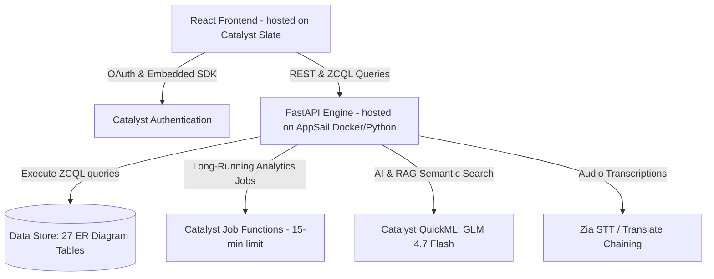

# Zoho Catalyst Migration Architecture Blueprint

This document outlines the corrected reference architecture and concrete configurations for deploying **VAJRA 3.0** entirely on the Zoho Catalyst serverless ecosystem.

---

## 1. Component Mapping & System Topology



---

## 2. Serverless Function Partitioning (Bypassing the 30s Timeout Limit)

Catalyst standard Advanced I/O functions have a hard **30-second execution timeout**. Any multi-hop GraphRAG or complex LLM reasoning chain must be structured asynchronously using **Job Functions** (15-minute limit):

### Synchronous Pipeline (Advanced I/O / AppSail) - < 30s
* **Auth Verification**: Role-based access validation.
* **Metadata Queries**: Basic lookups (State, District, Unit, Employee).
* **Hotspot Queries**: Fast lookup of pre-calculated DBSCAN coordinates.
* **Risk Score Retrieval**: Serving saved offender risk score values.

### Asynchronous Pipeline (Job Functions) - < 15 mins
* **GraphRAG Traversals**: Recursively searching case/accused associations across tables.
* **Deep Document RAG**: Large document ingestion and semantic extraction via QuickML.
* **Tabular ML Training**: Periodic Zia AutoML or XGBoost refitting jobs.

---

## 3. Project Configuration Files

### `catalyst.json` (Project Root)
```json
{
  "project": {
    "name": "VAJRA",
    "id": "50212000000025002"
  },
  "client": {
    "source": "client"
  },
  "appsail": {
    "source": "vajra_backend"
  }
}
```

### `vajra_backend/app-config.json` (AppSail Folder)
```json
{
  "command": "uvicorn main:app --host 0.0.0.0 --port $PORT",
  "stack": "python3.12",
  "env_variables": {
    "CATALYST_PROJECT_ID": "50212000000025002",
    "CATALYST_REGION": "IN"
  }
}
```

---

## 4. CORS & Authentication Security Checklist

> [!IMPORTANT]
> To prevent communication failures between the React frontend and the FastAPI backend, you must configure cross-origin settings:

1. **CORS Whitelisting**:
   * Navigate to the **Catalyst Console**.
   * Under **Cloudscale** $\rightarrow$ **Authentication**, select **Whitelisting**.
   * Add your Client hosting URL (e.g., `https://your-app.catalystserverless.in`) and enable the toggle for **CORS**.
2. **QuickML Connector Setup**:
   * Create a Catalyst connection under **Cloudscale** $\rightarrow$ **Connections**.
   * Enable the scope `quickml.deployment.READ`.
   * Bind this connection to your AppSail function environment variables to query the models safely.
