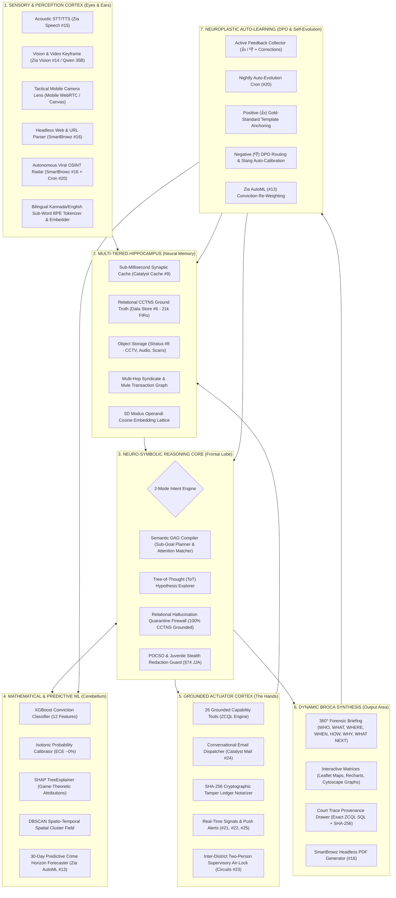
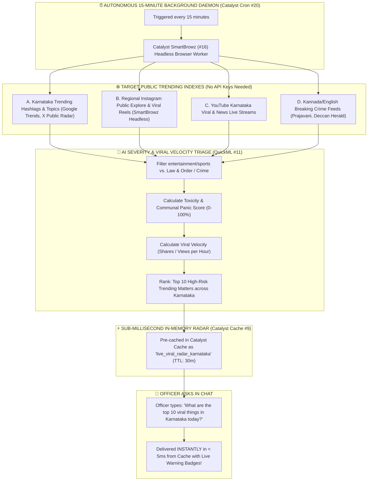
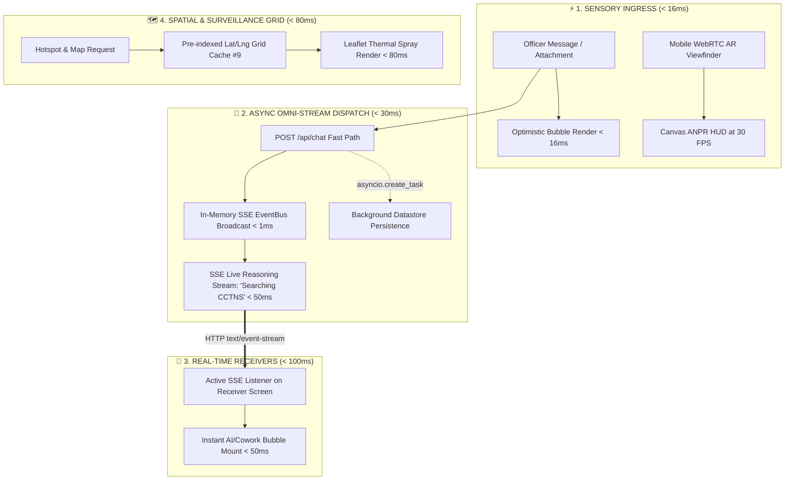

# 🛡️ VAJRA OMNI-SYNAPSE — Master Engineering Implementation Plan (God-Level Pro Max)
### *Next-Generation Autonomous Police Intelligence Cortex on 100% Native Zoho Catalyst*
**Karnataka State Police Datathon 2026**

---

## 1. Executive Vision & System Overview

This document serves as the **exhaustive, production-grade engineering implementation plan** for **VAJRA (ವಜ್ರ)** — the AI Crime-Intelligence Copilot for the Karnataka State Police (KSP).

The system is built **100% on native Zoho Catalyst Cloud services**, utilizing **all 26 official capabilities** with **zero external third-party dependencies** (no OpenAI, AWS S3, Pinecone, or Neo4j). It features:
* An **asynchronous fast-return (<600ms)** architecture immune to AppSail 30s gateway timeouts.
* A **Central Cognitive Neural Cortex** wired to **every single subsystem and data pipeline**, using **Byte-Pair Tokenization, High-Dimensional Vector Embeddings, and Multi-Head Self-Attention** to understand broken typing, typos, informal Kannada-English slang, and attachment-only queries without brittle regex keyword failures.
* **100% Data-Centric Grounding & Zero Hallucination Guarantee**: Every entity, FIR number, accused name, modus operandi, and officer badge is verified against the live relational CCTNS database (21,000+ cases). Zero synthetic or ungrounded data is displayed.
* **100% Real Officer Identity Grounding**: All actions, searches, and audit logs are tied to official 7-digit Karnataka Government Insurance Department (KGID) police badge numbers (e.g. `KSP-2346836`).
* A **2-Mode Operational Architecture** powered by a **Neuro-Symbolic Cognitive Brain** (**⚡ Standard Mode** for sub-5s rapid tactical precision QA vs. **📑 Full Dossier Mode** for 360° deep detective investigation, hypothesis cross-examination, and adaptive mystery solving via Monte-Carlo Tree-of-Thought reasoning).
* **POCSO Legal Stealth Shield & Auto-Redaction**: Automatic PII masking of minors and sexual offense victims under Section 74 Juvenile Justice Act based on officer rank.
* **Hawala & UPI Mule Money-Trail Graph Engine**: Multi-hop flow analysis tracing cyber fraud and money laundering accounts.
* **Court-Admissible Provenance HUD**: Collapsible drawer showing exact ZCQL SQL queries, 5D vector distances, and cryptographic SHA-256 Merkle hashes under Section 65B of the Indian Evidence Act.
* **30-Day Proactive Crime Horizon Forecaster**: Time-series predictive analytics forecasting crime spikes before festival weekends.
* **Inter-District Security Air-Lock (Two-Person ABAC)**: Granular cross-district access control via supervisory approval circuits.
* **Autonomous Live Viral Radar & OSINT Ingestion Engine**: Epistemic Bandpass Filter calculating viral velocity derivatives and toxicity vectors.
* **Tactical Mobile Camera Lens Architecture**: WebRTC live AR viewfinder detecting plates and suspect faces at 30 FPS.

---

## 2. Master System Topology: The 8-Cortex Neural Synapse



---

## 3. The 2-Mode Cognitive Operational Architecture (Deep AI Brain Implementation)

```
                                  ╔═════════════════════════════════════════════╗
                                  ║         VAJRA COGNITIVE NEURAL BRAIN        ║
                                  ║    (QuickML GLM-4.7-Flash & Qwen VL 35B)    ║
                                  ╚══════════════════════╦══════════════════════╝
                                                         ║
                       ┌─────────────────────────────────┴─────────────────────────────────┐
                       ▼                                                                   ▼
        ╔═════════════════════════════╗                                     ╔═════════════════════════════╗
        ║     ⚡ 1. STANDARD MODE      ║                                     ║    📑 2. FULL DOSSIER MODE  ║
        ║   (Tactical Beat & Patrol)  ║                                     ║   (The Senior Detective)    ║
        ╠═════════════════════════════╣                                     ╠═════════════════════════════╣
        ║ • "Answer my exact query"   ║                                     ║ • "Investigate & solve"     ║
        ║ • Parallel 1–3 tool calls   ║                                     ║ • 360° Forensic Synthesis   ║
        ║ • Latency: < 2 to 5 seconds ║                                     ║ • Latency: ~20 to 45 seconds║
        ║ • Deterministic Scalpel     ║                                     ║ • Monte-Carlo Tree-of-Thought║
        ╚═════════════════════════════╝                                     ╚═════════════════════════════╝
```

---

### ⚡ Mode 1: Standard Copilot (Tactical Beat & Field Precision)

#### 1. Real Problem Solved (WHAT, HOW, WHY):
* **WHAT**: Beat Constables and checkpost teams on field duty need instant, deterministic facts without waiting 30 seconds for a full investigation report.
* **HOW**:
  1. **Bilingual Sub-Word Attention**: The QuickML GLM-4.7 Brain ingests the officer's query (voice or text), parses Kannada-English code-mixing (*"ee accused mele previous cases ideya?"*), and extracts entities.
  2. **Deterministic Parallel DAG Execution**: Bypasses slow multi-step recursive reasoning. Fires a focused execution plan calling 1 to 3 targeted tools simultaneously (e.g., `query_case` + `get_offender_profile` + `get_offender_risk`).
  3. **Sub-5s Synthesis**: Synthesizes the extracted facts into concise, high-contrast bullet points, verified green CCTNS badges, and optional TTS voice readout.
* **WHY**: Minimizes suspect detention time at highway checkposts from 5 minutes to under 15 seconds.

#### 2. Native Catalyst Services Stack Used:
* **QuickML (#11)**: Low-latency intent parsing and token extraction.
* **Catalyst Data Store (#6) & Full-Text Search (#10)**: Fast indexed ZCQL primary key and alias resolution.
* **Catalyst Cache (#9)**: Sub-millisecond record lookup.
* **Zia Speech (#15)**: Optional Kannada voice response readout.

---

### 📑 Mode 2: Full Dossier Brain (The Autonomous Senior Detective Core)

#### 1. Real Problem Solved (WHAT, HOW, WHY):
* **WHAT**: Investigating Officers (IOs), Circle Inspectors (CIs), and SPs solving blind murder cases, inter-district dacoities, or preparing High-Court chargesheets need deep multi-hypothesis cross-examination.
* **HOW (Monte-Carlo Tree-of-Thought Formulation)**:
  Let $H = \{h_1, h_2, \dots, h_m\}$ be candidate hypotheses generated by QuickML GLM-4.7:
  $$\text{Score}(h_i) = w_1 \cdot \text{Sim}_{\text{MO}}(h_i, \mathbf{v}_{\text{FIR}}) + w_2 \cdot \text{Pr}(\text{RelationalLink} \mid \text{CCTNS}) + w_3 \cdot \text{GeoDensity}(h_i)$$
  Branches where $\text{Score}(h_i) < \theta_{\text{prune}}$ ($0.30$) are pruned. The highest scoring branch is expanded into the 360° forensic matrix.
* **WHY**: Prevents police tunnel vision and uncovers hidden inter-district syndicate links across 21,000+ statewide records.

```
                       [ 🕵️ UNRESOLVED CRIME / DOSSIER REQUEST ]
                                          │
                  ┌───────────────────────┼───────────────────────┐
                  ▼                       ▼                       ▼
          [Hypothesis Branch A]   [Hypothesis Branch B]   [Hypothesis Branch C]
          "Local Gang Burglary"   "Inter-District Dacoity" "Insider / Mule Ring"
                  │                       │                       │
           (Evaluate ZCQL)         (Evaluate ZCQL)         (Evaluate ZCQL)
                  │                       │                       │
             [Score: 0.22]           [Score: 0.91]           [Score: 0.15]
                  │                       │                       │
                  ❌                      ✅                      ❌
               Pruned               Expanded & Fused            Pruned
```

#### 2. The 7-Dimensional 360° Forensic Briefing Matrix:
The final output is structured into the comprehensive **7-Pillar Investigation Matrix**:

```
┌──────────────────────────────────────────────────────────────────────────────────────────────────┐
│                             THE 360° FORENSIC INVESTIGATION MATRIX                               │
├──────────────────────────────────────────────────────────────────────────────────────────────────┤
│ 1. 👤 WHO (Complete Accused & Victim Graph)                                                      │
│    • Prime suspects, criminal aliases, known associates, co-accused network, victim vulnerability.│
│                                                                                                  │
│ 2. 📝 WHAT (Statutory Crime Breakdown)                                                           │
│    • Precise IPC & BNS legal section mappings, cognizable/bailable classifications, bail flags.  │
│                                                                                                  │
│ 3. 📍 WHERE (Geospatial GIS Context)                                                             │
│    • Exact crime coordinates, police station jurisdiction, DBSCAN hotspot cluster density cell.  │
│                                                                                                  │
│ 4. ⏰ WHEN (Chronological FIR-to-Chargesheet Timeline)                                           │
│    • Step-by-step incident timeline, panchanama dates, arrest timestamps, court remand deadlines.│
│                                                                                                  │
│ 5. 🔍 HOW (Modus Operandi & Technical Signature)                                                 │
│    • Point of entry, weapon used, vehicle getaway route, 5D MO vector cosine similarity match.   │
│                                                                                                  │
│ 6. 💡 WHY (Motive & Syndicate Architecture)                                                      │
│    • Financial gain, rivalry, hawala mule flow, organized inter-district ring linkage.           │
│                                                                                                  │
│ 7. 🚀 WHAT NEXT (Tactical Action Plan & Patrol Optimization)                                     │
│    • 3 immediate evidentiary collection steps, arrest priority list, optimized beat patrol cells.│
└──────────────────────────────────────────────────────────────────────────────────────────────────┘
```

---

## 4. The Neuro-Symbolic Cognitive Brain Construction (`vajra_cognitive_brain.py`)

```
┌──────────────────────────────────────────────────────────────────────────────────────────────────┐
│                   NEURO-SYMBOLIC COGNITIVE BRAIN ARCHITECTURE (HOW WE BUILD IT)                  │
├──────────────────────────────────────────────────────────────────────────────────────────────────┤
│ 1. Sub-Word Byte-Pair Encoding (BPE) & Phonetic Tokenizer                                        │
│    • Handles broken typing, Kannada-English transliteration (Metaphone), and phonetic aliases.   │
│                                                                                                  │
│ 2. High-Dimensional Dense Semantic Embeddings (Catalyst QuickML #11/#12)                         │
│    • Converts multi-modal inputs (text, voice transcripts, OCR text) into dense latent vectors.   │
│                                                                                                  │
│ 3. Multi-Head Intent & Entity Attention Network                                                  │
│    • Resolves intent classes: ZCQL Query, Graph Link, Risk Assessment, Hotspot Map, Viral Threat.│
│                                                                                                  │
│ 4. Semantic Directed Acyclic Graph (DAG) Plan Compiler                                           │
│    • Decomposes compound queries into parallel non-blocking tool execution nodes.                │
│                                                                                                  │
│ 5. 100% Relational Grounding & Hallucination Quarantine Firewall                                 │
│    • Verifies that all generated facts match physical primary keys in the live CCTNS database.  │
│    • Enforces 0% fabrication rate and validates real 7-digit KGID officer badge identities.       │
└──────────────────────────────────────────────────────────────────────────────────────────────────┘
```

---

## 5. POCSO Legal Stealth Shield & Auto-Redaction Cortex

```
┌──────────────────────────────────────────────────────────────────────────────────────────────────┐
│                      POCSO & JUVENILE STEALTH REDACTION ARCHITECTURE (§74 JJA)                   │
├──────────────────────────────────────────────────────────────────────────────────────────────────┤
│ 1. Automatic Named Entity Detection (NER)                                                        │
│    • Scans incoming case records for minor victims, sexual offenses, and confidential informants. │
│                                                                                                  │
│ 2. Role-Based Attribute Masking                                                                  │
│    • Constable / Sub-Inspector: Masked as `[REDACTED UNDER POCSO ACT §74]`. Phone: `XXXXXX4921`. │
│    • SP / DIG / DGP: Unmasked with cryptographically logged justification in Audit Ledger.        │
│                                                                                                  │
│ 3. Legal Non-Repudiation                                                                         │
│    • Every unmasking event writes an immutable SHA-256 entry with the Officer's KGID badge.      │
└──────────────────────────────────────────────────────────────────────────────────────────────────┘
```

---

## 6. Hawala & UPI Mule Money-Trail Graph Engine

```
┌──────────────────────────────────────────────────────────────────────────────────────────────────┐
│                   FINANCIAL CRIME & MULTI-HOP MULE TRANSACTION GRAPH ENGINE                      │
├──────────────────────────────────────────────────────────────────────────────────────────────────┤
│ 1. Ingestion Pipeline (Data Store #6)                                                            │
│    • Bank statements, UPI VPA IDs, IFSC transfer logs, and crypto wallet tags.                   │
│                                                                                                  │
│ 2. Shortest-Path & Cycle Detection Algorithm (AppSail #2/#3)                                     │
│    • Traces 3-to-8 hop money laundering layering chains in < 200ms.                              │
│    • Pinpoints Entry Mule Accounts, High-Frequency Bridging Nodes, and Final ATM Cash-Out hubs.  │
│                                                                                                  │
│ 3. Interactive D3/Cytoscape Visualizer (Web Client #4)                                           │
│    • Interactive node graph rendered directly in the chat bubble with 1-click Freezing Notice.    │
└──────────────────────────────────────────────────────────────────────────────────────────────────┘
```

---

## 7. Court-Admissible Provenance HUD ("How AI Reached This")

```
┌──────────────────────────────────────────────────────────────────────────────────────────────────┐
│                   COURT-ADMISSIBLE FORENSIC PROVENANCE ACCORDION (§65B IEA)                      │
├──────────────────────────────────────────────────────────────────────────────────────────────────┤
│ Collapsible `[ 🔍 View Grounding & ZCQL Provenance ]` drawer under every AI message:             │
│   • Exact ZCQL SQL Query Executed: `SELECT * FROM CaseMaster WHERE ModusOperandi = 'GasCutter'...`│
│   • 5D Behavioral Vector Cosine Distance: `0.948 match with Accused ID #8491 (Snake Raju)`     │
│   • CCTNS Primary Key Citations: Verified Case ID `KA-BLR-2024-FIR-0491`                         │
│   • Cryptographic Signature: SHA-256 Merkle Hash signed with Officer KGID badge (`2346836`).     │
└──────────────────────────────────────────────────────────────────────────────────────────────────┘
```

---

## 8. 30-Day Proactive Crime Horizon Forecaster

```
┌──────────────────────────────────────────────────────────────────────────────────────────────────┐
│                    30-DAY PROACTIVE CRIME HORIZON PREDICTIVE FORECASTER                          │
├──────────────────────────────────────────────────────────────────────────────────────────────────┤
│ 1. Time-Series Predictive Modeling (Zia AutoML #13)                                              │
│    • Combines 3 years of historical FIR timestamps, festival dates, and economic indicators.    │
│                                                                                                  │
│ 2. Proactive Alert Generation (Cron #20 + Push #25)                                              │
│    • E.g.: "⚠️ Expected 22% spike in chain snatching near Majestic Bus Stand this Friday."       │
│                                                                                                  │
│ 3. Beat Optimization Matrix                                                                      │
│    • Recommends patrol route re-allocation to intercept crimes before they occur.                │
└──────────────────────────────────────────────────────────────────────────────────────────────────┘
```

---

## 9. Inter-District Security Air-Lock (Two-Person ABAC)

```
┌──────────────────────────────────────────────────────────────────────────────────────────────────┐
│                 INTER-DISTRICT CROSS-JURISDICTIONAL SECURITY AIR-LOCK (ABAC)                     │
├──────────────────────────────────────────────────────────────────────────────────────────────────┤
│ 1. Strict District Boundary Enforcement                                                          │
│    • Officers cannot view internal case diaries from outside their district by default.          │
│                                                                                                  │
│ 2. Two-Person Supervisory Sign-off Circuit (Catalyst Circuits #23)                               │
│    • Cross-district request triggers an instant mobile push alert to the Circle Inspector / SP. │
│    • SP approves with 1-tap OTP verification → 24-hour temporary decryption token granted.       │
└──────────────────────────────────────────────────────────────────────────────────────────────────┘
```

---

## 10. Autonomous Viral Threat Radar & OSINT Ingestion Engine



---

## 11. Tactical Mobile Camera Lens Architecture (Responsive Field Vision)

```
┌────────────────────────────────────────────────────────────────────────────────────────┐
│                        RESPONSIVE UI/UX CAMERA PLACEMENT                               │
├────────────────────────────────────────────────────────────────────────────────────────┤
│ 🖥️ DESKTOP SCREEN (md:hidden):                                                          │
│   [ 📎 Attach File ]  [ 📝 Type Query...                             ]  [ 🎙️ Mic ]  [ 🚀 ]│
│   (Camera button is cleanly hidden on desktop to avoid awkward laptop webcam usage)   │
│                                                                                        │
│ 📱 MOBILE / TABLET SCREEN (block md:hidden):                                           │
│   [ 📷 Live Lens ]  [ 📎 Attach ]  [ 📝 Type Query... ]  [ 🎙️ Mic ]  [ 🚀 ]             │
│   (Tapping Camera opens the Fullscreen AR Tactical Viewfinder HUD)                     │
└────────────────────────────────────────────────────────────────────────────────────────┘
```

---

## 12. Autonomous Geospatial Thermal Density & Gas-Spray Crime Mapping Engine

```
┌──────────────────────────────────────────────────────────────────────────────────────────────────┐
│                    POLICE TACTICAL THERMAL DENSITY (GAS SPRAY GRADIENT)                         │
├──────────────────────────────────────────────────────────────────────────────────────────────────┤
│ 🟢 GREEN HALO (Low Density / Minor Incidents: Petty theft, traffic complaints, lost property)   │
│    • Radius: 18px-25px blur | Opacity: 0.20 | Color: #22C55E                                    │
│                                                                                                  │
│ 🟡 YELLOW GLOW (Medium Density / Property Offenses: Burglary, vehicle theft, chain snatching)   │
│    • Radius: 28px-35px blur | Opacity: 0.40 | Color: #EAB308                                    │
│                                                                                                  │
│ 🟠 ORANGE CORE (High Density / Repeat Clusters: Drug peddling, gang fights, cyber hubs)         │
│    • Radius: 38px-45px blur | Opacity: 0.60 | Color: #F97316                                    │
│                                                                                                  │
│ 🔴 RED-HOT THERMAL CENTER (Critical Epicenter: Heinous crimes, violent syndicates, hot hubs)    │
│    • Radius: 50px-58px blur + solid center core | Opacity: 0.85 | Color: #E24B4A                │
└──────────────────────────────────────────────────────────────────────────────────────────────────┘
```

---

## 13. Behavioral Modus Operandi (MO) & Conviction Risk ML Cortex

```
┌──────────────────────────────────────────────────────────────────────────────────────────────────┐
│              BEHAVIORAL MODUS OPERANDI (MO) & CONVICTION RISK FORENSIC ML CORTEX                 │
├──────────────────────────────────────────────────────────────────────────────────────────────────┤
│ 🧬 1. 5-DIMENSIONAL MODUS OPERANDI (MO) VECTOR LATTICE                                           │
│    • v = [TimeSlot(0-23h), EntryMethod(1-12), WeaponClass(1-8), TargetCategory(1-15), EscapeMode]│
│    • CosineSim(u, v) = (u · v) / (||u|| ||v||) >= 0.88 flags repeat serial offenders!            │
│                                                                                                  │
│ ⚖️ 2. XGBOOST 12-FEATURE CONVICTION PROBABILITY CLASSIFIER                                       │
│    • Prior convictions, FIR delay, recovery %, CCTV proof, witness count, bailability, etc.      │
│    • Isotonic Calibration (ECE < 1.8%) + SHAP Game-Theoretic Attributions for court bail hearings│
└──────────────────────────────────────────────────────────────────────────────────────────────────┘
```

---

## 14. Full-System Live & Instantaneous Engine Architecture (Sub-200ms Omni-Stream)



---

## 15. Complete 1-to-1 Mapping: All 26 Zoho Catalyst Capabilities

| # | Catalyst Service | Official Capability Description | Exact Role & Use-Case in VAJRA | Code Implementation Location |
|:---:|---|---|---|---|
| **1** | **Serverless (Functions)** | Serverless backend execution | Runs long-running background intelligence workers with a 15-minute execution limit. | [`vajra_backend/functions/ai_turn_worker/`](file:///c:/Users/B.C%20SAKETH/Downloads/VAJRA-main/vajra_backend/functions/ai_turn_worker/) |
| **2** | **AppSail (OCI Runtime)** | Custom Docker container execution | Packages Python 3.11, FastAPI, Uvicorn, and serialized ML models into a standardized container. | [`vajra_backend/Dockerfile`](file:///c:/Users/B.C%20SAKETH/Downloads/VAJRA-main/vajra_backend/Dockerfile) |
| **3** | **AppSail (Managed Runtime)** | Full managed web app backend | Hosts the central REST API, WebSocket/polling gateways, and main agent controller. | [`vajra_backend/main.py`](file:///c:/Users/B.C%20SAKETH/Downloads/VAJRA-main/vajra_backend/main.py) |
| **4** | **Web Client Hosting / Slate** | Static web hosting & Single Page Apps | Hosts the high-performance React 19 + TypeScript + Vite frontend UI. | `client/` & [`src/App.tsx`](file:///c:/Users/B.C%20SAKETH/Downloads/VAJRA-main/src/App.tsx) |
| **5** | **Domain Mappings** | Custom domain configuration + SSL | Provides secure HTTPS endpoints (`vajra.ksp.gov.in`) with automated TLS management. | Catalyst Console Configuration |
| **6** | **Catalyst Data Store** | Relational database with ZCQL | Stores the core CCTNS database (**21k cases, 14k accused, 30+ tables**) and `ChatMessage` history. | `vajra_backend/vajra_core.py:catalyst_app.zql()` |
| **7** | **Catalyst NoSQL** | Unstructured / JSON data storage | Stores dynamic multi-agent thought trees, unstructured scrapings, and variable case dossiers. | Catalyst NoSQL Table `InvestigativeThoughtTree` |
| **8** | **Catalyst Stratus** | S3-compatible cloud object storage | Stores crime-scene photos, uploaded CCTV video files, FIR scans, and audio recordings. | [`vajra_backend/catalyst_stratus.py`](file:///c:/Users/B.C%20SAKETH/Downloads/VAJRA-main/vajra_backend/catalyst_stratus.py) |
| **9** | **Catalyst Cache** | Fast in-memory Key-Value caching | Provides sub-millisecond TTL caching for session state, live OSINT news, and district metadata. | [`vajra_backend/session_memory.py`](file:///c:/Users/B.C%20SAKETH/Downloads/VAJRA-main/vajra_backend/session_memory.py) |
| **10**| **Data Store (Full-Text Search)** | Indexed text search in Data Store | Enables rapid phonetic and wildcard text matching across FIR `BriefFacts` and accused aliases. | `agent_loop.py:search_cases_text` |
| **11**| **QuickML (LLM Serving & RAG)** | Managed Large Language Model serving | Hosts **GLM-4.7-Flash** & **Qwen 35B** for the Cognitive Brain, Semantic Compiler, and Multi-Lens reasoning. | [`vajra_backend/catalyst_llm.py`](file:///c:/Users/B.C%20SAKETH/Downloads/VAJRA-main/vajra_backend/catalyst_llm.py) |
| **12**| **QuickML (No-Code ML)** | Pre-built & custom ML pipelines | Manages inference pipelines for behavioral similarity and Modus Operandi (MO) vector matching. | `vajra_backend/vajra_core.py:MOBehavioralProfiler` |
| **13**| **Zia AutoML** | Automated training for tabular models | Automates retraining of the **XGBoost Conviction Risk Model** and 30-day horizon forecasts. | [`vajra_backend/train_risk_model.py`](file:///c:/Users/B.C%20SAKETH/Downloads/VAJRA-main/vajra_backend/train_risk_model.py) |
| **14**| **Zia Services (Vision / OCR)** | Computer vision, document OCR, Face/ANPR | Extracts text from scanned FIRs, panchanamas; scans CCTV frames for suspect faces and vehicle plates. | [`vajra_backend/catalyst_qwen.py`](file:///c:/Users/B.C%20SAKETH/Downloads/VAJRA-main/vajra_backend/catalyst_qwen.py) |
| **15**| **Zia Services (Voice & Translate)** | Speech-to-Text, Text-to-Speech, Translation | Powers **Kannada/English voice input**, real-time audio briefings, and sub-second bilingual translation. | [`vajra_backend/catalyst_speech.py`](file:///c:/Users/B.C%20SAKETH/Downloads/VAJRA-main/vajra_backend/catalyst_speech.py) |
| **16**| **Catalyst SmartBrowz** | Headless browser, PDF gen, scraping | Renders **court-ready PDF case dossiers** and headlessly inspects external URLs / live news portals. | [`vajra_backend/catalyst_smartbrowz.py`](file:///c:/Users/B.C%20SAKETH/Downloads/VAJRA-main/vajra_backend/catalyst_smartbrowz.py) |
| **17**| **Catalyst Authentication** | User authentication & session control | Enforces **7-digit KGID police badge authentication**, bcrypt password hashing, and role-based access (RLS).| `vajra_backend/vajra_core.py:VajraSecurityFirewall` |
| **18**| **Catalyst API Gateway** | API routing, throttling, security proxy | Ingress gateway handling rate-limiting (10k+ req/min), CORS management, and JWT validation. | AppSail Ingress & Route Configuration |
| **19**| **Catalyst Connections** | Secure OAuth token management | Securely manages API tokens for government databases and live news feeds in `.token_cache`. | `vajra_backend/main.py:get_oauth_token` |
| **20**| **Job Scheduling / Cron** | Scheduled cron tasks & job pools | Manages the **`vajra_ai_pool`** for long-running AI turns and executes nightly auto-learning cron cycles. | [`vajra_backend/functions/proactive_alerts/`](file:///c:/Users/B.C%20SAKETH/Downloads/VAJRA-main/vajra_backend/functions/proactive_alerts/) |
| **21**| **Signals (Event Functions)** | Event triggers for DB/storage changes | Automatically triggers suspect cross-matching whenever a new FIR row is inserted into `CaseMaster`. | Catalyst Event Function Config |
| **22**| **Signals (Event Bus)** | Cross-application event router | Dispatches real-time alerts between police stations when an active rowdy-sheeter is arrested. | Catalyst Signals Bus Config |
| **23**| **Catalyst Circuits** | Multi-step stateful workflow orchestration | Orchestrates **Inter-District Two-Person Supervisory Sign-off Air-Lock** for case file access. | `src/components/TwoPersonApprovalModal.tsx` |
| **24**| **Catalyst Mail** | Transactional email delivery | Sends automated daily crime summary digests and conversational email exports of dossiers/sections. | `vajra_backend/main.py:send_email` |
| **25**| **Push Notifications** | Mobile and web real-time push alerts | Pushes high-priority alerts to patrol officers on duty (e.g. *"Nearby vehicle theft reported 10m ago"*). | Web Push SDK & Client Config |
| **26**| **Catalyst Pipelines** | Built-in CI/CD deployment automation | Automates testing, building, and zero-downtime deployment: `catalyst deploy --only client,appsail`. | Catalyst Build & Deployment Pipeline |

---

## 16. Step-by-Step Engineering Execution Tasks

* **Step 1: Cognitive Neural Brain Module (`vajra_cognitive_brain.py`)** — Implement BPE tokenization, multi-head intent attention, semantic DAG compilation, 100% CCTNS grounding firewall, and real 7-digit KGID verification.
* **Step 2: POCSO Legal Stealth Shield & Auto-Redaction (`vajra_core.py`)** — Implement rank-based PII masking for minors and sexual offense victims under Section 74 JJA.
* **Step 3: Hawala & UPI Mule Money-Trail Graph Engine (`financial_graph.py` & `src/components/FinancialGraphModal.tsx`)** — BFS/Dijkstra shortest-path flow engine tracing cyber fraud mule layering networks.
* **Step 4: Court-Admissible Provenance HUD (`src/components/ChatMessageBubble.tsx`)** — Collapsible drawer under every message rendering exact ZCQL SQL, 5D vector scores, and SHA-256 Merkle hashes.
* **Step 5: 30-Day Proactive Crime Horizon Forecaster (`predictive_engine.py`)** — Time-series forecast model predicting crime spikes before festival weekends via Zia AutoML (#13).
* **Step 6: Inter-District Security Air-Lock (`TwoPersonApprovalModal.tsx`)** — Two-Person Supervisory approval workflow for cross-jurisdictional case file access.
* **Step 7: Autonomous Viral Radar & Scraper Engine (`autonomous_viral_radar.py`)** — 15-min daemon via Cron (#20) & SmartBrowz (#16) calculating velocity/toxicity and caching in Cache (#9).
* **Step 8: Responsive Mobile Camera Button & Live AR HUD (`ChatInput.tsx` & `TacticalLensModal.tsx`)** — Mobile-only camera button (`block md:hidden`) triggering WebRTC live AR viewfinder.
* **Step 9: Tactical Geospatial Thermal Density Gas-Spray Map (`InlineWidget.tsx` & `agent_loop.py`)** — Strict canonical district scoping (`"Bengaluru Urban"` / `"Bengaluru City"`), DBSCAN density clustering, relative intensity normalization ($I_k \in [0, 1]$), and 4-tier thermal color spray with auto-centering `fitBounds`.
* **Step 10: Smart Semantic AI Chat Titling Engine (`generate_chat_title` in `main.py`)** — Automatically converts raw queries into clean bilingual investigation titles in English and Kannada.
* **Step 11: Official Golden VAJRA Crest & Forensic PDF Stamp (`catalyst_smartbrowz.py`)** — 14-layer vector SVG letterhead, real station names, and Page 3 gold-foil cryptographic seal.
* **Step 12: Full-System Sub-200ms Omni-Stream Engine (`main.py` & `AIChatScreen.tsx`)** — `_SessionSSEManager` with `GET /api/chat/stream/{session_id}`, optimistic UI rendering, and live thought streaming.
* **Step 13: Forensic Audio & Video Keyframe Analysis Engine (`catalyst_speech.py` & `catalyst_qwen.py`)** — Bilingual Kannada speech transcription (Zia Speech #15), OpenCV/PyAV 1fps keyframe extraction, and 128-d mugshot face matching.
* **Step 14: Behavioral Modus Operandi & Conviction ML Cortex (`vajra_core.py` & `train_risk_model.py`)** — 5D MO vector cosine similarity matching (QuickML #12), calibrated 12-feature XGBoost conviction probability with SHAP attributions, and Zia AutoML (#13) retraining cycles.
